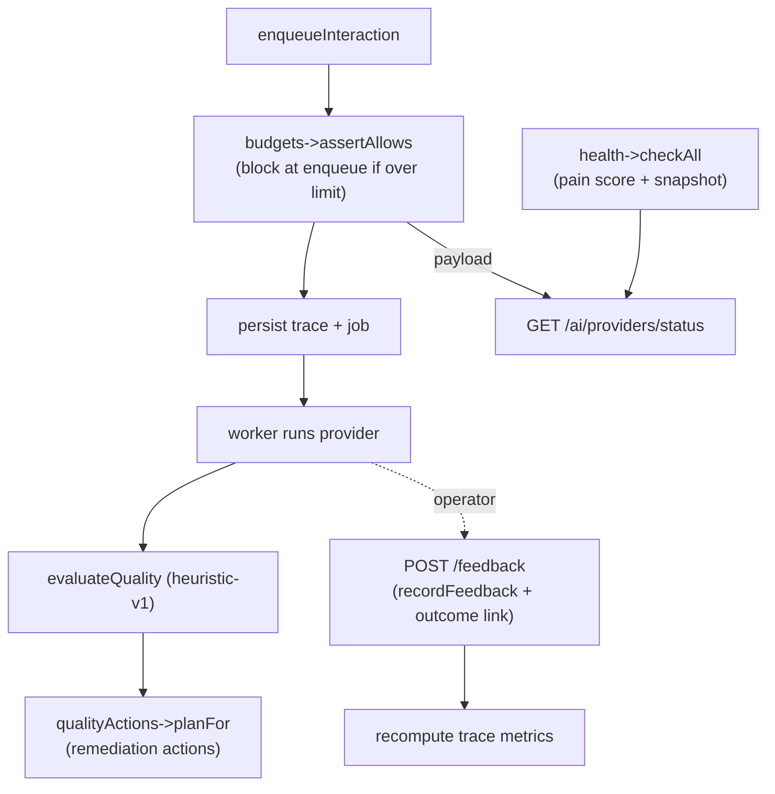

# Quality, budget and health

Three guardrails sit around the gateway's execution path: a quality evaluator scores every successful response and proposes remediation, a budget gate blocks calls that would exceed a token window, and a health service tracks each provider's online status and operational pain. Together with operator feedback and outcome attribution, they close the loop on "did this call actually help, and can we afford to keep making it".

## Key abstractions

| Path | Role |
|---|---|
| `app/Services/Ai/AiQualityEvaluator.php` | Heuristic (`heuristic-v1`) post-run quality scoring -> `AiQualityEvaluation` |
| `app/Services/Ai/AiQualityActionService.php` | Turns quality verdicts into remediation `ai_quality_actions` |
| `app/Services/Ai/AiRuntimeBudgetService.php` | `assertAllows(provider, model, options)` + budget payload |
| `app/Services/Ai/AiProviderHealthService.php` | `checkAll()` / `check()` run each provider's `health()`, compute pain score, persist snapshots |
| `app/Services/Ai/AiProviderHealthCheck.php` | Immutable health DTO |
| `app/Services/Ai/Telemetry/AiOutcomeAttributionService.php` | Records outcome links (useful, not_useful, wrong_context, etc.) |
| `app/Services/Ai/Telemetry/AiTraceMetricAggregator.php` | Recomputes `ai_trace_metric_summaries` |
| `app/Services/Ai/AtlasAiRuntimeSettings.php` | Effective budget settings (`effective()['budget']`) |
| `app/Services/Ai/AiGatewayService.php` | `recordFeedback()` — persists operator feedback on a trace |
| `app/Http/Controllers/AiInteractionController.php` | `feedback()` — POST feedback + outcome attribution |
| `app/Http/Controllers/AiProviderController.php` | `status()` / `check()` / `updateSettings()` — the provider dashboard |
| `app/Models/AiQualityEvaluation.php`, `AiQualityAction.php`, `AiProviderHealthSnapshot.php`, `AiTraceMetricSummary.php`, `AiOutcomeLink.php` | The persistence entities |

## How it works

### Quality evaluation

After a successful job, the worker calls `evaluateQuality($trace)`, which delegates to `AiQualityEvaluator::evaluateTrace`. The evaluator:

1. Skips when the `ai_quality_evaluations` table is unavailable or the response is empty and the trace did not succeed.
2. Runs a heuristic assessment (`assess`) producing a score, a status (`passed` / `flagged` / `failed`), dimensions, flags (each with a code), suggested actions, and evidence (response char/word counts).
3. Upserts an `AiQualityEvaluation` (keyed by `trace_id`) with the evaluator version `heuristic-v1`, provider, model, agent slug, score, status, dimensions, flags, and suggested actions.
4. Stamps a `quality` summary onto the trace metadata.
5. Records an `ai_quality_evaluated` audit event.
6. Runs the agent behavior quality gate (`AgentBehaviorQualityGate`) on the evaluation.

The evaluation is honest about its limits: it is a heuristic, not a learned judge, and it never overrides the operator or the [separation of powers](../../concepts/separation-of-powers.md).

### Quality actions

`AiQualityActionService::planFor($trace, $evaluation, $autoRun=true)` turns a non-passing evaluation (or one with flags) into remediation actions. It:

1. Returns empty when the table is unavailable, or when the evaluation passed with no flags.
2. Builds action plans per flag, dedupes by a `dedupe_key` (trace + action type), and creates or updates an `AiQualityAction` (status, priority, reason, flags, payload).
3. Auto-runs newly created actions whose plan has `auto_run=true`.

`run($action, $trace)` executes a queued or failed action (for example, re-running with a different agent or context). `completeRemediationActions` is called by the worker after evaluation to run any ready actions. Actions carry a `dedupe_key` so the same problem does not spawn duplicate remediation.

### Budget gate

`AiRuntimeBudgetService::assertAllows($provider, $model, $options)` runs in `enqueueInteraction` before the trace is persisted. It is a hard gate, not advisory:

1. Reads `effective()['budget']`. If `enabled` is false or `mode` is not `block`, it returns immediately.
2. Skips when the `ai_trace_metric_summaries` table is unavailable.
3. Computes the provider's visible-token usage over `window_hours` (default from `AtlasAiRuntimeSettings::DEFAULT_BUDGET_WINDOW_HOURS`).
4. Reads the per-provider `max_visible_tokens` limit.
5. If usage has reached the limit, throws `RuntimeException` with a Portuguese message naming the provider and the budget that was hit.

`payload()` builds the budget envelope used by the provider dashboard: per-provider usage, totals, `max_visible_tokens`, `warn_visible_tokens`, remaining tokens, status, and a governance contract. The budget window and limits live in `config('atlas.ai.budget')` and can be overridden by the operator via `PATCH /ai/providers/settings`.

### Operator feedback and outcome attribution

`POST /ai/interactions/{trace}/feedback` (`AiInteractionController::feedback`) is the operator's "did this help" signal. It:

1. Calls `AiGatewayService::recordFeedback($trace, $data)`, which persists `feedback_score` (1-5), `feedback_action` (`useful`, `not_useful`, `wrong_agent`, `wrong_context`, `too_slow`, `too_expensive`, `unsafe`, `dismissed`), and `feedback_comment` onto the trace.
2. Calls `recordFeedbackOutcome`, which uses `AiOutcomeAttributionService` to write an `AiOutcomeLink` with an outcome type mapped from the feedback action (`human_marked_useful`, `human_marked_not_useful`, `human_marked_wrong_context`, etc.) and `AiTraceMetricAggregator` to recompute the trace metric summaries.

`AiOutcomeAttributionService::OUTCOME_TYPES` is the closed set of recognized outcomes, including behavioral signals like `provider_switched_after_bad_answer`, `user_abandoned_thread`, and `user_reasked_same_intent`. Outcome links tie a trace to a target (task, project, routine, decision) with a value score and confidence, giving the system a way to learn which interactions produced real downstream value.

### Provider health

`AiProviderHealthService::checkAll()` iterates every registered provider key and calls `check($provider)`. `check`:

1. Calls the provider's `health()` (which, for CLI providers, runs `checkBinary` + `checkCliRuntimeContract` — binary presence plus a `--help` token-contract check).
2. Computes 24h stats from `ai_jobs` and `ai_job_attempts`: total jobs, failed jobs, last success/failure timestamps, and p50 latency of succeeded attempts.
3. Computes the `operational_pain_score` (below).
4. Persists an `AiProviderHealthSnapshot` (provider, status, checked_at, last success/failure, totals, p50 latency, pain score, message, metadata).
5. Logs a `health_check` worker event.

`latest()` returns the most recent snapshot per provider.

#### The pain score

`painScore($status, $total, $failed)` is an integer 0-4 that summarizes how much a provider is hurting:

- **4** — offline, or a 24h failure rate >= 50%.
- **3** — degraded, or a failure rate >= 25%.
- **2** — failure rate >= 10%.
- **1** — any failure at all (rate > 0), or online with no jobs.
- **0** — online with no failures.

The score blends the binary health status with the observed failure rate, so a provider whose CLI is present but whose calls are failing half the time hurts as much as one that is fully offline.

### The provider dashboard

`GET /ai/providers/status` (`AiProviderController::status`) is the operator dashboard. It assembles:

- `runtime_settings` — the effective settings (default provider, selection mode, budget).
- `provider_choice_catalog` and `model_policy` — what can be chosen and what models are allowed.
- `budget` — the `AiRuntimeBudgetService::payload()` envelope.
- `queue` — current queue depth.
- `workers` — worker rows derived from recent `ai_worker_events` (running, stale, stopped).
- `providers` — one row per provider blending the latest health snapshot with 24h job counts and recent worker events.
- `usage_24h` and `active_jobs`.
- `recent_events` — the last 20 worker events.

`POST /ai/providers/check` runs `AiProviderHealthService::checkAll()` on demand and returns the fresh snapshots. `PATCH /ai/providers/settings` updates the runtime settings (default provider, selection, budget) via `AtlasAiRuntimeSettings::update()` and returns the refreshed dashboard.

## How the guardrails relate

## Integration points

- **Worker** — `evaluateQuality` and `completeRemediationActions` run inside `completeAttempt`. See [The local worker](the-local-worker.md).
- **Gateway** — `budgets->assertAllows` runs at enqueue; `recordFeedback` is the feedback entry. See [Interaction lifecycle](interaction-lifecycle.md).
- **Providers** — `health()` is the provider's self-check; the pain score blends it with attempt stats. See [Providers and the CLI driver model](providers.md).
- **ADML** — the live outcome feedback ledger feeds the learned route. See [Provider selection and routing](provider-selection-and-routing.md).
- **Evidence ledger** — quality evaluations and actions are audited. See [Evidence and receipts](../../concepts/evidence-and-receipts.md).
- **HTTP API** — feedback, provider status, and provider check routes. See [the HTTP API reference](../../api/ai-gateway-api.md).
- **Anti-Goodhart** — the quality evaluator is a heuristic, not a learned score the system could game. See [Anti-Goodhart and no-proxy](../../concepts/anti-goodhart.md).

## Key source files

| File | What to read |
|---|---|
| `app/Services/Ai/AiQualityEvaluator.php` | `evaluateTrace()`, `assess()`, `VERSION = 'heuristic-v1'` |
| `app/Services/Ai/AiQualityActionService.php` | `planFor()`, `run()`, the dedupe key |
| `app/Services/Ai/AiRuntimeBudgetService.php` | `assertAllows()`, `payload()`, `painScore()` |
| `app/Services/Ai/AiProviderHealthService.php` | `checkAll()`, `check()`, `stats()`, `painScore()` |
| `app/Services/Ai/Telemetry/AiOutcomeAttributionService.php` | `record()`, `OUTCOME_TYPES` |
| `app/Services/Ai/Telemetry/AiTraceMetricAggregator.php` | Trace metric recomputation |
| `app/Services/Ai/AiGatewayService.php` | `recordFeedback()` |
| `app/Http/Controllers/AiInteractionController.php` | `feedback()` |
| `app/Http/Controllers/AiProviderController.php` | `status()`, `check()`, `updateSettings()` |
| `app/Models/AiQualityEvaluation.php`, `AiQualityAction.php`, `AiProviderHealthSnapshot.php` | The persistence entities |
| `config/atlas.php` | `atlas.ai.budget` |
