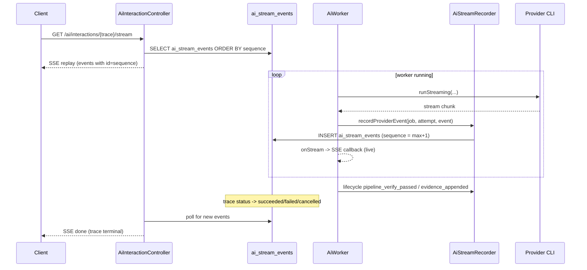

# Sessions, threads and streaming

An interaction is not a one-shot call. It belongs to a thread (the conversation), which has one active session (a working window with a provider), and its result is streamed live to the client. This page covers thread resolution, session idle/resume, provider handoff briefs, snapshots, compaction, and the SSE streaming substrate.

## Key abstractions

| Path | Role |
|---|---|
| `app/Services/Ai/AiThreadResolver.php` | Resolves or creates the `AiThread` for an input; derives mode/focus/workspace |
| `app/Services/Ai/AiSessionManager.php` | `ensureActive()`: pick/refresh/create the active `AiSession`; idle-timeout pause + resume |
| `app/Services/Ai/AiSessionStateService.php` | Maintains structured session state (objective, phase, decisions, open loops, next steps) |
| `app/Services/Ai/AiCompactionService.php` | Auto-compaction and resume compaction for long conversations |
| `app/Services/Ai/AiProviderHandoffService.php` | Builds an `AiProviderHandoff` brief when the provider switches |
| `app/Services/Ai/AiContextSnapshotRecorder.php` | Records a per-trace context snapshot |
| `app/Services/Ai/AiConversationRecorder.php` | Records user/assistant `ai_messages` |
| `app/Services/Ai/AiConversationContextBuilder.php` | Builds conversation context for the prompt |
| `app/Services/Ai/AiStreamRecorder.php` | Persists sequenced `ai_stream_events` |
| `app/Services/Ai/AiThreadDeletionService.php` | Cascading thread deletion |
| `app/Http/Controllers/AiInteractionController.php` | `stream()` (SSE) and `flowStatus()` |
| `app/Http/Controllers/AiThreadController.php` | Thread CRUD, state, messages, compact, switch-provider, snapshots |
| `app/Models/AiThread.php`, `AiSession.php`, `AiMessage.php`, `AiSessionState.php`, `AiCompaction.php`, `AiProviderHandoff.php`, `AiContextSnapshot.php`, `AiStreamEvent.php` | The persistence entities |

## How it works

### Thread resolution

`AiThreadResolver::resolve($input, $options)` decides which thread an interaction belongs to. The resolution returns an `AiThreadResolution` value object (the thread, the resolution mode, and whether it is new). The precedence:

1. `new_thread=true` — create a new thread (mode `explicit_new_thread`).
2. Explicit `thread_id` (from options, payload, or `conversation_context.thread_id`) — load it and reactivate if needed (mode `explicit_thread_id`).
3. Explicit `session_id` — load the thread behind that session (mode `explicit_session_id`).
4. Implicit continuation — only when `allow_implicit_thread_continuation` is true and either the payload carries recent turns or the input is a short reference. The latest active thread on the same surface and workspace becomes the candidate (mode `latest_continuation_candidate`).
5. Otherwise create a new thread (mode `implicit_new_thread`).

The thread carries mode, focus, routing hints, and a workspace. `updateThreadModeFromPayload` keeps the thread's mode in sync with the payload.

### Session lifecycle

`AiSessionManager::ensureActive($thread, $provider, $input, $options)` runs in a DB transaction (5 attempts). A thread has at most one active session. The flow:

1. If an explicit session id is in the options, pause other active sessions on the thread, reactivate it if needed, and touch it.
2. Otherwise load the latest active session on the thread under `lockForUpdate`.
3. If that session has idle-expired (`isIdleExpired`, against `config('atlas.ai.session_idle_minutes')`), pause it with reason `idle_timeout` and create a new session with `creation_reason='session_idle_resume'` and `resumed_from_session_id`.
4. If there is no active session, create one (`creation_reason='new_active_session'`).
5. Otherwise touch the existing session (update `provider_last`, message count, token estimate).

`close($session, $status)` ends a session with `completed`, `paused`, or `abandoned`, stamping message count and token estimate.

### Session state

`AiSessionStateService` maintains a structured `AiSessionState` per thread: the objective, current phase, current topic, decisions, open loops, next steps, and relevant artifacts. `updateForUserInput` runs at enqueue and the worker updates state for the assistant response after a successful job. This structured state is what the handoff brief and compaction draw on.

### Provider handoff

When the thread's provider changes (and fair mode is not locking it), `AiProviderHandoffService::createIfSwitching` writes an `AiProviderHandoff`. It pulls the active session state and the last 8 user/assistant messages, builds a `brief_json` (objective, current phase/topic, decisions, open loops, next steps, relevant artifacts, thread summary, compaction id, recent turns) and a `brief_text` (a compact Portuguese summary capped at 12000 chars). The [worker](the-local-worker.md) injects the brief into the next prompt so the new provider keeps context. Fair mode sets `provider_handoff_disabled_by_fair_mode` and skips the handoff.

### Snapshots and compaction

`AiContextSnapshotRecorder::record($trace, $session, $prompt, $compaction, $handoff)` takes a per-trace context snapshot at enqueue, capturing the prompt, context pack, and the compaction/handoff in play. `AiCompactionService` handles two compaction paths:

- **Auto-compaction** — `maybeAutoCompact($thread, $session)` triggers when a long conversation exceeds the compaction threshold, summarizing earlier turns so the prompt stays within limits.
- **Resume compaction** — `maybeCompactSessionResume` runs when a session is being resumed after an idle timeout, folding the prior session's state into the new one.

The compaction id is stamped onto the trace, job, and any handoff so the audit trail shows which compaction fed a given interaction.

### Streaming

The gateway streams live updates to the client through `ai_stream_events`. `AiStreamRecorder::record($job, $attempt, $eventType, $content, $metadata, $channel)` writes one row per event inside a DB transaction, computing the next `sequence` as `max(sequence) + 1` for the trace. Event types are `lifecycle`, `permission`, `progress`, `stdout`, `stderr`, `token`, `response`, `error` (unknown types default to `progress`). `recordProviderEvent` maps a provider stream chunk into a recorded event, carrying the event `name` in metadata.

The worker emits lifecycle checkpoints at well-defined points: `pipeline_verify_passed` / `pipeline_verify_failed`, `pipeline_evidence_appended`, `permission_allowed` / `permission_denied`, `decision_receipt_blocked`, `kernel_pipeline_contract_blocked`, `policy_contract_blocked`. These are what the Live Cockpit renders as a pipeline.

The HTTP surface is `GET /ai/interactions/{trace}/stream` (`AiInteractionController::stream`). It is an SSE response (`Content-Type: text/event-stream`, `Cache-Control: no-cache, no-transform`, `X-Accel-Buffering: no`) that:

1. Replays existing `ai_stream_events` ordered by `sequence` then `id` (100 at a time), each as an SSE event with the sequence as the `id`.
2. When no new events arrive, checks the trace status; if terminal (`succeeded`, `failed`, `cancelled`), sends a `done` event and returns.
3. Sends a `heartbeat` event at most every 10s.
4. Polls with an adaptive interval (faster when active, slower when idle).
5. Sends a `timeout` event if the connection outlives the stream window.

`GET /ai/interactions/{trace}/flow-status` returns the flow status read model for a trace (the hyperflow/router envelope surface).

### Thread HTTP surface

`AiThreadController` exposes thread management: `GET /ai/threads` (index), `POST /ai/threads` (store), `GET /ai/threads/{thread}` (show), `PATCH`/`DELETE`, `GET /ai/threads/{thread}/state` (session state), `GET /ai/threads/{thread}/messages` (messages), `POST /ai/threads/{thread}/compact` (manual compaction), `POST /ai/threads/{thread}/switch-provider` (manual provider switch, which creates a handoff), and `GET /ai/threads/{thread}/snapshots` (context snapshots).

## How streaming flows

## Integration points

- **Gateway** — `enqueueInteraction` calls `threads->resolve`, `sessions->ensureActive`, `compactions`, `handoffs`, and `snapshots` in order. See [Interaction lifecycle](interaction-lifecycle.md).
- **Worker** — `completeAttempt` records the assistant message and updates session state; the stream callback forwards chunks to SSE. See [The local worker](the-local-worker.md).
- **Provider selection** — a provider switch triggers a handoff. See [Provider selection and routing](provider-selection-and-routing.md).
- **Quality** — the assistant message and session state feed quality evaluation. See [Quality, budget and health](quality-budget-health.md).
- **HTTP API** — thread and streaming routes. See [the HTTP API reference](../../api/ai-gateway-api.md).
- **Open Brain** — the conversation context and session state are part of what the prompt builder injects. See [Open Brain](../open-brain/index.md).

## Key source files

| File | What to read |
|---|---|
| `app/Services/Ai/AiThreadResolver.php` | `resolve()` — the resolution precedence |
| `app/Services/Ai/AiSessionManager.php` | `ensureActive()`, `close()`, `isIdleExpired()` |
| `app/Services/Ai/AiSessionStateService.php` | `updateForUserInput()` and the state fields |
| `app/Services/Ai/AiCompactionService.php` | `maybeAutoCompact()`, the resume path |
| `app/Services/Ai/AiProviderHandoffService.php` | `createIfSwitching()`, `create()`, `briefText()` |
| `app/Services/Ai/AiContextSnapshotRecorder.php` | `record()` |
| `app/Services/Ai/AiConversationRecorder.php` | `recordUserMessage()`, `recordAssistantMessage()` |
| `app/Services/Ai/AiStreamRecorder.php` | `record()`, `recordProviderEvent()` |
| `app/Http/Controllers/AiInteractionController.php` | `stream()` — the SSE loop |
| `app/Http/Controllers/AiThreadController.php` | Thread CRUD and actions |
| `app/Models/AiStreamEvent.php` | The sequenced event entity |
