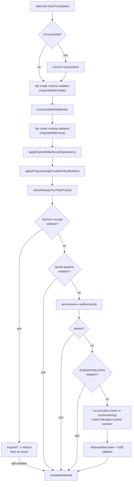

# The local worker

`atlas:ai:work` is the long-running Mac process that actually drives the provider CLIs. It polls the custom DB-backed `ai_jobs` queue, claims the oldest ready job, runs a gate chain, invokes the provider, and finalizes the attempt. Nothing else in the system calls a provider CLI for interactions. This page covers the claim loop, the gate chain, attempt execution, `completeAttempt`, stale recovery, and Mac background readiness.

## Key abstractions

| Path | Role |
|---|---|
| `app/Console/Commands/AiWorkCommand.php` | The worker command: loop, `--once`, `--limit`, `--sleep`, `--provider`, `--worker-id` |
| `app/Services/Ai/AiWorker.php` | The worker engine: claim, gate chain, execute, complete |
| `app/Services/Ai/AiWorkerLogger.php` | Writes `ai_worker_events` (started, claimed, heartbeat, stopped) |
| `app/Services/Ai/AiPermissionEngine.php` | The permission gate (`authorizeJob`) |
| `app/Services/Ai/Kernel/Decision/DecisionReceiptRuntimeGuard.php` | Decision-receipt enforcement before a provider call |
| `app/Services/Ai/Kernel/Pipeline/KernelPipelineRuntimeGuard.php` | Kernel pipeline contract enforcement |
| `app/Services/Ai/Programming/AtlasProgrammingOrchestrator.php` | Programming provider policy runtime |
| `app/Services/Ai/FairClaudePolicy.php` | Fair-mode runtime violation check |
| `app/Services/Ai/MacAgent/MacAgentService.php` | Mac power session + background readiness |
| `app/Services/Ai/Hermes/Mesh/HermesMeshJobRunner.php` | AtlasDecide-routed mesh fan-out |
| `app/Services/Ai/AiCouncilCoordinator.php` | Council aggregation on council jobs |
| `app/Services/Ai/AiProviderChoiceBuilder.php` | Builds `awaiting_user_choice` options |
| `app/Services/Ai/AiProviderChoiceResolver.php` | Resolves an operator choice |
| `app/Models/AiJob.php`, `AiJobAttempt.php` | The job and attempt rows the worker mutates |

## How it works

### The command loop

`AiWorkCommand::handle` constructs the worker with a `worker_id` (from `--worker-id` or `config('atlas.ai.worker_id')`), then loops:

1. Call `AiWorker::runNext($provider, $workerId)`.
2. If a job was processed, print its JSON status and increment the counter.
3. If the queue is empty: emit a `worker_heartbeat` event at most once per 60s, then `sleep($sleep)` (default 3s).
4. Stop when `--once` is set and the pass is done, or when `--limit` is reached.

`worker_started` and `worker_stopped` events bracket the loop (the latter in a `finally` block). `--provider` restricts the worker to one provider; without it the worker claims any ready job.

### Stale recovery

Every pass begins with `recoverStaleProcessingJobs($workerId)`. It locks up to 50 `status='processing'` jobs and checks each: if `started_at` plus `timeout_seconds + 60s` is in the past, the worker that claimed it is gone. The job is either requeued (`status='queued'`, `available_at=now`, `worker_id=null`) or, if `attempts >= max_attempts`, marked `failed` with `error_code='worker_timeout'`. The trace follows the job's status. Council trace IDs are collected and `AiCouncilCoordinator::sync` is re-run for each so a partially-dead council resolves correctly.

### Claiming a job

`claimJob` runs in a DB transaction with `lockForUpdate`. It selects up to 25 `status='queued' AND available_at <= now()` jobs ordered by `priority` then `created_at`, optionally filtered by provider or trace id. For each candidate it first checks Mac background readiness (below); if not ready it defers and continues. Otherwise it flips the job to `processing`, sets `reserved_at`, `started_at`, `worker_id`, increments `attempts`, mirrors the trace to `processing`, logs `job_claimed`, and records the `ExecutionStarted` ledger event. The first claimable job wins.

### Mac background readiness

Scheduled and background jobs (trace `source_type='scheduled'`, or `atlas_workflow_mode` in `['scheduled','background']`, or a `scheduled_task.id`) must wait until the Mac is ready to run them in the background. `macBackgroundReadinessDefer` asks `MacAgentService::status` for `readiness.ready_for_background_jobs`. If false, the job's `available_at` is pushed forward by 300s (`MAC_BACKGROUND_RETRY_DELAY_SECONDS`), the trace is reset to `queued`, a `job_deferred` event is logged, and claim continues to the next candidate. Foreground interactions skip this check.

### The gate chain

Once a job is claimed, `runNextMatching` runs a chain of gates before any provider call. Each gate that fails short-circuits into `completeAttempt` with a failed `AiProviderResult`, so the failure is recorded as an attempt with the right error code rather than dropped.

The gates in order:

1. **Council sync** — if the job is a council job, `AiCouncilCoordinator::sync` runs first to reconcile the trace against its child jobs.
2. **Fair mode violation** (`requireModel=false`, then again after model identity is ensured) — `FairClaudePolicy` checks the runtime against the locked provider/model. See [Provider selection and routing](provider-selection-and-routing.md).
3. **Model identity** — `ensureJobModelIdentity` makes sure the job's model matches the resolved provider model.
4. **Atlas Scout dependency** — `applyExpiredAtlasScoutDependency` degrades the executor when the scout job expired without producing a brief.
5. **Programming provider policy** — `applyProgrammingProviderPolicyRuntime` applies the programming provider policy to the job.
6. **YouTube prompt refresh** — if a YouTube video moved from `processing` to `ready` while the job was queued, the prompt is rebuilt with the fresh ingestion.
7. **Decision receipt** — `DecisionReceiptRuntimeGuard::violationForJob`. If the receipt expired, `AiDecisionReceiptRefreshService` tries to refresh it before the provider call; if it still violates, the attempt is blocked with `decision_receipt_blocked`.
8. **Kernel pipeline contract** — `KernelPipelineRuntimeGuard::violationForJob`. A violation is audited as a rejected plan and blocks with `kernel_pipeline_contract_violation`. A passing plan is recorded as accepted.
9. **Permission gate** — `AiPermissionEngine::authorizeJob`. A denial blocks with `permission_denied` (non-retryable). An allow applies the permission runtime and any pending steer.
10. **Programming policy contract** — `programmingProviderPolicyViolation`. A violation emits `pipeline_verify_failed` and blocks with `policy_violation` (non-retryable).

### Attempt execution

If all gates pass, the worker creates an `AiJobAttempt` (`createAttempt`, status `processing`), emits a `permission_allowed`/`permission_denied` stream event, then opens a **Mac power session** (`MacAgentService::startSession`, kind `ai_job`) so the Mac will not sleep mid-run. Inside `KernelSloProbe::measure('runtime.execute', ...)`:

- The mesh runner is tried first: `HermesMeshJobRunner::run($job)` returns a result when the job is an AtlasDecide-routed mesh fan-out, or null to fall back transparently to the single provider.
- Otherwise `provider->runStreaming($job, $job->prompt, $onStream)` runs the CLI. See [Providers and the CLI driver model](providers.md).
- Each stream chunk is recorded by `AiStreamRecorder::recordProviderEvent` (sequence-stamped into `ai_stream_events`) and forwarded to the SSE callback. The first `token`/`response` event emits a `provider_first_token` telemetry event.

The power session is stopped in a `finally` block. A thrown exception becomes a `provider_exception` result. Two opt-in Patamar-4 seams run after the result: **Swarm Auto-Failover** (a failed primary triggers a K=2 swarm dispatch and the winning arm replaces the failure) and **ADML Live Outcome Feedback** (the outcome is recorded to the learned-route ledger). Both are defensive and never throw.

### completeAttempt

`completeAttempt` finalizes everything. It sanitizes the operator-facing output, hashes the response, and sets the attempt status (`succeeded` / `failed` / `timeout` / `cancelled`), persisting the command + command hash, response hash, exit code, duration, output text (capped at 20000 chars), stdout/stderr excerpts, error code/message, and metadata. It records `provider_call_succeeded`/`provider_call_failed` telemetry and either a `ProviderReturned` or `OperationBlocked` ledger event.

If the job was cancelled mid-run, the provider result is ignored: the attempt is marked `cancelled_by_operator` and the job is left cancelled.

On **success** the worker emits the final Live Cockpit checkpoints (`pipeline_verify_passed`, `pipeline_evidence_appended`), sets `ai_jobs.status='succeeded'` with `result_text`, updates the trace to `succeeded` with response text/hash/latency, records the assistant message, updates session state, runs [quality evaluation](quality-budget-health.md), completes remediation actions, recomputes trace metrics, and completes the Kernel mission if one was attached. Special success paths handle council (`council->sync` then aggregate), Atlas Scout (release the executor), and native programming repair.

On **failure** several special paths run before the default requeue/fail:
- **Gemini to Claude fallback** — a budget-aware fallback when Gemini fails in a way Claude can cover.
- **Atlas Scout immediate degrade** — release the executor when the scout job failed.
- **Pause for choice** — `shouldPauseForChoice` sets the job to `awaiting_user_choice` and writes options built by `AiProviderChoiceBuilder` (switch_provider, downgrade_model, wait, retry_same, fail, cancel). The operator resolves via `POST /ai/jobs/{job}/resume-choice` and `AiProviderChoiceResolver`.
- **Default** — `permission_denied` and `policy_violation` are non-retryable. Otherwise the job is requeued (`available_at = now + retry_delay_seconds`) unless `attempts >= max_attempts`, in which case it is marked `failed`.

## Integration points

- **The queue** — `ai_jobs` polled under `lockForUpdate`, ordered by `priority, available_at, created_at`. Not Laravel's queue worker.
- **Providers** — `AiProviderManager::get($providerKey)` returns the driver; the worker calls `runStreaming`. See [Providers and the CLI driver model](providers.md).
- **Streaming** — `AiStreamRecorder` persists sequenced events consumed by the SSE endpoint. See [Sessions, threads and streaming](sessions-threads-streaming.md).
- **Quality and budget** — `evaluateQuality` runs after a successful job; the budget gate ran at enqueue. See [Quality, budget and health](quality-budget-health.md).
- **Evidence ledger** — `AtlasEvidenceLedger` records `ExecutionStarted`, `ProviderCalled`, `ProviderReturned`, `OperationBlocked`, `OperationCompleted`. See [Evidence and receipts](../../concepts/evidence-and-receipts.md).
- **Engineering plane** — programming jobs run through the gateway's worker. See [Engineering](../engineering/index.md).
- **Evolution Loop** — the loop's implement phase produces jobs the worker executes. See [Evolution Loop](../evolution-loop/index.md).

## Key source files

| File | What to read |
|---|---|
| `app/Console/Commands/AiWorkCommand.php` | The command signature and loop |
| `app/Services/Ai/AiWorker.php` | `runNextMatching()`, `claimJob()`, `macBackgroundReadinessDefer()`, `recoverStaleProcessingJobs()`, `createAttempt()`, `completeAttempt()`, `evaluateQuality()` |
| `app/Services/Ai/AiWorkerLogger.php` | `event()` — worker event persistence |
| `app/Services/Ai/Kernel/Decision/DecisionReceiptRuntimeGuard.php` | `violationForJob()` |
| `app/Services/Ai/Kernel/Pipeline/KernelPipelineRuntimeGuard.php` | `violationForJob()` |
| `app/Services/Ai/AiPermissionEngine.php` | `authorizeJob()` |
| `app/Services/Ai/MacAgent/MacAgentService.php` | `startSession()`, `stopSession()`, `status()` |
| `app/Services/Ai/AiProviderChoiceBuilder.php` | The `awaiting_user_choice` option builder |
| `app/Services/Ai/AiProviderChoiceResolver.php` | `resolve()` — operator choice resolution |
| `app/Models/AiJobAttempt.php` | The attempt row mutated by `completeAttempt` |
