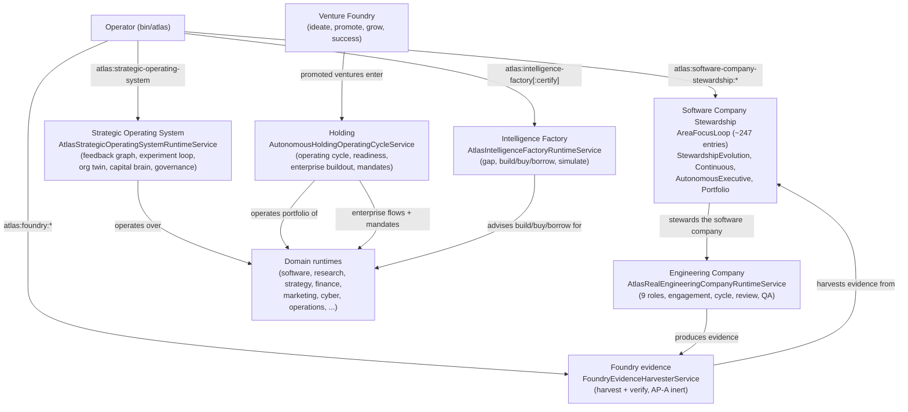

# Company, holding and strategic OS

This page covers the company-level operating stack that sits above the individual business domains. It is a group of overlapping runtimes, each of which models a different facet of running an autonomous company or portfolio: the Strategic Operating System, the Holding portfolio cycle, the Intelligence Factory, the Foundry evidence layer, the Software Company Stewardship loop, and the Engineering Company. Maturity across this stack is uneven, and this page is explicit about which pieces are real hand-written logic and which are large but fixture or registry-heavy.

## Purpose

Provide the meta-operating layer that governs a portfolio of companies: strategy-level operation, holding portfolio cycles, intelligence manufacturing, evidence harvesting, and the 24/7 stewardship of the software company. The stack shares the same doctrine as the rest of Atlas: provider-free read-only runtimes, claim policies that forbid auto-execution, evidence-grounded verdicts, and earned autonomy.

## The stack and its relationships

## Key abstractions

| Path | Role |
|------|------|
| `app/Services/Ai/StrategicOperatingSystem/AtlasStrategicOperatingSystemRuntimeService.php` | The Strategic Operating System runtime (40 KB). Provider-free, read-only. Composes a runtime feedback graph, an autonomous experiment-strategy loop, an organization twin, a portfolio capital-allocation brain, and an autonomous governance-policy evolution layer. Claim policy forbids provider invocation, writes, auto-applied policy, auto-spent capital, and auto-run experiments. |
| `app/Services/Ai/Holding/AutonomousHoldingOperatingCycleService.php` | The autonomous holding operating cycle (1,740 LOC). `observeToday` seeds domain manifests and opens runtime records per company. Defines many schema versions for routines, function executions, agent assignments, scorecards, workforce ledgers, flow executions, work products, recurring jobs, integration probes, orchestration traces, and cross-company handoffs. |
| `app/Services/Ai/Holding/AutonomousHoldingReadinessService.php` | Holding readiness gate (91 KB). Computes a target-score (9.0) readiness verdict requiring 9 companies with minimum functions, agent roles, flows, delivery types, work products, integrations, recurring cadences, metrics, and observed runtime evidence per company. |
| `app/Services/Ai/Holding/AutonomousHoldingEnterpriseBuildoutService.php` | Enterprise buildout report (755 KB). **Fixture and registry-heavy, not hand-written logic.** Builds a per-company readiness report from the seed manifests. Weigh by file size cautiously. |
| `app/Services/Ai/Holding/EnterpriseFlowFixtureActionRuntimeService.php` | Enterprise flow fixture action runtime (781 KB). **Fixture and registry-heavy, not hand-written logic.** |
| `app/Services/Ai/Holding/ExternalActionMandateRegistryService.php` | External action mandate registry (1.6 MB). **Fixture and registry-heavy, not hand-written logic.** Defines schemas for mandate registry, preflight, approval request/decision/status, control tower, activation cockpit, and premium activation status. |
| `app/Services/Ai/IntelligenceFactory/AtlasIntelligenceFactoryRuntimeService.php` | The Intelligence Factory runtime (34 KB). Provider-free. `advise` runs detect-gap, decide (build/buy/borrow), and simulate, then emits a claim-policy-gated advice packet. |
| `app/Services/Ai/IntelligenceFactory/AtlasIntelligenceFactoryCertificationService.php` | Intelligence Factory certification. Runs canonical-doc, persistence-surface, runtime-smoke, commands-present, integration-wiring, tests-present, and claim-policy checks. |
| `app/Services/Ai/Foundry/FoundryEvidenceHarvesterService.php` | Foundry evidence harvester (34 KB). AP-A inviolable rule: generates nothing. Harvests real evidence read-only from four owners (cycle recorder, evidence ledger, evidence packs, receipt integrity, plan completion) into a dossier and deterministically verifies anchors against that evidence. |
| `app/Services/Ai/Foundry/FoundryEvidenceVerifierService.php` | Foundry evidence verifier. |
| `app/Services/Ai/Foundry/FoundryExhaustionRarityGateService.php` | Foundry exhaustion and rarity gate. |
| `app/Services/Ai/Foundry/FoundrySemanticGapFinderService.php` | Foundry semantic gap finder. |
| `app/Services/Ai/SoftwareCompanyStewardship/AreaFocusLoop/` | The running software-company stewardship loop, the largest active subtree (~247 entries). Contains the cycle orchestrator, branch sandbox materializer, finding engines, certification services (L7 through L10), the reliable 24h loop runner, merge governors, priority engine, integration lanes, and many gates and contracts. |
| `app/Services/Ai/SoftwareCompanyStewardship/StewardshipEvolution/` | Stewardship evolution: DevForge runtime bridge, completion audit, evolution read model, live cycle certification, native obra runner, outcome evidence bridge, owner sandbox runtime runner, and runtime result bridges. |
| `app/Services/Ai/SoftwareCompanyStewardship/ContinuousStewardship/` | Continuous stewardship services. |
| `app/Services/Ai/SoftwareCompanyStewardship/AutonomousExecutive/` | Autonomous executive services. |
| `app/Services/Ai/SoftwareCompanyStewardship/PortfolioStewardship/` | Portfolio stewardship services. |
| `app/Services/Ai/SoftwareCompanyStewardship/AgentExecution/` | Agent execution services. |
| `app/Services/Ai/SoftwareCompanyStewardship/ProductMode/` | Product mode services. |
| `app/Services/Ai/SoftwareCompanyStewardship/SelfExpanding/` | Self-expanding stewardship services. |
| `app/Services/Ai/EngineeringCompany/AtlasRealEngineeringCompanyRuntimeService.php` | The real engineering company runtime (32 KB). Runs a 9-role engagement (product_intent_owner, architect, planner, senior_engineer, debugger, independent_reviewer, qa_test_engineer, release_delivery_manager, learning_memory_manager) through a cycle with real execution, review, QA, release pack, benchmark, and certification. |
| `app/Services/Ai/EngineeringCompany/EngineeringCompanyHash.php` | Engineering company canonical hash. |

## How it works

### Strategic Operating System

`AtlasStrategicOperatingSystemRuntimeService::operatingSystem` composes five sub-systems in order, each grounded in the previous:

1. **Runtime feedback graph** — reads runtime reality from persisted records.
2. **Autonomous experiment-strategy loop** — proposes experiments grounded in the feedback graph.
3. **Organization twin** — models the organization's operating sequence from feedback and experiments.
4. **Portfolio capital-allocation brain** — allocates capital across the portfolio from feedback, experiments, and organization.
5. **Autonomous governance-policy evolution** — evolves governance policy, review-gated, from all four prior layers.

The payload carries a `claim_policy` that is strict: provider not invoked, no writes, no auto-applied policy, no auto-spent capital, no auto-run experiments, requires verified execution for mutation, and requires human review for policy or capital change. The runtime is `provider_free_read_only_strategy_os`. A `system_readiness` block reports which layers are reality-grounded. Blockers are listed when any layer is not ready.

### Holding

`AutonomousHoldingOperatingCycleService::observeToday` is the operating cycle. It seeds the domain manifests (the 9 canonical domains), then for each domain opens or refreshes a runtime record for today with selected capabilities, functions, agent roles, flows, delivery types, and the operating packet. The cycle defines a large set of schema versions covering routines, function executions, agent assignments, operational scorecards, workforce ledgers, flow executions, work products, recurring jobs, integration probes, orchestration traces, flow evaluations, cross-company handoffs, and runbook evidence.

`AutonomousHoldingReadinessService` is the readiness gate. It computes a target-score (9.0) verdict that requires 9 companies, each with minimums for functions (4), agent roles (5), flows (4), delivery types (3), observed work products (3), integrations (3), recurring cadences (3), observed recurring jobs (3), metrics (4), observed metrics (5), observed function executions (4), observed agent assignments (5), observed agent scorecards (5), observed flow executions (4), and observed integration probes (3). This is a rigorous structural readiness bar.

The three large Holding files, `AutonomousHoldingEnterpriseBuildoutService` (755 KB), `EnterpriseFlowFixtureActionRuntimeService` (781 KB), and `ExternalActionMandateRegistryService` (1.6 MB), are fixture and registry-heavy. They define schemas, fixture suites, and mandate registries, not hand-written decision logic. Treat their file size as data volume, not logic depth.

### Intelligence Factory

`AtlasIntelligenceFactoryRuntimeService::advise` runs three steps:

1. **Detect gap** — classifies a capability gap (objective, domain, flow id, gap type) and finds matching capabilities. Status is `open` when no candidates exist, `resolved` otherwise.
2. **Decide** — produces a build/buy/borrow decision for the gap.
3. **Simulate** — simulates the selected capability.

The advice packet is claim-policy-gated (provider not invoked, no auto-execution). Certification (`AtlasIntelligenceFactoryCertificationService`) runs seven checks: canonical doc, persistence surface, runtime smoke, commands present, integration wiring, tests present, and claim policy.

### Foundry evidence layer

`FoundryEvidenceHarvesterService` follows the AP-A inviolable rule: it generates nothing. Zero proposal generation, zero canonical or doc writes, zero production mutation. It harvests real evidence read-only from four owners (cycle recorder, evidence ledger, evidence packs, receipt integrity, plan completion) into a dossier and deterministically verifies anchors against that evidence. Anchor verification rejects a non-existent or false anchor (fake cycle id, missing commit, unresolvable repro) with a recorded machine-readable `drop_reason`. Repro-command anchors are inert markers, never executed. Every owner call is guarded by an input-override seam so tests inject all sources and touch zero DB or JSONL.

The Foundry also includes `FoundryEvidenceVerifierService`, `FoundryExhaustionRarityGateService`, and `FoundrySemanticGapFinderService`, plus `Frontier/`, `Rsi/`, and `TestOs/` subdirectories.

### Software Company Stewardship

`app/Services/Ai/SoftwareCompanyStewardship/` is the largest active subtree in the company stack. The `AreaFocusLoop/` directory alone has roughly 247 entries and contains the running stewardship loop: the cycle orchestrator (`AreaFocusLoopOperationalOrchestratorService`), the branch sandbox materializer (`AreaFocusBranchSandboxMaterializerService` at 53 KB), the finding engines (`AreaFocusDeepFindingEngineService` at 169 KB, `AgenticEngineeringOsFindingEngineService`), the reliable 24h loop runner (`Reliable24hLoopRunnerService` at 173 KB), the merge governors (`StewardshipBranchMergeGovernorService` at 40 KB, `StewardshipMergeQueueService`), the priority engine (`StewardshipPriorityEngineService` at 66 KB), the integration lanes (`StewardshipIntegrationLaneService`, `StewardshipIntegrationLanePromotionService`), and a long ladder of certification services from L7 through L10.

The L7-L10 certification ladder is the autonomy-promotion spine:

- **L7** — promotion executor, proof bundle, completion certification.
- **L8** — frame evolution, meta-compounding, predictive twin, local engine distillation, self-deception immunity (five certification services).
- **L9** — operator judgment amplification, proven invariant, engineering discipline evolution, parallel lineage sandbox.
- **L10** — generative engineering, long-horizon strategy, bounded recursion (three certification services), plus convergence proof, recursive divergence gaming detector, and telos execution correction.

The sibling subdirectories, `StewardshipEvolution/`, `ContinuousStewardship/`, `AutonomousExecutive/`, `PortfolioStewardship/`, `AgentExecution/`, `ProductMode/`, and `SelfExpanding/`, each contribute a facet of continuous stewardship, evolution, executive autonomy, portfolio management, agent execution, product mode, and self-expansion.

### Engineering Company

`AtlasRealEngineeringCompanyRuntimeService::run` takes a goal text and runs a 9-role engagement through a cycle: product intent owner, architect, and planner run pre-execution, then the senior engineer runs against `AtlasRealEngineeringExecutionKernelService`, the debugger repairs if needed, the independent reviewer reviews, the QA test engineer runs QA, and the release delivery manager assembles the release pack. The engagement produces a benchmark and a certification. The roles enforce the same separation-of-powers doctrine as the rest of Atlas: the engineer that writes is not the reviewer that judges.

## Integration points

- **Artisan commands.** `atlas:strategic-operating-system`, `atlas:software-company-stewardship` (with `:area-focus-decision`, `:priority-engine`, `:integration-lane`, `:reliable-24h-loop`, `:certify-24h-loop`, `:live-cycle-audit`, and more), `atlas:intelligence-factory` (with `:certify`, `:readiness`, `:control-plane`), `atlas:foundry` (with `:harvest`, `:verify`, `:promote`, `:exhaustion-gate`, `:evolution-outcome`, `:frontier-generate`), `atlas:research:*`.
- **Config.** `config/atlas.php`, `config/atlas_projects.php` (project and workspace profiles), `config/atlas_operator_intelligence.php`.
- **DB tables.** `ai_holding_enterprise_flow_*`, `ai_holding_external_action_mandates`, `ai_holding_external_cutover_*`, `ai_holding_connector_activation_records`, `ai_holding_activation_backlog_items`, plus the intelligence factory capability, decision, simulation, certification, gap, and evolution tables, and the engineering company engagement, cycle, role run, review, QA, release pack, benchmark, and certification tables.
- **Domain runtime engine.** The Holding cycle and SOS operate over the 9 canonical domain manifests from `DomainSeedManifests`. See [Domain runtime engine](domain-runtime-engine.md).
- **Evidence Ledger.** The Foundry harvester reads real evidence from the `AtlasEvidenceLedger`. See [Evidence and receipts](../../concepts/evidence-and-receipts.md).
- **Venture Foundry.** Promoted ventures enter the holding portfolio. See [Venture Foundry](venture-foundry.md).

## Maturity honesty

This stack is the most uneven part of the business domains, and the file sizes are misleading without context.

- **Real hand-written logic.** The Strategic Operating System runtime (40 KB, provider-free, five composed layers, strict claim policy), the Holding operating cycle (1,740 LOC, real `observeToday` cycle), the Holding readiness gate (91 KB, rigorous structural bar), the Intelligence Factory runtime (34 KB) and its certification, the Foundry evidence harvester (34 KB, AP-A inert, anchor verification), the Engineering Company runtime (32 KB, 9 roles), and the Software Company Stewardship `AreaFocusLoop/` subtree (roughly 247 entries, the largest active code area, with the L7-L10 certification ladder) are all real working code.
- **Fixture and registry-heavy, not hand-written logic.** `AutonomousHoldingEnterpriseBuildoutService` (755 KB), `EnterpriseFlowFixtureActionRuntimeService` (781 KB), and `ExternalActionMandateRegistryService` (1.6 MB) are large because they hold fixture suites, schema definitions, and mandate registries, not because they contain deep decision logic. Weigh them by data volume, not logic depth.
- **Aspirational state doc, not code.** `docs/atlas-autonomous-company-architecture-v2.md` is the 7-layer autonomous-company architecture vision. It is the canonical design reference, and the implementation derives from it, but it is not itself code. The doc is honest about this: it lists, for each of the 7 layers, what already exists to reuse and what remains to build. The keystone layer (the closed learning loop) is explicitly called out as under-specified, not just not-built. See the autonomous-company architecture section below.

## The autonomous-company architecture vision

`docs/atlas-autonomous-company-architecture-v2.md` is the canonical design reference for the autonomous company. It is an aspirational state doc, not code. It describes 7 first-class layers that the v2 architecture adds on top of the v1 base (operator, control plane, holding and domains, Venture Foundry, NightShift, substrate):

1. **Closed learning loop (outcome to policy)** — the keystone. Transform observed results into the next decision's policy, auditably and reversibly. Reuses the Compounding runtime and Evidence Ledger; the control loop itself is the missing piece.
2. **Per-company decision engine** — read company state, choose the next best action across domains, dispatch. Reuses `VentureFocusDecider` as the core; the action dispatcher is missing.
3. **Cross-domain orchestration with typed handoffs** — make the company flow end-to-end (lead to sale to onboarding to support to billing). Reuses `DomainHandoffService`; the end-to-end orchestrator is missing.
4. **Per-action quality gate** — every output passes a quality gate before it leaves, not just at admission and result. Generalizes the ADEP iterate-to-green pattern from code to all domains.
5. **Autonomy promotion ladder (suggest to approve to auto)** — define how each action class gains or loses autonomy with proof. Irreversible or high-risk actions never pass approve without a mandate. Reuses `AtlasChangeClassTrustLadder`.
6. **Per-company containment (blast-radius, circuit-breaker, rollback)** — limit the damage of any bad autonomous decision operating real money or customers. Extends the Loop's blast-radius primitives.
7. **Operator cockpit (control tower)** — real-time state, decision receipts, and intervention levers in one place. Consolidates the Holding's enterprise-control-tower and the Evidence Ledger.

The doc is explicit about two irreducible limits: high-risk or irreversible actions stay behind an operator mandate by design (sovereignty), and genuinely greenfield judgment has a model ceiling (capacity). The v2 does not promise "everything autonomous forever." It promises extreme-quality autonomy in the bounded, reversible, measurable space, with the frontier graduating by proof.

The build order is: measurement first (the success evaluator and triple scorecard, which now exist in the Venture Foundry), then the decision engine and orchestration, then the per-action quality gate, then the autonomy ladder and containment, then the learning loop (the keystone, which comes after there is something to measure and learn from), and the cockpit in parallel.

## Key source files

| Path | Role |
|------|------|
| `app/Services/Ai/StrategicOperatingSystem/AtlasStrategicOperatingSystemRuntimeService.php` | Strategic Operating System runtime (provider-free, 5 composed layers) |
| `app/Services/Ai/Holding/AutonomousHoldingOperatingCycleService.php` | Holding operating cycle (1,740 LOC) |
| `app/Services/Ai/Holding/AutonomousHoldingReadinessService.php` | Holding readiness gate (target 9.0) |
| `app/Services/Ai/Holding/AutonomousHoldingEnterpriseBuildoutService.php` | Enterprise buildout (755 KB, fixture-heavy) |
| `app/Services/Ai/Holding/EnterpriseFlowFixtureActionRuntimeService.php` | Enterprise flow fixtures (781 KB, fixture-heavy) |
| `app/Services/Ai/Holding/ExternalActionMandateRegistryService.php` | External action mandate registry (1.6 MB, fixture-heavy) |
| `app/Services/Ai/IntelligenceFactory/AtlasIntelligenceFactoryRuntimeService.php` | Intelligence Factory runtime (gap, decide, simulate) |
| `app/Services/Ai/IntelligenceFactory/AtlasIntelligenceFactoryCertificationService.php` | Intelligence Factory certification (7 checks) |
| `app/Services/Ai/Foundry/FoundryEvidenceHarvesterService.php` | Foundry evidence harvester (AP-A inert, anchor verify) |
| `app/Services/Ai/Foundry/FoundryEvidenceVerifierService.php` | Foundry evidence verifier |
| `app/Services/Ai/Foundry/FoundryExhaustionRarityGateService.php` | Foundry exhaustion and rarity gate |
| `app/Services/Ai/Foundry/FoundrySemanticGapFinderService.php` | Foundry semantic gap finder |
| `app/Services/Ai/SoftwareCompanyStewardship/AreaFocusLoop/` | The running stewardship loop (~247 entries, L7-L10 ladder) |
| `app/Services/Ai/SoftwareCompanyStewardship/StewardshipEvolution/` | Stewardship evolution services |
| `app/Services/Ai/EngineeringCompany/AtlasRealEngineeringCompanyRuntimeService.php` | Engineering company runtime (9 roles) |
| `docs/atlas-autonomous-company-architecture-v2.md` | The 7-layer autonomous-company architecture vision (aspirational) |

## Related pages

- [Business domains](index.md) — overview
- [Venture Foundry](venture-foundry.md) — ventures enter the holding portfolio
- [Domain runtime engine](domain-runtime-engine.md) — the 9 canonical domain manifests the Holding and SOS operate over
- [Finance domain](finance.md) — one of the 9 domains
- [Self-Construction Government](../self-construction-government/index.md) — the government that governs the Loop and the company stack
- [Evolution Loop](../evolution-loop/index.md) — the Loop is one organ inside the Self-Construction Government
- [Anti-Goodhart and no-proxy](../../concepts/anti-goodhart.md) — the claim-policy and evidence-grounded doctrine
- [Evidence and receipts](../../concepts/evidence-and-receipts.md) — the Foundry harvester reads from the Evidence Ledger
- [Earned autonomy](../../concepts/earned-autonomy.md) — the L7-L10 promotion ladder mirrors earned autonomy
