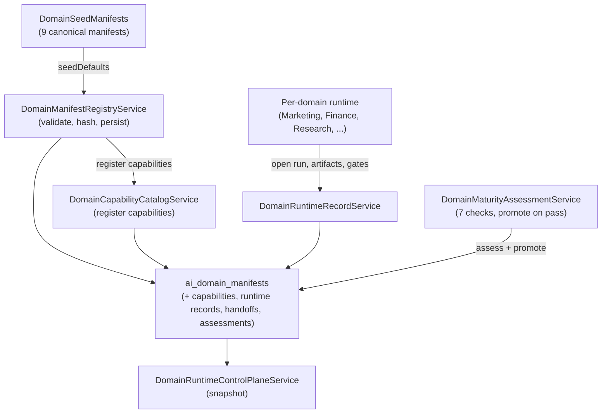

# Domain runtime engine

The domain runtime engine is the generic substrate that lets Atlas model and operate any business area uniformly. Instead of writing a bespoke runtime per domain, each domain is declared as a *manifest* (charter, ontology, departments, flows, allowed tools, evidence schema, quality gates, handoff rules, forbidden actions, and a maturity stage 1-to-5). The engine registers manifests, tracks capabilities and runtime records, assesses maturity, and exposes a control-plane snapshot. Per-domain Canon, Contract, Runtime, ControlPlaneProjection, and ComplianceGate classes then enforce the manifest at runtime.

## Purpose

Give every business domain the same shape: a declared charter, a set of flows with required evidence and gates, a list of forbidden actions, and an autonomy ceiling. This lets the operator and the Loop reason about domains uniformly, lets domains hand off to each other through typed contracts, and lets autonomy be earned and revoked per domain rather than granted globally.

## Key abstractions

| Path | Role |
|------|------|
| `app/Services/Ai/DomainRuntime/DomainManifestRegistryService.php` | Register and seed domain manifests. Validates the 11 required fields, checks the maturity stage is 1-to-5, hashes the manifest, and persists to `ai_domain_manifests`. |
| `app/Services/Ai/DomainRuntime/DomainSeedManifests.php` | Canonical seed manifests for 9 domains (software, research, strategy, finance, marketing, cyber, personal development, automation, operations). Defines the 5 maturity stage constants. |
| `app/Services/Ai/DomainRuntime/DomainRuntimeControlPlaneService.php` | Read-model snapshot of all manifests, capabilities, runtime records, and handoffs. Schema `atlas.ai.domain_runtime.control_plane.v1`. |
| `app/Services/Ai/DomainRuntime/DomainCapabilityCatalogService.php` | Register and query per-domain capabilities (capability_id, risk_level, required gates, evidence). |
| `app/Services/Ai/DomainRuntime/DomainHandoffService.php` | Typed handoffs between domains (source, target, status, receipt hash). |
| `app/Services/Ai/DomainRuntime/DomainMaturityAssessmentService.php` | Run maturity checks against a manifest and a target stage. Promotes the manifest stage only when all checks pass. |
| `app/Services/Ai/DomainRuntime/DomainRuntimeSelectionService.php` | Select a domain runtime for a given task. |
| `app/Services/Ai/DomainRuntime/DomainRuntimeRecordService.php` | Persist runtime records (mission_id, work_order_id, runtime_status, receipt_hash). |
| `app/Services/Ai/DomainRuntime/DomainRuntimeReadinessService.php` | Readiness report: checks required tables, models, services, test files, and that all default seed manifests are present. |
| `app/Services/AtlasDomainRegistry.php` | Top-level domain registry with sensitivity and external-AI policy, synced from `config/atlas.php` to the `atlas_domains` table. |

## The manifest

`DomainManifestRegistryService::register()` requires 11 fields, all non-empty:

| Field | What it is |
|-------|-----------|
| `charter` | Mission, audience, outcomes, frontier, and forbidden outcomes for the domain |
| `ontology` | The nouns the domain speaks in (mission, spec, patch, finding, opportunity, ...) |
| `departments` | The sub-areas of the domain (dev, qa, research_desk, valuation, ...) |
| `flow_profiles` | Named flows the domain runs (atlas_dev_quick_fix, research_brief, valuation, ...) |
| `tools_allowed` | Tools the domain may use (shell.run, web.search, doc.write, ...) |
| `evidence_schema` | Evidence kinds the domain must attach (test_run, source_ref, finding, ...) |
| `quality_gates` | Named gates the domain must clear (placement_verified, risk_disclosed, ...) |
| `handoff_rules` | Which domains this one may hand off to, and which are forbidden |
| `delivery_types` | What the domain delivers (patch_set, research_brief, valuation_model, ...) |
| `metrics` | What the domain measures (delivery_lead_time, source_diversity, ...) |
| `forbidden_actions` | Hard-forbidden actions regardless of approval state (silent merge, publish without approval, ...) |

A manifest also carries an optional `policy_profile` (autonomy + risk), `memory_scope` (retain days + kinds), `owner`, `status` (scaffold, active, deprecated, blocked), `maturity_stage` (1-to-5), and `capabilities`. The registry hashes the manifest with `MissionCanonicalHash::sha256` so two identical manifests produce the same hash, and rejects duplicate `domain_id`s.

## The seed manifest catalog

`DomainSeedManifests::all()` returns canonical seed manifests for 9 domains. Each is a full manifest plus an enterprise operating model (enterprise functions, agent roles, flow profiles, delivery types, integration contracts, recurring cadences, metrics, operational history tables, and runtime commands).

| Domain | Maturity stage | Autonomy | Notable forbidden actions |
|--------|---------------|----------|---------------------------|
| `software` | 4 (operating unit) | execute_with_approval | silent merge, unreviewed deploy |
| `research` | 4 (operating unit) | execute_with_approval | inference without citation |
| `strategy` | 4 (operating unit) | suggest | real spend without operator approval |
| `finance` | 4 (operating unit) | suggest | execute trade without mandate, omit risk disclosure |
| `marketing` | 5 (autonomous enterprise unit) | limited_internal_autonomy | publish without approval |
| `cyber` | 4 (operating unit) | execute_with_approval | unauthorized offensive operation, detection evasion for malicious use |
| `personal_development` | 4 (operating unit) | suggest | clinical diagnosis |
| `automation` | 4 (operating unit) | execute_with_approval | credential exfiltration, destructive op without approval |
| `operations` | 4 (operating unit) | execute_with_approval | unauthorized deploy, unauthorized restart |

Marketing is the only domain seeded at stage 5, reflecting that the Conversion OS and Keyword OS are the most mature business code. Finance is deliberately `suggest` autonomy with `risk: high` and a charter that forbids real trade execution without a mandate.

## The maturity ladder (1 to 5)

`DomainSeedManifests` defines five stages:

| Stage | Constant | Meaning |
|-------|----------|---------|
| 1 | `STAGE_ASSISTANT` | Assistant. Helps a human; no autonomous action. |
| 2 | `STAGE_SPECIALIST` | Specialist. Handles a bounded capability. |
| 3 | `STAGE_DEPARTMENT` | Department. Runs a sub-area with its own flows. |
| 4 | `STAGE_OPERATING_UNIT` | Operating unit. Runs the domain end-to-end with approval gates. |
| 5 | `STAGE_AUTONOMOUS_ENTERPRISE_UNIT` | Autonomous enterprise unit. Runs the domain as a self-contained business. |

`DomainMaturityAssessmentService::assess()` runs seven checks against a manifest and a target stage. Stages 4 and above require evidence refs, recorded metrics, and a certification hash. If any check fails, the assessment is `blocked` and the manifest stage is not promoted. If all pass, the assessment is `passed` and the manifest's `maturity_stage` is updated. The assessment itself is hashed and persisted to `ai_domain_maturity_assessments`.

## How it works

A domain is brought online in four steps:

1. **Seed.** `DomainManifestRegistryService::seedDefaults(DomainSeedManifests::all())` inserts the 9 canonical manifests (skipping any already seeded). Each manifest's capabilities are registered through `DomainCapabilityCatalogService`.
2. **Operate.** A per-domain runtime (for example `app/Services/Ai/MarketingDomain/MarketingRuntimeService.php`) opens a run, produces artifacts, and routes sensitive actions through approval gates. Runtime records are persisted via `DomainRuntimeRecordService`.
3. **Assess maturity.** `DomainMaturityAssessmentService::assess()` checks whether a domain has earned a higher stage. Evidence refs, metrics, and a certification hash are required for stages 4 and above.
4. **Snapshot.** `DomainRuntimeControlPlaneService::snapshot()` returns the full read model: every manifest with its counters, every capability, every runtime record, and every handoff.

## The control plane snapshot

`DomainRuntimeControlPlaneService::snapshot()` returns a single payload (schema `atlas.ai.domain_runtime.control_plane.v1`) with:

- A summary (manifest count, capability count, runtime record count, handoff count).
- Every manifest with its status, maturity stage, owner, manifest hash, counters (capabilities, runtime records, maturity assessments), and the latest maturity assessment.
- Every capability (capability_id, domain_id, risk_level, maturity level, status).
- Every runtime record (domain_id, mission_id, work_order_id, runtime_status, receipt_hash).
- Every handoff (source domain, target domain, status, receipt_hash, reason).

This is the read model the operator and other subsystems consult to see the state of all domains at once.

## Readiness

`DomainRuntimeReadinessService::report()` checks that the five required tables exist (`ai_domain_manifests`, `ai_domain_capabilities`, `ai_domain_runtime_records`, `ai_domain_handoffs`, `ai_domain_maturity_assessments`), that the five required models and seven required services are resolvable, that ten required test files are present, and that all 9 default seed manifests are in the database. It returns a pass/fail check list and an `ok` flag.

## Integration points

- **Artisan commands.** `atlas:domain:analyze`, `atlas:domain:onboarding`, `atlas:domain:pipelines`, `atlas:domain:plane`, `atlas:domains:programming-surfaces`, `atlas:domain:expansion-spec`, `atlas:domain:routing-governance`.
- **Per-domain runtimes.** Each domain has a Canon (constants), a Contract (flows and gates), a Runtime, a ControlPlaneProjection, a ComplianceGate, a ManifestSeeder, and a ReadinessService. See [Marketing and the Conversion OS](marketing-and-conversion-os.md), [Finance domain](finance.md), and [Venture Foundry](venture-foundry.md).
- **Cross-domain.** `app/Services/Ai/CrossDomain/AtlasCrossDomainMeshService.php` models the cross-domain value chain; `AtlasTemporaryDomainCompositionService` composes ad-hoc domains.
- **DB tables.** `ai_domain_manifests`, `ai_domain_capabilities`, `ai_domain_runtime_records`, `ai_domain_handoffs`, `ai_domain_maturity_assessments`, `ai_domain_profiles`, `atlas_domains`.

## Key source files

| Path | Role |
|------|------|
| `app/Services/Ai/DomainRuntime/DomainManifestRegistryService.php` | Register and seed manifests |
| `app/Services/Ai/DomainRuntime/DomainSeedManifests.php` | 9 canonical seed manifests + maturity stage constants + enterprise operating models |
| `app/Services/Ai/DomainRuntime/DomainRuntimeControlPlaneService.php` | Control-plane snapshot |
| `app/Services/Ai/DomainRuntime/DomainCapabilityCatalogService.php` | Capability catalog |
| `app/Services/Ai/DomainRuntime/DomainHandoffService.php` | Typed domain handoffs |
| `app/Services/Ai/DomainRuntime/DomainMaturityAssessmentService.php` | Maturity assessment and promotion |
| `app/Services/Ai/DomainRuntime/DomainRuntimeReadinessService.php` | Readiness report |
| `app/Services/AtlasDomainRegistry.php` | Top-level domain registry with sensitivity and external-AI policy |

## Related pages

- [Business domains](index.md) — overview of the whole area
- [Marketing and the Conversion OS](marketing-and-conversion-os.md) — the most mature domain runtime
- [Finance domain](finance.md) — the analysis-only contract
- [Venture Foundry](venture-foundry.md) — the company lifecycle
- [Self-Construction Government](../self-construction-government/index.md) — earned autonomy and the fleet control plane
