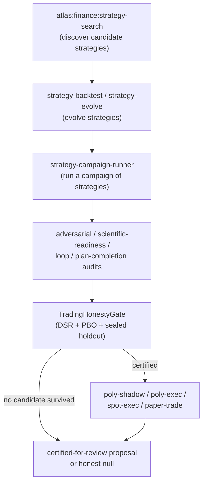

# Finance domain

The Finance domain has a deliberately split personality. The core domain is analysis-only: it produces research notes, valuation models, portfolio reviews, risk reports, and compliance memos, and it is forbidden from placing, modifying, or canceling orders. Execution is an explicit, separate subsystem (the StrategyLoop, PolymarketExec, SpotExec) that lives under `app/Services/Ai/Finance/` but outside the analysis contract. This separation is enforced in code, not just in docs.

## Purpose

Run a finance research desk, valuation, portfolio analysis, and risk and compliance reporting without ever touching order entry. The analysis contract is `output_mode = analysis_review_only` and `autonomy = low`. The StrategyLoop is the live trading-strategy campaign that actually executes (paper, shadow, or real) under a separate honesty gate.

## The analysis-only contract

`app/Services/Ai/Finance/AtlasFinanceDomainContract.php` is the contract. It declares:

- **10 flows.** `finance.market_research`, `finance.risk_review`, `finance.portfolio_analysis`, `finance.trade_thesis`, `finance.macro_review`, `finance.earnings_review`, `finance.news_impact`, `finance.compliance_review`, `finance.backtest_plan`, `finance.forge`.
- **Global gates.** `finance_compliance_review`, `source_attribution`, `risk_disclosure`, and `analysis_review_only` (the output mode itself is a gate).
- **Forbidden market actions.** `place_order`, `modify_order`, `cancel_order`, `rebalance_account`, `transfer_cash`, `exercise_option`, `connect_broker_for_execution`, `publish_investment_advice_as_personal_recommendation`.
- **Tool policy.** `mode = read_only`, `market_data_read = true`, `broker_api_access = false`, `order_entry = false`, `external_publish = false`.
- **Domain gate policy.** Release requires operator approval and compliance review. The autonomy ceiling is `analysis_review_only`. Market execution is not allowed.

The `forge` flow is the only flow that requires human approval by default (it composes a multi-flow plan into a review packet). Each flow declares its runtime, required evidence, and extra gates.

The memory policy is provider-safe by default and never stores broker credentials, account secrets, or unredacted personal financial data. Learning promotes from accepted research notes, reviewed risk findings, and validated backtest methods, and requires review for portfolio preferences, risk limits, compliance rules, and instrument watchlists. It never auto-executes.

## Key abstractions

| Path | Role |
|------|------|
| `app/Services/Ai/Finance/AtlasFinanceDomainContract.php` | The 10 flows, global gates, forbidden market actions, tool and memory policy, and gate policy. |
| `app/Services/Ai/Finance/AtlasFinanceRuntime.php` | The finance runtime. |
| `app/Services/Ai/Finance/AtlasFinanceOrchestrator.php` | The finance orchestrator. |
| `app/Services/Ai/Finance/AtlasFinanceProfileFactory.php` | Finance profile factory. |
| `app/Services/Ai/Finance/AtlasFinanceComplianceGate.php` | Compliance gate. |
| `app/Services/Ai/Finance/AtlasFinanceSafetyPolicy.php` | Safety policy. |
| `app/Services/Ai/Finance/AtlasFinanceReviewRequest.php` | Review request. |
| `app/Services/Ai/Finance/StrategyLoop/TradingHonestyGate.php` | The post-selection honesty gate for the StrategyLoop. |
| `app/Services/Ai/Finance/StrategyLoop/MarketDataCache.php` | Market data cache. |
| `app/Services/Ai/Finance/StrategyLoop/FundingTape.php` | Funding tape. |
| `app/Services/Ai/Finance/StrategyLoop/Bar.php` | Bar (OHLCV) value object. |

## The StrategyLoop

The StrategyLoop is the live trading-strategy campaign, the "finance strategy campaign." It lives under `app/Services/Ai/Finance/StrategyLoop/` with subdirectories `Strategy/`, `Campaign/`, `Metrics/`, plus `MarketDataCache`, `FundingTape`, `Bar`, and `TradingHonestyGate`.

The flow:

1. **Search.** `atlas:finance:strategy-search` discovers candidate strategies.
2. **Evolve.** `strategy-backtest` and `strategy-evolve` evolve them.
3. **Campaign.** `strategy-campaign-runner` runs a campaign of strategies.
4. **Audit.** Adversarial, scientific-readiness, loop, and plan-completion audits gate quality.
5. **Honesty gate.** `TradingHonestyGate` is the post-selection judge.
6. **Execute.** `poly-shadow`, `poly-exec`, `spot-exec`, `paper-trade` execute (Polymarket shadow or real, spot, or paper).

The execution engines live in `app/Services/Ai/Finance/PolymarketExec/`, `PolymarketShadow/`, and `SpotExec/`, with `Kernel/` and `Governance/` subdirectories.

## The TradingHonestyGate

`TradingHonestyGate` is the honesty gate that closes the loop's number-one overfitting risk. It turns a raw "best Sharpe among N" into either a certified-for-review proposal or an honest null. The frozen judge scores one workspace, blind to how many siblings ran, so the trial count N (the engine's reported `scenarios_explored`) is injected here and used to:

1. **Deflate the winner's Sharpe by N.** The more scenarios explored, the higher the "best by luck" bar. Searching harder makes the metric stricter, not easier. The deflation uses the Lo-2002 variance floor that keeps N biting under clustered siblings.
2. **Estimate PBO across the siblings' out-of-sample windows.** PBO (Probability of Backtest Overfitting) via the CSCV estimator checks whether the in-sample winner is actually overfit.
3. **Require the winner to survive a sealed holdout** it never optimized against.

Certify only if DSR (Deflated Sharpe Ratio) is at least `dsr_min` (default 0.95), PBO is at most `pbo_max` (default 0.2), and the holdout stays positive (Sharpe at least 0.5 with at least 10 trades). A cross-sibling diversity precondition rejects honestly rather than certifying on a degenerate set. If any check fails, the honest output is "no candidate survived." That null is the system working, never a failure to paper over. Win-rate is never consulted.

The sensitive statistical engine (DSR with the Lo-2002 floor, PBO/CSCV, cross-trial Sharpe variance) runs in a real Python numpy runtime behind `HonestMetricsRuntimeClient`, proven equivalent to the removed PHP within 1e-9. The thresholds, the sibling-diversity precondition, and the certify-or-null decision stay in the PHP kernel. Python returns numbers, PHP governs.

## Integration points

- **Artisan commands.** `atlas:finance:strategy-search`, `strategy-backtest`, `strategy-evolve`, `strategy-loop`, `strategy-campaign-runner`, `strategy-loop-audit`, `strategy-adversarial-audit`, `strategy-scientific-readiness-audit`, `strategy-confirmation-next`, `strategy-plan-completion-audit`, `poly-exec`, `poly-shadow`, `poly-arb`, `poly-implication`, `spot-exec`, `paper-trade`.
- **Config.** `config/atlas_venture_foundry.php` (the venture side, not finance-specific), `config/atlas.php`.
- **DB tables.** Finance smoke payloads, finance control plane, `ai_receipts`.
- **Related.** The Strategy domain (`app/Services/Ai/Strategy/`) feeds opportunities; the Research domain feeds sources. The domain manifest seeds finance at maturity stage 4 with `suggest` autonomy and `risk: high`.

## Maturity honesty

The Finance core (the contract, runtime, orchestrator, compliance gate, safety policy) is clean, hand-written, analysis-only code. The StrategyLoop, PolymarketExec, PolymarketShadow, and SpotExec are the actual execution code and are active (files dated June). The `TradingHonestyGate` is a rigorous, frozen-judge-style gate that delegates its statistics to a real Python runtime. The separation between analysis and execution is enforced in the contract's forbidden actions and tool policy, not just documented.

## Key source files

| Path | Role |
|------|------|
| `app/Services/Ai/Finance/AtlasFinanceDomainContract.php` | The analysis-only contract (flows, gates, forbidden actions) |
| `app/Services/Ai/Finance/AtlasFinanceRuntime.php` | Finance runtime |
| `app/Services/Ai/Finance/AtlasFinanceOrchestrator.php` | Finance orchestrator |
| `app/Services/Ai/Finance/AtlasFinanceComplianceGate.php` | Compliance gate |
| `app/Services/Ai/Finance/AtlasFinanceSafetyPolicy.php` | Safety policy |
| `app/Services/Ai/Finance/StrategyLoop/TradingHonestyGate.php` | Post-selection honesty gate (DSR, PBO, sealed holdout) |
| `app/Services/Ai/Finance/StrategyLoop/MarketDataCache.php` | Market data cache |
| `app/Services/Ai/Finance/StrategyLoop/FundingTape.php` | Funding tape |
| `app/Services/Ai/Finance/PolymarketExec/` | Polymarket execution engine |
| `app/Services/Ai/Finance/PolymarketShadow/` | Polymarket shadow execution |
| `app/Services/Ai/Finance/SpotExec/` | Spot execution engine |

## Related pages

- [Business domains](index.md) — overview
- [Domain runtime engine](domain-runtime-engine.md) — the finance manifest (stage 4, suggest autonomy, high risk)
- [Venture Foundry](venture-foundry.md) — ventures feed off strategy and finance
- [Evolution Loop](../evolution-loop/index.md) — the frozen-judge pattern the TradingHonestyGate mirrors
- [Anti-Goodhart and no-proxy](../../concepts/anti-goodhart.md) — the honesty gate is an anti-overfitting, anti-Goodhart gate
