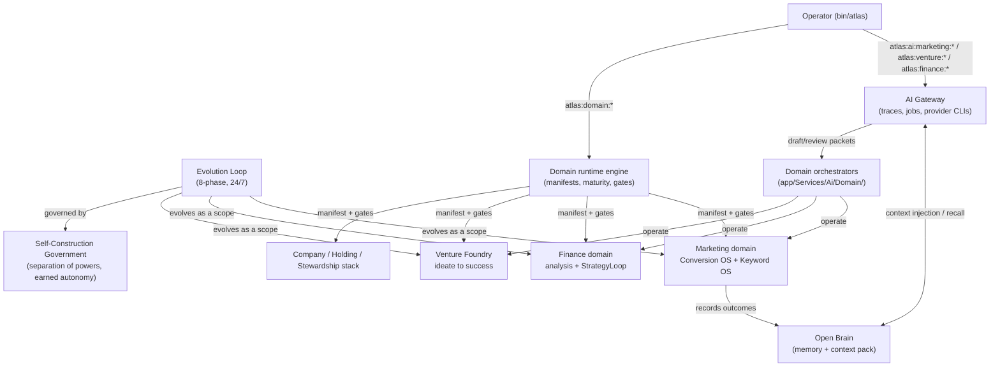

# Business domains

Atlas Server is an AI software-engineering platform, but it also has an "autonomous company" ambition: the same agent machinery (the [AI Gateway](../ai-gateway/index.md), the [Evolution Loop](../evolution-loop/index.md), evidence and certification, the [Open Brain](../open-brain/index.md)) is pointed at money-making scopes. This section covers that machinery.

## Purpose

There are two complementary layers. First, a generic **domain runtime engine** that models any business area (software, research, strategy, finance, marketing, cyber, operations, automation, personal development) as a *manifest* and operates it with per-domain runtimes, compliance gates, and an autonomy ladder (suggest to approve to auto). Second, on top of that engine sits the **company stack**: Venture Foundry (ideate, promote, grow a venture toward an ARR target), the Holding/Strategic-OS/Stewardship portfolio, and the very active affiliate **Conversion OS** and **Search/Keyword OS** built inside the Marketing domain.

## Maturity honesty

Maturity across this area is uneven, and the wiki distinguishes working code from fixture-heavy or aspirational docs.

- **Most mature and most actively developed.** The Marketing domain's `Content/` (Conversion OS), `Campaign/` (Search/Keyword OS), and `Knowledge/` (19 persuasion libraries) are real working code, dozens of files, provider-free, with auditors and gates. This is where the Loop has been grinding most recently. See [Marketing and the Conversion OS](marketing-and-conversion-os.md) and [Search and Keyword OS](search-keyword-os.md).
- **Mature engine code.** The `DomainRuntime` manifest engine, `VentureFoundry` (full ideate-to-success lifecycle), `Product` certification, `Strategy`, and `SoftwareCompanyStewardship/AreaFocusLoop` (a very large active subtree) are real, hand-written logic.
- **Mixed.** The Finance core is a clean analysis-only contract with no order entry by design; the actual execution lives in `Finance/StrategyLoop`, `PolymarketExec`, and `SpotExec`. The `Holding` subsystem has a real 1,740-line operating-cycle service, but its largest files (`ExternalActionMandateRegistryService` at 1.6 MB, `AutonomousHoldingEnterpriseBuildoutService` at 755 KB) are fixture and registry data, not hand-written logic.
- **Docs and aspirational state.** `docs/atlas-autonomous-company-architecture-v2.md` (the 7-layer vision), `docs/atlas-company-success-engine-buildout.md` (a buildout plan), and the `*-os-state.md` / `conversion-os-audit-cycleNN.md` cycle journals describe intent and track progress. They hold live state and roadmaps, not a guarantee that every described layer is fully implemented in code.

## Pages in this section

| Page | What it covers |
|------|----------------|
| [Domain runtime engine](domain-runtime-engine.md) | The generic manifest engine: `DomainManifestRegistryService`, seed manifests for 9 domains, the 1-to-5 maturity ladder, capabilities, handoffs, and the control-plane snapshot. |
| [Marketing and the Conversion OS](marketing-and-conversion-os.md) | The most actively developed business domain. VSL ingestion, the ConversionOrchestrator, AggressionAmplifier, BridgePageComposerService, the 19 Knowledge libraries, approval gates, auditors, and the optimization cycle. |
| [Search and Keyword OS](search-keyword-os.md) | The Google-Ads keyword system: KeywordIntelligencePipeline, IntentLadderClassifier, KeywordInvestmentGate, NegativeKeywordForge, QualifiedKeywordDossier, BayesianKillScaleDecider, and the learning loop calibrated on Blackink outcomes. |
| [Finance domain](finance.md) | The analysis-only contract (no order entry in the core domain), the 10 flows, compliance gates, the live StrategyLoop, Polymarket/Spot execution engines, and the TradingHonestyGate. |
| [Venture Foundry](venture-foundry.md) | The ideate-to-promote-to-grow-to-success lifecycle: VentureIdeationService, VentureRegistryService, VentureGrowthLadderService, VentureSuccessEvaluator, the admission gate, and the Company Success Engine. |
| [Company, holding and strategic OS](company-holding-stack.md) | The Strategic Operating System, Holding, Intelligence Factory, Foundry, and SoftwareCompanyStewardship. Notes which pieces are large but fixture/registry-heavy. |

## How domains plug into the Gateway and Loop

Business domains do not run in isolation. Per-domain orchestrators in `app/Services/Ai/Domain/` (for example `AtlasMarketingOrchestrator`, `AtlasResearchOrchestrator`, `AtlasStrategicDecisionOrchestrator`) hang off the AI Gateway's `StandardResponseOrchestrator` to produce draft and review packets through the same provider-CLI path the rest of the app uses. The autonomous-evolution Loop treats a business domain as a *scope*: it can be aimed at the affiliate, conversion, or keyword OS the same way it evolves the engineering scope, recording outcomes back into domain runtime records, marketing decision and economics ledgers, and venture metric observations.

The autonomy ladder is the same one used everywhere: a domain starts at `suggest` (it proposes, a human approves), can graduate to `approve` (it executes within an envelope, a human reviews), and only reaches `auto` after earned autonomy. Sensitive actions (publish, paid spend, order entry, deploy) are forbidden without an explicit approval gate regardless of stage. This mirrors the [earned autonomy](../../concepts/anti-goodhart.md) and [separation of powers](../../concepts/anti-goodhart.md) doctrine that governs the Loop.

## Key source files

| Path | Role |
|------|------|
| `app/Services/Ai/DomainRuntime/DomainManifestRegistryService.php` | Register and seed business-domain manifests (charter through gates through maturity) |
| `app/Services/Ai/DomainRuntime/DomainSeedManifests.php` | Canonical seed manifests for 9 domains |
| `app/Services/Ai/DomainRuntime/DomainRuntimeControlPlaneService.php` | Read-model snapshot of all domains, capabilities, and handoffs |
| `app/Services/Ai/Domain/` | Per-domain draft/review orchestrators that hang off the AI Gateway |
| `app/Services/Ai/Finance/AtlasFinanceDomainContract.php` | Finance flows, gates, and forbidden market actions |
| `app/Services/Ai/MarketingDomain/MarketingRuntimeService.php` | Marketing domain runtime (runs, artifacts, approval gates, certification) |
| `app/Services/Ai/VentureFoundry/VentureRegistryService.php` | Create and track ventures toward an ARR target |
| `app/Services/Ai/StrategicOperatingSystem/AtlasStrategicOperatingSystemRuntimeService.php` | Strategic Operating System runtime |
| `app/Services/Ai/SoftwareCompanyStewardship/AreaFocusLoop/` | The running software-company stewardship loop (largest active subtree) |

## Integration points

- **Artisan commands.** `atlas:domain:*` (engine), `atlas:ai:marketing:*` (conversion, keyword, funnel, VSL), `atlas:finance:strategy-*` (strategy search, backtest, evolve, campaign runner, audits, exec), `atlas:venture:*` (idea-register, promote, strategist-review, comprehend, assess, ladder, metric-record), `atlas:software-company-stewardship:*`, `atlas:strategic-operating-system`, `atlas:foundry:*`.
- **Config.** `config/atlas_venture_foundry.php` (ideation, strategist cadence, success thresholds, admission gate), `config/atlas.php` (`atlas.domains.defaults`), `config/atlas_projects.php`.
- **DB tables.** `ai_domain_manifests`, `ai_domain_capabilities`, `ai_domain_runtime_records`, `ai_domain_handoffs`, `ai_ventures`, `ai_venture_metric_observations`, `ai_marketing_runs`, `ai_marketing_artifacts`, `ai_marketing_approval_gates`, `ai_marketing_vsl_assets`, and the Holding enterprise-flow tables.
- **Live state docs.** `docs/conversion-os-state.md`, `docs/search-keyword-os-state.md`, `docs/affiliate-loop-state.md`, `docs/affiliate-mastery/`, `docs/ventures/`, `docs/atlas-autonomous-company-architecture-v2.md`.

## Related pages

- [AI Gateway](../ai-gateway/index.md) — domain orchestrators hang off the gateway
- [Evolution Loop](../evolution-loop/index.md) — the loop can be aimed at business scopes
- [Self-Construction Government](../self-construction-government/index.md) — multi-project stewardship and earned autonomy
- [Anti-Goodhart and no-proxy](../../concepts/anti-goodhart.md) — the anti-proxy gates that keep domains from farming metrics
