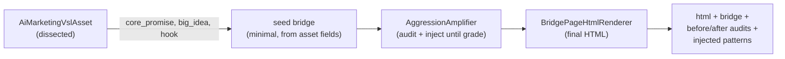

# Marketing and the Conversion OS

The Marketing domain is the most actively developed and most mature business domain in Atlas. Its root holds the domain skeleton (Canon, Runtime, approval gates, control-plane projection, readiness), and two large subdirectories do the real work: `Content/` (the Conversion OS, which turns a VSL asset into a high-converting bridge page) and `Campaign/` (the Search/Keyword OS, covered on its own page). A third subdirectory, `Knowledge/`, holds 19 crystallized persuasion and conversion libraries that the Conversion OS audits against and injects from.

## Purpose

Turn a video sales letter (VSL) asset into a conversion-optimized bridge or advertorial page, provider-free, by auditing the page against elite conversion patterns and injecting what is missing until the page reaches a target grade. Then iterate that as a loop, tracking the state in `docs/conversion-os-state.md`. The bridge page's one job is to warm the cold lead and maximize VSL watch-through: every section opens a curiosity gap only the VSL closes.

## The domain skeleton

`app/Services/Ai/MarketingDomain/MarketingDomainCanon.php` is the constant set: run statuses (planned, drafting, certifying, completed, failed), artifact types (ICP, positioning, campaign, copy, creative, funnel, analytics_plan), artifact statuses, experiment statuses, approval gate types (publish, paid_media, send_email, launch_experiment), and forbidden actions (publish without approval, paid spend without approval, send email without approval, launch experiment without approval). Certification requires ICP, positioning, campaign, copy, and funnel artifacts, and every campaign or paid-media artifact must have an open or approved gate.

`app/Services/Ai/MarketingDomain/MarketingRuntimeService.php` opens a marketing run, produces artifacts, and certifies the run. Certification fails if any required artifact type is missing, if a campaign artifact lacks a publish or paid-media gate, or if an experiment lacks a launch gate. The run is never marked completed with a pending sensitive gate.

`app/Services/Ai/MarketingDomain/MarketingApprovalGateService.php` and `MarketingLimitedAutonomyPolicyService.php` enforce the gates. The limited-autonomy policy caps external spend at zero without approval.

## Key abstractions

| Path | Role |
|------|------|
| `app/Services/Ai/MarketingDomain/VslIntelligenceExtractorService.php` | Dissect a VSL transcript into structured intelligence (entities, market, lead, offer, funnel, keywords, creative) via a governed provider. |
| `app/Services/Ai/MarketingDomain/VslAssetIngestionService.php` | Ingest a VSL asset (transcript, metadata) into an `AiMarketingVslAsset`. |
| `app/Services/Ai/MarketingDomain/Content/ConversionOrchestrator.php` | One-button end-to-end pipeline: asset to seed bridge to amplified bridge to final HTML. |
| `app/Services/Ai/MarketingDomain/Content/AggressionAmplifier.php` | The closed loop: audit, inject missing elite patterns, re-audit until target grade, with anti-Goodhart and structure-safety gates. |
| `app/Services/Ai/MarketingDomain/Content/BridgePageComposerService.php` | Author an aggressive bridge page from the dissected VSL, winning patterns, and affiliate skills. |
| `app/Services/Ai/MarketingDomain/Content/BridgePageHtmlRenderer.php` | Render a bridge into final HTML. |
| `app/Services/Ai/MarketingDomain/Content/BridgePagePolicyGuard.php` | Fail-closed policy compliance for the bridge (uptime, no unhedged medical claims). |
| `app/Services/Ai/MarketingDomain/Content/ConversionAuditor.php` | Unified multi-dimensional X-ray: runs all 9 copy libraries plus the structure library and returns a per-library score, an overall grade, and the top missing high-leverage patterns. |
| `app/Services/Ai/MarketingDomain/Content/ConversionCriticGate.php` | Critic gate over the conversion dimensions. |
| `app/Services/Ai/MarketingDomain/Content/AntiGoodhartGuard.php` | Measures hollowness; rejects injections that raise it materially. |
| `app/Services/Ai/MarketingDomain/Content/PersonaSimulator.php` | Simulates skeptical personas (will_watch, will_close, first_objection, what_she_needs_next). |
| `app/Services/Ai/MarketingDomain/Knowledge/MarketingPlaybook.php` | The largest crystallized knowledge library (43 KB). |
| `app/Services/Ai/MarketingDomain/MarketingRuntimeService.php` | Marketing domain runtime (runs, artifacts, certification). |
| `app/Services/Ai/MarketingDomain/MarketingDomainCanon.php` | Domain constants (statuses, artifact types, gates, forbidden actions). |

## VSL ingestion

`VslIntelligenceExtractorService` is pillar 1. It reads a transcribed VSL and runs a focused multi-pass LLM analysis through a governed provider (never a pinned model). The passes are: `entities`, `market`, `lead`, `offer`, `funnel`, `keywords`, `creative`.

Quality layers:

- An entity normalization pass first, so downstream passes use canonical names (fixing ASR errors in names, brands, drugs).
- Multi-run consensus on the critical market/mechanism pass.
- A comprehension critic that scores each field and re-runs the weak passes.

Each pass is independent; one failure does not lose the rest. The asset ends up `structured` (or `partial` if some passes errored), with `structure_status` ready or partial and the extraction model recorded.

## The Conversion OS pipeline

`ConversionOrchestrator::orchestrate()` is the "press one button" entry point. It chains three stages, all provider-free:

1. **Seed.** `seed()` builds a minimal bridge from the asset's dissected fields (headline from core_promise or big_idea, subheadline from hook, language detected from target_geo). It pre-seeds copy slots with pinned angle and hook markers so variants differ along the axes they were asked to differ. The seed is kept tiny on purpose; the amplifier does the work.
2. **Amplify.** `AggressionAmplifier::amplify()` runs the closed loop. It audits the bridge with `ConversionAuditor`, picks the top missing high-leverage patterns, generates a concrete copy snippet for each one grounded in the asset's ammunition, injects each snippet into the right bridge slot (kicker, mechanism_tease, body_sections, ps, objection_flips, cta_blocks), then re-audits to prove the lift. This repeats until the target grade is met or the iteration cap is hit.
3. **Render.** `BridgePageHtmlRenderer::render()` emits the final HTML with a brand and optional thumbnail.

The orchestrator returns the HTML, the final bridge, the before and after audits, and the list of injected patterns.

## The AggressionAmplifier closed loop

The amplifier is the heart of the Conversion OS. Two gates protect every injection:

- **Anti-Goodhart gate.** `AntiGoodhartGuard::inspect()` measures hollowness (marker stuffing without real persuasion). If an injection raises hollowness by more than 15 points, it is rejected. The system never trades real persuasion for marker stuffing.
- **Structure-safety gate.** If an injection introduces a watch-through leak (premature reveal or CTA, detected by `WatchThroughLeakDetector`) or choice overload (a competing CTA category, detected by `DecisionClarityAuditor`), it is rejected. Persuasion is never traded for a structural defect.

After the main loop, two more passes run:

- **Persona fix.** `PersonaSimulator` simulates the niche's panel. If the audience score is below 70, the amplifier injects the targeted snippet for the worst-rejecting persona's "what she needs next".
- **Aggression pass.** On by default. Pushes the aggressive playbook (manufactured scarcity, fear, social/authority/value/identity pressure) grounded in the asset, through the same structure and anti-Goodhart gates. The operator derives a compliant version downstream if they choose.

## The 19 Knowledge libraries

`app/Services/Ai/MarketingDomain/Knowledge/` holds 19 crystallized persuasion and conversion libraries. Each is a `PatternLibrary` that the `ConversionAuditor` scores a page against and the `AggressionAmplifier` injects from. All scored by a single `PatternLibraryScorer`.

| Library | Focus |
|---------|-------|
| `MarketingPlaybook.php` (43 KB) | The master playbook |
| `PersuasionPatternLibrary.php` | SOTA persuasion patterns (31 patterns) |
| `AggressiveConversionTacticsLibrary.php` | Aggressive direct-response tactics |
| `OfferArchitectureLibrary.php` | Offer levers (Hormozi) |
| `CognitiveBiasLibrary.php` | Rare cognitive biases |
| `AwarenessSophisticationLibrary.php` | Schwartz awareness engineering |
| `FunnelSequenceLibrary.php` | Multi-step funnel journeys |
| `HookLeadLibrary.php` | Hooks and leads (Bencivenga, Halbert, Carlton) |
| `ObjectionLibrary.php` | Advanced objection neutralizers |
| `NarrativeVoiceLibrary.php` | Master voice signatures |
| `AngleBigIdeaLibrary.php` | Angles and big ideas (elite swipe files) |
| `VisualPersuasionLibrary.php` | Rare persuasive design (scores on HTML structure) |
| `VideoCreativeAnatomyLibrary.php` | Video creative anatomy |
| `PagePatternLibrary.php` | Page patterns |
| `SalesMomentPatternIndex.php` | Sales moment patterns |
| `CloseTacticsLibrary.php` | Close tactics |
| `TacticalNegotiationLibrary.php` | Tactical negotiation |
| `AffiliateNetworksReference.php` | Affiliate network reference |
| `PatternLibrary.php` | Base interface |

## The optimization cycle

The Conversion OS is iterated as a loop, tracked in `docs/conversion-os-state.md` and the `conversion-os-audit-cycleNN.md` journals. The state doc records the maturity floor (currently 85, rising to 90) and per-cycle deliveries. The cycle:

1. Draft a funnel or bridge page.
2. Run it through the ~10 conversion-dimension auditors and critics (`ConversionCriticGate`, `ConversionAuditor`, `ValueEquationAuditor`, `FunnelContinuityAuditor`, `ProofForge`, `ProofSubstanceAuditor`, `ProofAdjacencyAuditor`, `FrictionAbilityAuditor`, `DecisionClarityAuditor`, `PersonaSimulator`, `CopyQualityGate`, `WatchThroughLeakDetector`).
3. Score it (panel verdict, overall grade, audience score).
4. Inject improvements through the AggressionAmplifier until the floor grade is met.
5. Record the outcome into the `LearnedWeightLedger` (via `atlas:ai:marketing:record-outcome`) so the `HybridPatternScorer` can blend craft weights with learned weights per niche.

The flywheel is closed: `LearnedWeightLedger` persists a snapshot of the audit plus the real outcome (CVR, clicks) per niche; `HybridPatternScorer` blends craft and learned weights with a sigmoidal curve (0 outcomes = 100% craft, 30 = 50/50, 200+ = ~90% learned). The `ConversionAuditor` wires the hybrid scorer by default, so the moment the ledger receives real data, the motor uses it without rewriting.

## Auditors and critics

The `Content/` directory holds the full panel:

| Auditor / critic | What it measures |
|------------------|------------------|
| `ConversionAuditor` | Unified multi-dimensional X-ray across all 9 copy libraries + structure |
| `ConversionCriticGate` | Critic gate over the conversion dimensions |
| `AntiGoodhartGuard` | Hollowness (marker stuffing without persuasion) |
| `WatchThroughLeakDetector` | Premature reveals and CTAs that leak VSL watch-through |
| `DecisionClarityAuditor` | Choice overload and competing CTAs |
| `ValueEquationAuditor` | Value equation strength |
| `ProofForge` | Forges proof blocks |
| `ProofSubstanceAuditor` | Proof substance |
| `ProofAdjacencyAuditor` | Proof adjacency to claims |
| `FunnelContinuityAuditor` | Funnel continuity |
| `FunnelCongruenceAuditor` | Funnel congruence |
| `CopyQualityGate` | Copy quality |
| `CopySubstanceProbe` | Copy substance |
| `CopySmellDetector` | Copy smell (hollow markers) |
| `FrictionAbilityAuditor` | Friction vs ability to act |
| `AbandonPointSimulator` | Abandon points |
| `RetentionCurveLeakDetector` | Retention curve leaks |
| `PersonaSimulator` | Skeptical persona reactions |
| `AudiencePanelVerdict` | Aggregated audience verdict |
| `BridgeSpoilerDetector` | Spoilers that reveal the VSL payoff |
| `KeywordRelevanceGate` | Keyword-to-page message match |

## Integration points

- **Artisan commands.** `atlas:ai:marketing:vsl`, `atlas:ai:marketing:vsl-page`, `atlas:ai:marketing:bridge-page`, `atlas:ai:marketing:compose-funnel`, `atlas:ai:marketing:funnel`, `atlas:ai:marketing:amplify`, `atlas:ai:marketing:orchestrate`, `atlas:ai:marketing:battle`, `atlas:ai:marketing:audit`, `atlas:ai:marketing:audit-vsl`, `atlas:ai:marketing:diagnose`, `atlas:ai:marketing:spy`, `atlas:ai:marketing:scout`, `atlas:ai:marketing:weights`, `atlas:ai:marketing:record-outcome`, `atlas:ai:marketing:import-outcomes`, `atlas:ai:marketing:continuity`, `atlas:ai:marketing-domain`, `atlas:loop:funnel`.
- **DB tables.** `ai_marketing_runs`, `ai_marketing_artifacts`, `ai_marketing_approval_gates`, `ai_marketing_experiments`, `ai_marketing_vsl_assets`, `ai_marketing_winning_patterns`, `ai_marketing_pattern_outcomes`, `ai_marketing_decision_ledger_entries`, `ai_marketing_economics_ledger_entries`.
- **Live state.** `docs/conversion-os-state.md`, `docs/conversion-os-audit-cycle43.md` through `45.md`, `docs/affiliate-loop-state.md`, `docs/affiliate-mastery/` (12 files including `sistema-conversao-1-para-25.md` at 115 KB).
- **The Loop.** The Evolution Loop treats the Conversion OS as a scope and grinds it 24/7; the cycle journals in `docs/conversion-os-audit-cycleNN.md` are the Loop's work log.

## Key source files

| Path | Role |
|------|------|
| `app/Services/Ai/MarketingDomain/VslIntelligenceExtractorService.php` | VSL dissection (multi-pass, governed provider) |
| `app/Services/Ai/MarketingDomain/VslAssetIngestionService.php` | VSL asset ingestion |
| `app/Services/Ai/MarketingDomain/Content/ConversionOrchestrator.php` | End-to-end pipeline (asset to HTML) |
| `app/Services/Ai/MarketingDomain/Content/AggressionAmplifier.php` | The closed audit-inject-re-audit loop with anti-Goodhart and structure gates |
| `app/Services/Ai/MarketingDomain/Content/BridgePageComposerService.php` | Author an aggressive bridge page (61 KB) |
| `app/Services/Ai/MarketingDomain/Content/BridgePageHtmlRenderer.php` | Render bridge to HTML |
| `app/Services/Ai/MarketingDomain/Content/BridgePagePolicyGuard.php` | Fail-closed policy compliance |
| `app/Services/Ai/MarketingDomain/Content/ConversionAuditor.php` | Unified multi-dimensional X-ray |
| `app/Services/Ai/MarketingDomain/Content/PersonaSimulator.php` | Skeptical persona simulation |
| `app/Services/Ai/MarketingDomain/Content/EliteAdvertorialRenderer.php` | Elite advertorial rendering |
| `app/Services/Ai/MarketingDomain/Content/StructuredFunnelComposer.php` | Structured funnel composition |
| `app/Services/Ai/MarketingDomain/Content/PersonaLibrary.php` | Persona definitions (42 KB) |
| `app/Services/Ai/MarketingDomain/Knowledge/MarketingPlaybook.php` | Master playbook (43 KB) |
| `app/Services/Ai/MarketingDomain/MarketingRuntimeService.php` | Marketing runtime and certification |
| `app/Services/Ai/MarketingDomain/MarketingDomainCanon.php` | Domain constants |

## Related pages

- [Business domains](index.md) — overview
- [Search and Keyword OS](search-keyword-os.md) — the other half of the Marketing domain
- [Domain runtime engine](domain-runtime-engine.md) — the generic manifest engine Marketing plugs into
- [Evolution Loop](../evolution-loop/index.md) — the loop grinds the Conversion OS as a scope
- [Anti-Goodhart and no-proxy](../../concepts/anti-goodhart.md) — the anti-Goodhart guard and structure-safety gates
