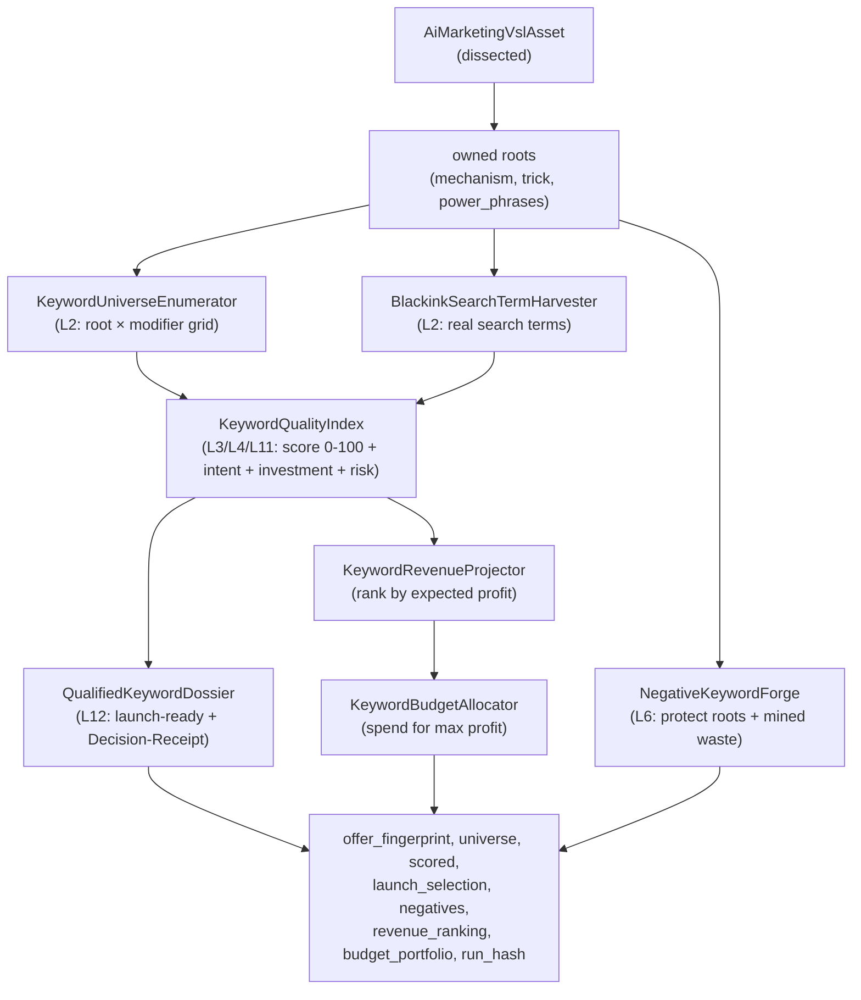

# Search and Keyword OS

The Search and Keyword OS is the Google-Ads keyword system inside the Marketing domain's `Campaign/` subdirectory. It is a 13-layer deterministic system that takes a VSL offer and produces a launch-ready keyword dossier with per-keyword Decision-Receipts, calibrated by real Blackink outcomes. The mother principle, from the operator: the product-name keyword is forbidden. The highest-converting traffic is re-finders (people who saw the VSL or heard about it) Googling what they remember: the coined mechanism or trick, a planted slogan, a celebrity plus claim. The more impossible a keyword is to type without having seen the ad, the more qualified it is. Specificity equals qualification.

## Purpose

Build the most aggressive and intelligent Search keyword system, one that decides who enters the auction before spending money, eliminates bad keywords, and scales industrially, all 100% deterministic (zero hallucination, no coverage holes, bit-for-bit repeatability, provenance and Decision-Receipt per decision). The live state is tracked in `docs/search-keyword-os-state.md`.

## The 13 layers

The state doc maps the system to 13 layers. The offline-provable spine is mature and self-proven; only the vectors that depend on live external data are gated.

| Layer | Component | Status |
|-------|-----------|--------|
| L0 Knowledge Core | `KeywordKnowledgeCore` — 16 canonical Google and psychology laws with source and date, versioned. Each engine declares `const LAWS` and the Decision-Receipt cites the specific law per decision. | Mature |
| L1 Asset comprehension | The dissected VSL asset feeds the engine. | Mature |
| L2 Universe discovery | `KeywordUniverseEnumerator` enumerates the universe (owned roots times modifier grid per tier, PT+EN). `BlackinkSearchTermHarvester` merges real search terms. Autocomplete/related/gap vectors are gated by external data. | Partial (external data gated) |
| L3 Pain, intent, mind | `IntentLadderClassifier`, `KeywordMindState`, `KeywordPainModifierSignal` | Mature |
| L4 Investment vs spend | `KeywordInvestmentGate`, `KeywordVerdictGate` (AND of significance, attribution, lag) | Mature |
| L5 Real volume/demand | `KeywordVolumeSignal` ingests a Keyword Planner CSV export and prioritizes demand times intent. Demand modulates, never vetoes. | Partial (CSV gated) |
| L6 Negatives/exclusion | `NegativeKeywordForge`, `BlackinkNegativeMiner` (mines real losers into n-gram negatives) | Mature |
| L7 Clustering/match at scale | `KeywordClusterer` groups the universe into single-theme ad groups (STAG) with barbell match types. SERP-overlap is gated. | Partial |
| L8 Bidding/readiness | `BidStrategyDecider`, `SmartBiddingReadinessDiagnostic` | Mature |
| L9 Real sale measurement | `BlackinkKeywordOutcomeFeed` reads real historical Blackink outcomes. Real-time GCLID postback is gated by live. | Partial |
| L10 Bayesian flywheel | `KeywordOutcomeCalibrator` applies Bayesian-shrunk CVR-lift weights from real outcomes back into the quality index. | Mature with real data |
| L11 Account-risk signal | `KeywordAccountRiskSignal`, `KeywordOsIntegrityAuditor` | Mature |
| L12 Orchestration and governance | `KeywordIntelligencePipeline`, `KeywordOsRunner`, `KeywordDecisionReceipt`, `KeywordDecisionLedgerRepository` | Mature |

## Key abstractions

| Path | Role |
|------|------|
| `app/Services/Ai/MarketingDomain/Campaign/KeywordIntelligencePipeline.php` | L12 orchestration: stitches the engines into one deterministic system over an offer. Idempotent and provider-free. |
| `app/Services/Ai/MarketingDomain/Campaign/KeywordOsRunner.php` | The operable capstone: assembles the three money-grounded feeds (calibration, discovered terms, mined negatives) and runs the pipeline. |
| `app/Services/Ai/MarketingDomain/Campaign/IntentLadderClassifier.php` | Compositional intent classifier (journey plus pain plus specificity), PT-BR and EN, with negative-polarity detection. |
| `app/Services/Ai/MarketingDomain/Campaign/KeywordInvestmentGate.php` | Investment vs spend decision math (breakeven CVR, rule-of-three, EPC vs CPC). |
| `app/Services/Ai/MarketingDomain/Campaign/KeywordQualityIndex.php` | 0-to-100 quality score (6 components) with an action band (scale, launch, test, kill). |
| `app/Services/Ai/MarketingDomain/Campaign/NegativeKeywordForge.php` | Forge negatives that protect owned roots (anti-champion) plus mined waste negatives. |
| `app/Services/Ai/MarketingDomain/Campaign/QualifiedKeywordDossier.php` | Launch-ready selection with a Decision-Receipt per keyword. |
| `app/Services/Ai/MarketingDomain/Campaign/BayesianKillScaleDecider.php` | KILL, SCALE, KEEP, or HOLD with few data, via a Beta posterior on CVR. |
| `app/Services/Ai/MarketingDomain/Campaign/KeywordKnowledgeCore.php` | The canonical knowledge core (16 laws, versioned). |
| `app/Services/Ai/MarketingDomain/Campaign/BlackinkKeywordOutcomeFeed.php` | Reads real historical Blackink keyword outcomes (read-only). |
| `app/Services/Ai/MarketingDomain/Campaign/KeywordRevenueProjector.php` | Ranks keywords by expected profit (volume times real CVR times payout minus cost). |
| `app/Services/Ai/MarketingDomain/Campaign/KeywordBudgetAllocator.php` | Allocates a budget across the revenue ranking for maximum profit. |
| `app/Services/Ai/MarketingDomain/Campaign/KeywordRegimeClassifier.php` | Partitions keywords into harvest, seed, and probe regimes. |
| `app/Services/Ai/MarketingDomain/Campaign/KeywordLearningLoop.php` | The closed learning loop: real outcomes recalibrate the quality index. |

## The pipeline

`KeywordIntelligencePipeline::run()` takes a dissected VSL asset and an economics array (payout, refund, margin, CVR) and returns the full dossier. The flow:



The pipeline is idempotent: same offer plus same economics produces the same `run_hash` bit-for-bit, with per-keyword provenance. Determinism by construction: no I/O, no clock, no randomness in the path. The `KeywordOsRunner` wraps the pipeline and assembles the three money-grounded feeds (calibration from `BlackinkKeywordOutcomeFeed`, discovered terms from `BlackinkSearchTermHarvester`, mined negatives from `BlackinkNegativeMiner`) plus the offensive generation (phonetic mistypes of the coined name via `PhoneticMistypeForge`, celebrity-lane via `CelebrityLaneForge`).

## The intent ladder

`IntentLadderClassifier` replaces single-axis token-spotting with a compositional model distilled from the keyword-decision report. The score is:

```
intent_score = tier_base(T0~10 .. T4~92) + 14*pain + 8*specificity
```

Three independent axes:

- **Journey.** The knowledge-to-action ladder (Schwartz unaware to most-aware), tiers T0 (informational) through T4 (transactional/branded).
- **Pain and urgency.** Willingness-to-pay signal (rapido, de vez, definitivo, now, fast).
- **Specificity.** Long-tail narrows the intent distribution (clean signal for Smart Bidding).

Negative polarity caps the score near zero. The classifier fixes two bugs from the legacy `KeywordIntentMapper`: it is multilingual (PT-BR and EN), and it separates buyer trust-checks (funciona, does it work, vale a pena = positive) from defensive non-buyers (cancelar, reembolso, scam, side effects = negative). The honest limit, cited in the code: text-only classification has a ~74% ceiling versus human (Jansen 2008). This is a strong prior, not proven conversion; the SERP and real CVR are the oracle.

## The investment gate

`KeywordInvestmentGate` turns the operator's law ("wrong person equals spend; certainty before spending equals investment") into a number. Three structural truths:

- **Breakeven CVR** = CPC / net_payout. Below this, a click loses money.
- **Rule-of-three cut** = ceil(3 / breakeven_cvr) clicks. Zero sales in that many clicks means 95% sure the true CVR is below breakeven, so it is spend.
- **EPC greater than CPC** means investment: each click returns more than it cost.

Two bases, honestly labeled: `proven` (real observed clicks, conversions, revenue decided the verdict) and `forecast_prior` (no live data yet, the verdict is a forecast flagged as a prior, not proof). The verdict is `investimento`, `teste`, or `gasto`.

## The Bayesian kill/scale decider

`BayesianKillScaleDecider` decides KILL, SCALE, KEEP, or HOLD with few data. The folk gate is binary: HOLD until spend reaches 3x Max CPA. That burns money. This models the click-to-sale CVR as a Beta posterior (prior = the breakeven economics' assumed CVR as pseudo-counts) and returns P(true CPA greater than Max CPA), that is, P(loss).

- KILL when P(loss) is near-certain even at zero sales (guarded: never KILL on the prior alone; require a sale or roughly one expected-sale's worth of clicks with zero sales).
- SCALE when profit is near-certain (CPA at or below Max CPA and P(profit) at least 70%).
- KEEP when profitable but not yet confident.
- HOLD only when the data genuinely cannot decide.

Anti-Goodhart: it measures P(real profit), never a proxy.

## The learning loop

`KeywordLearningLoop` and `KeywordOutcomeCalibrator` close the flywheel. Real outcomes (keyword to cost, conversions, revenue from `BlackinkKeywordOutcomeFeed`) produce a Bayesian-shrunk CVR-lift per family and root, which feeds back into the `KeywordQualityIndex`: keywords that sold go up, keywords that spent without selling go down. The state doc records a proven result: slogan 83 to 100, mechanism 86 to 52, calibrated on 143 real losers (100% down-weighted). The calibration is dormant until live data arrives by design (Hopkins): priors become measured truth only when the operator runs a campaign.

## Integration points

- **Artisan commands.** `atlas:ai:marketing:keywords`, `atlas:ai:marketing:keyword-os`, `atlas:ai:marketing:keyword-moat`, `atlas:ai:marketing:keyword-scale`, `atlas:ai:marketing:keyword-verdict`.
- **DB tables.** `ai_marketing_vsl_assets` (the dissected asset), `ai_marketing_campaign_blueprints`, `ai_marketing_decision_ledger_entries`, `ai_marketing_economics_ledger_entries`, the keyword decision ledger (`ai_marketing_keyword_decision_ledger`).
- **Live state.** `docs/search-keyword-os-state.md` (30 KB, the 13-layer map and loop journal), `docs/affiliate-mastery/search-network-keyword-decision-report.md`, `docs/affiliate-mastery/google-search-campaign-config-playbook.md`.
- **The Loop.** The Evolution Loop grinds the Keyword OS as a scope; the state doc is its work log.
- **Related engines.** `MessageMatchAdForge` (L4 Quality Score engineering: generates RSA ads message-matched keyword-to-headline), `CampaignBlueprintService` (L5 aggressive structure: STAG by family, match type by tier, phased bidding), `SearchNetworkPlanner`, `RsaWriter`.

## Key source files

| Path | Role |
|------|------|
| `app/Services/Ai/MarketingDomain/Campaign/KeywordIntelligencePipeline.php` | L12 orchestration (idempotent, provider-free) |
| `app/Services/Ai/MarketingDomain/Campaign/KeywordOsRunner.php` | Operable capstone (assembles feeds, runs pipeline) |
| `app/Services/Ai/MarketingDomain/Campaign/IntentLadderClassifier.php` | Compositional intent classifier (PT-BR + EN) |
| `app/Services/Ai/MarketingDomain/Campaign/KeywordInvestmentGate.php` | Investment vs spend decision math |
| `app/Services/Ai/MarketingDomain/Campaign/KeywordQualityIndex.php` | 0-to-100 quality score with action band |
| `app/Services/Ai/MarketingDomain/Campaign/NegativeKeywordForge.php` | Negative keyword forging |
| `app/Services/Ai/MarketingDomain/Campaign/QualifiedKeywordDossier.php` | Launch-ready selection with Decision-Receipts |
| `app/Services/Ai/MarketingDomain/Campaign/BayesianKillScaleDecider.php` | Bayesian KILL/SCALE/KEEP/HOLD with few data |
| `app/Services/Ai/MarketingDomain/Campaign/KeywordKnowledgeCore.php` | Canonical knowledge core (16 laws) |
| `app/Services/Ai/MarketingDomain/Campaign/KeywordLearningLoop.php` | Closed learning loop |
| `app/Services/Ai/MarketingDomain/Campaign/KeywordOutcomeCalibrator.php` | Bayesian-shrunk CVR-lift calibration |
| `app/Services/Ai/MarketingDomain/Campaign/BlackinkKeywordOutcomeFeed.php` | Real historical Blackink outcomes (read-only) |
| `app/Services/Ai/MarketingDomain/Campaign/KeywordRevenueProjector.php` | Revenue ranking by expected profit |
| `app/Services/Ai/MarketingDomain/Campaign/KeywordBudgetAllocator.php` | Budget portfolio for maximum profit |
| `app/Services/Ai/MarketingDomain/Campaign/KeywordRegimeClassifier.php` | Harvest, seed, probe regime partition |

## Related pages

- [Marketing and the Conversion OS](marketing-and-conversion-os.md) — the other half of the Marketing domain
- [Business domains](index.md) — overview
- [Domain runtime engine](domain-runtime-engine.md) — the generic manifest engine
- [Evolution Loop](../evolution-loop/index.md) — the loop grinds the Keyword OS as a scope
- [Anti-Goodhart and no-proxy](../../concepts/anti-goodhart.md) — the Bayesian decider measures real profit, never a proxy
