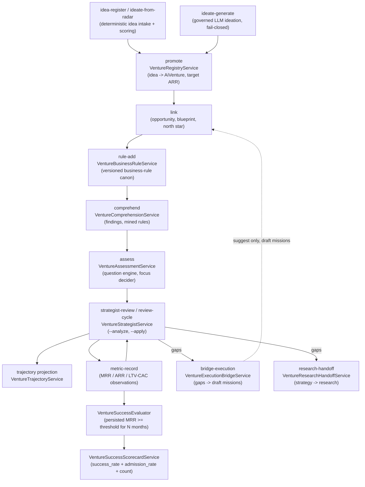

# Venture Foundry

The Venture Foundry is the subsystem that creates and grows companies. It takes a promoted idea and walks it through a governed lifecycle, ideate to promote to grow to success, toward a declared ARR target (default 100M USD). The whole sector is built on one anti-proxy principle: **success is measured from persisted MRR observations, never from narrative, opinion, or self-declaration**. A venture is only `succeeded` when reconciled recurring revenue has been sustained at or above a threshold for N consecutive months.

## Purpose

Provide a durable registry of companies, a deterministic growth ladder, a standing strategist that reviews each venture against the ladder, and a Company Success Engine that reports an honest success scorecard. The Foundry never auto-promotes, never auto-declares progress, and never lets an LLM opinion become a stage transition. Recommendation and promotion are separate acts.

## The venture lifecycle

## Key abstractions

| Path | Role |
|------|------|
| `app/Services/Ai/VentureFoundry/VentureIdeationService.php` | Idea intake and deterministic 0-100 scoring (pain, urgency, market, founder fit, sovereignty fit). Ideas come from the operator, the Opportunity Radar, or the governed generator. |
| `app/Services/Ai/VentureFoundry/VentureIdeaGenerationService.php` | The only LLM path in the sector. Runs as a batch (`ideate-generate`), never inline. Structured-output validation, cite-or-omit market sizes, capped and deduped candidates. Generation never promotes. |
| `app/Services/Ai/VentureFoundry/VentureRegistryService.php` | Durable registry of companies. `promoteIdea` creates an `AiVenture` at stage S0 with a target ARR (default 100M). Status transitions (active, paused, closed) are guarded. |
| `app/Services/Ai/VentureFoundry/VentureStrategistService.php` | The standing strategist. Runs a review against the growth ladder, persists an auditable `AiVentureStrategyReview`, emits a strategy memo, and only advances the stage when `--apply` is passed. |
| `app/Services/Ai/VentureFoundry/VentureStrategistAnalysisService.php` | The thinking layer of the strategist. A grounded, fail-closed LLM opinion built from a numbered fact sheet (F1..Fn) of persisted records only. Every strategic move must cite fact ids or it is dropped. |
| `app/Services/Ai/VentureFoundry/VentureGrowthLadderService.php` | The canonical ladder S0 to S5 (100M USD ARR). Every stage declares entry gates evaluated only against persisted records. No observation, no gate. |
| `app/Services/Ai/VentureFoundry/VentureBusinessRuleService.php` | Versioned business-rule canon per venture. Re-declaring a `rule_id` creates a new version and marks the previous superseded, so the active set is always auditable. |
| `app/Services/Ai/VentureFoundry/VentureTrajectoryService.php` | Deterministic growth-trajectory projection toward the target ARR. Blocked while no ARR observation exists. With an observation it answers "years to target at X% growth" and "CAGR required for H-year horizon." |
| `app/Services/Ai/VentureFoundry/VentureResearchHandoffService.php` | Bridges venture strategy gaps into the Research domain runtime via a governed `strategy -> research` handoff carrying deterministic research questions. |
| `app/Services/Ai/VentureFoundry/VentureExecutionBridgeService.php` | Turns a review's gaps into draft missions the operator can activate. Autonomy is `suggest` and status is `draft`, so a bridged mission can structurally never auto-execute. Idempotent per review. |
| `app/Services/Ai/VentureFoundry/Success/VentureSuccessEvaluator.php` | The Company Success Engine core. Success = MRR at or above threshold maintained over N consecutive calendar months, measured only from persisted observations. States: insufficient_data, not_yet, succeeded, failed. |
| `app/Services/Ai/VentureFoundry/Success/VentureReconciledSuccessEvaluator.php` | Phase 1 honest verdict. Composes K1 reconciled settled cash with K4 multi-signal health. Sustained-but-unhealthy is `blocked_by_health`, never success. Built new alongside the legacy evaluator (byte-identical-OFF). |
| `app/Services/Ai/VentureFoundry/Success/VentureSuccessScorecardService.php` | The triple scorecard. Reports success_rate (succeeded over resolved), admission_rate (admitted over assessed, guards against cowardly under-admission), and success_count together so the target cannot be gamed. |
| `app/Services/Ai/VentureFoundry/Success/VentureAdmissionGate.php` | Records cohort admission decisions. A venture is admissible when it carries a declared success milestone and has no open existential risk. Advisory by default (`admission_gate_enabled` controls auto-enforcement). |
| `app/Services/Ai/VentureFoundry/Comprehension/VentureComprehensionService.php` | Comprehension runs that mine findings (business rules, problems, improvements, audience usage, documentation) from the venture workspace. |
| `app/Services/Ai/VentureFoundry/Assessment/VentureAssessmentService.php` | Assessment runs with a question engine and focus decider that narrows the venture's number-one focus. |
| `app/Services/Ai/VentureFoundry/Health/VentureHealthGate.php` | Multi-signal health gate (K4) that blocks success when a sustained-MRR venture is unhealthy. |
| `app/Services/Ai/VentureFoundry/Cost/VentureCostAttributionLedger.php` | Cost attribution and runway reader for ventures. |
| `app/Services/Ai/VentureFoundry/Reward/ReconciledCashEventStore.php` | Reconciled settled cash events (K1), the honest revenue source the success evaluator reads. |
| `app/Services/Ai/VentureFoundry/Safety/WindowedReservationService.php` | Windowed action reservation and dispatch controller for venture safety. |
| `app/Services/Ai/VentureFoundry/Connectors/FeedLivenessGate.php` | Feed liveness and webhook signature verification for venture connectors. |

## How it works

### Idea intake and scoring

An idea enters from three sources: the operator (`idea-register`), the Opportunity Radar (`ideate-from-radar`, deterministic, every field comes from a persisted opportunity), or the governed LLM generator (`ideate-generate`). Every idea is scored with an auditable breakdown: pain severity (weight 30), urgency (15), market size (25, log-scaled), founder fit (15), sovereignty fit (15). The score is deterministic and never depends on conversation memory.

### Governed generative ideation

`VentureIdeaGenerationService` is the only LLM path in the sector. It runs exclusively as a batch action, never inline on a hot path. Anti-hallucination gates are fail-closed: structured output must pass `AtlasStructuredOutputValidator` against a strict schema or the batch yields zero; a `market_size_usd` only survives when accompanied by a non-empty `market_size_assumption` (no naked numbers); 0-5 inputs are structurally clamped; candidates are capped at the configured max and deduped against existing idea slugs. Every accepted idea lands as `status=proposed` and `source=generated` with the deterministic score. Generation never promotes.

### Promote to a venture

`VentureRegistryService::promoteIdea` takes an idea that is not already promoted or rejected and creates an `AiVenture`. The venture starts at stage S0 (ideation), carries a target ARR (default 100M USD), and gets a canonical hash. The idea is marked `promoted` and linked back. Status transitions (active, paused, closed) are guarded by an allowed-transitions table.

### The growth ladder

`VentureGrowthLadderService` defines the canonical ladder:

| Stage | Key | Objective | Entry gates |
|-------|-----|-----------|-------------|
| S0 | ideation | Turn a promoted idea into a qualified opportunity with explicit problem, ICP, and pain. | (none) |
| S1 | validation | Prove the thesis with a linked opportunity and a minimum canon of business rules. | opportunity_linked, business_rules_min_active (3) |
| S2 | first_revenue | Operate for real: validated blueprint, defined north star, and observed positive ARR. | blueprint_linked, north_star_defined, arr_positive |
| S3 | traction_1m | Repeatable commercial engine with 1M USD ARR. | arr_1m |
| S4 | scale_10m | Scale with healthy economics: 10M USD ARR and LTV/CAC at or above 3. | arr_10m, ltv_cac_healthy |
| S5 | category_100m | Category leadership with 100M USD ARR. | arr_100m |

Every gate is evaluated only against persisted records: linked artifacts, active business rules, and the latest metric observations. The ladder never claims a stage from conversation. No observation, no gate.

### The strategist review

`VentureStrategistService::review` evaluates the venture against the ladder, projects the trajectory, optionally adds the LLM opinion (`--analyze`), emits a strategy memo, and persists an auditable `AiVentureStrategyReview`. The recommended stage is computed deterministically. The stage only changes when `--apply` is passed. Recommendation and promotion are separate acts, so the sector never self-claims progress.

The `--analyze` path runs `VentureStrategistAnalysisService`, which builds a numbered fact sheet (F1..Fn) from persisted state only (thesis, stage, gates, gaps, metrics, trajectory, business rules). Every strategic move returned by the provider must cite the fact ids it stands on; a move citing no facts or unknown facts is dropped and reported. If all moves are ungrounded, the analysis degrades to `all_moves_ungrounded` and the deterministic review survives unchanged. Provider failure never blocks the review.

The weekly cadence (`review-cycle`) reviews every active venture whose latest review is older than the configured interval (default 6 days). It never applies a stage. Analysis is config-gated (`cycle_analyze`, default false) unless explicitly overridden.

### The Company Success Engine

Success is sustained recurring revenue, measured only from persisted observations. `VentureSuccessEvaluator` reads MRR observations per calendar month (the last observation in each month wins), computes the trailing streak and best streak, and classifies:

- **insufficient_data** — fewer than N distinct months observed.
- **not_yet** — N or more months observed, but no qualifying trailing streak.
- **succeeded** — trailing run of N or more consecutive months all at or above threshold.
- **failed** — reached a qualifying streak in the past, then churned below threshold.

`VentureReconciledSuccessEvaluator` is the Phase 1 honest verdict. It composes K1 reconciled settled cash (from `ReconciledCashEventStore`, never self-report) with K4 multi-signal health (from `VentureHealthGate`). A venture is `succeeded` only when it holds at or above threshold settled MRR for N consecutive months AND the health gate is green. Sustained-but-unhealthy is `blocked_by_health`, never success. It is built new alongside the legacy evaluator so the legacy path stays byte-identical-OFF.

`VentureSuccessScorecardService` reports three numbers together so the target (meta at or above 70%) cannot be gamed:

1. **success_rate** — succeeded over resolved (resolved = succeeded + failed). The headline by-milestone number with no deadline.
2. **admission_rate** — admitted over assessed. Guards against cowardly under-admission to inflate the rate.
3. **success_count** — absolute number of succeeded ventures.

All three are computed entirely from persisted MRR observations plus the admission ledger, never auto-declared. The scorecard breaks results down by origin (created vs managed).

### Comprehension and assessment

The `Comprehension/` subdirectory runs comprehension cycles that mine findings from the venture workspace: business rules, problems, improvements, audience usage, and documentation artifacts. High-confidence mined rules can be promoted into the venture rule canon with `--promote-rules`. Generated canonical docs can be written to disk with `--write-docs`.

The `Assessment/` subdirectory runs assessment cycles with a question catalog and engine (`VentureQuestionEngine`, `VentureQuestionCatalog`) and a focus decider (`VentureFocusDecider`) that narrows the venture's number-one focus from the assessment answers.

## Integration points

- **Artisan command.** `atlas:venture` with actions: `idea-register`, `idea-list`, `ideate-from-radar`, `ideate-generate`, `promote`, `venture-list`, `venture-show`, `link`, `rule-add`, `rule-list`, `metric-record`, `ladder`, `strategist-review`, `review-cycle`, `comprehend`, `comprehension-report`, `comprehension-findings`, `assess`, `assessment-report`, `questions`, `focus`, `data-readiness`, `question-catalog`, `research-handoff`, `bridge-execution`, `status`. Key flags: `--analyze` (LLM opinion, explicit spend), `--apply` (advance stage), `--target-arr-usd` (default 100M), `--brief` (for ideation), `--json`.
- **Config.** `config/atlas_venture_foundry.php`: `ideation_provider_key` / `ideation_model` / `ideation_timeout_seconds` / `ideation_max_ideas`; `analysis_provider_key` / `analysis_model`; `weekly_review_enabled`, `cycle_analyze` (default false), `cycle_min_interval_days` (default 6); `trajectory_scenarios` (conservative 0.5, base 1.0, aggressive 2.0) and `trajectory_horizons_years` (3, 5, 7, 10); `success_metric_key` (mrr), `success_mrr_threshold` (1000.0), `success_min_consecutive_months` (3); `admission_gate_enabled` (default false).
- **DB tables.** `ai_ventures`, `ai_venture_ideas`, `ai_venture_business_rules`, `ai_venture_metric_observations`, `ai_venture_strategy_reviews`, `ai_venture_blueprints`, `ai_venture_comprehension_runs`, `ai_venture_comprehension_findings`, `ai_venture_assessment_runs`, `ai_venture_admission_decisions`, `ai_venture_cost_attributions`, `ai_venture_documentation_artifacts`, `ai_venture_question_answers`.
- **Strategy domain.** Opportunities from `OpportunityRadarService` feed ideation. Strategy memos are emitted via `StrategyMemoService`. The canonical hash uses `StrategyCanonicalHash`.
- **Research domain.** `VentureResearchHandoffService` emits governed `strategy -> research` handoffs via `DomainHandoffService`.
- **Missions.** `VentureExecutionBridgeService` creates draft missions via `MissionFactoryService` (autonomy `suggest`, status `draft`).
- **Live state docs.** `docs/ventures/` holds per-venture state; `docs/atlas-company-success-engine-buildout.md` holds the success-engine buildout plan.

## Maturity honesty

The Venture Foundry is real, hand-written logic. The ideation, registry, strategist, growth ladder, trajectory, business rules, success evaluator, reconciled success evaluator, scorecard, admission gate, comprehension, and assessment services are all working code with auditable hashes and fail-closed gates. The two LLM paths (ideation generation and strategist analysis) are isolated behind protected provider seams so tests exercise the full parse, validate, and gate path with zero spend. The success engine's anti-proxy discipline (persisted MRR only, triple scorecard, admission-rate guard, health gate composition) is enforced in code, not just documented. The Company Success Engine buildout plan in `docs/atlas-company-success-engine-buildout.md` is a state and roadmap doc describing the meta at-or-above-70% goal, not a guarantee that the full cohort is populated with real ventures today.

## Key source files

| Path | Role |
|------|------|
| `app/Services/Ai/VentureFoundry/VentureRegistryService.php` | Durable venture registry, promote, status transitions, artifact attachment |
| `app/Services/Ai/VentureFoundry/VentureIdeationService.php` | Idea intake and deterministic 0-100 scoring |
| `app/Services/Ai/VentureFoundry/VentureIdeaGenerationService.php` | Governed LLM ideation (the only provider path), fail-closed |
| `app/Services/Ai/VentureFoundry/VentureStrategistService.php` | Standing strategist, review, weekly cycle, stage promotion on apply |
| `app/Services/Ai/VentureFoundry/VentureStrategistAnalysisService.php` | Grounded fail-closed LLM opinion with cite-or-drop fact sheet |
| `app/Services/Ai/VentureFoundry/VentureGrowthLadderService.php` | Canonical S0 to S5 ladder, entry gates, metric recording, evaluation |
| `app/Services/Ai/VentureFoundry/VentureBusinessRuleService.php` | Versioned business-rule canon |
| `app/Services/Ai/VentureFoundry/VentureTrajectoryService.php` | Deterministic growth-trajectory projection (blocked without observed ARR) |
| `app/Services/Ai/VentureFoundry/VentureResearchHandoffService.php` | Strategy to research handoff bridge |
| `app/Services/Ai/VentureFoundry/VentureExecutionBridgeService.php` | Gaps to draft missions bridge (suggest only) |
| `app/Services/Ai/VentureFoundry/Success/VentureSuccessEvaluator.php` | MRR-based success evaluator (persisted observations only) |
| `app/Services/Ai/VentureFoundry/Success/VentureReconciledSuccessEvaluator.php` | Honest verdict composing reconciled cash and health |
| `app/Services/Ai/VentureFoundry/Success/VentureSuccessScorecardService.php` | Triple scorecard (success, admission, count) |
| `app/Services/Ai/VentureFoundry/Success/VentureAdmissionGate.php` | Cohort admission decisions with anti-cowardice milestone requirement |
| `app/Services/Ai/VentureFoundry/Comprehension/VentureComprehensionService.php` | Workspace comprehension runs and findings |
| `app/Services/Ai/VentureFoundry/Assessment/VentureAssessmentService.php` | Assessment runs, question engine, focus decider |
| `app/Console/Commands/AtlasVentureFoundryCommand.php` | The `atlas:venture` command surface |
| `config/atlas_venture_foundry.php` | Provider keys, cadence, trajectory scenarios, success thresholds, admission gate |

## Related pages

- [Business domains](index.md) — overview
- [Company, holding and strategic OS](company-holding-stack.md) — the company stack this Foundry feeds into
- [Finance domain](finance.md) — finance feeds opportunities and unit economics
- [Marketing and the Conversion OS](marketing-and-conversion-os.md) — the most mature business domain
- [Anti-Goodhart and no-proxy](../../concepts/anti-goodhart.md) — the anti-proxy discipline behind success-from-persisted-MRR
- [Evolution Loop](../evolution-loop/index.md) — the loop can be aimed at a venture as a scope
