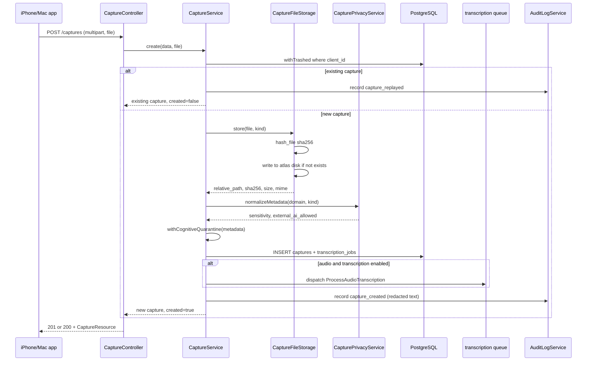

# Captures API and lifecycle

Captures are the primary ingestion shape: raw operator input as text, audio, or photo, classified into a domain and stamped with cognitive-quarantine metadata on creation. This page covers the REST endpoints, the `CaptureService` lifecycle methods, content-addressed file storage, the `CaptureResource` safety projection, and deletion semantics.

## Purpose

The captures API is the main entry point for the operator's raw notes, voice recordings, and photos. It handles idempotent creation by `client_id`, audio transcription dispatch, operator triage (routing a note to a task, project, or proposal), semantic clarification, and hard deletion with purge of all derived projections.

## Endpoints

All routes are protected by `X-Atlas-Token` and defined in `routes/api.php` around lines 390-397:

| Method | Path | Controller method | Description |
|--------|------|-------------------|-------------|
| `POST` | `/captures` | `store` | Create a capture (multipart for audio/photo, JSON for text). Returns 201 if created, 200 if idempotent replay. |
| `GET` | `/captures` | `index` | Cursor-paginated list. Filters: `domain`, `kind`, `client_id`, `since`, `cursor`, `limit`. |
| `GET` | `/captures/{capture}` | `show` | Single capture with links. |
| `PATCH` | `/captures/{capture}` | `update` | Update a capture. |
| `DELETE` | `/captures/{capture}` | `destroy` | Hard-delete a capture and purge derived rows. |
| `GET` | `/captures/{capture}/file` | `file` | Stream the stored binary (audio/photo). |
| `GET` | `/captures/{capture}/transcription` | `transcription` | Transcription status, text, engine, error. |
| `POST` | `/captures/{capture}/transcription/retry` | `retryTranscription` | Re-queue a failed or stuck transcription. Returns 202. |
| `POST` | `/captures/{capture}/semantic/clarify` | `clarify` | Re-run semantic clarification on a capture that has text. |
| `POST` | `/captures/{capture}/triage` | `triage` | Route a capture to a destination (archive, snooze, task, project, proposal, hypothesis). |

## Key abstractions

| Path | Role |
|------|------|
| `app/Http/Controllers/CaptureController.php` | Capture REST surface (CRUD, file, transcription, triage, clarify). |
| `app/Services/CaptureService.php` | Capture lifecycle orchestrator: create, update, triage, clarify, retryTranscription. |
| `app/Services/CaptureDestinationService.php` | Triage routing: attach-note, create-task, create-project, link-proposal; retires superseded destinations. |
| `app/Services/CaptureFileStorage.php` | Content-addressed (sha256) binary storage with dedupe. |
| `app/Services/CaptureDeletionService.php` | Hard delete + purge of derived projections. |
| `app/Http/Resources/CaptureResource.php` | Capture projection with `capture_safety` and `review_workflow` blocks. |
| `app/Http/Requests/StoreCaptureRequest.php` | Create validation: kind enum (audio, text, photo), file size cap, domain rule, geo bounds. |
| `app/Http/Requests/TriageCaptureRequest.php` | Triage action validation. |
| `app/Models/Capture.php` | Capture entity (UUID, soft-deletes, JSONB metadata, audio to transcription_jobs). |
| `app/Models/CaptureLink.php` | Row linking a capture to its triage destination target. |

## How it works

### Create flow

`CaptureService::create` is the entry point for both `POST /captures` and the `captures_to_upload` array in `/sync`. The flow:

1. **Idempotency check.** Look up `Capture::withTrashed()->where('client_id', $data['client_id'])`. If found and ready for semantic curation, re-run the clarify-propose-activate pipeline; record a `capture_replayed` audit event; return the existing capture with `created: false`.
2. **File storage.** If a file is present (multipart upload), `CaptureFileStorage::store` computes the sha256 of the file, builds a path like `audio/<sha256>.m4a`, and writes it to the `atlas` disk only if it does not already exist (dedupe). Returns the relative path, sha256, size, and mime type.
3. **Database insert (transaction).** `CapturePrivacyService::normalizeMetadata` normalizes sensitivity and external-AI policy for the domain. `withCognitiveQuarantine` stamps the three metadata blocks (`cognitive_quarantine`, `content_intelligence`, `immune_audit`). The capture row is created with `transcription_status: 'pending'` for audio, `'na'` for text/photo. For audio, a `TranscriptionJob` row is created and `ProcessAudioTranscription` is dispatched on the `transcription` queue (if `atlas.transcription.enabled`).
4. **Semantic pipeline.** If the capture is ready for semantic curation (has text and is not audio, or audio with `transcription_status: 'done'`), `clarifyProposeAndActivate` runs: `CaptureSemanticClarifier::handleReady`, `CurationProposalService::createFromCapture`, `ActivationEngine::createForContext`.
5. **Audit.** `AuditLogService::record('capture_created', ...)` with redacted (sha256) text evidence, never raw text.
6. **Rollback.** If the transaction throws, `CaptureFileStorage::deleteIfCreated` removes the stored file only if this call created it (preserving deduped files shared with existing captures).

### Update flow

`CaptureService::update` re-normalizes privacy metadata, re-stamps cognitive quarantine, and re-runs the semantic pipeline if the capture becomes ready. Records a `capture_updated` audit event.

### Triage flow

`POST /captures/{id}/triage` with an `action` of `archive`, `snooze`, `attach_note`, `create_task`, `create_project`, `promote`, or `create_hypothesis`. `CaptureService::triage` runs in a transaction:

- For `promote` or `create_hypothesis`, the capture must have text. It finds or creates a `SemanticCurationProposal` and proposes an `AiMemoryDelta`.
- `CaptureDestinationService::apply` creates or links the target: a task via `TaskPlanningService`, a project via `ProjectExecutionService` (which also infers a plan and ensures a next-action task), a semantic note link, or a proposal link.
- `CaptureDestinationService::retirePrevious` archives a superseded task or project (only if it belongs to this capture) and records a `capture_destination_reclassified` audit event.
- The triage payload and a bounded `triage_history` (max 20 entries) are written to `metadata.triage` and `metadata.triage_history`.

### File storage (sha256 dedupe)

`CaptureFileStorage::store` in `app/Services/CaptureFileStorage.php` uses content-addressed storage. The path is `<kind>/<sha256><extension>`, where the extension is derived from the MIME type (e.g. `audio/mpeg` maps to `.mp3`, `image/heic` to `.heic`). If a file with the same sha256 already exists on the `atlas` disk, it is not re-written. This means two captures with the same audio content share one file on disk. `deleteIfCreated` only removes the file if this specific call created it, so a deduped file shared with another capture is never deleted by a rollback.

### CaptureResource safety and review-workflow

`CaptureResource` in `app/Http/Resources/CaptureResource.php` returns the capture with two safety-oriented blocks:

- **`capture_safety`** — projects the cognitive-quarantine and immune-audit flags into a response-friendly shape: `raw_capture: true`, `raw_content_provider_export_allowed: false`, `human_review_required_for_promotion: true`, `promotion_status`, `immune_noise_gate_status`, and file integrity (`available` / `missing` / `not_applicable`).
- **`review_workflow`** — if a proposal or memory delta exists, exposes the operator actions as a list of HTTP calls: `ratify_semantic_note`, `promote_to_memory_registry`, `promote_to_verbatim_store`, `dismiss_proposal`, `postpone_proposal`, `accept_memory_delta`, `reject_memory_delta`. Each action has a `method`, `path`, `requires_operator: true`, and optional `body`. The workflow status moves from `pending_review` to `promoted` once a memory or verbatim promotion is recorded.

### Deletion semantics

`DELETE /captures/{id}` calls `CaptureDeletionService::delete` in `app/Services/CaptureDeletionService.php`. It runs in a transaction and does two distinct things:

1. **Deletes derived projections** that the raw capture generated: `ai_inbox_items`, `ai_context_bundles` (found by scanning JSON columns for the capture id/client_id), `capture_links`, `transcription_jobs`, `semantic_curation_proposals`, `atlas_project_plan_proposals`, `atlas_memory_entry_usages`, `atlas_memory_entries`. This stops the raw note from continuing to teach retrieval after deletion.
2. **Nulls source pointers** on objects the operator may have intentionally created: `source_capture_id` on `atlas_tasks`, `atlas_projects`, `atlas_routines`, `behavior_logs`; `linked_capture_id` on `digital_sessions`. These objects survive, but lose their link back to the deleted capture.
3. Deletes the stored file from the `atlas` disk.
4. `forceDelete()` the capture (hard delete, not soft delete).

Every table and column access is guarded by `DatabaseTableAvailability::has` / `hasColumn`, so deletion works even if a table is absent in a partial deployment.

## Integration points

- **Transcription** ([transcription-pipeline.md](transcription-pipeline.md)) — audio captures dispatch `ProcessAudioTranscription` on creation.
- **Cognitive quarantine** ([cognitive-quarantine-and-privacy.md](cognitive-quarantine-and-privacy.md)) — every capture is stamped with quarantine metadata on create and update.
- **Sync** ([sync-protocol.md](sync-protocol.md)) — `/sync` calls `CaptureService::create` for each `captures_to_upload` entry (text only).
- **AI Gateway** ([../ai-gateway/index.md](../ai-gateway/index.md)) — ratified captures can become context for AI interactions.
- **Open Brain** ([../open-brain/index.md](../open-brain/index.md)) — ratified captures can become canonical memory.
- **REST API** ([../../api/rest-endpoints.md](../../api/rest-endpoints.md)) — full endpoint reference.

## Key source files

| Path | Purpose |
|------|---------|
| `app/Http/Controllers/CaptureController.php` | REST controller for captures. |
| `app/Services/CaptureService.php` | Create, update, triage, clarify, retryTranscription. |
| `app/Services/CaptureDestinationService.php` | Triage routing and supersede logic. |
| `app/Services/CaptureFileStorage.php` | Content-addressed file storage with dedupe. |
| `app/Services/CaptureDeletionService.php` | Hard delete with purge and null semantics. |
| `app/Http/Resources/CaptureResource.php` | Response projection with safety and review-workflow. |
| `app/Http/Requests/StoreCaptureRequest.php` | Create validation rules. |
| `app/Http/Requests/TriageCaptureRequest.php` | Triage action validation. |
| `app/Models/Capture.php` | Eloquent model (UUID, soft-deletes, JSONB metadata). |
| `app/Models/CaptureLink.php` | Triage destination link model. |
| `routes/api.php` | Route definitions (lines 390-397). |
