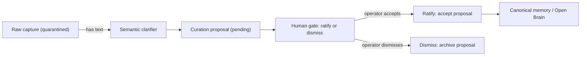

# Cognitive quarantine and capture privacy

Cognitive quarantine is the invariant that a raw capture is not memory, context, a decision, or a learning signal, and is blocked from embedding, provider export, and Open Brain context until a human ratifies a curation proposal. This page covers the privacy service, the sensitivity and external-AI gating, the three metadata blocks stamped on every capture, and the human-review promotion gate that bridges capture to AI memory.

## Purpose

Without quarantine, every raw note the operator dictates would immediately become context for AI interactions and a candidate for canonical memory. That would pollute retrieval with unfiltered, unreviewed, and potentially sensitive content. Quarantine forces a human gate between raw ingestion and any downstream use, and it does so by construction: the metadata flags are set to `false` on creation and can only flip to `true` through an explicit ratification workflow.

## Key abstractions

| Path | Role |
|------|------|
| `app/Services/CapturePrivacyService.php` | Normalizes sensitivity and external-AI policy per domain. |
| `app/Services/AtlasDomainRegistry.php` | Domain slugs with default sensitivity and external-AI policy. |
| `app/Services/CaptureService.php` | Stamps the three quarantine metadata blocks via `withCognitiveQuarantine`. |
| `app/Http/Resources/CaptureResource.php` | Projects `capture_safety` and `review_workflow` into the API response. |
| `app/Services/Semantic/CurationProposalService.php` | Creates pending proposals from captures. |
| `app/Services/Semantic/CaptureSemanticClarifier.php` | Produces the clarification that feeds proposal creation. |
| `app/Services/Semantic/ActivationEngine.php` | Records activations (does not promote to memory). |
| `app/Services/Ai/AiMemoryDeltaProposer.php` | Proposes memory deltas from triage (pending human review). |
| `config/atlas.php` | `privacy.block_external_ai_for_sensitivity`, `domains.defaults`. |

## How it works

### CapturePrivacyService

`CapturePrivacyService` in `app/Services/CapturePrivacyService.php` normalizes the privacy metadata on every capture create and update. `normalizeMetadata(metadata, domain, kind)`:

1. **Sensitivity.** Resolves from `metadata.privacy.sensitivity`, `metadata.sensitivity`, or `metadata.sensitivity_level`. Falls back to the domain's `defaultSensitivity` from `AtlasDomainRegistry`. Valid values: `normal`, `private`, `sensitive`.
2. **External-AI allowed.** Resolves from an explicit boolean if present. If the domain's `externalAiPolicy` is `block_all`, returns `false`. Otherwise, checks the sensitivity against `config('atlas.privacy.block_external_ai_for_sensitivity')` (default: `['private', 'sensitive']`). If the sensitivity is in the blocked list, returns `false`.
3. **Vault visibility.** Maps sensitivity to vault visibility: `sensitive` to `restricted`, `private` to `private`, `normal` to `standard`.
4. Writes a `privacy_audit` trail (max 20 entries) recording each normalization event.

`externalAiAllowedForMetadata` is a read-side helper that other services use to check whether a capture's content may cross to an external AI, by reading the stamped `privacy.external_ai_allowed` flag.

### AtlasDomainRegistry

`AtlasDomainRegistry` in `app/Services/AtlasDomainRegistry.php` defines the domain vocabulary and per-domain privacy policy. The defaults are in `config/atlas.php` under `domains.defaults`:

| Slug | Label | Default sensitivity | External-AI policy |
|------|-------|---------------------|-------------------|
| `blackink` | BlackInk | `private` | `block_private_sensitive` |
| `atlas` | Atlas | `private` | `block_private_sensitive` |
| `saude` | Saude | `sensitive` | `block_private_sensitive` |
| `financas` | Financas | `private` | `block_private_sensitive` |
| `outro` | Outro | `normal` | `allow` |

The registry syncs these defaults into the `atlas_domains` table if it exists, and falls back to the config array if the table is absent. The default slug is `outro` (the catch-all domain with the most permissive policy).

### The three metadata blocks

`CaptureService::withCognitiveQuarantine` stamps three JSONB blocks into `metadata` on every create and update:

#### `cognitive_quarantine`

The core quarantine contract. Key fields:

| Field | Default | Purpose |
|-------|---------|---------|
| `schema_version` | `atlas.capture.cognitive_quarantine.v1` | Schema versioning. |
| `raw_capture` | `true` | This is a raw capture, not derived memory. |
| `memory_eligible` | `false` | Not eligible to become a memory entry. |
| `context_eligible` | `false` | Not eligible to become AI context. |
| `embedding_allowed` | `false` | Not allowed to be embedded. |
| `provider_export_allowed` | `false` | Not allowed to cross to an external AI provider. |
| `open_brain_context_allowed` | `false` | Not allowed in Open Brain context packs. |
| `raw_content_exposed` | `false` | Raw content has not been exposed downstream. |
| `promotion_status` | `unclassified` | Moves to `proposal_pending` once a proposal exists. |
| `promotion_target` | `null` | Set when a promotion target is chosen. |
| `content_hash` | sha256 of content | Dedupe and integrity. |
| `immune_audit` | (see below) | The immune audit block. |
| `review.required` | `true` | Human review is required. |
| `review.status` | `pending` | Moves to `pending` (proposal) then toward `ratified`. |
| `review.reason` | `raw_capture_quarantined_before_memory_or_context` | Why review is required. |
| `lineage` | origin, captured_at, content_hash | Provenance. |

When a semantic curation proposal is created, `attachSemanticCurationReview` updates `promotion_status` to `proposal_pending`, records the proposal id, and sets `review.reason` to `semantic_curation_proposal_requires_operator_review`.

#### `content_intelligence`

A quality and destination assessment, schema `atlas.capture.content_intelligence.v1`. Key fields:

- `status`: `candidate_pending_review`
- `content_type`: `audio`, `image`, `pdf`, `file`, or `text` (derived from kind and mime)
- `destination.enum`: one of `semantic_note`, `task`, `project`, `archive`, `discard`, `atlas_memory_candidate`, `weak_archive`, `benchmark_case`. Set to `proposal_required_before_promotion`.
- `quality.score`: 0-100, computed from text presence (+30), text density (+15 if 80+ chars, -10 if <20), file source (+20), content hash (+15), domain declared (+10). Labeled `high` (75+), `medium` (50+), or `low`.
- `privacy`: all flags (`provider_export_allowed`, `embedding_allowed`, `open_brain_context_allowed`, `memory_write_allowed`, `raw_content_exposed`) set to `false`.
- `promotion.requires_proposal: true`, `requires_human_review: true`, `automatic_memory_promotion_allowed: false`.

#### `immune_audit`

An explicit, auditable record of the quarantine invariant, schema `atlas.capture.cognitive_immune_audit.v1`. Key fields:

- `status`: `quarantined`
- `master_invariant`: `raw_capture_not_evidence_not_learning_signal_not_memory_not_context_not_decision`
- `raw_capture_is_memory`: `false`, `raw_capture_is_context`: `false`, `raw_capture_is_decision`: `false`
- `learning_signal_allowed_now`: `false`, `memory_promotion_allowed_now`: `false`, `context_export_allowed_now`: `false`, `embedding_allowed_now`: `false`
- `noise_gate`: classifies the capture as `likely_noise_or_low_signal` (quality < 0.35 or destination is discard/none) or `candidate_requires_review`, with the content type, destination, quality score, source kind, and domain.
- `promotion_gates`: a ladder g0 through g8 recording the state of each gate:
  - `g0_capture`: `captured_quarantined`
  - `g1_extraction`: `pending_human_or_semantic_review`
  - `g2_signal`: `pending`
  - `g3_safety`: `provider_export_blocked`
  - `g4_contradiction`: `not_checked`
  - `g5_outcome`: `not_validated`
  - `g6_scope`: `domain_recorded`
  - `g7_promotion_mode`: `proposal_or_block`
  - `g8_probation`: `not_started`
- `audit_hash`: sha256 of `content_hash|content_type|destination|quality_score|domain` for tamper evidence.

### The human-review promotion gate

The promotion gate is the only path from quarantine to memory. It works through the `review_workflow` block that `CaptureResource` projects into the API response:

When a capture has text (directly or after transcription), the semantic pipeline creates a `SemanticCurationProposal` with `status: pending`. The `CaptureResource.review_workflow` block then exposes operator actions as HTTP calls:

- **`ratify_semantic_note`** — `POST /semantic/curation-proposals/{id}/accept`
- **`promote_to_memory_registry`** — `POST /semantic/curation-proposals/{id}/accept` with `body: {promote_to_memory: true}`
- **`promote_to_verbatim_store`** — `POST /semantic/curation-proposals/{id}/accept` with `body: {promote_to_verbatim: true}`
- **`dismiss_proposal`** — `POST /semantic/curation-proposals/{id}/dismiss`
- **`postpone_proposal`** — `POST /semantic/curation-proposals/{id}/postpone`

If a triage action (`promote` or `create_hypothesis`) proposed a memory delta, the workflow also exposes:

- **`accept_memory_delta`** — `POST /ai/memory/deltas/{id}/review` with `body: {action: accept}`
- **`reject_memory_delta`** — `POST /ai/memory/deltas/{id}/review` with `body: {action: reject}`

All actions have `requires_operator: true`. The workflow status moves from `pending_review` to `proposal_pending` to `promoted` once a memory or verbatim promotion is recorded in `metadata.memory_promotion` or `metadata.verbatim_promotion`.

Until one of these actions fires, the capture's content cannot be embedded, exported to a provider, or included in an Open Brain context pack. The `capture_safety` block in the resource response makes this visible to any consumer: `raw_content_provider_export_allowed: false`, `human_review_required_for_promotion: true`.

### Evidence is redacted

Even the audit events that record the capture lifecycle use redacted evidence. `CaptureService::redactedCaptureTextEvidence` returns `{redacted: true, sha256: <hash>, present: <bool>}` rather than the raw text. This means the audit log proves a capture was created, updated, triaged, or replayed without storing the content itself.

## Integration points

- [Captures API and lifecycle](captures-and-lifecycle.md) — `CaptureService` stamps the quarantine metadata on every create and update.
- [Audio transcription pipeline](transcription-pipeline.md) — transcription triggers the semantic pipeline, but the capture stays quarantined until ratification.
- [AI Gateway](../ai-gateway/index.md) — only ratified captures can become context for AI interactions.
- [Open Brain](../open-brain/index.md) — only ratified captures can become canonical memory entries.
- [Provider-safety](../../concepts/provider-safety.md) — the cross-cutting doctrine that no raw sensitive content crosses to external AI.
- [Anti-Goodhart](../../concepts/anti-goodhart.md) — why captures are not auto-promoted (no proxy for human judgment).

## Key source files

| Path | Purpose |
|------|---------|
| `app/Services/CapturePrivacyService.php` | Sensitivity normalization and external-AI gating. |
| `app/Services/AtlasDomainRegistry.php` | Domain vocabulary and per-domain privacy policy. |
| `app/Services/CaptureService.php` | `withCognitiveQuarantine`, `contentIntelligenceContract`, `cognitiveImmuneAudit`. |
| `app/Http/Resources/CaptureResource.php` | `capture_safety` and `review_workflow` response blocks. |
| `app/Services/Semantic/CurationProposalService.php` | Creates pending proposals from captures. |
| `app/Services/Semantic/CaptureSemanticClarifier.php` | Produces clarifications that feed proposals. |
| `app/Services/Ai/AiMemoryDeltaProposer.php` | Proposes memory deltas from triage (pending review). |
| `config/atlas.php` | `privacy.block_external_ai_for_sensitivity` (line 408), `domains.defaults` (line 348). |
