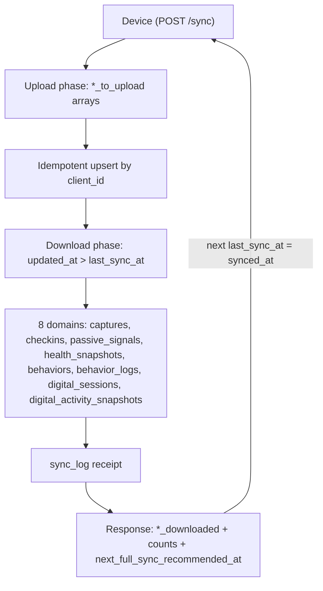

# Sync protocol

The `POST /sync` endpoint is the device's single bidirectional round-trip. It uploads changes across all domains in one request and downloads server-side changes since a cursor. This page covers the envelope shape, the upload and download arrays, the `updated_at` cursor model, the `sync_log` receipt, the text-only-capture rule, and the health-snapshot audit.

## Purpose

Rather than calling each ingestion endpoint separately, the device makes one `POST /sync` call that pushes all local changes and pulls all server-side changes. This reduces round-trips, gives the device a consistent snapshot of what changed, and produces a durable receipt (`sync_log` row) for every sync. The endpoint is the primary sync path for the local-first iPhone/Mac app over Tailscale.

## Key abstractions

| Path | Role |
|------|------|
| `app/Http/Controllers/SyncController.php` | Single `__invoke` method handling the full bidirectional sync. |
| `app/Http/Requests/SyncRequest.php` | Validates the `*_to_upload` arrays and `last_sync_at`. |
| `app/Models/SyncLog.php` | Per-device sync receipt with upload/download counts (table `sync_log`, no timestamps). |
| `app/Services/CaptureService.php` | Called for each `captures_to_upload` entry (idempotent by `client_id`). |
| `app/Services/BitaculaService.php` | Called for `behaviors_to_upload` and `behavior_logs_to_upload`. |
| `app/Services/AtlasDomainRegistry.php` | Resolves the default domain slug for captures without one. |
| `app/Services/AuditLogService.php` | Records the `health_snapshots_synced` audit event. |

## How it works

### The envelope

`POST /sync` takes a JSON body validated by `SyncRequest` in `app/Http/Requests/SyncRequest.php`:

**Request fields:**

| Field | Required | Description |
|-------|----------|-------------|
| `device_id` | yes | Device identifier (string, max 128). |
| `last_sync_at` | no | Cursor: a timestamp. The server returns rows with `updated_at > last_sync_at`. |
| `captures_to_upload` | no | Array of text captures (see text-only rule below). |
| `checkins_to_upload` | no | Array of check-ins. |
| `passive_signals_to_upload` | no | Array of passive signals (supports `deleted_at` for soft-delete). |
| `health_snapshots_to_upload` | no | Array of HealthKit daily snapshots. |
| `behaviors_to_upload` | no | Array of Bitacula behavior factors. |
| `behavior_logs_to_upload` | no | Array of Bitacula daily behavior logs. |
| `digital_sessions_to_upload` | no | Array of Sensor 4 sessions. |
| `digital_activity_snapshots_to_upload` | no | Array of Sensor 4 daily aggregates. |
| `metadata` | no | Arbitrary sync metadata. |

**Response fields:**

| Field | Description |
|-------|-------------|
| `synced_at` | Server timestamp of this sync. |
| `*_uploaded` | Count of rows uploaded per domain. |
| `*_downloaded` | Resource collection of rows changed since `last_sync_at` per domain. |
| `next_full_sync_recommended_at` | `synced_at + 1 hour`. |

### How it works

`SyncController::__invoke` runs an upload phase followed by a download phase, then writes a `sync_log` receipt:



### Upload phase

`SyncController::__invoke` processes each `*_to_upload` array in order:

- **Captures:** calls `CaptureService::create` for each entry, defaulting the domain to `AtlasDomainRegistry::defaultSlug()` if absent. This means captures uploaded via `/sync` get the full cognitive-quarantine stamping and semantic pipeline.
- **Check-ins:** upserts by `client_id` via `Checkin::withTrashed()`. Restores soft-deleted rows on replay.
- **Passive signals:** upserts by `client_id`. Supports `deleted_at` in the payload: if present, soft-deletes the signal; if absent and the signal was soft-deleted, restores it.
- **Health snapshots:** upserts by `client_id`. Normalizes confidence (scales to 0-1 if > 1) and stores JSONB blocks (metrics, readiness, sleep, recovery, load, subjective, body).
- **Behaviors / behavior logs:** calls `BitaculaService::upsertBehavior` / `upsertBehaviorLog`.
- **Digital sessions:** upserts by `client_id` with `raw_payload` and `metadata` as JSONB.
- **Digital activity snapshots:** upserts by `client_id` with `focus_mode_active_min`, `category_breakdown`, `source_breakdown`, `raw_rize_data`, `raw_screentime_data` as JSONB.

### Download phase

After uploads, the server queries each domain for rows changed since `last_sync_at`:

```php
Model::withTrashed()
    ->where('updated_at', '>', $lastSyncAt)
    ->orderBy('updated_at')
    ->orderBy('id')
    ->limit(200)
    ->get();
```

Key properties:
- **`withTrashed`** — soft-deleted rows are included so the device can mirror deletions.
- **`updated_at` cursor** — the `set_updated_at()` database trigger keeps this fresh on every write.
- **Limit 200 per domain** — pagination by cursor; the device should use the latest `updated_at` from the response as the next `last_sync_at`.
- **Ordering** — `updated_at` then `id` for deterministic ordering.

For captures, the download query also eager-loads `capture_links` (if the table is available).

### sync_log receipt

After both phases, the controller creates a `SyncLog` row (`sync_log` table) recording:

- `device_id`, `synced_at`
- Upload and download counts per domain (e.g. `captures_uploaded`, `captures_downloaded`, `checkins_uploaded`, `checkins_downloaded`, etc.)
- `duration_ms` — wall-clock time of the sync
- `metadata` — the sync metadata from the request

The `sync_log` table has no timestamps (no `created_at`/`updated_at`); `synced_at` is the canonical time.

### Text-only-capture rule

`SyncRequest` validates `captures_to_upload.*.kind` as `Rule::in(['text'])`. Audio and photo captures cannot go through `/sync` because they carry binary payloads that do not fit in JSON. The validation message is explicit:

> Sync JSON only accepts text captures. Upload audio/photo captures through POST /captures multipart.

This means the device must upload audio/photo captures via the multipart `POST /captures` endpoint (see [captures API and lifecycle](captures-and-lifecycle.md)) and can batch text captures through `/sync`.

### Health-snapshot audit

Health snapshots are classified as `sensitive` data. The sync controller records an explicit `AuditLogService::record('health_snapshots_synced', ...)` audit event with:

- `device_id`, `last_sync_at`
- `uploaded` and `downloaded` counts
- `privacy.sensitivity: sensitive`, `privacy.domain: health`

This ensures every health-snapshot access through sync is audited, even though the endpoint is the same bidirectional envelope.

### `prepareForValidation` in SyncRequest

Before validation, `SyncRequest::prepareForValidation`:

- Defaults missing `domain` on each `captures_to_upload` entry to `AtlasDomainRegistry::defaultSlug()`.
- Canonicalizes `category` and `lifecycle_status` on `behaviors_to_upload` entries via `BehaviorCategories::canonicalize` and `BehaviorLifecycle::canonicalize`.

### `withValidator` additional checks

After standard validation, `SyncRequest::withValidator` adds:

- Future-date rejection for `checkins_to_upload.*.recorded_at` (via `RejectsFutureCheckinRecordedAt` trait).
- `HealthMetricIntegrity::validatePassiveSignal` for each `passive_signals_to_upload` entry.

## Integration points

- [Captures API and lifecycle](captures-and-lifecycle.md) — `/sync` calls `CaptureService::create` for text captures.
- [Sensor 4: digital activity](sensor4-digital-activity.md) — `/sync` accepts `digital_sessions_to_upload` and `digital_activity_snapshots_to_upload`.
- [Cognitive quarantine and capture privacy](cognitive-quarantine-and-privacy.md) — captures uploaded via `/sync` get the same quarantine stamping as multipart uploads.
- [REST API](../../api/rest-endpoints.md) — `/sync` is the single endpoint for batch sync.

## Key source files

| Path | Purpose |
|------|---------|
| `app/Http/Controllers/SyncController.php` | The single `__invoke` sync handler. |
| `app/Http/Requests/SyncRequest.php` | Validation rules for the sync envelope. |
| `app/Models/SyncLog.php` | Sync receipt model (table `sync_log`). |
| `app/Services/CaptureService.php` | Called for each uploaded capture. |
| `app/Services/BitaculaService.php` | Called for uploaded behaviors and behavior logs. |
| `app/Services/AtlasDomainRegistry.php` | Default domain resolution. |
| `app/Services/AuditLogService.php` | Health-snapshot sync audit. |
| `routes/api.php` | `/sync` route definition (line 629). |
