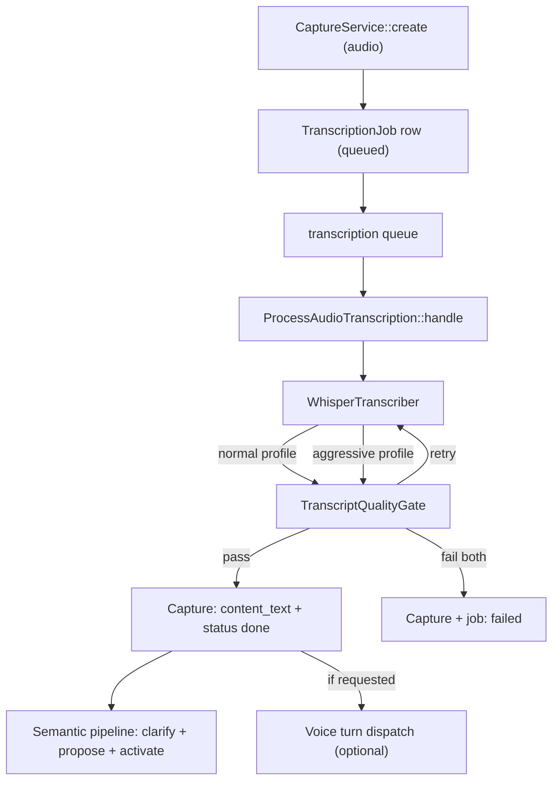

# Audio transcription pipeline

Audio captures are transcribed locally with whisper.cpp, not by a cloud API. The pipeline runs as an async queue job, wraps the whisper-cli binary, and applies a fail-closed quality gate that refuses to store a hallucinated or acoustically unreliable transcript. This page covers the job, the transcriber, the quality gate, config keys, health checks, and the retry endpoint.

## Purpose

When an audio capture is created, the server needs to turn the binary into text so the semantic pipeline (clarifier, curation proposal, activation) can run. The transcription pipeline does this with a local whisper.cpp binary, guarded by a deterministic quality gate that catches decoder degeneration (loops, hallucinations, dropped audio) and retries with a harder profile before failing closed.

## Key abstractions

| Path | Role |
|------|------|
| `app/Jobs/ProcessAudioTranscription.php` | Queue job: runs whisper, sets capture text/status, then runs the semantic pipeline. |
| `app/Services/WhisperTranscriber.php` | whisper.cpp wrapper: ffmpeg normalize, whisper-cli, quality gate, fail-closed retry. |
| `app/Services/Ai/Transcription/TranscriptQualityGate.php` | Pure, deterministic quality assessment: text-loop detection + acoustic confidence/coverage. |
| `app/Models/TranscriptionJob.php` | Per-capture transcription work row (one active per capture). |
| `app/Http/Controllers/HealthController.php` | Public `/health` probe reporting whisper binary/model/ffmpeg presence and job counts. |
| `config/atlas.php` | `transcription.*` config keys. |

## How it works

### The queue job

`ProcessAudioTranscription` in `app/Jobs/ProcessAudioTranscription.php` is a `ShouldQueue` job with `tries: 3` and `timeout: 600` seconds. It is dispatched on the `transcription` queue with `->afterCommit()` so it only fires after the capture's database transaction commits.

The job's `handle` method:

1. Loads the `TranscriptionJob` row with its capture. If the job is already `done`, it returns early.
2. Marks the job `processing` (increments `attempts`, sets `started_at`) and the capture `transcription_status: processing`.
3. Calls `WhisperTranscriber::transcribe` with the path to the stored audio file on the `atlas` disk.
4. On success, sets `content_text`, `transcription_status: done`, `transcription_engine` (from config).
5. Marks the job `done` with `finished_at`.
6. Optionally dispatches a voice turn to `AtlasVoiceRealtimeService` if the capture metadata requested it (`voice_realtime_dispatch.dispatch_to_ai`), with ghost-transcript detection that blocks dispatch for suspect output (e.g. the tinyurl "acesse o site" whisper hallucination).
7. Runs the semantic pipeline: `CaptureSemanticClarifier::handleReady`, `CurationProposalService::createFromCapture`, `ActivationEngine::createForContext`. These are wrapped in a try-catch so a semantic failure does not mark the transcription as failed.

The `failed` method marks both the job and the capture as `failed` with the error message, and records a voice dispatch failure if one was requested.

### The transcriber

`WhisperTranscriber` in `app/Services/WhisperTranscriber.php` does the actual work. `transcribeDetailed` is the full-fidelity method; `transcribe` is a back-compat wrapper that returns just the text.

The flow:

1. **Validate binaries.** Checks that the whisper binary exists and is executable, the model file exists, the audio file exists, and ffmpeg exists and is executable. Throws `RuntimeException` if any are missing.
2. **Memory headroom.** Raises the PHP memory limit to at least 1536 MB if currently lower, so decoding a large `-ojf` JSON (every token is an object) does not OOM on a long recording.
3. **Normalize audio.** Runs ffmpeg to convert the input to 16 kHz mono `pcm_s16le` WAV (`-vn -ac 1 -ar 16000 -c:a pcm_s16le`). Estimates duration from the WAV byte count (32000 bytes/sec).
4. **Quality-gated transcription with retry.** Runs two profiles in sequence: `normal` then `aggressive`. For each profile:
   - Builds whisper-cli args with anti-hallucination flags: `-mc 0` (no carry-over context), `-et` (entropy threshold), `-nth` (no-speech threshold), `-sns` (suppress non-speech). The aggressive profile lowers the entropy threshold to `2.2` and adds greedy-ish decode params (`-tp 0.0 -tpi 0.4`) to break out of loops.
   - Runs the process with a timeout (default 7200s, min 600s).
   - Parses the `-ojf` JSON output into segments with real timestamps and per-token confidence probabilities.
   - Runs `TranscriptQualityGate::assess` (text-level) and `assessAcoustic` (acoustic-level).
   - If both pass, returns the payload. If not, loops to the harder profile.
5. **Fail-closed.** If both profiles fail, throws a `RuntimeException` with the merged issues list. The transcript is never stored, so a poisoned output cannot contaminate downstream metrics.
6. **Cleanup.** The work directory (normalized WAV, output files) is always removed in a `finally` block.

### The quality gate

`TranscriptQualityGate` in `app/Services/Ai/Transcription/TranscriptQualityGate.php` is pure PHP with no LLM and no I/O. It has two assessment methods:

**Text-level (`assess`):**

- Rejects transcripts under 50 words (fail).
- **Consecutive-repeat loop:** flags a single token repeated 4+ times in a row (the "mix mix mix" hallucination).
- **Degenerate content-token share:** flags any non-stopword exceeding 5% of all words. Stopwords (English + Portuguese) are excluded because they dominate any short text naturally.
- **Phrase-loop:** flags a repeated bigram run of 4+ (e.g. "taking care" repeated).
- **Words-per-minute + coverage:** when duration is known, computes WPM and coverage (WPM / expected 140 WPM). Flags WPM below 70 (audio lost) or above 240 (implausible), and coverage below 55%.
- Verdict: `pass` if no issues, `retry` if any hard-fail signal (loop, dominant token, phrase loop, low coverage), `fail` if the transcript is too short.

**Acoustic-level (`assessAcoustic`):**

- Parses the decoder's per-token probabilities from the `-ojf` JSON into segments with `from_ms`, `to_ms`, `text`, and `confidence`.
- Computes a duration-weighted mean decoder confidence (0-100). Hard-fails below 55.
- Computes real time coverage: spoken milliseconds / total audio milliseconds. Hard-fails below 50%.
- Computes the largest silence gap between consecutive segments. Flags gaps over 45 seconds.
- Surfaces low-confidence segments (mean probability below 0.50) with their time span and a text snippet, up to 40 segments. These are surfaced, never hidden.
- Verdict: `pass` or `retry` (hard-fail on low confidence or low coverage).

### Config keys

All keys live under `atlas.transcription` in `config/atlas.php`:

| Key | Env var | Default | Purpose |
|-----|---------|---------|---------|
| `enabled` | `TRANSCRIPTION_ENABLED` | `false` | Master switch. If off, audio captures get a `TranscriptionJob` row but no job is dispatched. |
| `bin_path` | `WHISPER_BIN_PATH` | `/usr/local/bin/whisper-cli` | Path to the whisper.cpp binary. |
| `ffmpeg_path` | `FFMPEG_BIN_PATH` | `/usr/bin/ffmpeg` | Path to ffmpeg. |
| `language` | `WHISPER_LANGUAGE` | `pt` | Language hint passed to whisper-cli (`-l`). |
| `model_path` | `WHISPER_MODELS_DIR` + `model_file` | `/opt/whisper-models/ggml-large-v3-turbo.bin` | Path to the GGML model. |
| `engine` | (fixed) | `whisper-cpp-large-v3-turbo` | Engine name stamped on the capture. |
| `timeout_seconds` | `WHISPER_TIMEOUT_SECONDS` | `7200` | Whisper process timeout (min 600s enforced). |
| `normalize_timeout_seconds` | `WHISPER_NORMALIZE_TIMEOUT_SECONDS` | `1200` | ffmpeg normalization timeout. |
| `max_context` | `WHISPER_MAX_CONTEXT` | `0` | Carry-over context count (`-mc 0` = no carry-over, anti-hallucination). |
| `entropy_thold` | `WHISPER_ENTROPY_THOLD` | `2.4` | Entropy threshold for the normal profile. |
| `no_speech_thold` | `WHISPER_NO_SPEECH_THOLD` | `0.6` | No-speech threshold (`-nth`). |
| `suppress_non_speech` | `WHISPER_SUPPRESS_NON_SPEECH` | `true` | Adds `-sns` flag. |

### Health checks

`GET /health` (public, no auth) in `app/Http/Controllers/HealthController.php` reports a `transcription` block:

- `enabled`, `engine`, `language`
- `binary_path`, `binary_exists`, `binary_executable`
- `model_path`, `model_exists`
- `ffmpeg_path`, `ffmpeg_exists`, `ffmpeg_executable`

It also reports `transcription_jobs` counts (queued, processing, failed) and a `queue` block noting the `transcription` queue name and that a queue worker must be running.

### Retry endpoint

`POST /captures/{capture}/transcription/retry` calls `CaptureService::retryTranscription`, which:

1. Validates the capture is audio, the file exists on the `atlas` disk, and transcription is enabled.
2. Checks for an active job (`queued` or `processing`). If one exists, returns the capture as-is (no duplicate job).
3. Resets `transcription_status: pending`, clears the error, creates a new `TranscriptionJob`, and dispatches `ProcessAudioTranscription`.

Returns 202 with the `CaptureResource`.

### Anti-hallucination fail-closed

The pipeline is fail-closed by design. A hallucinated transcript (loops, dominant tokens, ghost URLs) or an acoustically unreliable one (low decoder confidence, dropped coverage) is never stored. The transcriber retries once with a harder profile, and if that also fails, throws an exception that marks the capture's `transcription_status: failed`. The operator can then retry via the endpoint above. The voice-turn dispatcher has its own ghost-transcript guard (`looksLikeVoiceSttGhostTranscript`) that blocks dispatch for known whisper hallucinations like the tinyurl "acesse o site" pattern.

## Integration points

- [Captures API and lifecycle](captures-and-lifecycle.md) — `CaptureService::create` dispatches the job; `retryTranscription` re-queues it.
- [Cognitive quarantine and capture privacy](cognitive-quarantine-and-privacy.md) — the transcript text triggers the semantic pipeline, but the capture stays quarantined until human ratification.
- [Sync protocol](sync-protocol.md) — `/sync` only accepts text captures; audio must go through multipart `POST /captures` so the transcription pipeline can run.
- [AI Gateway](../ai-gateway/index.md) — the optional voice-turn dispatch can forward a transcript to an AI interaction.

## Key source files

| Path | Purpose |
|------|---------|
| `app/Jobs/ProcessAudioTranscription.php` | Queue job with semantic pipeline and voice dispatch. |
| `app/Services/WhisperTranscriber.php` | whisper.cpp wrapper with ffmpeg normalize and fail-closed retry. |
| `app/Services/Ai/Transcription/TranscriptQualityGate.php` | Pure text-loop and acoustic quality gate. |
| `app/Models/TranscriptionJob.php` | Per-capture transcription work row. |
| `app/Http/Controllers/HealthController.php` | Public health probe with transcription checks. |
| `app/Services/CaptureService.php` | `retryTranscription` method. |
| `config/atlas.php` | `transcription.*` config keys (lines 106-125). |
