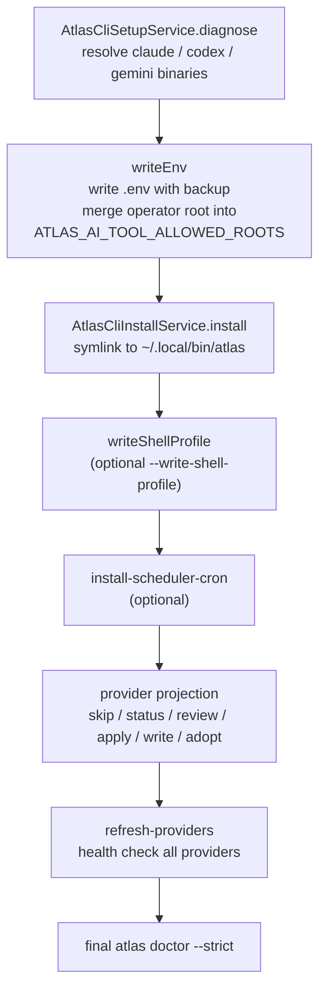

# Bootstrap, doctor and release

The CLI ships with a readiness pipeline that takes a fresh checkout from "no providers configured" to "tagged release". It has four stages, each an artisan command behind a `bin/atlas` verb: **bootstrap** installs and configures, **doctor** runs readiness gates, **final** checks product-level B0-B8 blocks, and **release** gates a version tag against worktree, docs, CI, dogfood, and final. Between them sits **dogfood**, a real-usage evidence ledger whose 3-day real-usage cover gates the release.

The pipeline is the operator's path to a trustworthy install. `atlas bootstrap` is the recommended single entrypoint; it diagnoses provider binaries, writes `.env` with a backup, installs the launcher symlink, optionally writes a shell profile and a scheduler cron, and finishes by running `atlas doctor --strict`.

## Purpose

Cover the install and configure flow, the doctor gates, the final B0-B8 product-readiness blocks, the dogfood evidence ledger and its 3-day gate, and the release gate with tagging.

## Bootstrap

`atlas:cli:bootstrap` (`atlas bootstrap`) is the professional install and configure flow. The command orchestrates six services and exposes a large option surface so it can be re-run safely. The recommended invocation is:

```bash
./bin/atlas bootstrap --dry-run
./bin/atlas bootstrap --refresh-providers --strict
```

To operate from any folder under the user's home directory:

```bash
./bin/atlas bootstrap --operator-mode --operator-root=/Users/vitorepf --refresh-providers --strict
```

The bootstrap sequence:



`AtlasCliSetupService::diagnose` resolves three provider binaries: `claude_cli` (Claude Code CLI), `codex_cli` (Codex CLI), and `gemini_cli` (Gemini CLI). It reports a summary with `has_any_ready_provider`, `dev_ready` (Codex or Claude), and `council_ready` (both Claude and Codex for cross-review). `writeEnv` persists the resolved binary paths into `.env`, backing up the existing file first. When `--operator-mode` is set it also writes `ATLAS_AI_TOOL_PERMISSION_MODE=danger`, `ATLAS_AI_TOOL_ALLOW_DANGER=true`, and `ATLAS_AI_ALLOW_UNSANDBOXED_WRITE=true`; the `--operator-root` value is merged into `ATLAS_AI_TOOL_ALLOWED_ROOTS` through `mergedAllowedRoots`.

The provider projection step (`--provider-projection=skip|status|review|apply|write|adopt`) generates or updates the `CLAUDE.md` / `AGENTS.md` provider projections. Bootstrap finishes with an automatic `atlas doctor --strict` unless `--no-doctor` is passed.

## Doctor

`atlas:cli:doctor` (`atlas doctor`) is the terminal readiness gate. `AtlasCliDoctorService::diagnose` runs nine gates and rolls them up into a readiness status of `passed`, `needs_review`, or `failed` with a weighted score (passed = 20, needs_review = 10, failed = 0).

| Gate | What it checks | Fail state |
|---|---|---|
| `provider_binaries` | At least one provider binary resolved | failed if none |
| `provider_health` | At least one provider online (health check) | failed if all offline |
| `council_capacity` | Both Claude and Codex available for cross-review | needs_review if only one |
| `permission_scope` | Resolved workspace is inside `ATLAS_AI_TOOL_ALLOWED_ROOTS` | failed if outside |
| `skills_health` | Skill bundles load without errors | failed on errors |
| `scheduler_cron` | `ai_scheduled_tasks` table exists and cron entry installed | failed if table missing, needs_review if cron absent |
| `provider_projection` | Provider projections are current | needs_review if stale |
| `clipboard_visual_input` | Clipboard capture runtime ready (`pngpaste` or `osascript` + `sips`) | needs_review if unavailable |
| `workspace_quality` | Detected test command passes | needs_review / failed |

`--strict` makes the command return non-zero unless readiness is fully `passed`. `--refresh-providers` re-runs health checks first; `--run-tests` runs the detected test command as part of the diagnosis. The permission gate is the one that ties the workspace to operator authorization: it resolves the workspace with `realpath`, then checks it is equal to or nested under an allowed root.

## Final

`atlas:cli:final` (`atlas final`) is the B0-B8 product-readiness gate. It runs the doctor first, then evaluates a set of blocks. `--strict` runs tests and returns failure unless every block passes. The blocks:

| Block | What it verifies |
|---|---|
| `B0_glossary` | Canonical glossary exists in `docs/` and the Vault |
| `B1_debug_research` | `atlas:ai:chat` covers debug and research modes |
| `B2_dev_repair_loop` | `atlas:cli:dev` and `atlas:cli:fix` exist and the launcher covers them |
| `B3_trace_tool_events` | `ai_tool_events` table and `atlas:cli:trace` exist |
| `B4_permission_sessions` | `ai_permission_sessions` table and `atlas:cli:permissions` exist |
| `B5_memory_deltas` | `ai_memory_deltas` table and `atlas:cli:memory` exist |
| `B6_router_compare` | `ai_router_decisions` table and `atlas:cli:compare` exist |
| `B7_terminal_tui` | `atlas:cli:tui` and `atlas:cli:dashboard` exist and the launcher covers them |
| `B8_distribution` | `atlas:cli:version`, `update`, `rollback`, `bootstrap`, `doctor` exist and the launcher covers them |
| `product_hardening` | Dogfood and release commands exist, final-product and release-checklist docs exist, `.github/workflows/atlas-cli.yml` exists |
| `release_preflight` | A structural `atlas:cli:release --preflight --no-final --skip-dogfood --allow-dirty` passes |
| `final_doctor` | `atlas doctor` readiness is `passed` |

The `release_preflight` block is notable: it spawns the release command in preflight mode as a subprocess and checks it passes without calling final recursively or running real dogfood. This is what makes `atlas final` a safe, complete check.

## Dogfood

`atlas:cli:dogfood` (`atlas dogfood`) is the real-usage evidence ledger. `AtlasCliDogfoodService` persists events to a JSON file under storage. It has four subcommands: `start` (mark a session running), `record` (log a finished event), `run` (a safe smoke), and `report` (summarize the window).

The required scenarios are:

- `ask_session`
- `dev_task`
- `debug_fix`
- `provider_handoff`
- `quality_gate`
- `tui_status`
- `release_check`

`atlas dogfood run` is a **smoke**, not real evidence. It runs the smoke scenarios, tags every event with `profile=smoke` and `cleanup_policy=delete_smoke_artifacts_after_run`, cleans up the artifacts it created, and is explicitly excluded from real-usage coverage. The release gate rejects smoke events when it asks for real usage.

The `report()` method is the 3-day gate. By default it looks back 3 days, filters events to the workspace, separates `passed` events into real vs smoke (smoke events carry `metadata.profile=smoke`), and runs gates:

| Gate | What it checks |
|---|---|
| `observation_window` | At least N distinct days observed in the window |
| `scenario_coverage` | Every required scenario has a passing event |
| `blocking_failures` | No `failed` or `blocked` events in the window |
| `real_usage_coverage` | (only when `requireReal=true`) every required scenario has a passing **real** event |

The release gate calls `report($workspace, 3, requireReal: true)`, so a release requires 3 days of real (non-smoke) usage covering every required scenario.

## Release

`atlas:cli:release` (`atlas release`) is the release readiness gate and optional tagger. It runs a set of checks, then optionally creates an annotated git tag. The checks:

| Check | What it verifies |
|---|---|
| `version` | `--release-version` matches `vMAJOR.MINOR.PATCH` (with optional pre-release suffix) |
| `worktree` | Worktree is clean (or `--allow-dirty`) |
| `final_product_docs` | Final-product doc paths exist |
| `release_checklist` | Release-checklist doc paths exist |
| `ci_workflow` | `.github/workflows/atlas-cli.yml` exists |
| `final` | `atlas final --strict` passes (unless `--no-final`) |
| `dogfood` | 3-day real-usage dogfood report passes (unless `--skip-dogfood`) |

`--preflight` is structural validation only: skipped final and dogfood gates are allowed, and `--create-tag` is hard-blocked in preflight mode. A tag is only created when `--create-tag` is set, the status is `passed`, and the run is not a preflight. If readiness did not pass, the tag is blocked with a `failed` check. The canonical release flow is therefore:

```bash
atlas release --version=v2.0.0 --preflight --no-final --skip-dogfood --allow-dirty  # structure only
atlas release --version=v2.0.0 --create-tag                                       # full gate + tag
```

## Key abstractions

| Path | Role |
|---|---|
| `app/Console/Commands/AtlasCliBootstrapCommand.php` | `atlas:cli:bootstrap`, orchestrate setup, install, scheduler, projection, doctor |
| `app/Console/Commands/AtlasCliDoctorCommand.php` | `atlas:cli:doctor`, readiness gate command |
| `app/Console/Commands/AtlasCliFinalCommand.php` | `atlas:cli:final`, B0-B8 product-readiness blocks |
| `app/Console/Commands/AtlasCliReleaseCommand.php` | `atlas:cli:release`, release gate and tagger |
| `app/Console/Commands/AtlasCliDogfoodCommand.php` | `atlas:cli:dogfood`, evidence ledger command |
| `app/Services/Ai/Cli/AtlasCliDoctorService.php` | Nine-gate diagnosis and readiness scoring |
| `app/Services/Ai/Cli/AtlasCliDogfoodService.php` | Evidence ledger, required scenarios, smoke, 3-day real-usage report |
| `app/Services/Ai/Cli/AtlasCliSetupService.php` | Provider-binary diagnosis, `.env` writer, operator-root merge |
| `app/Services/Ai/Cli/AtlasCliInstallService.php` | Launcher symlink and shell-profile install |
| `app/Services/Ai/Scheduling/AtlasSchedulerInstallService.php` | Scheduler cron inspect and install |

## How it works

Bootstrap is idempotent and re-runnable. Every step has a `--dry-run` counterpart that plans without writing, and `writeEnv` backs up the existing `.env` before mutating it. The doctor gates are pure reads except `--refresh-providers` and `--run-tests`; both are opt-in. Final composes the doctor payload with its own block checks, so a single `atlas final --strict` exercises the doctor, the command registry, the required DB tables, the docs, the CI workflow, and a release preflight subprocess. Release composes final and dogfood, then tags only when the composite is green.

## Integration points

- **CLI and operator surface** ([index.md](index.md)) — these verbs are the readiness half of the launcher dispatch table.
- **Dev Cockpit and Forge** ([dev-cockpit-and-forge.md](dev-cockpit-and-forge.md)) — the doctor's `clipboard_visual_input` and `workspace_quality` gates apply to dev runs; `--operator-mode` configured here enables operator runs there.
- **Operator mode and approval gate** ([operator-mode-and-approval.md](operator-mode-and-approval.md)) — `--operator-mode` and `--operator-root` write the authorization roots the doctor permission gate enforces.
- **Getting started** ([../../overview/getting-started.md](../../overview/getting-started.md)) — install and bootstrap instructions.

## Key source files

| File | What to read |
|---|---|
| `app/Console/Commands/AtlasCliBootstrapCommand.php` | The `$signature` block and `handle()`, the orchestration order |
| `app/Services/Ai/Cli/AtlasCliDoctorService.php` | `diagnose()`, `payload()`, `permissionGate()`, `readiness()` |
| `app/Console/Commands/AtlasCliFinalCommand.php` | `blocks()`, the B0-B8 block definitions and `releasePreflightBlock()` |
| `app/Console/Commands/AtlasCliReleaseCommand.php` | `checks()`, the release check list and `createTag()` |
| `app/Services/Ai/Cli/AtlasCliDogfoodService.php` | `requiredScenarios()`, `runSmoke()`, `report()`, the 3-day gate |
| `app/Services/Ai/Cli/AtlasCliSetupService.php` | `diagnose()`, `writeEnv()`, `mergedAllowedRoots()` |
| `docs/atlas-cli-final-product.md` | Canonical CLI product reference (install, readiness, release) |
| `docs/atlas-cli-release-checklist.md` | Release gates and blocking conditions |
