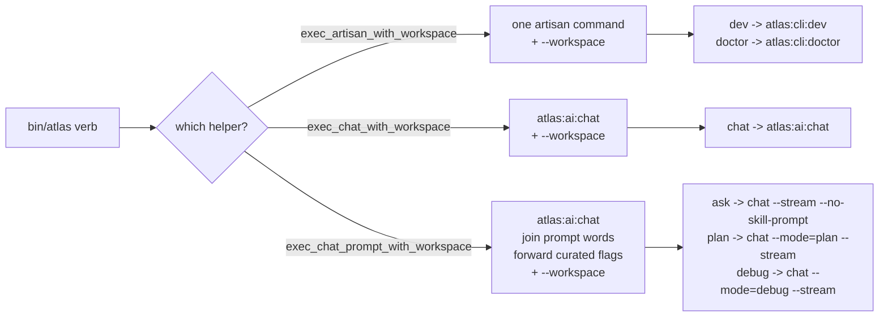

# Command taxonomy

The real surface of Atlas Server is not HTTP. It is 1,227 artisan commands, all under the `atlas:*` prefix, auto-discovered by the Laravel console kernel from `app/Console/Commands/`. The `bin/atlas` launcher is a thin bash dispatch table that maps human verbs (`ask`, `dev`, `forge`, `doctor`, `release`) onto these commands. Understanding the prefix taxonomy is the fastest way to navigate the codebase, because each prefix is a named subsystem with its own services, models, and tests.

## Purpose

Map the 1,227 commands by prefix, explain how CLI verbs map to artisan, and clarify what `routes/console.php` actually holds (schedules, not commands). Cover the surface adapter model: one runtime, many front-ends.

## The prefix map

The counts below are measured from the `protected $signature` property across the command files in `app/Console/Commands/`. Every command is an `atlas:*` command; there are no non-atlas artisan commands in the project.

| Prefix | Count | What it is |
|---|---|---|
| `atlas:aaeos:*` | 317 | **Atlas Agentic Engineering OS**, the largest subsystem: mission control cockpit, phase handoff, the HTTP-path facade |
| `atlas:ai:*` | 144 | Core AI runtime: chat, work, health, decide, session-bootstrap, place-feature, doctor, bootstrap-skills |
| `atlas:loop:*` | 141 | Autonomous Evolution Loop: campaign, automerge, keepalive, main-health, backlog-feed, run-scenario, off |
| `atlas:frontend:*` | 44 | Frontend engineering surface |
| `atlas:self-construction:*` | 34 | Atlas Self-Construction OS (governed start packets) |
| `atlas:task:*` | 32 | Task fabric and task serving |
| `atlas:cli:*` | 32 | The CLI command classes (dev, doctor, final, release, dogfood, bootstrap, state, ...) |
| `atlas:programming:*` | 27 | Programming orchestrator surface |
| `atlas:engineering:*` | 21 | Engineering harness, benchmark, quality, security, knowledge |
| `atlas:context:*` | 21 | Context packs and injection |
| `atlas:brain:*` | 21 | External brain (cycle, seed, state, worker prompt) |
| `atlas:finance:*` | 16 | Finance strategy campaigns |
| `atlas:software-company-stewardship:*` | 15 | Native obra runner (scheduled) |
| `atlas:memory:*` | 15 | Memory registry (list, add, audit, govern, projection, recall, quality) |
| `atlas:dev:*` | 15 | Dev senior-loop and dev runtime |
| `atlas:aemor:*` | 14 | AEMOR (records outcome and learning candidate; product-runtime governance) |
| `atlas:self-improvement:*` | 12 | Self-improvement |
| `atlas:forge:*` | 12 | Forge (max-power programming) |
| `atlas:long-horizon:*`, `atlas:aael:*`, `atlas:code:*`, `atlas:atlas-decide:*`, `atlas:semantic:*`, `atlas:aobg:*`, `atlas:vox:*`, `atlas:teos:*`, `atlas:foundry:*`, `atlas:aurg:*`, `atlas:swarm:*`, `atlas:scheduler:*`, `atlas:project:*`, `atlas:open-brain:*`, `atlas:code-graph:*` | 3-9 each | Long tail of named subsystems (reality graph AURG, decide, semantic RAG, voice/vox, foundry, swarm, scheduler, open-brain MCP, code-graph) |

The three giants — `aaeos` (317), `ai` (144), and `loop` (141) — account for roughly half of all commands. `aaeos` is the mission-control and agentic-engineering-OS surface. `ai` is the gateway and runtime. `loop` is the autonomous evolution cycle. The `atlas:cli:*` prefix (32) is the operator-facing set documented across this wiki section; everything else is reachable through it or through the watchdogs.

## How CLI verbs map to artisan

The launcher's `case "$cmd"` table is the single mapping. A verb either maps directly to one artisan command or to a small sub-dispatch. The mapping falls into a few patterns:

- **Direct dispatch** — `dev` to `atlas:cli:dev`, `doctor` to `atlas:cli:doctor`, `release` to `atlas:cli:release`. The helper appends `--workspace=$CWD` unless the caller already passed one.
- **Chat dispatch** — `chat` to `atlas:ai:chat` with the workspace.
- **Prompt dispatch** — `ask`, `plan`, `review`, `debug`, `research`, `project` all go to `atlas:ai:chat` with a `--mode` and `--stream`. `exec_chat_prompt_with_workspace` joins the free-form prompt words into one string and forwards only curated flags (`--image`, `--provider`, `--model`, `--permission`, `--clipboard-image`, `--no-auto-image`, etc.).
- **Sub-dispatch** — `engineering`, `benchmark`, `project`, `memory`, `open-brain`, `aobg` each have a nested `case` that picks the right sub-command (`engineering benchmark seed`, `memory audit`, `open-brain context`).
- **Fallback** — any unknown verb is treated as a chat prompt: `atlas:ai:chat "<joined>" --stream --workspace=$CWD`.

The workspace injection is what makes the verbs work from any directory. `bin/atlas` captures `CALLER_PWD` before `cd` to the repo root, then appends `--workspace=$CALLER_PWD` to every artisan call unless `has_workspace_arg` finds one already present.

## routes/console.php holds schedules, not commands

A common mistake is to look for command definitions in `routes/console.php`. That file is 33KB, but it does not define the 1,227 commands. It holds `Schedule::command(...)` definitions: the Laravel scheduler entries that the launchd `schedule:run` tick fires. Each entry is `->when()`-gated by a `config('atlas.*')` flag. Examples:

- `atlas:software-company-stewardship native-obra-runner` every 15 minutes, gated by the native-obra-runner flag.
- `queue:work database-long --queue=folder-intel --stop-when-empty` every minute, gated by the folder-intelligence auto-assemble flag.
- `queue:work database-long --queue=missions --stop-when-empty` every minute, gated by the mission HTTP delivery flag.
- `atlas:harness propose` daily at 07:00 and `atlas:harness autopilot`, gated by the harness autopilot flag.

The 1,227 commands are class-based artisan commands under `app/Console/Commands/`, auto-discovered by the console kernel. The only `Artisan::command` closure in `routes/console.php` is the framework's built-in `inspire`.

## Surface adapters: one runtime, many front-ends

The CLI is one adapter among many. `app/Services/Ai/Surface/SurfaceAdapterRegistry.php` registers ten surface adapters that all drive the same runtime:

| Adapter | Surface |
|---|---|
| `AtlasCliDevSurfaceAdapter` | `atlas dev` / `atlas fix` / `atlas continue` |
| `AtlasCliChatSurfaceAdapter` | `atlas ask` / `atlas chat` |
| `AtlasCliForgeSurfaceAdapter` | `atlas forge` |
| `AtlasCodeSurfaceAdapter` | Atlas Code (desktop) |
| `AtlasApiInteractionSurfaceAdapter` | HTTP API interactions |
| `AtlasAppSurfaceAdapter` | The mobile/desktop app |
| `AtlasDesktopAiSurfaceAdapter` | Desktop AI |
| `AtlasWorkerSurfaceAdapter` | The gateway worker |
| `AtlasMcpReadonlySurfaceAdapter` | MCP read-only |
| `AtlasVaultSurfaceAdapter` | Obsidian / AtlasVault |
| `AtlasVoiceRealtimeSurfaceAdapter` | Voice realtime |

The registry also carries `SURFACE_ALIASES` that normalize legacy names (`atlas_cli` to `atlas_cli_dev`, `obsidian` to `atlas_vault`, `code` to `atlas_code`, and so on). Because the surface boundary lives in the adapter (for the CLI, `AtlasCliDevAdapter`), a CLI run and an HTTP run can hit the identical pipeline. This is why `AtlasCliDevEfficientHandler` reuses the same `AtlasDevFastPathOrchestrator` and `RunExecutor` as the HTTP `/plan` and `/run` endpoints.

## Key abstractions

| Path | Role |
|---|---|
| `app/Console/Commands/` | 1,227 class-based artisan commands, all `atlas:*`, auto-discovered by the console kernel |
| `bin/atlas` | The dispatch table that maps verbs to artisan commands and injects `--workspace` |
| `routes/console.php` | Laravel `Schedule::command(...)` entries (schedules), not command definitions |
| `app/Services/Ai/Surface/SurfaceAdapterRegistry.php` | The ten surface adapters and their aliases |
| `app/Services/Ai/Surface/Adapters/AtlasCliDevSurfaceAdapter.php` | The CLI dev surface boundary |
| `app/Services/Ai/Programming/AtlasDev/Surface/AtlasCliDevAdapter.php` | The CLI-to-pipeline adapter |

## How it works

The console kernel auto-discovers every `Command` subclass in `app/Console/Commands/`. The `protected $signature` property on each class is what gives it its `atlas:*` name and defines its options. The launcher does not know about the classes; it only knows the verb-to-signature mapping in its `case` table. When the operator runs `atlas dev`, the launcher execs `php artisan atlas:cli:dev --workspace=$CWD`; Laravel resolves the `AtlasCliDevCommand` class, injects its services, and runs `handle()`. The scheduler in `routes/console.php` is a separate concern: it decides which already-defined commands run on a clock, gated by config flags.

## Integration points

- **CLI and operator surface** ([index.md](index.md)) — the launcher and the runtime services this taxonomy dispatches into.
- **AI Gateway** ([../ai-gateway/index.md](../ai-gateway/index.md)) — `atlas:ai:*` is the gateway command prefix; `atlas:ai:work` is the worker.
- **Evolution Loop** ([../evolution-loop/campaigns-and-runtime.md](../evolution-loop/campaigns-and-runtime.md)) — `atlas:loop:*` is the loop command prefix the watchdogs call.
- **Self-Construction Government** ([../self-construction-government/agent-governance-fleet.md](../self-construction-government/agent-governance-fleet.md)) — `atlas:self-construction:*` and `atlas:aaeos:*` are the government and AAEOS surfaces.
- **Open Brain** ([../open-brain/index.md](../open-brain/index.md)) — `atlas:open-brain:*`, `atlas:aobg:*`, and `atlas:memory:*` are the brain and memory surfaces.

## Key source files

| File | What to read |
|---|---|
| `bin/atlas` | The full `case "$cmd"` dispatch table and the three `exec_*_with_workspace` helpers |
| `routes/console.php` | The `Schedule::command(...)` entries and their `->when()` config gates |
| `app/Services/Ai/Surface/SurfaceAdapterRegistry.php` | `ADAPTER_CLASSES` and `SURFACE_ALIASES` |
| `app/Console/Commands/AtlasCliDevCommand.php` | An example `$signature`, the largest option surface in the CLI set |
| `app/Console/Commands/AtlasCliHelpCommand.php` | The `atlas:cli:help` command that documents the verbs |
