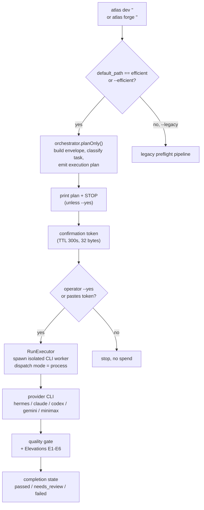

# Dev Cockpit and Forge

The Dev Cockpit (`atlas dev`) is the primary heavy-work surface in the CLI. With no task argument it opens an interactive cockpit showing the workspace, provider, permission, thread, git state, and loaded skills. With a task argument it runs the **Atlas Dev Efficient** pipeline: plan the work, print the plan and stop unless the operator confirms, then run it through a provider and gate the result. `atlas forge` is the same command with `--forge`, a maximum-power programming profile that opts into sandboxed execution, visual E2E, and quality scans.

The Dev Cockpit is where the "Atlas is the surface, models are engines" thesis becomes concrete. The operator gives a task; the Atlas runtime, not the operator's habit, picks the provider, model, effort, sandbox, and permission level. The provider can be Claude, Codex, Gemini, Hermes, or MiniMax, and Atlas can switch or fall back between them mid-run while the session, decisions, and traces stay intact.

## Purpose

Cover the Dev Cockpit entrypoint, the Efficient pipeline, the option surface, the Elevations E1-E6 quality gates, clipboard and visual image analysis, and the REPL.

## The Efficient pipeline

`config/atlas_dev.php` makes the Efficient path the canonical default (`atlas_dev.efficient.default_path = 'efficient'`). The pipeline is staged so the operator can ship it in layers: a master `enabled` flag, a `plan_enabled` surface, a `run_enabled` surface, and a `desktop_enabled` surface. `run_enabled` and `desktop_enabled` default OFF until provider invocation and desktop UX are explicitly opted in.

The CLI never re-implements business logic. `AtlasCliDevEfficientHandler` is a thin orchestrator that reuses the same core pipeline the HTTP `/plan` and `/run` endpoints drive. Its single responsibility is to keep the command readable while the surface boundary lives in `AtlasCliDevAdapter`.

The confirmation token is the safety hinge between plan and run. `ConfirmationTokenService` mints a 32-byte token with a 300-second TTL (`atlas_dev.confirmation_token.ttl_seconds`). Without `--yes` the CLI prints the plan and stops; the operator must confirm before any provider spend. The `run_dispatch_mode` defaults to `process`: `/run` accepts the operator-confirmed work, writes queued state, spawns an isolated CLI worker, and returns immediately so the caller stays responsive.

A mandatory RAG gate (`atlas_dev.mandatory_rag_gate`) is fail-closed for non-trivial engineering tasks: Atlas Dev must never execute work without sufficient context. Bypass is OFF by default and requires explicit auditable opt-in; every bypass is persisted in the gate receipt.

## The option surface

`app/Console/Commands/AtlasCliDevCommand.php` has one of the largest option surfaces in the codebase. The signature alone is the documentation for what a dev run can control. Grouped by concern:

| Concern | Options |
|---|---|
| Provider and model | `--ai`, `--provider`, `--model`, `--effort` (fast/balanced/deep/max) |
| Fair Claude benchmark | `--claude-only`, `--single-provider`, `--no-decide`, `--fallback-disabled` |
| Permission | `--permission` (auto/read/write/danger), `--allow-write`, `--operator`, `--allow-unsandboxed`, `--dangerously-allow-all` |
| Sandbox and harness | `--sandbox` (workspace/worktree/docker), `--provider-runtime`, `--test-command`, `--visual-e2e`, `--quality-scan`, `--harness-policy`, `--no-apply-isolated-patch` |
| Skills and brain | `--skill=*`, `--no-open-brain`, `--require-open-brain`, `--open-brain-refresh`, `--open-brain-budget` |
| Images | `--image=*`, `--clipboard-image`, `--no-auto-image` |
| Pipeline control | `--efficient`, `--legacy`, `--yes`, `--plan-only`, `--forge`, `--repair`, `--resume`, `--no-run` |
| Runtime | `--timeout`, `--no-stream`, `--no-progress`, `--no-notify`, `--json` |

`atlas forge` is `atlas dev --forge`. The `--forge` flag selects the `forge` programming profile, which is the max-power path that wires the harness sandbox, visual E2E, and quality scans. `--repair` marks the run as an explicit fix intent. `--claude-only` with `--single-provider` and `--fallback-disabled` is the fair-Claude benchmark mode that locks the run to Claude Opus and disables Atlas Decide, fallback, and the council.

## Elevations E1-E6

Elevations are Atlas Dev's tri-state quality gates. Each elevation has a `mode` that is `off`, `advisory`, or `hard`:

- **off** — byte-identical to pre-elevation (no-op).
- **advisory** — surfaces only via an honesty flag. The `CompletionStateGate` auto-downgrades `passed` to `needs_review`; it never produces `failed` for the flag alone.
- **hard** — blocks via a sanctioned channel (a `failed` gate or an `escalate` critic).

The safe default for landed code is `advisory`. Unknown, missing, or invalid values resolve to `advisory` without crashing, so a misconfigured flag can never silently disable an elevation nor accidentally hard-block the pipeline. An elevation is promoted from advisory to hard within its own milestone once its trip condition is validated; it never starts at hard. There is no third channel and no silent green: the `CompletionDecision` constructor forbids `status=passed` alongside an honesty flag.

| Elevation | Name | Default | What it checks |
|---|---|---|---|
| E1 | Intent Probe + Semantic Critic | advisory | Deterministic intent-falsification probe plus an optional adversarial LLM-as-judge sub-layer (doubt-additive only) |
| E2 | Definition of Done + Semantic Acceptance Criteria | advisory | The run actually satisfies the stated definition of done |
| E3 | Mutation Testing Gate | off | Reads the real infection-reported MSI (never a self-declared score); spawns infection, needs pcov; floor 60.0 MSI |
| E4 | Differential Testing / Shadow-Diff | advisory | Differential testing against a shadow path |
| E5 | Pre-Patch Regression Baseline + Caller-Test Selection | advisory | Establishes a regression baseline before the patch and selects caller tests |
| E6 | Spec-Driven Constitution Gate | advisory | The change conforms to the governing spec/constitution |

E3 defaults to `off` because, unlike E1 and E2 (pure PHP logic), it spawns a scoped infection subprocess that requires the pcov coverage driver. Deployments without pcov must keep E3 off or the gate fail-closes on every run.

## Clipboard and visual image analysis

The Dev Cockpit can take a screenshot or clipboard image as input. When the operator asks naturally ("analise essa tela", "corrija esse screenshot"), Atlas detects the visual reference and `AtlasImageAttachmentService` captures the macOS clipboard image (via `pngpaste` if available, otherwise `osascript` + `sips`), validates the MIME type and size (max 20 MB; PNG, JPEG, WebP, GIF), and attaches it.

The provider choice for images is governed by the AI Gateway, not the operator. `AiGatewayService::providerSupportsImageAttachments` returns true only for `codex_cli`, `gemini_cli`, and `hermes_cli`. Claude CLI does not receive pixels as native visual input in this runtime; it only gets attachment paths and instructions, so treating it as image-capable would make an upload look attached while Claude could only see metadata. When an image is attached and the selected provider does not support images, the gateway falls back to `codex_cli` first, then `gemini_cli` (`imageAttachmentFallbackProvider`).

The flags that control it:

- `--clipboard-image` — attach the current macOS clipboard image to the next prompt.
- `--no-auto-image` — do not auto-attach clipboard images when the prompt mentions screenshots or images.
- `--image=*` — attach explicit image file paths.
- `/paste-image` — the manual REPL fallback when auto-detection misses.

The doctor reports a `clipboard_visual_input` gate with the capture runtime status (whether `pngpaste` or `osascript` + `sips` are available and whether the current clipboard appears to hold an image).

## The REPL

`app/Services/Ai/Cli/Repl/` (9 files) is the interactive read-eval-print loop behind the chat and cockpit surfaces. `ReplComposer` handles input composition and key events; `KeySequenceParser` and `KeyCodes` decode terminal key sequences; `HistorySearch` provides reverse-incremental history search; `SlashCommandRegistry` registers the in-session slash commands (`/help`, `/model`, `/paste-image`, `/status`, `/handoff codex|claude`, `/exit`); `StatusBarFormatter` renders the status line; `ReplRenderer` and `ReplMessages` handle output. `AtlasReplHistory` persists history across sessions.

## Key abstractions

| Path | Role |
|---|---|
| `app/Console/Commands/AtlasCliDevCommand.php` | `atlas:cli:dev` entrypoint; the option surface and the efficient/legacy path switch |
| `app/Services/Ai/Cli/AtlasCliDevEfficientHandler.php` | Plan to token to run orchestration; reuses the HTTP pipeline |
| `app/Services/Ai/Cli/AtlasCliDevWorkflowService.php` | Legacy preflight dev workflow |
| `app/Services/Ai/Programming/AtlasDev/Pipeline/AtlasDevFastPathOrchestrator.php` | `planOnly()`, the core plan pipeline shared by CLI and HTTP |
| `app/Services/Ai/Programming/AtlasDev/Security/ConfirmationTokenService.php` | 32-byte confirmation token with TTL |
| `app/Http/Controllers/AtlasDev/Support/RunExecutor.php` | The run executor shared by CLI and HTTP `/run` |
| `app/Services/Ai/Cli/AtlasImageAttachmentService.php` | Clipboard capture, validation, and status |
| `app/Services/Ai/Cli/Repl/ReplComposer.php` | Interactive REPL input and key handling |
| `app/Services/Ai/Cli/AtlasCliModelCatalogService.php` | Model alias catalog |
| `config/atlas_dev.php` | Efficient flags, confirmation token, provider timeout, mandatory RAG gate, Elevations E1-E6 |

## How it works

The command resolves the workspace, decides efficient vs legacy from the config default and the `--efficient` / `--legacy` flags, and either calls `runEfficient()` or the legacy preflight. The efficient handler builds an operation envelope through `AtlasCliDevAdapter`, calls `orchestrator->planOnly()`, and emits the plan. If the operator passed `--yes` or supplies the confirmation token, it hands off to `RunExecutor` which spawns an isolated CLI worker in `process` dispatch mode and returns. The provider streams its output with a phase ribbon (`--no-progress` disables it). After the run, the quality gate and any active Elevations score the completion state.

## Integration points

- **AI Gateway** ([../ai-gateway/index.md](../ai-gateway/index.md)) — the dev run enqueues an interaction; image attachment provider fallback lives in `AiGatewayService`.
- **Open Brain** ([../open-brain/index.md](../open-brain/index.md)) — dev runs auto-inject brain context unless `--no-open-brain`; `--require-open-brain` fails if context cannot be injected.
- **Engineering** ([../engineering/index.md](../engineering/index.md)) — `--forge` wires the harness sandbox, visual E2E, and quality scans.
- **Operator mode and approval gate** ([operator-mode-and-approval.md](operator-mode-and-approval.md)) — `--operator` and `--permission` feed the approval gate.
- **Bootstrap, doctor and release** ([bootstrap-doctor-release.md](bootstrap-doctor-release.md)) — the doctor's `clipboard_visual_input` and `workspace_quality` gates apply to dev runs.
- **Command taxonomy** ([command-taxonomy.md](command-taxonomy.md)) — `dev` and `forge` map to `atlas:cli:dev`.

## Key source files

| File | What to read |
|---|---|
| `app/Console/Commands/AtlasCliDevCommand.php` | The `$signature` block (full option surface); `runEfficient()` |
| `app/Services/Ai/Cli/AtlasCliDevEfficientHandler.php` | `run()`, plan, token, run, and the outcome constants |
| `app/Services/Ai/Programming/AtlasDev/Pipeline/AtlasDevFastPathOrchestrator.php` | `planOnly()`, the shared core pipeline |
| `app/Services/Ai/Cli/AtlasImageAttachmentService.php` | `clipboardStatus()`, `captureClipboardWithPngpaste()`, `captureClipboardWithOsascript()` |
| `app/Services/Ai/AiGatewayService.php` | `providerSupportsImageAttachments()`, `imageAttachmentFallbackProvider()` |
| `config/atlas_dev.php` | `efficient`, `confirmation_token`, `mandatory_rag_gate`, `elevations` blocks |
| `app/Services/Ai/Cli/Repl/ReplComposer.php` | REPL input composition |
| `docs/paste-image-setup.md` | Clipboard image and `/paste-image` setup |
