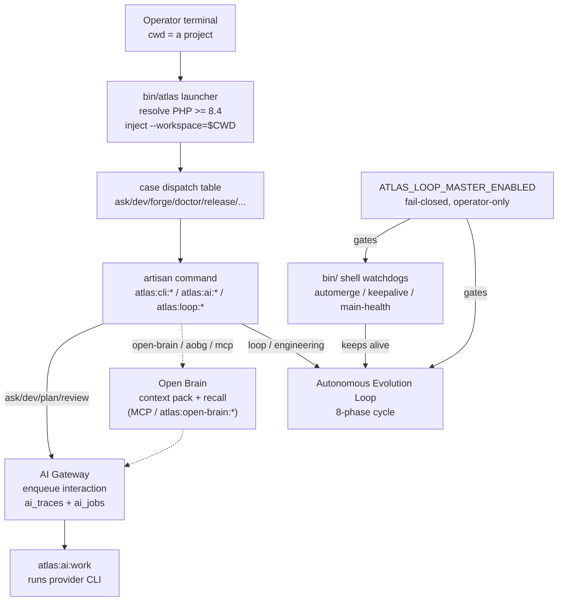

# CLI and operator surface

Atlas Server is a Laravel app, but the product the operator touches is a local terminal tool: the `atlas` CLI. Its thesis, stated in `docs/atlas-cli-final-product.md`, is to replace direct use of Claude Code, Codex CLI, and loose chats with one persistent, governed terminal surface. The principle is short: **Atlas is the surface; Claude, Codex, Gemini, and any future model are interchangeable engines.** The CLI preserves context, decisions, memory, permissions, traces, and quality even when the underlying provider changes.

The surface is a thin bash launcher (`bin/atlas`) that resolves a Homebrew PHP binary, injects the caller's current directory as a workspace argument, and `exec`s into one of 1,227 Laravel artisan commands. Around the launcher sit a Dev Cockpit (`atlas dev` / `atlas forge`), a bootstrap-to-release readiness pipeline (`atlas bootstrap` / `doctor` / `final` / `release`), an operator approval gate with Ed25519-signed decision receipts, a learned operator profile, a mobile review inbox, and a family of shell watchdogs that keep the autonomous Loop alive 24/7 without a human supervising.

## How the launcher maps to the AI Gateway and the Loop

The CLI is the human-facing front end on top of the AI Gateway. Every `atlas ask`, `atlas dev`, or `atlas plan` ultimately routes through `atlas:ai:chat` or the programming orchestrator, which enqueue an interaction into the gateway (`ai_traces` + `ai_jobs`) and let a local worker run the provider CLI. The watchdogs in `bin/` are the operator's hands-off way of keeping the autonomous Loop alive: they drain certified proposals to main, respawn dead campaigns, and revert green-in-isolation-but-red-in-combination commits, all gated by a fail-closed master switch.

## Purpose

This page is the anchor for the CLI operator surface. It covers the launcher mechanics and the CLI runtime services, then links to sub-pages for the Dev Cockpit, the bootstrap-doctor-release pipeline, operator mode and the approval gate, the watchdogs and master switch, and the command taxonomy.

## The launcher

`bin/atlas` is a `set -euo pipefail` bash script. It does four things in order:

1. **Resolve the repo root.** It follows symlinks (`BASH_SOURCE[0]`) up to the real script file, then takes the parent directory. This is worktree-safe: running the launcher from a git worktree operates that worktree, never a hardcoded main checkout.
2. **Resolve PHP.** It looks for a Homebrew PHP binary that satisfies `ATLAS_MIN_PHP_VERSION` (default `8.4.0`). The candidate list is `/opt/homebrew/bin/php`, Homebrew formula paths, `/usr/local/bin/php`, and finally a bare `php`. `ATLAS_PHP_BIN` overrides the whole list. If nothing satisfies the minimum it prints a clear install hint and exits non-zero.
3. **Inject the workspace.** It captures `CALLER_PWD="${PWD}"` before `cd "$ROOT"`, then appends `--workspace="$CALLER_PWD"` to every artisan invocation unless the caller already passed one (`has_workspace_arg`).
4. **Dispatch.** A `case "$cmd"` table maps short verbs to artisan commands and calls one of three exec helpers: `exec_artisan_with_workspace` (plain), `exec_chat_with_workspace` (chat threads), or `exec_chat_prompt_with_workspace` (joins free-form prompt words into one string and forwards curated flags).

The dispatch table is the single place where a human verb becomes an artisan command. A few highlights:

| CLI verb | Artisan command | Notes |
|---|---|---|
| `chat` (default) | `atlas:ai:chat` | Long conversational session |
| `ask` | `atlas:ai:chat --stream --no-skill-prompt` | One-shot answer; prompt words joined |
| `plan` / `review` / `debug` / `research` / `project` | `atlas:ai:chat --mode=… --stream` | Same path, different mode |
| `dev` | `atlas:cli:dev` | Dev Cockpit; `forge` adds `--forge` |
| `bootstrap` / `doctor` / `final` / `dogfood` / `release` | `atlas:cli:*` | Readiness pipeline |
| `state` / `steer` / `compact` / `handoff` | `atlas:cli:state …` | Long-session control |
| `memory` / `open-brain` / `aobg` / `mcp` | `atlas:memory:*` / `atlas:open-brain:*` / `atlas:aobg:*` | Brain and memory |
| `worker` / `health` | `atlas:ai:work` / `atlas:ai:health` | Gateway worker |
| `*` (unknown) | `atlas:ai:chat "<joined>" --stream` | Fallback: treat as a chat prompt |

## CLI runtime services

The runtime services under `app/Services/Ai/Cli/` (26 entries) hold the state and behavior the commands delegate to. The commands themselves are thin; the services do the work.

| Path | Role |
|---|---|
| `app/Services/Ai/Cli/AtlasCliSessionService.php` | Long-session state: objective, phase, decisions, next steps, artifacts, provider handoff |
| `app/Services/Ai/Cli/AtlasCliDevEfficientHandler.php` | Canonical Atlas Dev Efficient pipeline (plan to confirmation token to run); reuses the same core pipeline as the HTTP `/plan` and `/run` endpoints |
| `app/Services/Ai/Cli/AtlasCliDevWorkflowService.php` | Legacy preflight dev workflow orchestration for `atlas dev` |
| `app/Services/Ai/Cli/AtlasCliDoctorService.php` | Readiness diagnosis engine: providers, council, permissions, skills, scheduler, projection, clipboard, quality |
| `app/Services/Ai/Cli/AtlasCliDogfoodService.php` | Real-usage evidence ledger; required scenarios; smoke profile; 3-day real-usage gate |
| `app/Services/Ai/Cli/AtlasCliSetupService.php` | Provider-binary diagnosis and `.env` writer; operator-mode trusted-root resolution |
| `app/Services/Ai/Cli/AtlasCliInstallService.php` | Launcher symlink install and shell-profile writing |
| `app/Services/Ai/Cli/AtlasCliProviderStrategyService.php` | Provider recommendation and strategy for `dev` |
| `app/Services/Ai/Cli/AtlasCliModelCatalogService.php` | Model alias catalog (sonnet, opus, codex-premium, gpt-5.5, ...) |
| `app/Services/Ai/Cli/AtlasCliQualityService.php` | Quality gate (`atlas quality`): test run and completion packet |
| `app/Services/Ai/Cli/AtlasImageAttachmentService.php` | Clipboard and screenshot image capture; visual analysis input |
| `app/Services/Ai/Cli/IntentPermissionResolver.php` | Natural-language intent to permission level (auto / read / write / danger) |
| `app/Services/Ai/Cli/Repl/ReplComposer.php` | Interactive REPL input composition and key handling |
| `app/Services/Ai/Cli/AtlasCliPanel.php`, `AtlasTerminalTheme.php` | Terminal UI primitives (phase ribbon, themed panels) |

## Key abstractions

| Path | Role |
|---|---|
| `bin/atlas` | Thin bash launcher: resolves PHP >= 8.4, injects `--workspace=$CWD`, dispatches verbs to artisan |
| `app/Console/Commands/AtlasCliDevCommand.php` | `atlas:cli:dev`, the Dev Cockpit / `atlas dev` / `atlas forge` entrypoint (large option surface) |
| `app/Console/Commands/AtlasCliBootstrapCommand.php` | `atlas:cli:bootstrap`, install and configure flow |
| `app/Console/Commands/AtlasCliDoctorCommand.php` | `atlas:cli:doctor`, readiness gate command |
| `app/Services/Ai/OperatorApproval/OperatorApprovalGateService.php` | Operator Approval Gate: allow_auto vs confirm / review / block / escalate |
| `app/Services/Ai/Surface/SurfaceAdapterRegistry.php` | Routes one runtime to many product surfaces (CLI, code, worker, API, voice, app, vault, MCP) |
| `bin/atlas-loop-watchdog.sh` | 24/7 self-heal watchdog for a Loop soak |
| `config/atlas_dev.php` | Atlas Dev flags and Elevations E1-E6 (tri-state quality gates) |

## How it works

The launcher never carries business logic. Each verb is a one-line `exec` into an artisan command, and the artisan command delegates to a service. This keeps the bash surface auditable and lets the PHP side own all gating, redaction, and persistence.

The workspace injection is the mechanism that makes the CLI work from any directory. Because `bin/atlas` always passes `--workspace=$CALLER_PWD`, an artisan command knows which project the operator is standing in without the operator naming it. The doctor permission gate then asserts that the resolved workspace is inside an allowed root (`ATLAS_AI_TOOL_ALLOWED_ROOTS`), and the Open Brain auto-scopes its context pack to that workspace.

The CLI is one surface adapter among many. `app/Services/Ai/Surface/SurfaceAdapterRegistry.php` registers ten adapters (CLI dev, CLI chat, CLI forge, Atlas Code, API interaction, app, desktop AI, worker, MCP read-only, vault, voice realtime) that all drive the same runtime. A CLI run and an HTTP run can hit the identical pipeline because the surface boundary lives in `AtlasCliDevAdapter`, not in the command.

## Integration points

- **AI Gateway** ([../ai-gateway/index.md](../ai-gateway/index.md)) — `atlas ask` / `atlas dev` enqueue interactions into the gateway; the CLI is the local human surface on top of it.
- **Open Brain** ([../open-brain/index.md](../open-brain/index.md)) — `atlas open-brain context`, `atlas mcp`, and `atlas aobg` plug any external AI into the local brain via MCP; dev runs auto-inject brain context.
- **Evolution Loop** ([../evolution-loop/campaigns-and-runtime.md](../evolution-loop/campaigns-and-runtime.md)) — the watchdogs keep the loop alive; the CLI and watchdogs share the operator-only master switch.
- **Self-Construction Government** ([../self-construction-government/agent-governance-fleet.md](../self-construction-government/agent-governance-fleet.md)) — the fleet control plane authorizes which agents may run; the operator approval gate is the human side of that authorization.
- **Earned autonomy** ([../../concepts/earned-autonomy.md](../../concepts/earned-autonomy.md)) — the fail-closed master switches documented here are the canonical example.
- **Getting started** ([../../overview/getting-started.md](../../overview/getting-started.md)) — install and bootstrap instructions.

## Pages in this set

- [Dev Cockpit and Forge](dev-cockpit-and-forge.md) — `atlas dev` / `atlas forge`, the Efficient pipeline, the option surface, Elevations E1-E6, clipboard image analysis, the REPL
- [Bootstrap, doctor and release](bootstrap-doctor-release.md) — install and configure flow, doctor gates, final B0-B8 readiness, dogfood, release gate and tagging
- [Operator mode and approval gate](operator-mode-and-approval.md) — operator-root authorization, the approval gate, decision receipts, Operator Intelligence, mobile review
- [Watchdogs and master switch](watchdogs-and-master-switch.md) — the shell supervision stack, the fail-closed master switch, the Mac agent
- [Command taxonomy](command-taxonomy.md) — the 1,227 artisan commands organized by prefix, and how CLI verbs map to them

## Key source files

| File | What to read |
|---|---|
| `bin/atlas` | The full dispatch table and the three `exec_*_with_workspace` helpers |
| `app/Console/Commands/AtlasCliDevCommand.php` | The `$signature` block (the option surface) and the efficient/legacy path switch |
| `app/Services/Ai/Cli/AtlasCliDevEfficientHandler.php` | `run()`, plan, confirmation token, run orchestration |
| `app/Services/Ai/Cli/AtlasCliDoctorService.php` | `diagnose()` and `payload()`, the gate list and readiness scoring |
| `app/Services/Ai/Cli/AtlasCliSetupService.php` | `diagnose()` and `writeEnv()`, provider resolution and operator-root writing |
| `app/Services/Ai/Surface/SurfaceAdapterRegistry.php` | `ADAPTER_CLASSES` and `SURFACE_ALIASES`, the surface registry |
| `config/atlas_dev.php` | The `efficient`, `elevations`, and `mandatory_rag_gate` blocks |
| `docs/atlas-cli-final-product.md` | The canonical CLI product reference (install, daily use, readiness, release) |
