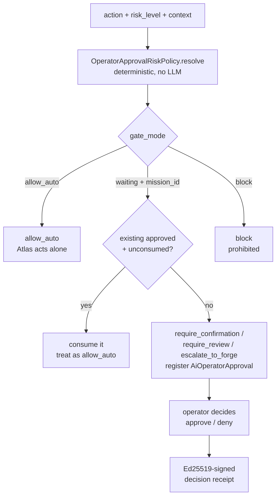

# Operator mode and approval gate

Operator mode is the governed way the CLI gets real local control: the authority to read, write, and run tools across everything under the operator's home directory. It is enabled once at bootstrap (`--operator-mode --operator-root=<home>`) and per-run via `atlas dev --operator`. It is bounded by two layers: a **permission scope** that asserts the workspace is inside an allowed root, and an **Operator Approval Gate** that decides, for each consequential action, whether Atlas may act alone or must stop and ask.

The approval gate is the human side of the autonomy doctrine. It is deterministic, not LLM-driven: given an action prefix and a risk level, `OperatorApprovalRiskPolicy` returns a gate mode. Risky decisions get an Ed25519-signed **decision receipt** that proves who approved what and when. A learned **Operator Intelligence** profile feeds the gate over time, and a **mobile review inbox** lets the operator approve from a phone.

## Purpose

Cover operator-root authorization, the permission scope, the Operator Approval Gate (modes, risk levels, action prefixes), Ed25519-signed decision receipts, code verification, Operator Intelligence, and the mobile review inbox.

## Operator-root authorization

Operator mode is configured at bootstrap. `AtlasCliSetupService::writeEnv` merges the `--operator-root` value into `ATLAS_AI_TOOL_ALLOWED_ROOTS` through `mergedAllowedRoots`, and when `--operator-mode` is set it also writes:

- `ATLAS_AI_TOOL_PERMISSION_MODE=danger`
- `ATLAS_AI_TOOL_ALLOW_DANGER=true`
- `ATLAS_AI_ALLOW_UNSANDBOXED_WRITE=true`

The doctor permission gate (`AtlasCliDoctorService::permissionGate`) reads `config('atlas.ai.tool_permissions.allowed_roots')`, resolves the workspace with `realpath`, and checks it is equal to or nested under an allowed root. If it is not, the gate fails with "Workspace fora de ATLAS_AI_TOOL_ALLOWED_ROOTS". A single run can opt into full local operator mode with `atlas dev --operator` without re-running bootstrap.

The authorization is scope-bounded by construction. The operator root is a directory, not a blanket "do anything" flag. Atlas can only act inside the roots the operator explicitly trusted, and every workspace it touches is checked against that list at doctor time and at runtime.

## The Operator Approval Gate

`OperatorApprovalGateService` sits above mission, follow-through, and hyperflow as a governance layer. It decides whether Atlas may continue or must stop. `OperatorApprovalCanon` is the single source of truth for the gate's enums.

### Gate modes

| Mode | Meaning |
|---|---|
| `allow_auto` | Atlas may act without operator interaction |
| `require_confirmation` | Operator must confirm (yes/no) |
| `require_review` | Operator must review with more context |
| `block` | Action is prohibited even with approval |
| `escalate_to_forge` | Hand off to Atlas Forge |

`PASSTHROUGH_MODES` is `[allow_auto]`. `WAITING_MODES` are `require_confirmation`, `require_review`, and `escalate_to_forge`. `BLOCKING_MODES` is `[block]`.

### Risk levels

`low`, `medium`, `high`, `critical`. A `critical` risk overrides the category: even a normally permissive category is elevated to `block` or stronger when the requested risk is critical.

### Action prefixes

| Action prefix | Example |
|---|---|
| `mission.handoff_dev` | Hand a mission to the dev runtime |
| `mission.handoff_forge` | Hand a mission to Forge (always escalates) |
| `mission.simulated_dispatch` | Simulated mission dispatch |
| `mission.certify` | Certify a mission (review without evidence, auto with evidence) |
| `tool.destructive` | Destructive tool command |
| `tool.file_edit_mass` | Mass file edits |
| `finance.trade` | A finance trade |
| `finance.transfer` | A finance transfer |
| `cyber.active_scan` | Active cyber scan |
| `cyber.exploit` | Cyber exploit |
| `forge.obra` | A large Forge obra |
| `explain` / `research` / `conversation` | Safe read-only actions |

### How the policy resolves

`OperatorApprovalRiskPolicy::resolve` is deterministic. It takes `(requested_action, risk_level, context)` and returns `(gate_mode, risk_level_final, reasons)`. There is no LLM and no provider call. The canonical rules:

| Category | Default mode |
|---|---|
| Destructive command | `block` if critical, else `require_confirmation` |
| Mass file edits | `require_review` |
| Finance trade/transfer/publish | `require_review` (escalates to `block` if critical or autonomy=suggest) |
| Cyber active/exploit | `require_review` / `block` by severity |
| Forge/obra (large) | `escalate_to_forge` |
| `mission.handoff_dev` | `allow_auto` (low risk) |
| `mission.handoff_forge` | `escalate_to_forge` (always) |
| `mission.certify` | `require_review` without evidence, `allow_auto` with evidence |
| `explain` / `research` / `conversation` | `allow_auto` |
| No category match | `require_confirmation` (fail-safe) |

The gate is idempotent and reusable. `evaluate()` always registers an `AiOperatorApproval` row when approval is required, always produces a deterministic `hash` over the canonical fields, and always produces a `receipt_hash` when a decision is recorded. If a recent `approved` and unconsumed approval already matches the mission and action, it is consumed and treated as `allow_auto` (so the operator does not re-approve the same thing twice). A decision already made cannot be decided again, and execution cannot resume without an `approved` status.

## Decision receipts

A decision receipt is an Ed25519-signed record of a human or operator decision. The keypair is a 128-byte libsodium sign keypair, base64-encoded, configured by `config/atlas_code_signing.php` (`ATLAS_DECISION_SIGNING_KEYPAIR_BASE64`). When the keypair is absent, the signer reports `signing_status: 'unavailable'` honestly. Atlas never silently signs with a synthetic keypair.

The audit log is an append-only JSONL file at `storage/app/atlas-code/decision-receipts.jsonl` by default. The `signer_id` defaults to `atlas-code-operator`. Receipts prove what was decided; they never override canonical specs.

## Code verification

`config/atlas_code_verification.php` governs which verification commands Atlas may run on behalf of the operator after an observed session has imported its result. The runner is defense-in-depth:

- A regex allowlist (`allowed_command_patterns`) permits only known test/lint/build/typecheck commands (pnpm, npm, yarn, composer, php artisan test, cargo, go test, pytest).
- The default mode is `dry_run` — no execution.
- The execute path requires `ATLAS_VERIFICATION_EXECUTE_ENABLED=true` plus an operator override token (`ATLAS_VERIFICATION_OPERATOR_TOKEN`) and a signed Ed25519 receipt.
- Each run has a per-command timeout (`ATLAS_VERIFICATION_TIMEOUT_SECONDS`, default 600).

Args are array-passed, never shell-joined, so the patterns are for human review and audit only. Tightening or loosening is a config change, not a code change.

## Operator Intelligence

`app/Services/Ai/OperatorIntelligence/` (20 files) learns the operator over time and feeds the gate. The pipeline:

| Path | Role |
|---|---|
| `OperatorComprehensionExtractor.php` | Extracts comprehension signals from operator interactions |
| `OperatorLearningClassifier.php` | Classifies learning candidates |
| `OperatorLearningCandidate.php` | A candidate learned behavior or preference |
| `OperatorLearningGate.php` | Gates which candidates may be promoted |
| `OperatorPatternDetector.php` | Detects repeated operator patterns |
| `OperatorProfileRegistry.php` | Promotes candidates to active `OperatorProfileItem` rows |
| `OperatorProfilePolicyCompiler.php` | Compiles a profile item into a policy |
| `OperatorProfileProjection.php` | Projects the profile for surfaces |
| `OperatorProfileDigest.php` | Digests the profile for review |
| `SkillScaffoldGenerator.php` | Scaffolds a skill from a learned pattern |
| `AtlasProjectStackLearner.php` | Learns a project's stack |

`OperatorProfileRegistry::promoteCandidate` takes a learning candidate, derives a profile key, and upserts an `OperatorProfileItem` with a confidence, validity window, privacy class, and automation level. Each item is compiled into a policy by `OperatorProfilePolicyCompiler`. A candidate may mirror to a memory delta. The profile is the learned half of the gate: over time the operator's repeated choices shape what the gate treats as safe to auto-approve.

## Mobile operator review

`app/Services/Ai/Mobile/` (22 files) is the operator's review inbox on a phone. `AtlasInboxService` creates `AiInboxItem` rows typed by kind (proposal, insight, job result, alert), with severity, status, dedupe keys, and available actions. Emitters (`InboxEmitter` variants for proposal, insight, job-result) push items; `MobilePushService` delivers them; `MobilePairingService` pairs a device; `MobileGatewayRateLimiter` bounds the rate. A `ProactiveLayerReadModel` and `SelfDiagnosticEmitter` add proactive and self-diagnostic items. A `MobileFeatureContractGate` governs which mobile features are enabled.

The mobile inbox is the remote-control surface for the approval gate's `require_confirmation` and `require_review` modes: the operator can approve or deny from the phone instead of at the terminal.

## The Mac agent

`app/Services/Ai/RuntimeBoundary/Contracts/MacAgentNativeContract.php` is the PHP-side contract for the native Swift Mac agent. It is a `FutureRuntimeInvocationContract` for block `mac_agent_native` and runtime `swift_native_mac`. The contract validates that the `capability` is one of `power_helper`, `wake_detection`, `background_check`, `voice_edge`, `apple_context`, and that `governed_by_decision_receipt` is true. The rule is: the Laravel kernel decides, the Swift edge executes, and every invocation must be governed by a decision receipt. The Mac agent must not be the first voice surface (mobile-first is canon). The native install lives in `scripts/install-mac-agent-launch-agent.sh` (LaunchAgent `com.atlas.mac-agent`) and `scripts/install-power-helper-launch-daemon.sh` (root LaunchDaemon `com.atlas.power-helper`), documented in `docs/atlas-mac-agent.md`.

## Key abstractions

| Path | Role |
|---|---|
| `app/Services/Ai/OperatorApproval/OperatorApprovalGateService.php` | Evaluate a request; persist approvals; consume reusable approvals |
| `app/Services/Ai/OperatorApproval/OperatorApprovalCanon.php` | Canonical enums: modes, risk, statuses, action prefixes |
| `app/Services/Ai/OperatorApproval/OperatorApprovalRiskPolicy.php` | Deterministic action+risk to gate-mode resolver |
| `app/Services/Ai/OperatorApproval/OperatorApprovalDecision.php` | The decision DTO returned by `evaluate()` |
| `app/Services/Ai/OperatorIntelligence/OperatorProfileRegistry.php` | Promotes learned candidates to active profile items |
| `app/Services/Ai/Mobile/AtlasInboxService.php` | Mobile review inbox create/dedupe/actions |
| `app/Services/Ai/RuntimeBoundary/Contracts/MacAgentNativeContract.php` | Native Swift Mac agent contract |
| `app/Services/Ai/Cli/AtlasCliSetupService.php` | Operator-root merge into `ATLAS_AI_TOOL_ALLOWED_ROOTS` |
| `app/Services/Ai/Cli/AtlasCliDoctorService.php` | The `permission_scope` gate |
| `config/atlas_code_signing.php` | Ed25519 keypair for decision receipts |
| `config/atlas_code_verification.php` | Verification command allowlist and execute governance |

## How it works

Authorization is established once at bootstrap and checked at doctor and runtime. The approval gate is invoked for every consequential action: the caller passes `requested_action`, `risk_level`, and `context` to `evaluate()`. The risk policy resolves a gate mode deterministically. If the mode is a waiting mode and a matching approved approval already exists, it is consumed. Otherwise an `AiOperatorApproval` row is registered and the operator is prompted, at the terminal or on the mobile inbox. When the operator decides, the decision is hashed and, if a signing keypair is configured, an Ed25519 receipt is produced. Verification commands after an observed session are gated by a separate allowlist and require their own signed receipt plus operator token.

## Integration points

- **CLI and operator surface** ([index.md](index.md)) — `--operator` and `--permission` on `atlas dev` feed the gate.
- **Bootstrap, doctor and release** ([bootstrap-doctor-release.md](bootstrap-doctor-release.md)) — `--operator-mode` and `--operator-root` are configured at bootstrap; the doctor enforces the permission scope.
- **Self-Construction Government** ([../self-construction-government/agent-governance-fleet.md](../self-construction-government/agent-governance-fleet.md)) — the fleet control plane is the agent side of authorization; the approval gate is the human side.
- **Earned autonomy** ([../../concepts/earned-autonomy.md](../../concepts/earned-autonomy.md)) — the gate is how autonomy is bounded and earned.
- **Evolution Loop** ([../evolution-loop/campaigns-and-runtime.md](../evolution-loop/campaigns-and-runtime.md)) — loop actions that cross risk thresholds pass through the gate.

## Key source files

| File | What to read |
|---|---|
| `app/Services/Ai/OperatorApproval/OperatorApprovalCanon.php` | `MODES`, `RISK_LEVELS`, `STATUSES`, action prefix constants |
| `app/Services/Ai/OperatorApproval/OperatorApprovalRiskPolicy.php` | `resolve()` and `byCategory()`, the deterministic rule table |
| `app/Services/Ai/OperatorApproval/OperatorApprovalGateService.php` | `evaluate()`, approval reuse, persistence, hashing |
| `app/Services/Ai/OperatorIntelligence/OperatorProfileRegistry.php` | `promoteCandidate()`, profile upsert and policy compilation |
| `app/Services/Ai/Mobile/AtlasInboxService.php` | `create()`, inbox item creation, dedupe, actions |
| `app/Services/Ai/RuntimeBoundary/Contracts/MacAgentNativeContract.php` | `blockValidation()`, capability and receipt governance |
| `config/atlas_code_signing.php` | Keypair, signer id, audit log path |
| `config/atlas_code_verification.php` | Execute kill switch, allowlist, timeout, operator token |
