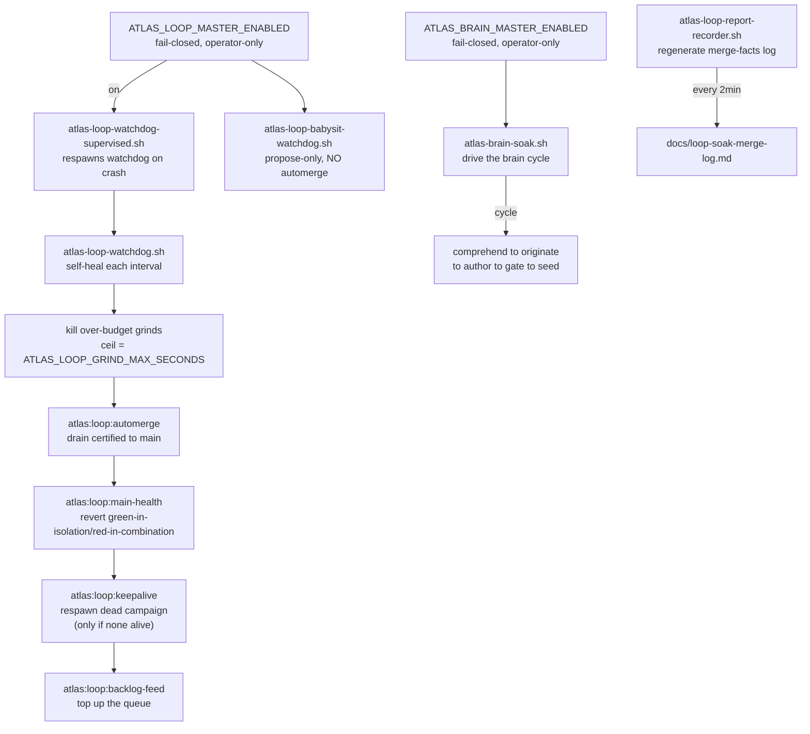

# Watchdogs and master switch

The autonomous Loop runs 24/7, but no human and no external agent watches it. A family of shell scripts in `bin/` keeps it alive instead. They are deliberately OS-less: no launchd daemon, no root, nothing left resident that a crash could wedge. They self-heal a long "soak" (hours or days) by killing over-budget grinds, draining certified proposals to main, respawning dead campaigns, and reverting green-in-isolation-but-red-in-combination commits.

Every one of these scripts is gated by a **fail-closed master switch** (`ATLAS_LOOP_MASTER_ENABLED`). The switch is operator-only and pétreo (stone, immutable) in the constitution: the loop can never re-enable itself. Absent, unreadable, or not-truthy means the loop is globally off, and the scripts respawn nothing and exit.

## Purpose

Cover the shell supervision stack (watchdog, supervised, babysit, brain-soak, report-recorder), the fail-closed master switch, how it keeps the Loop alive without a human, and the native Mac agent for power and wake management.

## The supervision stack

### The watchdog

`bin/atlas-loop-watchdog.sh` is the controlled self-heal watchdog for a loop soak. It is loop-only: it does not fire finance, worker, or mission GLM callers, so the only model spend is the campaign's own grinds. It self-locates its repo root from `BASH_SOURCE[0]` (two levels up), so it is worktree-safe and never hardcodes a checkout path. Each interval (default 60s, `ATLAS_LOOP_WATCHDOG_INTERVAL`):

1. **Master switch.** Read `ATLAS_LOOP_MASTER_ENABLED` directly from `.env` (never through config, so it mirrors `AtlasLoopMasterSwitch::enabled()` exactly). If off, exit and respawn nothing. A `WATCHDOG_STOP` file also breaks the loop.
2. **Kill over-budget grinds.** Any `atlas:loop:run-scenario` or `hermes chat --quiet` process older than the ceiling (`ATLAS_LOOP_GRIND_MAX_SECONDS`, default 1800) is killed. The configured attempt-hard-seconds is not enforced on the hermes_cli path (it bounds by max-turns, not wall-clock), so one hard target could otherwise run far past budget.
3. **Automerge.** `atlas:loop:automerge --limit=10` drains certified and re-proven proposals to main. Deterministic, scoped add (never `-A`), with a per-merge canary.
4. **Post-merge health net.** `atlas:loop:main-health --window=10` re-runs the impacted suite over the window's freshly landed commits against post-merge main and **git-reverts** (never reset) a commit that is green in isolation but red in combination. This is external by design: a process must not health-check-then-revert inside its own edit surface. It holds the single main-merge lock so it never reverts mid-crossing.
5. **Keepalive.** Respawn a dead campaign, but only if no `artisan atlas:loop:campaign` process is actually alive. The guard prevents the observed duplicate: a long grind made the heartbeat look stale, and the keepalive raced into spawning a second campaign for the same id (double grinds, double spend).
6. **Backlog feed.** `atlas:loop:backlog-feed` tops up the queue from real signals (no model spend).

### The supervisor

`bin/atlas-loop-watchdog-supervised.sh` respawns the watchdog when it dies unexpectedly. The watchdog is a single process; if it is OOM-killed or crashes mid-soak, hung grinds are never reaped again and the machine thrashes silently. The supervisor is the OS-less complement to a launchd KeepAlive: no system install, no root, nothing resident. After the watchdog returns, it re-reads the master switch to discriminate an intended stop (master now off, watchdog exited clean) from a crash (master still on, watchdog died), and respawns with a backoff (default 5s) only in the crash case. It honors its own `WATCHDOG_SUPERVISOR_STOP` file.

### The babysit watchdog

`bin/atlas-loop-babysit-watchdog.sh` is the propose-only variant. It deliberately does **not** call `atlas:loop:automerge`, so a babysit soak stays propose-only. Each interval it runs:

- `atlas:loop:hung-supervisor-guard` — kill a hung-but-heartbeating supervisor (heartbeat is not trustworthy because backlog-feed touches it; this uses completed-work progress, 20min frozen-with-work means wedged).
- `atlas:loop:keepalive` — respawn only when no campaign process is alive.
- `atlas:loop:reclaim-orphaned-grinds` — free tasks held by a dead grind worker in seconds, not the 90-minute lease, so a crashed or OOM'd worker never holds a slot hostage (fail-closed if `pgrep` is absent).
- `atlas:loop:backlog-feed` — top up the queue (never merges).

### The brain soak

`bin/atlas-brain-soak.sh` drives the external brain cycle after cycle for a deadline (default 4 hours). A single pasted model session cannot run for hours; it ends its turn. The loop must live in code, not in the model. This driver is that loop: each iteration invokes the provider CLI to run one brain cycle (comprehend to originate to author to gate to seed), then repeats until the deadline, a `SOAK_STOP` file, or the brain master switch going off. It is gated by `ATLAS_BRAIN_MASTER_ENABLED` (a separate fail-closed, operator-only switch). A per-cycle timeout (`BRAIN_MAX_CYCLE_SECONDS`, default 600) keeps one hang from eating the run. `mode=real` invokes the provider and seeds real tasks; `mode=dry` proves the loop only with no spend.

### The report recorder

`bin/atlas-loop-report-recorder.sh` regenerates `docs/loop-soak-merge-log.md` from git history every 2 minutes, so nothing is ever missed between supervision checks. It walks the commit log from a base commit, finds every `atlas loop auto-merge` commit, and writes a table of commit, target, line delta, and file count. The qualitative assessment lives in a separate hand-graded evaluation report; this is the complete, always-current facts log. It stops on a `REPORT_STOP` file.

## The fail-closed master switch

`ATLAS_LOOP_MASTER_ENABLED` is the single switch that arms or disarms the loop. It is read directly from `.env` by every watchdog and by `AtlasLoopMasterSwitch::enabled()` in PHP. The reading is deliberately primitive: a `grep` for the line, a `cut`, a `tr`, and a `case` over `1|true|on|yes|enabled`. Absent, unreadable, or any other value means off.

The switch is the canonical example of earned autonomy and fail-closed design:

- It defaults **off**. The loop does not run 24/7 by ambition.
- It is **operator-only**. The loop can never re-enable itself; the flag is pétreo in the constitution.
- It is **fail-closed**. If the `.env` is missing, malformed, or unreadable, the loop is off.
- It is **mirrored exactly** between bash and PHP, so the shell and the app agree on whether the loop is armed.

`ATLAS_BRAIN_MASTER_ENABLED` is the parallel switch for the brain soak. The same rules apply. The fleet has its own (`ATLAS_FLEET_ENABLED`).

## The Mac agent

The native Mac agent handles power and wake so a soak can survive sleep and run unattended. It has two halves:

- A **LaunchAgent** (`com.atlas.mac-agent`, installed by `scripts/install-mac-agent-launch-agent.sh`) for the user-level agent.
- A root **LaunchDaemon** (`com.atlas.power-helper`, installed by `scripts/install-power-helper-launch-daemon.sh`) for the privileged power helper.

The PHP-side contract is `app/Services/Ai/RuntimeBoundary/Contracts/MacAgentNativeContract.php`. The rule is: the Laravel kernel decides, the Swift edge executes, and every invocation must be governed by a decision receipt. The capabilities are `power_helper` (caffeinate, prevent sleep), `wake_detection` (detect wake from sleep), `background_check` (verify the agent is alive in the background), `voice_edge` (native voice), and `apple_context` (Apple ecosystem context). The agent must not be the first voice surface (mobile-first is canon). The runbook is `docs/atlas-mac-agent.md`: `atlas:host status/bootstrap`, `caffeinate`, `pmset wakeorpoweron` for scheduled wake.

## Key abstractions

| Path | Role |
|---|---|
| `bin/atlas-loop-watchdog.sh` | Controlled self-heal watchdog (kill over-budget, automerge, main-health, keepalive, backlog-feed) |
| `bin/atlas-loop-watchdog-supervised.sh` | Supervisor that respawns the watchdog on crash while master is on |
| `bin/atlas-loop-babysit-watchdog.sh` | Propose-only 24h self-heal (no automerge) |
| `bin/atlas-brain-soak.sh` | Drives the external brain cycle per provider invocation until deadline |
| `bin/atlas-loop-report-recorder.sh` | Regenerates the merge-facts log from git history every 2 min |
| `app/Services/Ai/RuntimeBoundary/Contracts/MacAgentNativeContract.php` | Native Swift Mac agent contract |
| `scripts/install-mac-agent-launch-agent.sh` | Installs the user LaunchAgent |
| `scripts/install-power-helper-launch-daemon.sh` | Installs the root power-helper LaunchDaemon |

## How it works

A soak starts with the operator arming the master switch and launching the supervisor for a campaign id. The supervisor starts the watchdog. The watchdog loops: check the switch, reap over-budget grinds, automerge, run the post-merge health net, respawn a dead campaign if none is alive, feed the backlog, sleep. If the watchdog crashes, the supervisor reads the switch again and respawns it only if the loop is still armed. The brain soak runs independently under its own switch. The report recorder runs alongside both, keeping the merge-facts log current. To stop, the operator flips the master switch off (`atlas:loop:off`) or touches the appropriate STOP file; the scripts exit and respawn nothing.

## Integration points

- **Evolution Loop** ([../evolution-loop/campaigns-and-runtime.md](../evolution-loop/campaigns-and-runtime.md)) — the watchdogs keep the loop's campaigns, automerge, and main-health alive.
- **Self-Construction Government** ([../self-construction-government/agent-governance-fleet.md](../self-construction-government/agent-governance-fleet.md)) — the master switch is the operator's kill switch over the entire autonomous stack.
- **Earned autonomy** ([../../concepts/earned-autonomy.md](../../concepts/earned-autonomy.md)) — the fail-closed, operator-only, default-off master switch is the canonical example.
- **CLI and operator surface** ([index.md](index.md)) — the launcher dispatches `loop` and `engineering` verbs; the watchdogs share the same master switch.
- **Operator mode and approval gate** ([operator-mode-and-approval.md](operator-mode-and-approval.md)) — the Mac agent's power and wake invocations are governed by decision receipts.

## Key source files

| File | What to read |
|---|---|
| `bin/atlas-loop-watchdog.sh` | `master_enabled()`, the grind-ceiling loop, and the five maintenance commands |
| `bin/atlas-loop-watchdog-supervised.sh` | `master_enabled()` and the crash-vs-intended-stop discriminator |
| `bin/atlas-loop-babysit-watchdog.sh` | The propose-only command set (hung-guard, keepalive, reclaim, backlog-feed) |
| `bin/atlas-brain-soak.sh` | The deadline loop, brain master switch read, and per-cycle timeout |
| `bin/atlas-loop-report-recorder.sh` | The git-history walk and table regeneration |
| `app/Services/Ai/RuntimeBoundary/Contracts/MacAgentNativeContract.php` | `blockValidation()`, capability and receipt governance |
| `docs/atlas-mac-agent.md` | Mac power management runbook (LaunchAgent, caffeinate, wake) |
