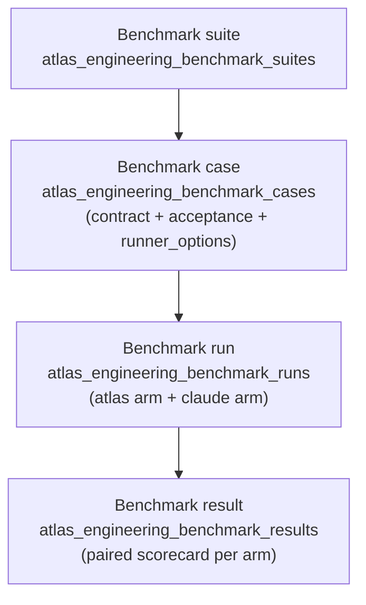

# Benchmark and Atlas-Bench

The benchmark subsystem measures Atlas against Claude Code under identical contracts. A suite holds cases; a case is a verifiable task with a contract; a run executes one or more cases for one or both arms (Atlas and Claude Code); results record the paired scorecard. Real engineering runs can be promoted into the corpus as Atlas-Bench cases, so the benchmark is fed by actual work rather than hand-curated samples. Fair-Claude reporting and export bundles prove the comparison is honest.

## Purpose

The benchmark exists to answer "is Atlas actually better than Claude Code at this task, under the same rules". To do that honestly it runs both arms under the same contract, scores both with the same scorer, records a paired scorecard, and lets a human export a verified bundle. Runs that are not fair (one arm had more context, a different model, or a different contract) are filtered out of the fair report. Promotion turns real harness runs into reusable cases so the corpus grows from real work.

## Key abstractions

| Abstraction | File | Role |
|-------------|------|------|
| Benchmark service | `app/Services/Engineering/EngineeringBenchmarkService.php` | Suites/cases/runs/results, promotion, fair-Claude, calibration, trends |
| Claude Code baseline | `app/Services/Engineering/EngineeringClaudeCodeBaselineRunnerService.php` | Runs the Claude Code baseline arm |
| Run scoring | `app/Services/Engineering/EngineeringRunScoringService.php` | Scores a run from controls + tests + patch + findings |
| Run artifacts | `app/Services/Engineering/EngineeringRunArtifactService.php` | Persists run artifacts and evidence rows |
| Benchmark input | `app/Services/Engineering/EngineeringBenchmarkInput.php` | Typed input (limits, batch sizes) |
| Claude baseline input | `app/Services/Engineering/EngineeringClaudeCodeBaselineInput.php` | Typed input for the baseline arm |

## How it works

### Suites, cases, runs, results

The data model is four levels:

- `createSuite` / `ensureDefaultSuite` create or return a suite.
- `registerCase` adds a case to a suite with its contract, acceptance criteria, and runner options.
- `runSuite` runs all cases in a suite; `runCase` runs one case (Atlas arm, and optionally the Claude Code baseline arm under the same contract).
- `recordOutcome` records the outcome of a run.

The Claude Code baseline arm runs through `EngineeringClaudeCodeBaselineRunnerService::capture`, which takes a case, a task, and runner options and captures the baseline result under the same terms as the Atlas arm.

### Fair-Claude reporting and export

`fairClaudeReportPayload` scans benchmark runs for paired scorecards. A run qualifies only if `paired_scorecard.enabled` is true and the result's `observed_json` carries `paired_scorecard.fair_mode`. The scan batches through recent runs (not running), filters to fair results, and builds the report from the fair subset only. Runs where one arm had an unfair advantage are excluded by construction.

`writeFairClaudeExportBundle(payload, directory)` writes the fair report to a directory as a verifiable bundle; `verifyFairClaudeExportBundle(directory)` reads it back and verifies integrity. The export is what a human or external reviewer inspects to confirm the comparison was fair.

### Run promotion to Atlas-Bench

`promoteRunToCase(run, suite, data)` turns a real `AtlasEngineeringRun` into a benchmark case. It loads the run's task, patch artifacts, test runs, control results, and review findings, then builds the case from them:

- The contract comes from the task's `engineering_contract` metadata, or is synthesized from the task title and minimum viable action.
- The runner options come from the run's own strategy.
- The case metadata records `source = engineering_run_promotion`, the source run id, task id, decision, status, score, and attempt count, so the case is traceable to the real run that produced it.

`promoteRecentRuns(suite, options)` promotes a batch of recent runs at once. This is how Atlas-Bench grows from actual engineering work rather than synthetic samples.

### Calibration and trends

`calibrateSuite(suite, options)` adjusts the suite's calibration against accumulated results. `trendPayload(suite, options)` produces the trend over time. `refreshCorpusManifest(suite)` refreshes the corpus manifest that tracks what is in the suite. `replayManifestPayload(run)` produces a replay manifest so a run can be reproduced.

### Rivals and replay

The rival commands (`atlas:engineering:benchmark:rivals`, `:rivals-harness`) run Atlas against the Claude Code baseline head-to-head, and `:replay-manifest` replays a prior run from its manifest. The fair mode options ensure both arms share provider, model, contract, and sandbox settings.

## Integration points

- **Harness**: a benchmark run reuses the same harness runner and scorer under a fair-mode contract; see [engineering harness](harness.md).
- **Blueprint and contracts**: a benchmark case carries the same contract shape as a task contract; see [blueprint and task contracts](blueprint-and-task-contracts.md).
- **Evidence Ledger**: benchmark runs and their outcomes are recorded as evidence; see [concepts/knowledge-governance.md](../../concepts/knowledge-governance.md).
- **Evolution loop**: the loop can use benchmark results to measure whether a change actually improved performance; see [systems/evolution-loop/](../evolution-loop/index.md).
- **Anti-Goodhart**: the fair-mode filter is the anti-proxy floor that stops a comparison from being claimed fair when it was not; see [concepts/anti-goodhart.md](../../concepts/anti-goodhart.md).
- **DB tables**: `atlas_engineering_benchmark_suites`, `atlas_engineering_benchmark_cases`, `atlas_engineering_benchmark_runs`, `atlas_engineering_benchmark_results`.
- **Commands**: `atlas:engineering:benchmark` (plus `:seed`, `:report`, `:calibrate`, `:claude-fair`, `:rivals`, `:rivals-harness`, `:replay-manifest`).
- **Config**: fair-mode options flow through `atlas.engineering.*` and `FairClaudePolicy`.

## Key source files

| File | Role |
|------|------|
| `app/Services/Engineering/EngineeringBenchmarkService.php` | Suites/cases/runs/results, promotion, fair-Claude, calibration, trends |
| `app/Services/Engineering/EngineeringClaudeCodeBaselineRunnerService.php` | Claude Code baseline arm |
| `app/Services/Engineering/EngineeringRunScoringService.php` | Run scoring (shared with harness) |
| `app/Services/Engineering/EngineeringRunArtifactService.php` | Run artifacts and evidence |
| `app/Services/Engineering/EngineeringBenchmarkInput.php` | Typed benchmark input |
| `app/Services/Ai/FairClaudePolicy.php` | Fair-Claude policy |
