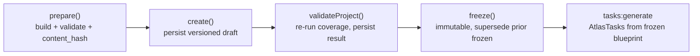

# Blueprint and task contracts

The blueprint pipeline turns a project goal into a frozen, versioned plan, then decomposes that plan into tasks that each carry a contract. The contract is what the harness scores against and what the review gate blocks on. Everything downstream (harness runs, scoring, evidence, benchmark promotion) is anchored to a frozen blueprint and its task contracts.

## Purpose

Two layers of plan exist. A **project blueprint** covers the whole project: it declares an inventory (screens, API surfaces, data entities), scenarios, a phase plan, and a content hash that makes it versioned and immutable once frozen. A **per-task blueprint** renders the contract for a single task into phases, an acceptance matrix, a scenario inventory, review gates, and a contingency policy that the provider sees at execution time. The **task contract** is the merge layer: it pulls goal, scope, acceptance criteria, likely files, edge cases, and definition of done from the task, its project step, and the project's own definition of done.

## Key abstractions

| Abstraction | File | Role |
|-------------|------|------|
| Project blueprint | `app/Services/Engineering/EngineeringProjectBlueprintService.php` | prepare/create/validate/freeze, versioned persistence, content hash |
| Coverage validator | `app/Services/Engineering/EngineeringBlueprintCoverageValidator.php` | Blueprint completeness gate (errors with `path`, missing evidence, blocking gates) |
| Phase planner | `app/Services/Engineering/EngineeringPhasePlannerService.php` | Steps into ordered phases into tasks |
| Per-task blueprint | `app/Services/Engineering/EngineeringBlueprintService.php` | Phases, acceptance matrix, scenarios, review gates, contingency policy |
| Blueprint snapshot | `app/Services/Engineering/EngineeringBlueprintSnapshotService.php` | Immutable snapshot of a blueprint for a run |
| Task contract | `app/Services/Engineering/EngineeringTaskContractService.php` | Goal/scope/acceptance/DoD merged from task, step, project |
| Task generation | `app/Services/Engineering/EngineeringTaskGenerationService.php` | Emits `AtlasTask`s from a frozen blueprint |
| Durable gate | `app/Services/Engineering/Governance/EngineeringBlueprintDurableGate.php` | Durability gate over blueprint persistence |

## How it works

### The project blueprint lifecycle

A project blueprint moves through four states before tasks can be generated:

1. **prepare** (`EngineeringProjectBlueprintService::prepare`) builds the blueprint from the project and its steps, runs the coverage validator, computes a `content_hash` (sha256 over the sorted blueprint payload minus timestamps), and returns `missing_fields` and `suggested_questions` for anything incomplete.
2. **create** persists a `draft` record to `atlas_engineering_project_blueprints`. If a record with the same `project_id` and `content_hash` already exists, it returns that record instead of duplicating. The version is `max(version) + 1`.
3. **validate** re-runs the coverage validator against the persisted blueprint and stores the result in `validation_json`.
4. **freeze** makes the blueprint immutable. It supersedes any other `frozen` record for the project (setting them to `superseded`), re-runs validation, and accepts a `human_exception` to override blocking errors when a human has signed off. Freeze throws `ValidationException` if the blueprint is still blocking and no exception was supplied.

The `payload()` method exposes a `stale` flag: it recomputes the content hash against the current blueprint and reports whether the stored record matches, so callers can detect drift between a frozen blueprint and the project's current state.

### Coverage validation

`EngineeringBlueprintCoverageValidator::validate` checks that the blueprint is complete enough to freeze. It returns a structured result:

- `errors` with a `code`, `message`, and `path` for each blocking issue (for example `inventory_missing`, `scenarios_missing`, `phase_plan_missing`, `screen_required_states_missing` when a screen does not cover loading/ready/error, `api_failure_modes_missing`, `task_acceptance_missing`, `task_dod_missing`).
- `warnings` for non-blocking issues (a scenario with no `evidence_required`, an acceptance criterion with no associated scenario).
- `missing_evidence` routing hints: a screen with visual requirements flags `manual_qa`; a data entity whose text mentions migration/schema/postgres/jsonb flags `database_review`.
- `blocking_gates` derived from the errors.
- `summary` counts of screens, API surfaces, data entities, scenarios, and phases.

This is where the verification-method routing starts: the validator looks at what the blueprint declares and decides which evidence gates the work will need.

### The per-task contract

`EngineeringTaskContractService::forTask` merges from four sources, in priority order: an existing `engineering_contract` in the task metadata, the task metadata itself, the project step, and the project's `definition_of_done`. The contract shape:

| Field | Meaning |
|-------|---------|
| `goal` | What the task accomplishes |
| `context` | Background the provider needs |
| `in_scope` / `out_of_scope` | Boundaries of the work |
| `acceptance_criteria` | Verifiable criteria, each with a `verification_method` |
| `likely_files` / `allowed_files` / `allowed_paths` | File scope (enforced by the harness) |
| `strict_file_scope` / `file_scope` / `scope_policy` | How strictly the file scope is enforced |
| `patterns_to_follow` / `patterns_to_avoid` | Conventions |
| `edge_cases` | Risks and edge cases to handle |
| `test_coverage` | Expected test coverage |
| `definition_of_done` | DoD merged from contract, metadata, and project |

The per-task blueprint (`EngineeringBlueprintService::forTask`) turns this contract into phases, an acceptance matrix, a scenario inventory, review gates, and a contingency policy. `promptLines()` renders it into the prompt the provider sees.

### Verification-method routing

Each acceptance criterion carries a `verification_method` that routes the evidence to a different gate:

| Method | Gate | Service | Command |
|--------|------|---------|---------|
| `test` | Automated test matrix | `app/Services/Engineering/EngineeringTestMatrixService.php` | `atlas:engineering:run` (auto_test) |
| `manual_qa` | Manual / UI QA | `app/Services/Engineering/EngineeringQaService.php` | `atlas:qa` |
| `database_review` | Postgres schema review | `app/Services/Engineering/PostgresEngineeringReviewService.php` | `atlas:db:review` |

Deep code review (`atlas:review:deep`, `EngineeringReviewService`) runs across all methods: it records findings and blocks the gate when an open p0 exists, or a p1 at confidence >= 0.8. Evidence rows (`manual_qa`, `database_review`, `deep_code_review`) persist via `EngineeringRunArtifactService`.

## Integration points

- **Harness**: the harness runner calls `contracts->forTask`, `blueprints->forTask`, and `snapshots->freezeForTask` at the start of every run; see [engineering harness](harness.md).
- **Benchmark**: a benchmark case reuses the same contract so Atlas and the Claude Code baseline run under identical terms; see [benchmark and Atlas-Bench](benchmark-and-atlas-bench.md).
- **Knowledge governance**: the frozen blueprint is authoring truth for the run; the run record and evidence are runtime truth; see [concepts/knowledge-governance.md](../../concepts/knowledge-governance.md).
- **DB table**: `atlas_engineering_project_blueprints` (status draft/frozen/superseded, version, content_hash, blueprint_json, validation_json, human_exception_json).
- **Commands**: `atlas:project:blueprint:prepare|create|validate|freeze`, `atlas:project:tasks:generate`.

## Key source files

| File | Role |
|------|------|
| `app/Services/Engineering/EngineeringProjectBlueprintService.php` | Project blueprint lifecycle |
| `app/Services/Engineering/EngineeringBlueprintCoverageValidator.php` | Coverage and evidence routing |
| `app/Services/Engineering/EngineeringBlueprintService.php` | Per-task blueprint |
| `app/Services/Engineering/EngineeringTaskContractService.php` | Task contract merge |
| `app/Services/Engineering/EngineeringPhasePlannerService.php` | Steps into phases into tasks |
| `app/Services/Engineering/EngineeringTaskGenerationService.php` | Frozen blueprint into AtlasTasks |
| `app/Services/Engineering/EngineeringBlueprintSnapshotService.php` | Immutable run snapshot |
| `app/Services/Engineering/EngineeringQaService.php` | manual_qa gate |
| `app/Services/Engineering/PostgresEngineeringReviewService.php` | database_review gate |
| `app/Services/Engineering/EngineeringReviewService.php` | Deep review gate (p0/p1 blocking) |
