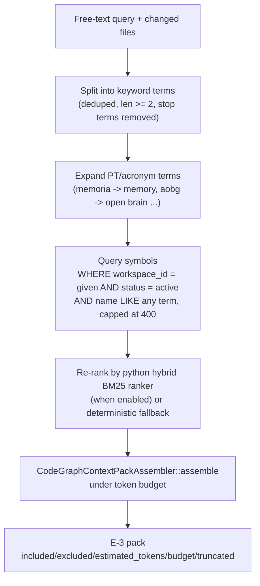

# Code intelligence and CodeGraph

Code intelligence is the symbol index that Atlas builds from a workspace and keeps as a read model. The CodeGraph package sits on top of that index and adds real edges (calls, types, framework wiring), reachability, and a shared BM25-ranked context retriever. Together they answer "which symbols matter for this task" without an external AI ever reading the whole repo.

## Purpose

Two layers, one read model. **Code intelligence** parses PHP, JS, and Markdown symbols out of the workspace into `atlas_engineering_code_modules`, `atlas_engineering_code_symbols`, and `atlas_engineering_doc_links`, keyed by workspace id, with a content-hash snapshot cache. **CodeGraph** is the 65-file package that turns those rows into a queryable graph and serves budgeted context packs. The whole thing is a read model: it is rebuilt from code and docs, it is not authoring truth, and it can be nuked and reindexed without losing anything canonical.

## Key abstractions

| Abstraction | File | Role |
|-------------|------|------|
| Indexer | `app/Services/Engineering/EngineeringCodeIntelligenceService.php` | Parse symbols into the read model; index/audit/readiness/catalog/symbols/module |
| Freshness gate | `app/Services/Engineering/AtlasCodeIntelligenceAutomaticGateService.php` | Names consumers, blocks/repairs on staleness |
| Schema drift auditor | `app/Services/Engineering/CodeIntelligenceSchemaDriftAuditor.php` | Detects drift between index schema and live tables |
| Context retriever | `app/Services/Engineering/CodeGraph/CodeGraphContextRetriever.php` | THE shared BM25 context-pack retriever (`packFor`) |
| Auto-context provider | `app/Services/Engineering/CodeGraph/CodeGraphAutoContextProvider.php` | Reverse-reachability blast-radius auto-context |
| Pack assembler | `app/Services/Engineering/CodeGraph/CodeGraphContextPackAssembler.php` | Assemble packs under token budget |
| Retrieval compressor | `app/Services/Engineering/CodeGraph/CodeGraphRetrievalCompressor.php` | Compress packs under budget |
| Edge builder | `app/Services/Engineering/CodeGraph/CodeGraphEdgeBuilder.php` | Build edges from symbols |
| Edge resolver | `app/Services/Engineering/CodeGraph/CodeGraphEdgeResolver.php` | Resolve real code-graph edges |
| Reality ingestion | `app/Services/Engineering/CodeGraph/CodeGraphRealityIngestionService.php` | Ingest reality/cross-domain graph |
| Workspace identity | `app/Services/Engineering/CodeGraph/CodeGraphWorkspaceIdentity.php` | Resolve workspace id from path |
| Secret scanner | `app/Services/Engineering/CodeGraph/CodeGraphSecretScanner.php` | Scan graph for secrets |

## How it works

### Indexing

`EngineeringCodeIntelligenceService::index` parses the workspace into symbols. The index is workspace-keyed: every row in `atlas_engineering_code_modules`, `atlas_engineering_code_symbols`, and `atlas_engineering_doc_links` carries a `workspace_id`, so multiple projects can share one database without leaking into each other. A content-hash snapshot cache (`atlas_engineering_code_file_snapshots`) avoids reparsing unchanged files. A `SYMBOL_VERSION` fold forces a reparse when the parser logic itself changes. Read APIs are `audit()`, `readiness()`, `catalog()`, `symbols()`, and `module()`.

The freshness gate (`AtlasCodeIntelligenceAutomaticGateService::evaluate`) names every consumer of the index and fails closed when the index is empty or stale. The named consumers, with their evidence files:

| Consumer id | Why it needs a fresh index |
|-------------|----------------------------|
| `correct_context` | Context packs must carry current docs and code refs |
| `cartography` | AURC uses the reality map for human navigation |
| `duplication_detection` | ACRUI avoids recreating runtime, surface, or contract that already exists |
| `file_selection` | Atlas Dev must select files and provable tests before editing |
| `patch_impact` | Patch impact depends on real relation between target, tests, docs, and edges |
| `forge` | Long works need a current code and test map |
| `atlas_dev` | The fast flow fails closed when code intelligence is empty or stale |
| `acrui` | ACRUI classifies real usage, reachability, and risk before duplicate/delete |
| `software_twin` | The twin needs a live map for impact, quality, and snapshot |
| `avcel` | AVCEL needs current context before cache, local verify, and repair |
| `ai_error_reduction` | Session bootstrap and placement must block stale context before coding |

The gate returns a `consumerMatrix` with a `covered`/`missing` status per consumer, plus `blockers` (including `code_intelligence_index_stale_by_age` when the index age exceeds the max). In strict mode (non-summary), a stale index blocks; the fast flow fails closed rather than reasoning over stale symbols.

### Edges and resolvers

The CodeGraph package builds real edges on top of the symbol rows. The resolver stack extracts calls, typed calls, type flow, and framework-aware wiring:

| File | What it resolves |
|------|------------------|
| `CodeGraphSymbolBuilder.php` | Symbol extraction |
| `CodeGraphEdgeBuilder.php` | Edge construction from symbols |
| `CodeGraphEdgeResolver.php` | Real code-graph edge resolution |
| `CodeGraphCallResolver.php` | Call edges |
| `CodeGraphTypedCallResolver.php` | Typed call edges |
| `CodeGraphTypeFlowResolver.php` | Type flow edges |
| `CodeGraphFrameworkAwareResolver.php` | Laravel/framework-aware wiring |
| `CodeGraphSymbolResolver.php` | Symbol resolution |
| `CodeGraphAdjacencyIndex.php` | Adjacency index for traversal |
| `CodeGraphCoverageEdgeParser.php` | Coverage overlay edges |

Graph views and exports: `CodeGraphUnifiedView`, `CodeGraphSkeletonView`, `CodeGraphMermaidExporter`.

### The BM25 context retriever

`CodeGraphContextRetriever::packFor` is the single shared retrieval path. It was extracted verbatim from the proven `atlas:ctx` command so the CLI and every programmatic consumer share one implementation. The pipeline:

Key contracts:

- **Workspace-scoped**: rows are filtered to the caller's resolved `workspace_id`; cross-workspace leakage is impossible by construction.
- **Budgeted**: the assembler fits the pack under a token budget (default 4000); `truncated` is honest about whether the budget was hit.
- **Never throws**: an empty query, too-short terms, no matches, a missing table, or a transient DB fault all resolve to an empty pack. Context retrieval is best-effort recall, not a gate.
- **Deterministic**: identical inputs yield byte-identical output (the only impurities are the read query and the optional hybrid-rank runtime call, both mirrored from `atlas:ctx`).
- **Term expansion**: Portuguese prompt words and acronyms expand to English/code identifiers (`memoria` to `memory`, `aobg` to `open brain context pack gateway`), so a PT prompt can match an English codebase.

The reverse-reachability blast-radius path lives separately in `CodeGraphAutoContextProvider` and is out of scope for `packFor`; the loop and Dev/Forge use it to find everything a change touches.

### Feeding the Open Brain context pack

The Open Brain context pack (`atlas_context_pack` MCP tool / `atlas:context-pack`) fuses three brains: code-graph (this retriever), reality graph AURG, and semantic memory. `CodeGraphContextRetriever::packFor` is the code-graph leg. `EngineeringContextPackService` composes the run-level context pack by fusing the KB read model, code intelligence, tool evidence, and memory, and persists it to `atlas_engineering_context_packs`. See [systems/open-brain/](../open-brain/index.md).

## Integration points

- **Open Brain**: the retriever is the code-graph leg of the context pack; see [systems/open-brain/](../open-brain/index.md).
- **Reality cartography**: ACRUI and AURC read the same index; see [reality and cartography](reality-and-cartography.md).
- **Harness**: `EngineeringContextPackService` builds the run's context pack from this index; see [engineering harness](harness.md).
- **Software twin**: the twin's impact graph reads symbols and edges from the index; see [software twin and verified evolution](software-twin-and-verified-evolution.md).
- **Knowledge governance**: the index is a read model, rebuilt from code; see [concepts/knowledge-governance.md](../../concepts/knowledge-governance.md).
- **Config**: `atlas.code_graph.real_edges`, `max_edges`, `traversal_max_depth`, `traversal_max_nodes`, `default_workspace_id`, `hybrid_rank`, `auto_context_budget`.
- **Commands**: `atlas:code-graph:build|index-all|pipeline|lsp`, `atlas:engineering:knowledge` (sync + index-code), `atlas:ctx`.

## Key CodeGraph files

| File | Role |
|------|------|
| `CodeGraphContextRetriever.php` | Shared BM25 context-pack retriever |
| `CodeGraphAutoContextProvider.php` | Reverse-reachability blast-radius auto-context |
| `CodeGraphContextPackAssembler.php` | Assemble packs under budget |
| `CodeGraphRetrievalCompressor.php` | Compress packs |
| `CodeGraphEdgeBuilder.php` / `CodeGraphEdgeResolver.php` | Edge construction and resolution |
| `CodeGraphCallResolver.php` / `CodeGraphTypedCallResolver.php` | Call edges |
| `CodeGraphTypeFlowResolver.php` / `CodeGraphFrameworkAwareResolver.php` | Type flow and framework wiring |
| `CodeGraphAdjacencyIndex.php` | Adjacency index for traversal |
| `CodeGraphUnifiedView.php` / `CodeGraphSkeletonView.php` / `CodeGraphMermaidExporter.php` | Graph views and exports |
| `CodeGraphRealityIngestionService.php` | Reality/cross-domain graph ingestion |
| `CodeGraphSecretScanner.php` / `CodeGraphLicenseDetector.php` | Secret and license guards |
| `CodeGraphPrivacyFilter.php` / `CodeGraphWorkspacePrivacy.php` | Privacy filtering |
| `CodeGraphWorkspaceIdentity.php` / `CodeGraphWorkspaceAccessPolicy.php` | Workspace identity and access |
| `CodeGraphWorkspacePurger.php` / `CodeGraphIndexLock.php` | Purge and lock |
| `CodeGraphIncrementalPlanner.php` / `CodeGraphIncrementalReindexPlanner.php` / `CodeGraphFirstIndexPlanner.php` | Index planning |
| `CodeGraphRetentionPolicy.php` / `CodeGraphQueryCache.php` / `CodeGraphQueryCacheStore.php` | Retention and caching |
| `CodeGraphHealthAuditor.php` / `CodeGraphRegressionDetector.php` / `CodeGraphIntegrityHasher.php` | Health, regression, integrity |
| `CodeGraphLanguageServer.php` / `CodeGraphTreeSitterExtractor.php` / `CodeGraphRuntimeInvoker.php` | LSP, tree-sitter, runtime bridges |
| `CodeGraphDocReconcileBridge.php` / `CodeGraphReviewContextAssembler.php` | Bridges to docs and review |
