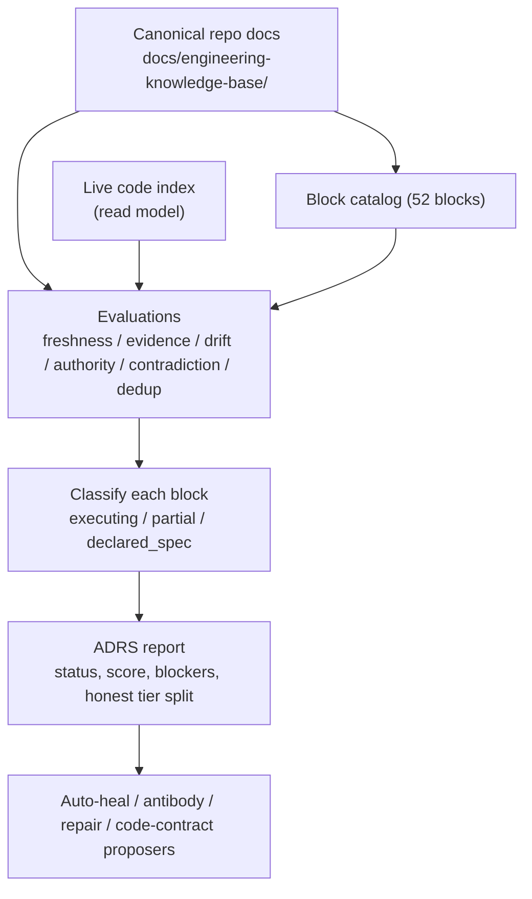
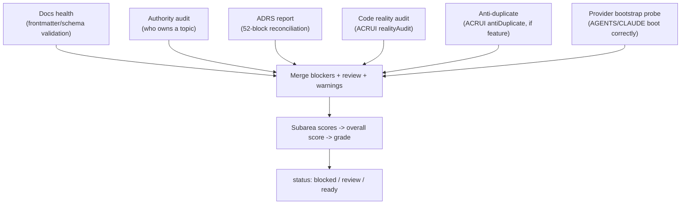

# Documentation reality (ADRS)

ADRS (Atlas Documentation Reality System) is the self-evaluating system that reconciles canonical repo docs against the live code and proves the drift. It runs about 52 evaluation blocks, classifies each into an honest execution tier, and exposes the retraction of any past over-claim. A composite enforcement service fuses ADRS with docs-health, authority audit, code reality, anti-duplicate, and provider-bootstrap probes into one gate that blocks code when the docs are out of sync. The doctrine is simple: repo docs are authoring truth, so they must match the code.

## Purpose

The problem ADRS solves is doc rot. A canonical doc declares a module "ready" or claims a contract exists; the code deleted it, renamed it, or never wired it. An agent that trusts the doc builds on a lie. ADRS evaluates the docs against the code index, classifies each block honestly (does it execute, is it partial, is it only declared), and reports the drift. The enforcement composite turns that into a gate: if the docs are blocked, no code runs.

## Key abstractions

| Abstraction | File | Role |
|-------------|------|------|
| ADRS core | `app/Services/Engineering/AtlasDocumentationRealitySystemService.php` | 52-block self-evaluating doc-to-code reconciler |
| Enforcement composite | `app/Services/Engineering/AtlasDocumentationEnforcementService.php` | Fuses docs-health + authority + ADRS + code reality + anti-duplicate + provider-bootstrap |
| Docs health | `app/Services/Engineering/EngineeringDocumentationHealthService.php` | Validates canonical module doc frontmatter/schema |
| Authority audit | `app/Services/Engineering/EngineeringDocumentationAuthorityAuditService.php` | Cross-source topic ownership audit |
| Violation rules | `app/Services/Engineering/EngineeringDocumentationViolationRules.php` | Rule set for docs health |
| Warning collector | `app/Services/Engineering/EngineeringDocumentationWarningCollector.php` | Warning aggregation |
| Provider bootstrap probe | `app/Services/Engineering/AtlasDocumentationProviderBootstrapProbe.php` | Probes that AGENTS/CLAUDE projections bootstrap correctly |
| Auto-heal | `app/Services/Engineering/AtlasDocumentationRealityAutoHealService.php` | Auto-heal proposer |
| Antibody proposer | `app/Services/Engineering/AtlasDocumentationRealityAntibodyProposerService.php` | Antibody (anti-drift) proposer |
| Repair proposer | `app/Services/Engineering/AtlasDocumentationRealityRepairProposerService.php` | Repair proposer |
| Code contract proposer | `app/Services/Engineering/AtlasDocumentationRealityCodeContractProposerService.php` | Code contract proposer |
| Write gate | `app/Services/Engineering/AtlasDocumentationRealityWriteGateService.php` | Bounds doc writes |

## How it works

### The 52 evaluation blocks

`AtlasDocumentationRealitySystemService::report(docsRoot)` computes a report over the canonical docs under `docs/engineering-knowledge-base/`. It builds a source registry, a block catalog of 52 evaluation blocks, an upgrade map, runs the evaluations, and classifies each block into one of three honest tiers:

| Tier | Meaning |
|------|---------|
| `executing` | The block actually runs and integrates against the code |
| `partial_runtime` | The block has partial runtime support |
| `declared_spec` | The block is declared in the spec but does not execute |

The three tiers partition all 52 blocks and must sum to 52. The report explicitly retracts the past over-claim: `declares_all_52_adrs_blocks_integrated` is `false`, and the honest executing/partial/declared split is reported alongside it. Real evaluators include `source_freshness_gate`, `evidence_sufficiency_gate`, `drift_duplication_guard`, `authority_kernel`, `knowledge_governance_system`, `contradiction_resolver`, `semantic_deduplication_engine`, and `canonical_question_router`.

The report is cross-request cached on a corpus stat-signature: a sha256 over each `.md` file's relative path plus mtime plus size, sorted. It never reads or parses file contents to build the cache key, so it is cheap, but it changes the instant any doc is added, removed, or edited. The TTL is `atlas.engineering.documentation_reality.report_cache_seconds` (default 300).

The report payload is read-only (`writes = false`, `providers_invoked = false`): ADRS never writes and never calls an external provider.

### ADRS reconciliation

When a block finds drift (a doc claim that does not match the code), it becomes a blocker and the report status goes to `blocked`. The generative services (auto-heal, antibody, repair, code-contract) read the report and propose fixes, but they propose only, gated by `WriteGateService`; ADRS itself never writes.

### The enforcement composite

`AtlasDocumentationEnforcementService::report(task, feature, targets, workspace)` fuses six sources into one gate:

The composite's `ai_execution_contract` makes the doctrine explicit: `docs_are_authority = true`, `provider_projection_is_bootstrap_only = true`, `chat_memory_is_not_authority = true`, `must_run_before_code = true`, `blocked_means_no_code = true`, `review_means_operator_or_owner_doc_decision_required = true`, `strict_mode_blocks_unless_ready = true`. A blocked enforcement report means no code runs.

### The generative and self-healing services

ADRS has a family of fragment and leap services that propose fixes without authorizing writes:

| Service | What it proposes |
|---------|------------------|
| `AtlasDocumentationRealityFlowService.php` | Doc flow analysis |
| `AtlasDocumentationRealityCompletenessService.php` | Completeness gaps |
| `AtlasDocumentationRealityBidirectionalReconciliationService.php` | Bidirectional doc-to-code and code-to-doc reconciliation |
| `AtlasDocumentationRealityCausalSelfModelService.php` | Causal self-model |
| `AtlasDocumentationRealitySelfImprovementModelingService.php` | Self-improvement modeling |
| `AtlasDocumentationRealityReflectiveStatusService.php` | Reflective status |
| `AtlasDocumentationRealityMultiEstateCompoundingService.php` | Multi-estate compounding |
| `AtlasDocumentationRealityOutcomeGroundingService.php` | Outcome grounding |
| `AtlasDocumentationRealityIntentAdvisoryService.php` | Intent advisory |
| `AtlasDocumentationRealityAutoHealService.php` | Auto-heal proposals |
| `AtlasDocumentationRealityAntibodyProposerService.php` | Antibody (anti-drift) proposals |
| `AtlasDocumentationRealityRepairProposerService.php` | Repair proposals |
| `AtlasDocumentationRealityCodeContractProposerService.php` | Code contract proposals |
| `AtlasDocumentationRealityWriteGateService.php` | Write gate bounding doc writes |

### Why repo docs are authoring truth

The governance hierarchy puts canonical repo docs above code, tests, migrations, the Evidence Ledger, read models, Obsidian, and provider projections. The reason is that docs are the human-edited source of intent: they say what the system is supposed to be. Code, tests, and migrations implement that intent. Read models (Postgres KB, code intelligence) are derived from both. The Evidence Ledger proves what ran. Provider projections (CLAUDE.md, AGENTS.md) are bootstrap-only snapshots. When ADRS finds a doc drifts from code, the question is whether the code is wrong (fix the code) or the doc is wrong (fix the doc), but the doc is the authority for intent. See [concepts/knowledge-governance.md](../../concepts/knowledge-governance.md).

## Integration points

- **Code intelligence**: ADRS drift and duplication guards read the live code index; see [code intelligence and CodeGraph](code-intelligence-and-codegraph.md).
- **Reality cartography**: AURC composes an ADRS report into its map; ACRUI's `realityAudit` and `antiDuplicate` feed the enforcement composite; see [reality and cartography](reality-and-cartography.md).
- **Open Brain**: the enforcement composite's `must_run_before_code` contract is what AGENTS/CLAUDE projections bootstrap against; see [systems/open-brain/](../open-brain/index.md).
- **Anti-Goodhart**: ADRS is the anti-proxy floor that stops an agent from coding against a stale or false doc; see [concepts/anti-goodhart.md](../../concepts/anti-goodhart.md).
- **Commands**: `atlas:documentation-reality` (plus `-flow`, `-completeness`, `-bidirectional-reconcile`, `-reflective-status`, `-self-improvement-modeling`, `-causal-self-model`, `-multi-estate`, `-outcome-grounding`, `-intent-advisory`, `-auto-heal`, `-antibody-proposals`, `-repair-proposals`, `-code-contract-proposals`, `-write-gate`), `atlas:documentation:enforce`, `atlas:docs:lint-file`, `atlas:docs:reality-check-file`, `atlas:cartography:truth-guard`.
- **Config**: `atlas.engineering.documentation_reality.report_cache_seconds`.

## Key source files

| File | Role |
|------|------|
| `app/Services/Engineering/AtlasDocumentationRealitySystemService.php` | ADRS 52-block reconciler |
| `app/Services/Engineering/AtlasDocumentationEnforcementService.php` | Composite enforcement gate |
| `app/Services/Engineering/EngineeringDocumentationHealthService.php` | Docs-health report |
| `app/Services/Engineering/EngineeringDocumentationAuthorityAuditService.php` | Cross-source authority audit |
| `app/Services/Engineering/AtlasDocumentationProviderBootstrapProbe.php` | Provider projection probe |
| `app/Services/Engineering/AtlasDocumentationRealityAutoHealService.php` | Auto-heal proposer |
| `app/Services/Engineering/AtlasDocumentationRealityWriteGateService.php` | Write gate |
