# Engineering harness

The harness is the sandboxed execution runner that takes a task and its contract, runs it against a provider, captures the patch, runs a test matrix, scores the result, records review findings, and appends every lifecycle event to the Evidence Ledger. It is the engine the autonomous evolution loop runs on (`meta_harness`). Every step is anchored to a frozen blueprint and a contract, and every event is proven.

## Purpose

The harness exists to make an AI coding run verifiable. Instead of letting a model edit files and declaring success, the harness resolves a workspace, scores how harnessable the task is, picks a provider and model under a model policy, builds a context pack, runs the provider in a sandbox, captures the patch as an artifact, runs a matrix of controls and tests, scores the run from controls plus tests plus patch plus review findings, and writes evidence rows. The run record, attempts, controls, test runs, and patch artifacts all persist to `atlas_engineering_*` tables, and the lifecycle is appended to the Evidence Ledger so the run is provable after the fact.

## Key abstractions

| Abstraction | File | Role |
|-------------|------|------|
| Runner | `app/Services/Engineering/EngineeringHarnessRunnerService.php` | End-to-end run orchestrator |
| Execution | `app/Services/Engineering/EngineeringHarnessExecutionService.php` | Lower-level single-attempt execution |
| Harnessability | `app/Services/Engineering/EngineeringHarnessabilityService.php` | Scores how harnessable a task is; calibratable |
| Workspace | `app/Services/Engineering/EngineeringWorkspaceService.php` | Resolves and prepares the workspace for a run |
| Provider runtime | `app/Services/Engineering/EngineeringProviderRuntimeService.php` | Resolves provider runtime (host vs docker compose) |
| Docker harness | `app/Services/Engineering/EngineeringDockerHarnessService.php` | Docker-backed sandbox execution |
| Model policy | `app/Services/Engineering/EngineeringModelPolicyService.php` | Provider/model selection per task |
| Control registry | `app/Services/Engineering/EngineeringControlRegistryService.php` | Registry of controls (lint/test/build) with revisions |
| Context pack | `app/Services/Engineering/EngineeringContextPackService.php` | Composes run context pack (KB + code intel + evidence + memory) |
| Test matrix | `app/Services/Engineering/EngineeringTestMatrixService.php` | Builds and runs the test matrix |
| Patch artifact | `app/Services/Engineering/EngineeringPatchArtifactService.php` | Patch/diff artifact persistence |
| Scoring | `app/Services/Engineering/EngineeringRunScoringService.php` | Scores a run from controls + tests + patch + findings |
| Run artifacts | `app/Services/Engineering/EngineeringRunArtifactService.php` | Persists run artifacts and evidence rows |
| Review findings | `app/Services/Engineering/EngineeringReviewFindingService.php` | Records and normalizes review findings |

## How it works

### The runner pipeline

`EngineeringHarnessRunnerService::run(task, options)` wires a long pipeline. Each stage is a separate service call, and key transitions are recorded to the Evidence Ledger:

```mermaid
graph TD
    WS["Resolve workspace"]
    Awis["AWIS mutation block check"]
    Contract["Build task contract"]
    Blueprint["Build per-task blueprint"]
    Snapshot["Freeze blueprint snapshot"]
    Harness["Score harnessability"]
    Model["Model policy selection"]
    Autonomy["Autonomy policy<br/>(permission/sandbox/attempts/auto_test)"]
    Controls["Control registry: applicable controls"]
    Run["Create AtlasEngineeringRun<br/>(status=preparing)"]
    LedStart["Ledger: ExecutionStarted"]
    WSPrep["Workspace prepare"]
    PR["Provider runtime plan<br/>(host or docker)"]
    Docker["Docker network policy"]
    Ctx["Context pack build<br/>(KB + code intel + evidence + memory)"]
    LedCtx["Ledger: ContextComposed"]
    Attempt["Create run attempt"]
    Exec["Execute attempt<br/>(provider CLI, stream output)"]
    LedProv["Ledger: ProviderReturned"]
    Patch["Capture patch artifact"]
    Tests["Run test matrix<br/>(controls + tests)"]
    Score["Score run<br/>(controls + tests + patch + findings)"]
    Evidence["Record evidence rows"]
    LedEnd["Ledger: OperationCompleted/Failed"]

    WS --> Awis --> Contract --> Blueprint --> Snapshot --> Harness
    Harness --> Model --> Autonomy --> Controls --> Run
    Run --> LedStart --> WSPrep --> PR --> Docker --> Ctx
    Ctx --> LedCtx --> Attempt --> Exec --> LedProv --> Patch
    Patch --> Tests --> Score --> Evidence --> LedEnd
```

The options that shape the run: `dry_run` (no execution), `no_provider` (skip the provider, run tests only), `auto_test`, `max_attempts`, `provider`, `model`, `model_policy` (default `fixed`), `permission` (default `auto`), `sandbox` (default `workspace`), `keep_workspace`, `apply_isolated_patch`, `control_profile`, `test_command`, `visual_e2e`, `quality_scan` (mode/profile/changed_only), `docker` options, `provider_runtime` options, `replay`, and `fair_mode` options.

### Docker sandbox

`EngineeringDockerHarnessService` backs sandbox execution. It augments a workspace profile with docker options, tests runtime commands, reports network policy status, runs healthchecks, and captures artifacts per test run. `EngineeringProviderRuntimeService::plan` decides whether the provider runs on the host or inside a docker compose stack. The sandbox isolates the provider's file mutations from the host workspace; the patch is captured as an artifact and can be applied in isolation (`apply_isolated_patch`).

### Test matrix and controls

`EngineeringControlRegistryService::applicableControls` resolves the controls (lint, test, build, etc.) that apply to the task, workspace, contract, and blueprint, optionally under a named profile and with auto-test. Controls have revisions (`atlas_engineering_control_revisions`) so a control definition is versioned. `persistControls` writes them to `atlas_engineering_controls`. `EngineeringTestMatrixService` ensures and runs the test cases (`atlas_engineering_test_cases` / `atlas_engineering_test_runs`); `recordResult` records control outcomes to `atlas_engineering_control_results`.

### Harnessability scoring

`EngineeringHarnessabilityService::score(workspace)` rates how amenable a task is to harnessed execution. It is calibratable: `calibrate(options)` adjusts the scoring against `atlas_engineering_harnessability_calibrations`. The score feeds the autonomy policy (which permission, sandbox, max attempts, and auto-test the run gets) and the model policy selection.

### Scoring

`EngineeringRunScoringService::score(run, contract, blueprint)` scores the run from controls, tests, the patch, and review findings. The scoring gates on p0/p1/p2 findings: an open p0 blocks, and a p1 at confidence >= 0.8 blocks. The final ledger event is `OperationCompleted` or `OperationFailed` depending on the outcome.

### Evidence Ledger integration

The harness appends lifecycle events to the `AtlasEvidenceLedger` throughout the run. The recorded event types and their timing:

| Event | When |
|-------|------|
| `ExecutionStarted` | After the run record is created |
| `ContextComposed` | After the context pack is built (carries `context_pack_hash`, control count, blueprint id) |
| `ProviderReturned` | After the provider attempt returns |
| `OperationCompleted` / `OperationFailed` | At the end, depending on outcome |

`recordEvidence` writes evidence rows (`manual_qa`, `database_review`, `deep_code_review`) via `EngineeringRunArtifactService`. The ledger is append-only and tamper-evident: it proves what ran, but per governance it never overrides a canonical spec. See [concepts/knowledge-governance.md](../../concepts/knowledge-governance.md).

## Integration points

- **Blueprint and contracts**: the harness calls `contracts->forTask`, `blueprints->forTask`, and `snapshots->freezeForTask` at the start of every run; see [blueprint and task contracts](blueprint-and-task-contracts.md).
- **Code intelligence**: the context pack is built from the code intelligence read model; see [code intelligence and CodeGraph](code-intelligence-and-codegraph.md).
- **Benchmark**: a benchmark run reuses the same harness under a fair-mode contract; see [benchmark and Atlas-Bench](benchmark-and-atlas-bench.md).
- **Evolution loop**: the loop uses the harness as its execution engine (`atlas.loop.meta_harness_*`); see [systems/evolution-loop/](../evolution-loop/index.md).
- **Evidence Ledger**: `app/Services/Ai/Kernel/Evidence/AtlasEvidenceLedger.php` plus `LedgerEventType`.
- **DB tables**: `atlas_engineering_runs`, `atlas_engineering_run_attempts`, `atlas_engineering_controls`, `atlas_engineering_control_results`, `atlas_engineering_control_revisions`, `atlas_engineering_test_cases`, `atlas_engineering_test_runs`, `atlas_engineering_context_packs`, `atlas_engineering_patch_artifacts`, `atlas_engineering_review_findings`, `atlas_engineering_evidence`, `atlas_engineering_harnessability_calibrations`.
- **Commands**: `atlas:engineering:run`, `atlas:harness`, `atlas:engineering:deliver`, `atlas:engineering:replay`, `atlas:engineering:harnessability:calibrate`, `atlas:engineering:docker-cleanup`, `atlas:engineering:quality-scan`, `atlas:engineering:visual-smoke|visual-baseline|visual-driver`.
- **Config**: `atlas.engineering.docker`, `atlas.engineering.provider_runtime`, `atlas.engineering.visual_e2e`, `atlas.engineering.quality_scan`.

## Key source files

| File | Role |
|------|------|
| `app/Services/Engineering/EngineeringHarnessRunnerService.php` | End-to-end run orchestrator |
| `app/Services/Engineering/EngineeringHarnessExecutionService.php` | Single-attempt execution |
| `app/Services/Engineering/EngineeringHarnessabilityService.php` | Harnessability scoring + calibration |
| `app/Services/Engineering/EngineeringWorkspaceService.php` | Workspace resolution and preparation |
| `app/Services/Engineering/EngineeringDockerHarnessService.php` | Docker sandbox execution |
| `app/Services/Engineering/EngineeringProviderRuntimeService.php` | Provider runtime resolution |
| `app/Services/Engineering/EngineeringModelPolicyService.php` | Model/provider policy selection |
| `app/Services/Engineering/EngineeringControlRegistryService.php` | Controls registry with revisions |
| `app/Services/Engineering/EngineeringContextPackService.php` | Run context pack composition |
| `app/Services/Engineering/EngineeringTestMatrixService.php` | Test matrix build and run |
| `app/Services/Engineering/EngineeringPatchArtifactService.php` | Patch artifact persistence |
| `app/Services/Engineering/EngineeringRunScoringService.php` | Run scoring |
| `app/Services/Engineering/EngineeringRunArtifactService.php` | Run artifacts and evidence rows |
| `app/Services/Ai/Kernel/Evidence/AtlasEvidenceLedger.php` | Append-only runtime proof ledger |
