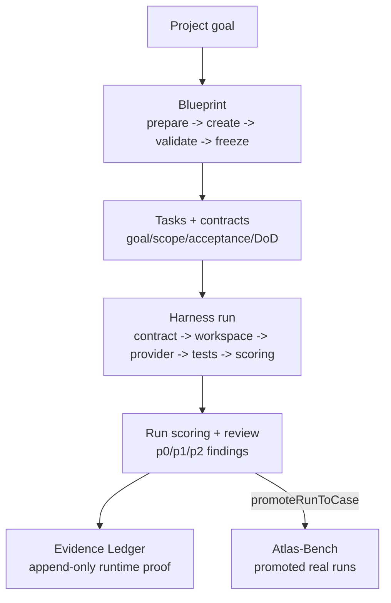
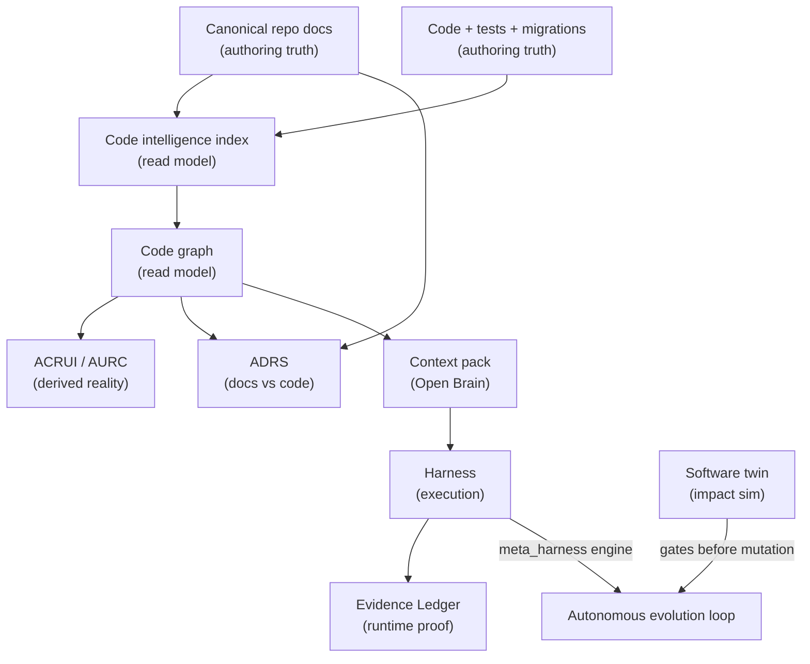

# Engineering

The Engineering plane is Atlas's agentic software-engineering machinery. It turns a project goal into a frozen, contract-driven build, executes that build inside a verifiable harness, scores and reviews the result, and proves the work against the real structure of the codebase. The code lives under `app/Services/Engineering/` (about 75 services) plus a 65-file `app/Services/Engineering/CodeGraph/` package.

## The six pillars

| Pillar | What it does | Entry point |
|--------|--------------|-------------|
| Blueprint | Versioned project and per-task plans with coverage validation and a prepare-to-freeze lifecycle | `app/Services/Engineering/EngineeringProjectBlueprintService.php` |
| Code intelligence / CodeGraph | A symbol index and code graph maintained as a read model; BM25-ranked, workspace-scoped context packs | `app/Services/Engineering/EngineeringCodeIntelligenceService.php`, `app/Services/Engineering/CodeGraph/CodeGraphContextRetriever.php` |
| Reality / cartography | Derives the real system structure from the live index and reconciles claims against code | `app/Services/Engineering/AtlasCodeRealityUsageIntelligenceService.php`, `app/Services/Engineering/AtlasUniversalRealityCartographyService.php` |
| Documentation reality (ADRS) | A self-evaluating doc-to-code reconciler that keeps canonical repo docs in sync with code | `app/Services/Engineering/AtlasDocumentationRealitySystemService.php` |
| Benchmark | Atlas-versus-Claude-Code suites, cases, and runs with fair reporting and promotion to Atlas-Bench | `app/Services/Engineering/EngineeringBenchmarkService.php` |
| Harness + software twin | A sandboxed execution runner plus a predictive impact simulator and verified-evolution contract layer | `app/Services/Engineering/EngineeringHarnessRunnerService.php`, `app/Services/Engineering/AtlasSoftwareTwinRuntimeService.php` |

## The project-to-harness-to-benchmark arc

A goal enters as a project, becomes a blueprint, decomposes into tasks with contracts, runs through the harness, gets scored and reviewed, and the real runs can be promoted into the benchmark corpus:

Each step is a separate page:

- [Blueprint and task contracts](blueprint-and-task-contracts.md)
- [Code intelligence and CodeGraph](code-intelligence-and-codegraph.md)
- [Reality and cartography](reality-and-cartography.md)
- [Documentation reality (ADRS)](documentation-reality.md)
- [Engineering harness](harness.md)
- [Benchmark and Atlas-Bench](benchmark-and-atlas-bench.md)
- [Software twin and verified evolution](software-twin-and-verified-evolution.md)

## The governance triangle

Three kinds of truth coexist, and the Engineering plane is careful never to confuse them. This is the [knowledge governance](../../concepts/knowledge-governance.md) hierarchy applied to engineering:

| Truth kind | What it is | Examples | Authoritative? |
|------------|-----------|----------|----------------|
| Authoring truth | The human-edited source that defines intent | canonical repo docs in `docs/engineering-knowledge-base/`, code, tests, migrations | Yes (source of truth) |
| Read model | A derived, rebuildable projection of the source | Postgres KB, code intelligence tables, code graph | No (rebuilt from source) |
| Evidence Ledger | Append-only proof of what actually ran at runtime | `AtlasEvidenceLedger` events, run receipts, merged shas | Proves events, never overrides specs |

The rule: repo docs author truth; `atlas_engineering_*` tables and the code graph are read models rebuilt from code and docs; the Evidence Ledger proves that a run, merge, or gate actually happened but never overrides a canonical spec. Read models drift and are rebuilt; the ledger is tamper-evident and append-only.

This triangle is what keeps the system honest against [anti-Goodhart](../../concepts/anti-goodhart.md) pressure: you cannot game a read model because it is rebuildable, and you cannot fake runtime proof because the ledger is append-only.

## How the pillars connect

The code intelligence read model and the code graph feed the Open Brain context pack (the `atlas_context_pack` MCP tool). The reality and cartography services read the same index to derive what is actually there. ADRS reconciles the canonical docs against that same index. The harness consumes a context pack built from all of these, runs the task, scores it, and writes evidence. The software twin and verified-evolution layer sit between the autonomous loop and any actual mutation, simulating impact before a change is allowed to proceed.

## Integration points

- **Open Brain**: the code graph feeds the context pack; see [systems/open-brain/](../open-brain/index.md).
- **Autonomous evolution loop**: the loop uses the harness as its execution engine (`meta_harness`); see [systems/evolution-loop/](../evolution-loop/index.md).
- **Knowledge governance**: read models vs authoring truth vs evidence ledger; see [concepts/knowledge-governance.md](../../concepts/knowledge-governance.md).
- **Anti-Goodhart**: ADRS and reality cartography enforce anti-proxy by reconciling claims against code; see [concepts/anti-goodhart.md](../../concepts/anti-goodhart.md).
- **Artisan commands**: blueprint tasks (`atlas:project:blueprint:*`), harness (`atlas:engineering:run`, `atlas:harness`), benchmark (`atlas:engineering:benchmark*`), code graph (`atlas:code-graph:*`, `atlas:engineering:knowledge`), documentation reality (`atlas:documentation-reality*`, `atlas:documentation:enforce`), software twin (`atlas:software-twin*`).
- **Config**: `config/atlas.php` keys `atlas.engineering.*`, `atlas.code_graph.*`, `atlas.cognition.predictive_code_intelligence_gate.*`, and loop blocks `atlas.loop.meta_harness_*`.

## Key source files

| File | Role |
|------|------|
| `app/Services/Engineering/EngineeringProjectBlueprintService.php` | Project blueprint prepare/create/validate/freeze |
| `app/Services/Engineering/EngineeringHarnessRunnerService.php` | End-to-end harness run orchestrator |
| `app/Services/Engineering/EngineeringCodeIntelligenceService.php` | Symbol index read model |
| `app/Services/Engineering/CodeGraph/CodeGraphContextRetriever.php` | Shared BM25 context-pack retriever |
| `app/Services/Engineering/AtlasCodeRealityUsageIntelligenceService.php` | ACRUI: real usage, reachability, anti-duplicate |
| `app/Services/Engineering/AtlasUniversalRealityCartographyService.php` | AURC: navigable reality map |
| `app/Services/Engineering/AtlasDocumentationRealitySystemService.php` | ADRS: doc-to-code reconciler |
| `app/Services/Engineering/EngineeringBenchmarkService.php` | Benchmark suites/cases/runs + Atlas-Bench |
| `app/Services/Engineering/AtlasSoftwareTwinRuntimeService.php` | Predictive impact twin |
| `app/Services/Engineering/AtlasAutonomousChangeOrchestratorService.php` | Contract-first change planner |
| `app/Services/Ai/Kernel/Evidence/AtlasEvidenceLedger.php` | Append-only runtime proof ledger |
