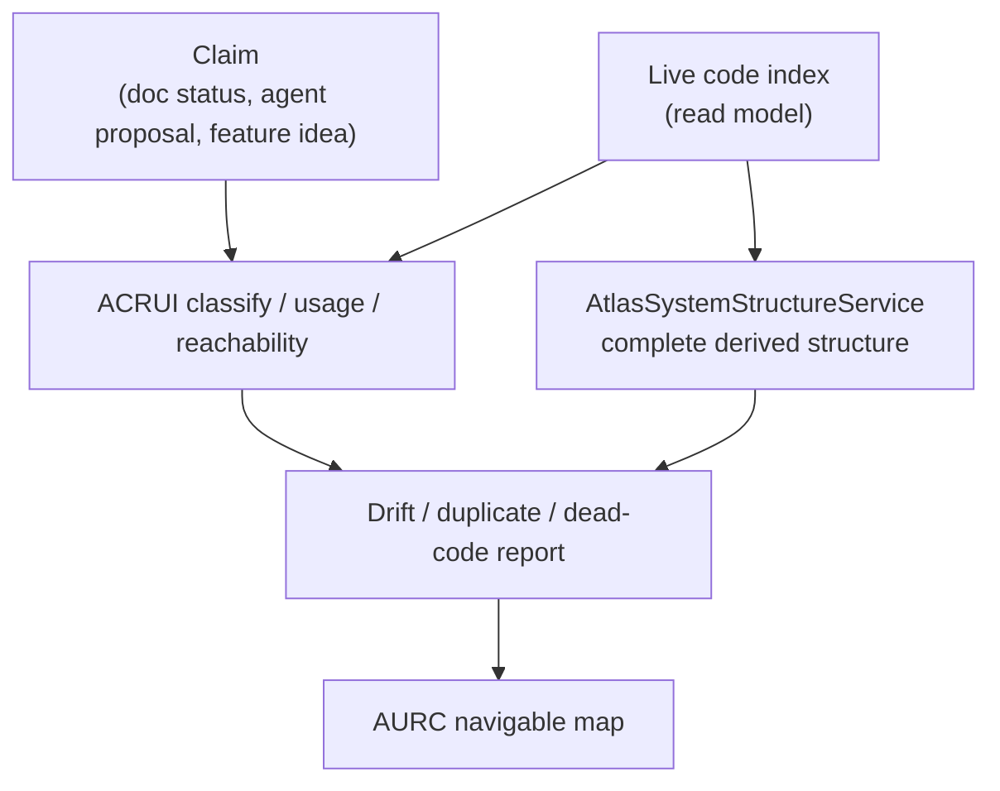

# Reality and cartography

Reality cartography is how Atlas knows what is actually in the codebase, as opposed to what the docs claim or what an agent guesses. Three services cooperate. ACRUI scans the corpus and classifies real usage, reachability, duplication, dead code, and drift. AURC composes that into a navigable map for humans. `AtlasSystemStructureService` derives the complete real structure at runtime from the live index. All three read the code intelligence read model; none of them are authoring truth.

## Purpose

The problem these services solve is drift between claims and code. A doc says a module exists; the code deleted it months ago. An agent proposes to build a surface that already exists under another name. A symbol is imported nowhere and can be deleted. A status field in a doc says "ready" but the code is half-wired. ACRUI, AURC, and the structure service catch all of these by reconciling claims against the live index rather than trusting any single source.

## Key abstractions

| Abstraction | File | Role |
|-------------|------|------|
| ACRUI | `app/Services/Engineering/AtlasCodeRealityUsageIntelligenceService.php` | Reality usage intelligence: classify, usage, reachability, anti-duplicate, dead code, drift |
| AURC | `app/Services/Engineering/AtlasUniversalRealityCartographyService.php` | Navigable reality map (nodes, edges, coverage, maturity badges) |
| Structure service | `app/Services/Engineering/AtlasSystemStructureService.php` | Derive complete real structure from the live index |

## How it works

### ACRUI

`AtlasCodeRealityUsageIntelligenceService` (ACRUI) is the reality authority over a scanned corpus (`app/`, `routes/`, `config/`, `database/`, `tests/`, `docs/`). Its public API:

| Method | What it returns |
|--------|-----------------|
| `classify(target)` | What a target really is (runtime, surface, contract, doc) based on code evidence |
| `usageMap(target)` | Where and how a target is actually used |
| `reachability(target)` | Whether a target is reachable from entrypoints |
| `antiDuplicate(feature)` | Whether a proposed feature already exists under another name |
| `deadCodeCandidates()` | Symbols that are imported/called nowhere |
| `deletionPreflight(target)` | Safety check before deleting (what breaks) |
| `realityAudit()` | Full reality audit of the corpus |
| `globalDuplicationAudit()` | Cross-corpus duplication audit |
| `statusDriftAudit()` | Where a doc's status field drifted from the code |
| `contextPack(task)` | Reality-grounded context for a task |

ACRUI is what enforces anti-duplication: before an agent builds something, `antiDuplicate` checks whether the runtime, surface, or contract already exists. Before an agent deletes something, `deletionPreflight` reports what would break. This is the anti-Goodhart floor for "is this work real or am I reinventing what is already here".

### The derived system structure

`AtlasSystemStructureService::deriveStructure` derives the complete real structure at runtime from the live code index. It produces areas into subsystems into leaves, plus dependency and containment edges. It has three sources:

- `deriveStructure(sourceOverride = 'auto')` picks the source automatically.
- `deriveStructureFromFilesystem()` derives from the filesystem directly.
- `deriveArea(area)` derives a single area.

The derived structure is embedded verbatim into AURC as `complete_derived_structure`. It is derived, not authored: rebuild the index and it regenerates.

### AURC

`AtlasUniversalRealityCartographyService::map(mode, workspace)` composes a navigable reality map. It fuses:

1. An ADRS report (see [documentation reality](documentation-reality.md)).
2. ACRUI's `classify` output.
3. Workspace intelligence.
4. The `complete_derived_structure` from `AtlasSystemStructureService`.

The result is a map with curated nodes and edges, the complete derived structure, maturity badges, and coverage. AURC is a human navigation surface, not a primary source. The `CONSUMERS` entry in the freshness gate says it explicitly: "AURC usa o mapa de realidade como navegacao humana, nao fonte primaria" (AURC uses the reality map for human navigation, not as a primary source).

### How claims are reconciled against code

The reconciliation loop is the same across all three: a claim (from a doc, an agent proposal, or a status field) is checked against the live index, and the mismatch is reported as drift.

When ADRS runs its drift and duplication guard, it checks doc claims against this same index. When the software twin simulates an impact, it reads symbols and edges from this same index. When the freshness gate blocks a stale index, it is because all of these consumers would otherwise reason over drift.

## Integration points

- **Code intelligence**: ACRUI, AURC, and the structure service all read the code intelligence read model; see [code intelligence and CodeGraph](code-intelligence-and-codegraph.md).
- **ADRS**: AURC composes an ADRS report, and ADRS runs its own drift guard against the same index; see [documentation reality](documentation-reality.md).
- **Software twin**: the twin's impact graph reads reachability and owner docs from ACRUI; see [software twin and verified evolution](software-twin-and-verified-evolution.md).
- **Anti-Goodhart**: reality cartography is the anti-proxy floor that stops an agent from reinventing or deleting blindly; see [concepts/anti-goodhart.md](../../concepts/anti-goodhart.md).
- **Commands**: `atlas:code-reality`, `atlas:code:deadcode-check`, `atlas:cartography:truth-guard`.

## Key source files

| File | Role |
|------|------|
| `app/Services/Engineering/AtlasCodeRealityUsageIntelligenceService.php` | ACRUI: classify/usage/reachability/anti-duplicate/dead-code/drift |
| `app/Services/Engineering/AtlasUniversalRealityCartographyService.php` | AURC: navigable reality map |
| `app/Services/Engineering/AtlasSystemStructureService.php` | Derived complete real structure |
| `app/Services/Engineering/AtlasCodeIntelligenceAutomaticGateService.php` | Freshness gate naming ACRUI and cartography as consumers |
