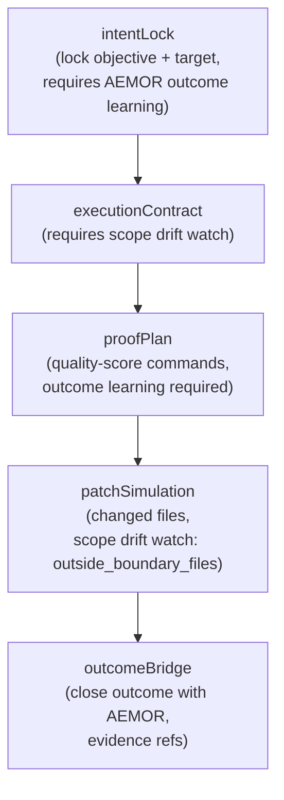
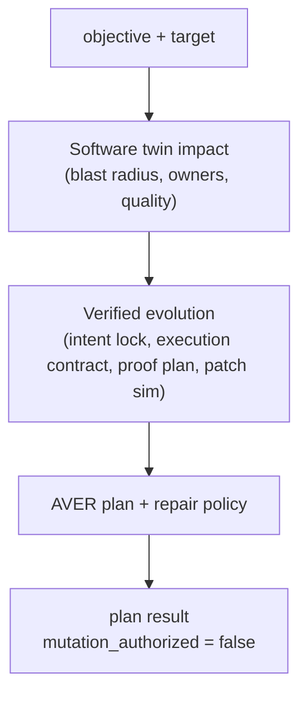

# Software twin and verified evolution

The software twin is a predictive impact simulator. It models a proposed change's blast radius, owners, duplication, drift, and quality before any mutation happens. The verified-evolution runtime turns an objective into a contract-first proof plan (intent lock, execution contract, proof plan, patch simulation, scope-drift watch, outcome bridge). The autonomous change orchestrator composes the two into a single `plan` that the loop calls before it is allowed to mutate. None of these authorize mutation; they produce the proof and contract that a separate authorizer acts on.

## Purpose

The problem these services solve is uncontrolled mutation. An autonomous loop that edits code without proving impact can saw off the branch it sits on. The twin simulates the impact first: which symbols, modules, docs, entrypoints, and tests a change touches, who owns them, whether the change duplicates existing work, whether it drifts, and what the quality score is. The verified-evolution runtime locks the intent, writes an execution contract, plans the proof, simulates the patch, watches for scope drift, and bridges the outcome. The orchestrator composes them so the loop has a single contract-first entry point that never itself authorizes mutation.

## Key abstractions

| Abstraction | File | Role |
|-------------|------|------|
| Software twin runtime | `app/Services/Engineering/AtlasSoftwareTwinRuntimeService.php` | Predictive impact twin; simulate, snapshot, predict |
| Impact graph | `app/Services/Engineering/AtlasSoftwareTwinImpactGraph.php` | Impact graph builder (target symbols to modules/docs/entrypoints/tests/causal paths) |
| Simulation predictor | `app/Services/Engineering/AtlasSoftwareTwinSimulationPredictor.php` | Prediction model for the twin |
| VE certification | `app/Services/Engineering/AtlasSoftwareTwinVerifiedEvolutionCertificationService.php` | Certifies a verified-evolution result against the twin |
| Verified evolution runtime | `app/Services/Engineering/AtlasVerifiedEvolutionRuntimeService.php` | Intent lock, execution contract, proof plan, patch simulation, scope drift, outcome bridge |
| Autonomous change orchestrator | `app/Services/Engineering/AtlasAutonomousChangeOrchestratorService.php` | Contract-first plan: twin impact to VE contract to AVER plan to repair policy |

## How it works

### Impact simulation

`AtlasSoftwareTwinRuntimeService::simulate(proposed)` builds an impact graph for a proposed change and predicts the consequences. The impact graph (`AtlasSoftwareTwinImpactGraph`) maps target symbols to the modules, doc links, entrypoints, tests, and causal paths they touch. The simulation predictor (`AtlasSoftwareTwinSimulationPredictor`) predicts:

| Predictor | What it predicts |
|-----------|------------------|
| `predictBlastRadius` | How far the change propagates |
| `predictOwner` | Who owns the touched code (confidence >= `OWNER_CONFIDENCE_FLOOR` = 80) |
| `predictDocDuplication` | Whether the change duplicates existing docs |
| `predictSymbolDuplication` | Whether the change duplicates existing symbols |
| `predictDrift` | Whether the change drifts from the doc spec |
| `predictVerdict` | The overall verdict (from duplicate, drift, owner review, degraded) |
| `predictBlockers` | The blockers for a given kind |

`impactGraphRag` and `impactGraphConfidence` build and score the impact graph from reachability, owner docs, tests, modules, doc links, and entrypoints. The twin is non-final (mockable) and has many schema versions (impact, graphrag, context, quality, snapshot, predictive).

### Snapshots

`snapshot(target)` writes an immutable snapshot of the twin's view to `atlas_software_twin_snapshots`. Snapshots are the provenance trail: they record what the twin believed about a target at a point in time, so a later change can be checked against the snapshot that authorized it.

### The verified-evolution contract

`AtlasVerifiedEvolutionRuntimeService` turns an objective and target into a contract-first proof chain. Each stage produces a versioned payload:

- `intentLock(objective, target)` locks the intent; it requires AEMOR outcome learning so the result is grounded in real outcomes.
- `executionContract(objective, target)` writes the execution contract; it requires a scope drift watch.
- `proofPlan(objective, target)` plans the proof, including quality-score commands (`atlas:software-twin quality-score`, `atlas:verified-evolution quality-score`) and outcome learning.
- `patchSimulation(objective, target, changedFiles)` simulates the patch and reports `scope_drift_watch.outside_boundary_files` for any file touched outside the allowed boundary.
- `outcomeBridge(objective, target, status, evidenceRefs)` closes the outcome with AEMOR, recording the outcome id and hash, and blocks if the outcome did not succeed.
- `qualityScore(objective, target)` computes the quality score against a floor of 85.

### The autonomous change orchestrator

`AtlasAutonomousChangeOrchestratorService::plan(objective, target, options)` is the single contract-first entry point the loop calls. It composes the twin and the verified-evolution runtime:

The orchestrator is explicit that it does not authorize mutation: the plan result carries `mutation_authorized = false` and `authorizes_mutation = false`. It produces the contract and proof; a separate authorizer (under the Self-Construction Government's separation of powers) decides whether to act on it.

### How it gates the loop before mutation

The autonomous evolution loop calls the orchestrator's `plan` before it mutates. The plan returns the twin's impact assessment, the verified-evolution contract, the proof plan, the patch simulation, and the scope-drift watch. If the patch simulation finds files outside the allowed boundary, or the quality score is below the floor, or the owner confidence is below the floor, the plan surfaces blockers. The loop's mutation gate consumes these blockers: a blocked plan means no mutation. This is the contract-first proof layer that sits between the loop and actual code changes. See [systems/evolution-loop/](../evolution-loop/index.md).

## Integration points

- **Code intelligence**: the twin's impact graph reads symbols, edges, reachability, and owner docs from the code intelligence read model; see [code intelligence and CodeGraph](code-intelligence-and-codegraph.md).
- **Reality cartography**: the twin uses ACRUI's reachability and owner docs; see [reality and cartography](reality-and-cartography.md).
- **Evolution loop**: the orchestrator's `plan` gates the loop before mutation; see [systems/evolution-loop/](../evolution-loop/index.md).
- **Self-construction government**: the orchestrator does not authorize mutation; a separate organ under separation of powers does; see [systems/self-construction-government/](../self-construction-government/index.md).
- **Evidence Ledger**: snapshots and outcome bridges are provenance the ledger can reference; see [concepts/knowledge-governance.md](../../concepts/knowledge-governance.md).
- **Anti-Goodhart**: the twin's duplication, drift, and quality predictors are the anti-proxy floor that stops a change from being declared good when it duplicates or drifts; see [concepts/anti-goodhart.md](../../concepts/anti-goodhart.md).
- **DB tables**: `atlas_software_twin_snapshots`.
- **Commands**: `atlas:software-twin`, `atlas:software-twin-verified-evolution:certify`, `atlas:verified-evolution quality-score`.

## Key source files

| File | Role |
|------|------|
| `app/Services/Engineering/AtlasSoftwareTwinRuntimeService.php` | Predictive impact twin |
| `app/Services/Engineering/AtlasSoftwareTwinImpactGraph.php` | Impact graph builder |
| `app/Services/Engineering/AtlasSoftwareTwinSimulationPredictor.php` | Prediction model |
| `app/Services/Engineering/AtlasSoftwareTwinVerifiedEvolutionCertificationService.php` | VE certification against the twin |
| `app/Services/Engineering/AtlasVerifiedEvolutionRuntimeService.php` | VE contract, proof, patch sim, outcome bridge |
| `app/Services/Engineering/AtlasAutonomousChangeOrchestratorService.php` | Contract-first change planner |
