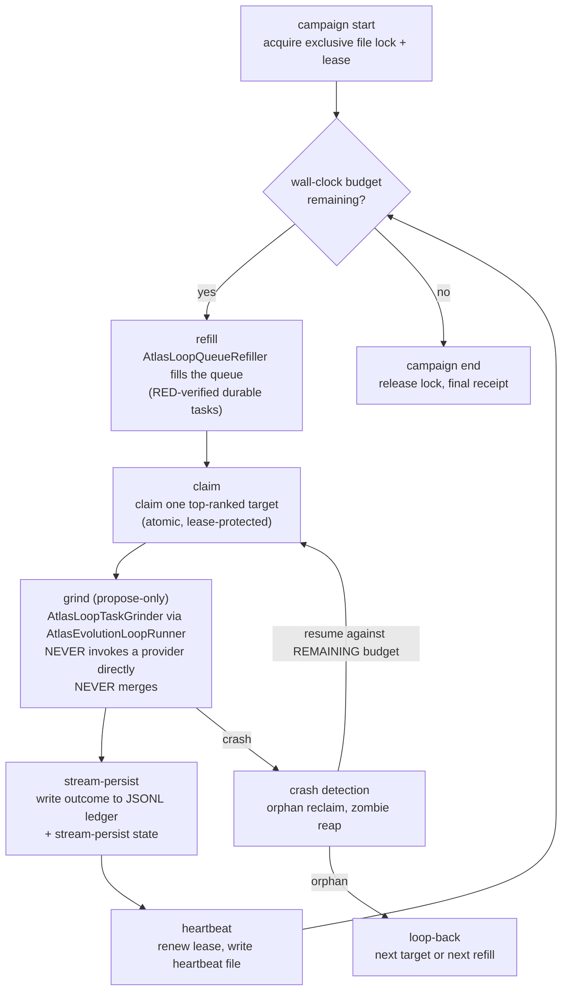

# Campaigns and runtime

The campaign supervisor is the loop as a 24/7 autonomous product. A campaign wraps many [8-phase cycles](the-8-phase-cycle.md) under a 24h wall-clock budget: refill the queue, claim a target, grind it (propose-only), persist the outcome, loop back. Around the supervisor sit multi-cycle coordination, parallelism, federation, antifragility and recovery, and telemetry and observability. Together they keep the grind honest, observable, antifragile, and multi-node.

## Purpose

A single cycle proves one evolution. The loop's job is to compound thousands of them, 24/7, without a human watching. The campaign supervisor is the durable wall-clock product that does that. It mirrors the proven file primitives of an earlier 24h runner (exclusive file lock with lease, kill/pause files, JSONL ledger, chunked responsive sleep), but the body is propose-only: it wraps the proven `AtlasEvolutionLoopRunner` via the grinder, never invokes a provider directly, and never merges. It deliberately does not route through any merge-capable session, because that stack's terminal action is merge-to-main, which is incompatible with a propose-only loop.

The wider runtime stack keeps the campaign alive and honest: parallelism fans grind work out to N workers, federation shares learned facts across machines, antifragility and recovery organs reap zombies and recover from crashes, and telemetry and observability organs detect proxy-drift, queue-drying, and stagnation before they become silent failures.

## Key abstractions

| Path | Role |
|---|---|
| `app/Services/Ai/AutonomousEvolution/Campaign/AtlasLoopCampaignSupervisor.php` | The 24h wall-clock campaign supervisor (refill, claim, grind, persist, loop-back; lock/lease/heartbeat/crash-recovery; propose-only) |
| `app/Services/Ai/AutonomousEvolution/Campaign/AtlasLoopCampaignCostGovernor.php` | Bounds campaign cost |
| `app/Services/Ai/AutonomousEvolution/Campaign/AtlasLoopCampaignCostMath.php` | Campaign cost math |
| `app/Services/Ai/AutonomousEvolution/Campaign/AtlasLoopCampaignFileStore.php` | File-based campaign state store |
| `app/Services/Ai/AutonomousEvolution/Campaign/AtlasLoopCampaignProviderHealthRecorder.php` | Records provider health during a campaign |
| `app/Services/Ai/AutonomousEvolution/Campaign/AtlasLoopGitHeadInspector.php` | Inspects the git head for code-drift restart |
| `app/Services/Ai/AutonomousEvolution/Campaign/AtlasLoopTerritoryClimbDecider.php` | Decides territory climbs |
| `app/Services/Ai/AutonomousEvolution/AtlasLoopFleetGovernor.php` | Root fleet governor (sizes and governs the worker fleet) |
| `app/Services/Ai/AutonomousEvolution/AtlasLoopFleetSizeAutotuner.php` | Autotunes the fleet size |
| `app/Services/Ai/AutonomousEvolution/MultiCycle/AtlasLoopMultiCycleCoordinationProtocol.php` | Coordinates work across cycles |
| `app/Services/Ai/AutonomousEvolution/MultiCycle/AtlasLoopMultiCycleSubScopePartitioner.php` | Partitions a scope into sub-scopes across cycles |
| `app/Services/Ai/AutonomousEvolution/Parallel/LoopWorkerPool.php` | Worker pool for grind fan-out |
| `app/Services/Ai/AutonomousEvolution/Parallel/LoopWorkerSpawner.php` | Spawns workers |
| `app/Services/Ai/AutonomousEvolution/Parallel/LoopWorkerCountPlanner.php` | Plans the worker count |
| `app/Services/Ai/AutonomousEvolution/Parallel/ScenarioWaveDispatcher.php` | Dispatches scenario waves to N workers |
| `app/Services/Ai/AutonomousEvolution/Federation/AtlasLoopFederationPeerRegistry.php` | Peer registry for multi-node loops |
| `app/Services/Ai/AutonomousEvolution/Federation/AtlasLoopFederationFactSyncProtocol.php` | Shares learned facts across peers |
| `app/Services/Ai/AutonomousEvolution/Federation/AtlasLoopFederationIsolationGuard.php` | Prevents a peer from poisoning another's scope |
| `app/Services/Ai/AutonomousEvolution/Federation/AtlasLoopFederationConsensusObserver.php` | Observes peer consensus |
| `app/Services/Ai/AutonomousEvolution/Federation/AtlasLoopAttributionInheritanceChannel.php` | Credit and provenance survive federation |
| `app/Services/Ai/AutonomousEvolution/Resilience/AtlasLoopZombieReaper.php` | Reaps zombie processes |
| `app/Services/Ai/AutonomousEvolution/Resilience/AtlasLoopHungGrindDetector.php` | Detects hung grinds |
| `app/Services/Ai/AutonomousEvolution/Resilience/AtlasLoopRespawnPolicy.php` | Respawn policy |
| `app/Services/Ai/AutonomousEvolution/ReentrySafety/AtlasLoopCycleCheckpointWriter.php` | Checkpoints a cycle for crash-resume |
| `app/Services/Ai/AutonomousEvolution/ReentrySafety/AtlasLoopCycleCheckpointReader.php` | Reads a cycle checkpoint |
| `app/Services/Ai/AutonomousEvolution/ReentrySafety/AtlasLoopCycleIdempotencyGuard.php` | Guards resume-exactly-once |
| `app/Services/Ai/AutonomousEvolution/Recovery/AtlasLoopBackupComposer.php` | Composes backups |
| `app/Services/Ai/AutonomousEvolution/Recovery/AtlasLoopReceiptReplayer.php` | Replays receipts to reconstruct state |
| `app/Services/Ai/AutonomousEvolution/Recovery/AtlasLoopRestoreVerifier.php` | Verifies a restore |
| `app/Services/Ai/AutonomousEvolution/Anomaly/AtlasLoopAnomalyDeviationDetector.php` | Detects deviation from baseline |
| `app/Services/Ai/AutonomousEvolution/Anomaly/AtlasLoopAnomalyBaselineReporter.php` | Reports the baseline |
| `app/Services/Ai/AutonomousEvolution/Anomaly/AtlasLoopAnomalyDigestEmitter.php` | Emits an anomaly digest |
| `app/Services/Ai/AutonomousEvolution/Simulation/AtlasLoopSimulationDryRunner.php` | Dry-runs a change safely |
| `app/Services/Ai/AutonomousEvolution/Simulation/AtlasLoopSimulationSandboxBuilder.php` | Builds a sandbox for dry runs |
| `app/Services/Ai/AutonomousEvolution/ModelCheck/AtlasLoopCycleDeadlockChecker.php` | Model-checks the cycle state machine for deadlock |
| `app/Services/Ai/AutonomousEvolution/ModelCheck/AtlasLoopCycleStateMachineExtractor.php` | Extracts the cycle state machine |
| `app/Services/Ai/AutonomousEvolution/SchemaFuzz/AtlasLoopSchemaFuzzPayloadGenerator.php` | Fuzzes schema contracts |
| `app/Services/Ai/AutonomousEvolution/Antifragile/AtlasLoopChaosSignalLabeler.php` | Labels chaos signals |
| `app/Services/Ai/AutonomousEvolution/Antifragile/AtlasLoopMetaObjectiveProposer.php` | Turns chaos signals into meta-objectives |
| `app/Services/Ai/AutonomousEvolution/Telemetry/AtlasLoopTelemetryFactStreamEmitter.php` | Emits the telemetry fact stream |
| `app/Services/Ai/AutonomousEvolution/Telemetry/AtlasLoopTelemetryFactSchemaRegistry.php` | Schema registry for telemetry facts |
| `app/Services/Ai/AutonomousEvolution/Telemetry/AtlasLoopTelemetryFactWindowAggregator.php` | Aggregates rolling windows |
| `app/Services/Ai/AutonomousEvolution/Telemetry/AtlasLoopTelemetryStarvationDetector.php` | Detects starvation |
| `app/Services/Ai/AutonomousEvolution/Observability/AtlasLoopProxyDriftFactDetector.php` | Detects the loop drifting to proxy metrics |
| `app/Services/Ai/AutonomousEvolution/Observability/AtlasLoopQueueDryingAlarmDetector.php` | Detects the queue drying up |
| `app/Services/Ai/AutonomousEvolution/Observability/AtlasLoopStagnationAlarmDetector.php` | Detects stagnation |
| `app/Services/Ai/AutonomousEvolution/Metrics/AtlasLoopE2ECycleLiveness.php` | E2E cycle liveness metric |
| `app/Services/Ai/AutonomousEvolution/Metrics/AtlasLoopSupplyLaneGenuineYield.php` | Supply-lane genuine yield metric |
| `app/Services/Ai/AutonomousEvolution/Metrics/AtlasLoopThrashLossRate.php` | Thrash-loss rate metric |
| `app/Services/Ai/AutonomousEvolution/AuditTrail/AtlasLoopAuditTrailComposer.php` | Composes the tamper-evident audit timeline |
| `app/Services/Ai/AutonomousEvolution/AuditTrail/AtlasLoopAuditTrailIntegrityVerifier.php` | Verifies audit-trail integrity |
| `app/Services/Ai/AutonomousEvolution/PatternEmergence/AtlasLoopCrossCyclePatternMiner.php` | Mines stable patterns across cycles |

## How it works

### The campaign supervisor lifecycle

`AtlasLoopCampaignSupervisor` (~94KB) is the 24h wall-clock loop. The lifecycle is `refill -> claim -> grind (propose-only) -> stream-persist -> loop-back` under a wall-clock budget.

The supervisor's invariants:

- **Wall-clock budget with accrual.** `elapsed_seconds` accrues only while actively working (grind plus refill). Paused time never burns budget, and a crash-resumed campaign resumes against REMAINING budget, not against the original 24h. Test seams (clock, sleeper, storage) make the budget and crash-resume provable without a real 24h wait.
- **Exclusive file lock with lease plus orphan reclaim.** Only one campaign runs at a time per scope. A crashed campaign's lock is reclaimed after the lease expires, so a dead process never wedges the loop.
- **Kill and pause switch.** A kill file or pause file breaks the loop. The master switch (`ATLAS_LOOP_MASTER_ENABLED`) is checked before any start.
- **Heartbeat.** A heartbeat file is written each loop, so a watchdog can tell a live campaign from a dead one.
- **Crash recovery.** The supervisor resumes a crashed campaign from its persisted state, not from scratch. The reentry-safety organs (below) guarantee resume-exactly-once.
- **Propose-only.** The body wraps the proven `AtlasEvolutionLoopRunner` via the grinder. It never invokes a provider directly and never merges. It deliberately does not route through any merge-capable session.
- **Code-drift restart.** `AtlasLoopGitHeadInspector` detects when the repo head has moved (the operator merged something, or another agent committed). A code-drift restart re-reads the working tree so the campaign grinds against current truth, not a stale snapshot.

`AtlasLoopCampaignCostGovernor` bounds campaign cost. `AtlasLoopCampaignCostMath` does the cost math. `AtlasLoopCampaignFileStore` is the file-based state store. `AtlasLoopCampaignProviderHealthRecorder` records provider health during a campaign. `AtlasLoopPipelineDrift` detects pipeline drift. `AtlasLoopTerritoryClimbDecider` decides territory climbs (the scope-release ladder; see [work discovery and origination](work-discovery-and-origination.md)).

### Multi-cycle coordination

`MultiCycle/` coordinates work across cycles and partitions a scope into sub-scopes. `AtlasLoopMultiCycleCoordinationProtocol` is the coordination protocol. `AtlasLoopMultiCycleSubScopePartitioner` partitions a scope into sub-scopes so multiple cycles can grind different parts of the same scope in parallel without overlap. `AtlasLoopMultiCycleReceiptLedger` records the coordination receipts.

`PatternEmergence/AtlasLoopCrossCyclePatternMiner` mines stable patterns emerging across cycles. A pattern is mined only when it is stable (it recurred across enough cycles and passed the stability checker, `AtlasLoopCrossCyclePatternStabilityChecker`). Mined patterns flow into the [pattern engine](recursive-self-improvement.md) registry via `AtlasLoopCrossCyclePatternReceiptLedger`. This is how the loop learns what works across cycles, not just within one.

### Parallelism

`Parallel/` fans grind work out to N workers. `LoopWorkerCountPlanner` plans the worker count. `LoopWorkerPool` is the pool. `LoopWorkerSpawner` (plus `LoopWorkerSpawnerContract`) spawns workers. `LoopWorkerHandle` is the handle a spawned worker carries. `ScenarioWaveDispatcher` (plus `ScenarioWaveDispatcherContract`) dispatches scenario waves to N workers, so the best-of-N strategy portfolio can run in parallel.

The root `AtlasLoopFleetGovernor` sizes and governs the worker fleet, and `AtlasLoopFleetSizeAutotuner` autotunes the fleet size based on observed throughput and cost. The fleet is the Kubernetes-style control plane for the loop's workers. See [self-construction-government](../self-construction-government/index.md) for the government that governs the fleet, and [concepts/earned-autonomy](../../concepts/earned-autonomy.md) for the fail-closed master switch (`ATLAS_FLEET_ENABLED`, default OFF).

### Federation

`Federation/` is the multi-node loop. `AtlasLoopFederationPeerRegistry` is the peer registry. `AtlasLoopFederationFactSyncProtocol` shares learned facts across peers (so a fact learned on one node propagates to the others). `AtlasLoopFederationIsolationGuard` prevents a peer from poisoning another's scope (a peer can only write to its own scope). `AtlasLoopFederationConsensusObserver` observes peer consensus. `AtlasLoopAttributionInheritanceChannel` ensures credit and provenance survive federation (a fact learned on node A and used on node B still attributes to A). `AtlasLoopAutopoieticScopeGovernancePipeline` governs autopoietic scope across the federation.

### Antifragility and recovery

A 24/7 grind that cannot recover from disorder is fragile. The loop is built to get stronger from it.

**Resilience.** `Resilience/AtlasLoopZombieReaper` reaps zombie processes (a worker that crashed but left a process). `AtlasLoopHungGrindDetector` detects grinds that have been running too long (over the `ATLAS_LOOP_GRIND_MAX_SECONDS` ceil). `AtlasLoopRespawnPolicy` decides whether and how to respawn a dead worker. `AtlasLoopProcessTopologyProbe` probes the process topology. `AtlasLoopResilienceReceiptLedger` records the resilience receipts.

**Reentry safety.** `ReentrySafety/AtlasLoopCycleCheckpointWriter` checkpoints a cycle so it can resume after a crash. `AtlasLoopCycleCheckpointReader` reads the checkpoint. `AtlasLoopCycleIdempotencyGuard` guards resume-exactly-once (a cycle that crashed mid-grind is resumed exactly once, never twice). `AtlasLoopCycleReentryReceiptLedger` records the reentry receipts.

**Recovery.** `Recovery/AtlasLoopBackupComposer` composes backups. `AtlasLoopReceiptReplayer` replays receipts to reconstruct state from the evidence ledger. `AtlasLoopRestoreVerifier` (plus `AtlasLoopRestoreVerificationResult`) verifies a restore matches the receipts.

**Anomaly.** `Anomaly/AtlasLoopAnomalyDeviationDetector` detects deviation from baseline. `AtlasLoopAnomalyBaselineReporter` reports the baseline. `AtlasLoopAnomalyDigestEmitter` emits an anomaly digest. `AtlasLoopAnomalyReceiptLedger` records the anomaly receipts.

**Simulation.** `Simulation/AtlasLoopSimulationDryRunner` dry-runs a change in a sandbox before it touches the tree. `AtlasLoopSimulationSandboxBuilder` builds the sandbox. `AtlasLoopSimulationReceiptLedger` records the simulation receipts.

**Model check.** `ModelCheck/AtlasLoopCycleDeadlockChecker` model-checks the cycle state machine for deadlock. `AtlasLoopCycleStateMachineExtractor` extracts the cycle state machine. `AtlasLoopCycleModelCheckCli` is the CLI for model checking.

**Schema fuzz.** `SchemaFuzz/AtlasLoopSchemaFuzzPayloadGenerator` fuzzes schema contracts (generates malformed payloads to find contract violations). `AtlasLoopSchemaFuzzReporter` reports the fuzz results. `AtlasLoopSchemaFuzzReceiptLedger` records the fuzz receipts.

**Antifragile.** `Antifragile/AtlasLoopChaosSignalLabeler` labels chaos signals (disorder the loop observed). `AtlasLoopMetaObjectiveProposer` turns labeled chaos signals into meta-objectives, so disorder strengthens the loop instead of weakening it. This is the antifragility doctrine made concrete: the loop does not just survive disorder, it learns from it. See [recursive self-improvement](recursive-self-improvement.md) for the V4 meta-objective origination that consumes these.

### Telemetry, observability, and the audit trail

**Telemetry.** `Telemetry/AtlasLoopTelemetryFactStreamEmitter` emits a fact stream (schema-registered via `AtlasLoopTelemetryFactSchemaRegistry`). `AtlasLoopTelemetryFactWindowAggregator` aggregates rolling windows (plus `RollingWindows/`). `AtlasLoopTelemetryFactExporter` exports the facts. `AtlasLoopTelemetryStarvationDetector` detects starvation (a supply lane producing no real work). `AtlasLoopTelemetryEventProducer` produces telemetry events. The fact stream is schema-registered so consumers know the shape of every fact.

**Observability.** `Observability/` raises alarms that detect the loop failing in the specific ways an autonomous 24/7 engine fails silently. `AtlasLoopProxyDriftFactDetector` detects the loop drifting to proxy metrics (the anti-Goodhart alarm). `AtlasLoopQueueDryingAlarmDetector` detects the queue drying up (a supply lane starving). `AtlasLoopStagnationAlarmDetector` detects stagnation (the loop running but not producing real progress). `AtlasLoopCycleSignalEmitter` emits cycle signals. These alarms are the early-warning system that turns a silent failure into a surfaced one.

**Metrics.** `Metrics/` computes honest health metrics. `AtlasLoopE2ECycleLiveness` measures end-to-end cycle liveness (is the cycle actually completing, or stuck?). `AtlasLoopSupplyLaneGenuineYield` measures supply-lane genuine yield (is a lane producing REAL accepted work, or thrash?). `AtlasLoopThrashLossRate` measures the thrash-loss rate (how much grind effort is wasted on work that never certifies). `AtlasLoopPrimitiveArmedRatio` measures the primitive-armed ratio (how many frozen primitives are armed vs disarmed). These are honest metrics: they measure real progress, not proxy counts. See [concepts/anti-goodhart](../../concepts/anti-goodhart.md).

**Audit trail.** `AuditTrail/AtlasLoopAuditTrailComposer` composes a tamper-evident audit timeline. `AtlasLoopAuditTrailIntegrityVerifier` verifies the timeline's integrity. `AtlasLoopAuditTrailExporter` exports the timeline. `AtlasLoopAuditTrailReplayer` replays it. The value objects (`AuditEvent`, `ExportManifest`, `IntegrityReport`, `ReplayReport`, `TimelineWindow`) support the timeline. The audit trail is the tamper-evident, replayable record of what the loop did, when, and why, across the whole campaign.

`WeeklyDigest/` rolls up a weekly digest, plus the root `AtlasLoopMorningDigestService` and `AtlasLoopWeeklyAgendaProposalService`.

## Integration points

- The campaign supervisor wraps the [8-phase cycle](the-8-phase-cycle.md). Each grind is one cycle (or one target within a cycle).
- The refill step uses the [work discovery](work-discovery-and-origination.md) queue refiller to fill the task queue.
- The propose-only body wraps `AtlasEvolutionLoopRunner` via the grinder; the certify and merge organs are the [quality gates](quality-gates-and-certification.md) and [merge governor](merge-governor.md).
- The master switch and the shell watchdogs that keep the campaign alive are covered in [cli-operator/watchdogs-and-master-switch](../cli-operator/watchdogs-and-master-switch.md).
- The pétreo floor that protects the campaign's own organs is covered in [self-modification safety](self-modification-safety.md).
- The cross-cycle pattern mining feeds the [pattern engine](recursive-self-improvement.md).
- The fleet governor is governed by the [self-construction-government](../self-construction-government/index.md).
- The anti-Goodhart alarms and honest metrics are covered in [concepts/anti-goodhart](../../concepts/anti-goodhart.md).
- The fail-closed fleet and loop switches are covered in [concepts/earned-autonomy](../../concepts/earned-autonomy.md).

## Operating the loop

### Artisan commands

The loop is driven by `atlas:loop:*` and `atlas:brain:*` artisan commands dispatched through `bin/atlas`. Representative commands:

- **Lifecycle:** `atlas:loop:on` / `atlas:loop:off` (master switch), `atlas:loop:campaign` (plus `:status`, `:stop`), `atlas:loop:keepalive`, `atlas:loop:reap-orphans`, `atlas:loop:reclaim-orphaned-grinds`, `atlas:loop:soak`, `atlas:loop:pause-resume`, `atlas:loop:steer <campaign> <note>`.
- **8-phase / live cycle:** `atlas:loop:cycle` (plus `:run`, `:inspect`, `:history`), `atlas:loop:cycle:run` (plus `start`, `resume`, `status`, `audit`), `atlas:loop:cycle-reentry`, `atlas:loop:comprehend <scope>`, `atlas:loop:comprehension` (plus `snapshot`, `diff`, `stale`).
- **Decide / originate / architect:** `atlas:loop:originate`, `atlas:loop:want`, `atlas:loop:seed-feature`, `atlas:loop:auto-architecture`, `atlas:loop:ambition-faculty`, `atlas:loop:weekly-agenda`.
- **Certify / verify:** `atlas:loop:certify-implementation`, `atlas:loop:verify-proposals`, `atlas:loop:mutation-gate`, `atlas:loop:cross-file-consumer-gate`, `atlas:loop:netdiff-cert`, `atlas:loop:coverage-gaps`, `atlas:loop:bench`.
- **Merge / promote:** `atlas:loop:promote`, `atlas:loop:obra-bridge`, `atlas:loop:migrate`, `atlas:loop:automerge`, `atlas:loop:main-health`.
- **Brain:** `atlas:brain:next <scope>`, `atlas:brain:seed`, `atlas:brain:worker-prompt`, `atlas:brain:state`, `atlas:brain:scopes`, `atlas:brain:metrics`, `atlas:brain:cycle-capsule`, `atlas:brain:frontier-ingest`, `atlas:brain:health-doctor`.
- **Recovery / resilience / observability:** `atlas:loop:recovery`, `atlas:loop:retention`, `atlas:loop:model-check`, `atlas:loop:anomaly`, `atlas:loop:observability:dashboard`, `atlas:loop:telemetry`, `atlas:loop:schema-fuzz`, `atlas:loop:simulate`, `atlas:loop:conflict`.
- **Self / patterns / task-class / feedback:** `atlas:loop:selfmod`, `atlas:loop:self` (architecture, deps, coverage), `atlas:loop:patterns`, `atlas:loop:task-class`, `atlas:loop:feedback`, `atlas:loop:coherence`, `atlas:loop:fact-anchor`, `atlas:loop:fact:bounds`.
- **Trinity / quaternity / cortex / federation / multi-cycle:** `atlas:loop:trinity` (plus `:contract-audit`, `-drift`, `-receipts`, dashboard), `atlas:loop:quaternity` dashboard, `atlas:loop:cortex:*`, `atlas:loop:federation`, `atlas:loop:multi-cycle`, `atlas:loop:intent` (plus `:resolve`, `:drift`).
- **Receipts / digests / dashboards:** `atlas:loop:receipt` (plus `:unified`), `atlas:loop:delivery-dossier`, `atlas:loop:morning-digest`, `atlas:loop:audit`, `atlas:loop:overview`, `atlas:loop:honest-progress`, `atlas:loop:capability-trend`, `atlas:loop:dashboard:trinity`, `atlas:loop:dashboard:quaternity`.
- **Top-level:** `atlas:unified-loop` (plus `:report`, `:supervisor`, `:install-launchd`), `atlas:evolution-loop`, `atlas:self-construction:runtime`, `atlas:self-construction:continuous-runtime`.

### Watchdog scripts

The shell supervision stack in `bin/` keeps the campaign alive without a human. See [cli-operator/watchdogs-and-master-switch](../cli-operator/watchdogs-and-master-switch.md) for the full stack:

| Script | Role |
|---|---|
| `bin/atlas-loop-watchdog.sh` | Controlled self-heal watchdog: kill over-budget grinds, drain certified to main, revert green-in-isolation/red-in-combination, respawn dead campaign (only if none alive), top up the queue |
| `bin/atlas-loop-watchdog-supervised.sh` | Respawns the watchdog itself on crash |
| `bin/atlas-loop-babysit-watchdog.sh` | Propose-only babysit (NO automerge) |
| `bin/atlas-brain-soak.sh` | Drives the brain cycle (comprehend to originate to author to gate to seed) |
| `bin/atlas-loop-report-recorder.sh` | Regenerates the merge-facts log every 2 minutes |
| `bin/atlas` | The CLI launcher (injects `--workspace=$CWD`, dispatches the 1,227 artisan commands) |

Every one of these scripts greps the same `ATLAS_LOOP_MASTER_ENABLED` line in `.env` before respawning a campaign. Absent, unreadable, or not-truthy means the loop is off and the scripts respawn nothing. The brain scripts grep `ATLAS_BRAIN_MASTER_ENABLED` the same way. Launchd install is via `atlas:loop:unified:install-launchd`.

### Config keys

The central switchboard is `config/atlas.php`. The `loop` block (around line 1937) and the `campaign` sub-block (around line 3521) hold the runtime knobs. Key flags:

- **Master and safety:** `ATLAS_LOOP_MASTER_ENABLED` (`.env`, fail-closed), `loop.propose_only` (default true), `loop.recursive_self_improvement_auto_apply` (default OFF), `loop.author_judge_overlap_gate_enabled` (default ON), `loop.overfit_probe_enabled` (default ON).
- **Search and explore:** `loop.scenarios_per_task`, `loop.max_scenarios_per_task`, `loop.search_patience`, `loop.scenario_provider_portfolio`, `loop.deep_strategy_portfolio`, `loop.cross_provider_best_of_n`, `loop.escalation_strong_provider`, `loop.max_seconds_per_scenario`, `loop.default_provider`.
- **Certify and judge:** `loop.cross_model_triangulation_enabled`, `loop.decision_min_refactor_cyclomatic`, `loop.decision_unmeasured_offset_ceiling`.
- **Origination:** `loop.contract_gap_origination_enabled`, `loop.origination_refusal_memory_enabled`, `loop.origination_queue_dedup_enabled`, `loop.leverage_first_origination_enabled`.
- **Brain:** `atlas.brain.master_enabled` (default OFF, fail-closed), `atlas.brain.journal_root`, `atlas.brain.done_set_root`, `atlas.brain.cycle_capsule_root`, `atlas.brain.writer_timeout_seconds`, `atlas.brain.default_scope` (`autonomous`), `atlas.brain.scopes[].roots`, `atlas.brain.scopes[].docs_roots`, `atlas.brain.scopes[].meta_harness`, `atlas.brain.reflection_enabled`, `atlas.brain.scope_signal_digest_enabled` (default ON), `atlas.brain.paths` (the 7-path portfolio).
- **Receipts:** `atlas.ai.loop.cycle_receipt_chain_path`.

### DB tables

The campaign and task state live in PostgreSQL. The cycle and unified receipt chains are JSONL files under `storage/app/atlas/loop/`, not DB tables. The brain is deliberately file-backed (NDJSON/JSONL ledgers under `storage/app/atlas/brain/` plus `docs/loop-evolution-journal/`), not DB-backed.

| Table | Holds |
|---|---|
| `atlas_loop_campaigns` | Campaign state (scope, budget, lock, lease, heartbeat) |
| `atlas_loop_tasks` | Queued and in-flight tasks |
| `atlas_loop_proposals` | Proposals |
| `atlas_loop_explorations` | Explorations |
| `atlas_loop_targets` | Discovered targets |
| `atlas_loop_pipeline_state` | Pipeline state |
| `atlas_loop_decomposition_outcomes` | Decomposition outcomes |
| `atlas_loop_origination_outcomes` | Origination outcomes |
| `atlas_loop_delivery_contracts` | Delivery contracts |
| `atlas_loop_failure_handles` | Failure handles |
| `atlas_loop_confidence_samples` | Confidence samples |
| `atlas_loop_test_coverage_edges` | Test coverage edges |
| `atlas_loop_clarification_requests` | Clarification requests |
| `atlas_loop_goodhart_receipts` | Goodhart receipts |

## Key source files

| File | What it does |
|---|---|
| `app/Services/Ai/AutonomousEvolution/Campaign/AtlasLoopCampaignSupervisor.php` | The 24h wall-clock campaign (refill, claim, grind, persist, loop-back; lock/lease/heartbeat/crash-recovery; propose-only) |
| `app/Services/Ai/AutonomousEvolution/Campaign/AtlasLoopCampaignCostGovernor.php` | Bounds campaign cost |
| `app/Services/Ai/AutonomousEvolution/AtlasLoopFleetGovernor.php` | Root fleet governor |
| `app/Services/Ai/AutonomousEvolution/AtlasLoopFleetSizeAutotuner.php` | Autotunes fleet size |
| `app/Services/Ai/AutonomousEvolution/MultiCycle/AtlasLoopMultiCycleCoordinationProtocol.php` | Coordinates work across cycles |
| `app/Services/Ai/AutonomousEvolution/Parallel/LoopWorkerPool.php` | Worker pool for grind fan-out |
| `app/Services/Ai/AutonomousEvolution/Parallel/ScenarioWaveDispatcher.php` | Dispatches scenario waves to N workers |
| `app/Services/Ai/AutonomousEvolution/Federation/AtlasLoopFederationFactSyncProtocol.php` | Shares learned facts across peers |
| `app/Services/Ai/AutonomousEvolution/Federation/AtlasLoopFederationIsolationGuard.php` | Prevents peer scope poisoning |
| `app/Services/Ai/AutonomousEvolution/Resilience/AtlasLoopZombieReaper.php` | Reaps zombie processes |
| `app/Services/Ai/AutonomousEvolution/ReentrySafety/AtlasLoopCycleIdempotencyGuard.php` | Guards resume-exactly-once |
| `app/Services/Ai/AutonomousEvolution/Recovery/AtlasLoopRestoreVerifier.php` | Verifies a restore |
| `app/Services/Ai/AutonomousEvolution/Observability/AtlasLoopProxyDriftFactDetector.php` | Proxy-drift alarm |
| `app/Services/Ai/AutonomousEvolution/Metrics/AtlasLoopE2ECycleLiveness.php` | E2E cycle liveness metric |
| `app/Services/Ai/AutonomousEvolution/AuditTrail/AtlasLoopAuditTrailIntegrityVerifier.php` | Tamper-evident audit-trail verification |
| `app/Services/Ai/AutonomousEvolution/PatternEmergence/AtlasLoopCrossCyclePatternMiner.php` | Mines stable patterns across cycles |
| `bin/atlas-loop-watchdog.sh` | The self-heal watchdog |
| `bin/atlas-brain-soak.sh` | Drives the brain cycle |
| `config/atlas.php` (loop block ~line 1937; campaign sub-block ~line 3521) | The central switchboard |
