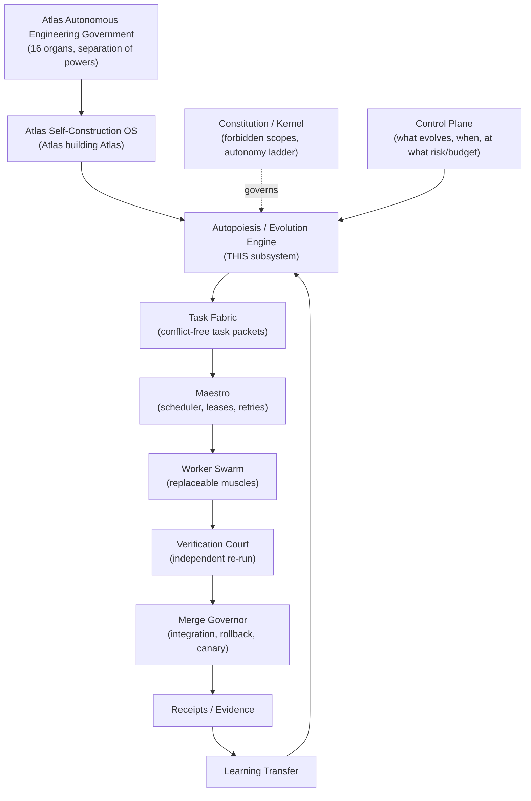
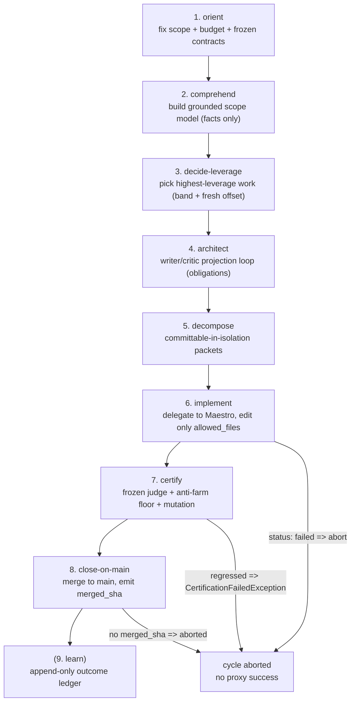

# Autonomous Evolution Loop

The Autonomous Evolution Loop (a.k.a. **ACDE / Autopoiesis-Evolution Engine**) is Atlas's crown-jewel organ. Given a **scope** (e.g. "Atlas Dev", the loop itself, the memory subsystem) it grinds 24/7 to evolve that scope to its maximum level, exponentially. The unit of work is a strict, sequential **8-phase cycle** (orient, comprehend, decide-leverage, architect, decompose, implement, certify, close-on-main). The human reviewer is replaced by a frozen out-of-process judge, a diff-earned anti-farm floor, cross-model triangulation, mutation testing, and a fail-closed merge gate. An immutable FORBIDDEN core stops the loop from editing the gates that judge it.

## Purpose

The loop's job is real capability, structural, and autonomy leaps, never cleanup-for-its-own-sake and never proxy-metric optimization (cyclomatic count, test count, line count). A refactor that preserves behavior counts as zero improvement. When the obvious reactive work dries up, the loop does not stop: an **ambition faculty** originates the next real leap rather than idling. The loop is the only thing in Atlas that evolves Atlas 24/7, alone, without a human or another AI reviewing each change.

The canonical definition lives in `docs/loop-canonical-definition.md`. The operator repeated that definition five times to lock it, because AIs (including Claude) drifted for days. Any doc, code, or agent that diverges from it is wrong.

## What the loop is, and is not

| The loop IS | The loop is NOT |
|---|---|
| An engine that takes a scope and grinds it to its maximum level, exponentially | The whole Self-Construction OS. It is one organ under the government. |
| Real capability/structural/autonomy leaps, proven by evidence | Micro-editing, janitorial work (removing lines/spaces), proxy optimization |
| A continuous commit-by-patch process, never one-shot | Patience / best-of-N / give-up-on-first-failure |
| Frontier projection plus cross-model critique in a loop (the phase that guarantees quality) | A single agent that writes, judges, merges, and promotes its own work |
| Originating the next leap when reactive work dries up | Stopping when the reactive list is empty ("I finished the list") |

### Anti-Goodhart spine

Before the loop touches anything it asks: *does this evolve the scope exponentially, leaving Atlas more capable?* If the answer is a small edit, janitorial work, or a proxy metric, the loop stops. One AI drifted into proxy work for days; the loop is built so that cannot recur. See [concepts/anti-goodhart](../../concepts/anti-goodhart.md).

### Ambition faculty

A scope given to the loop has no ceiling. The loop lives the scope, always raising the level. A dumb loop stops when the reactive work runs out. An intelligent loop hits that limit and surpasses it: when the reactive work dries up it asks *how can I be fundamentally more powerful, intelligent, resilient, autonomous?* and **originates** the next leap as real, proven work, never fake. This is the **faculdade de ambição** (ambition faculty). See [work discovery and origination](work-discovery-and-origination.md).

## Place in the hierarchy

The loop is no longer the name of the whole OS. The final 24/7 architecture is the **Atlas Autonomous Engineering Government**, documented in `docs/engineering-knowledge-base/atlas-autonomous-engineering-government.md`. Inside it, the **Atlas Self-Construction OS** governs Atlas-building-Atlas. The loop is the **Autopoiesis / Evolution Engine**, one recursive-evolution organ under the constitution, control plane, task fabric, Maestro, verification court, merge governor, receipts, and knowledge sync.

Separation of powers is enforced: observe, decide-value, architect, decompose, schedule, execute, verify, merge, and learn are distinct organs. One agent must not span originate through promote. See [self-construction-government](../self-construction-government/).

## Directory layout

All loop code lives under `app/Services/Ai/AutonomousEvolution/`. The subsystem spans **~120 directories and ~870 PHP files**, making it the single largest subsystem in Atlas. The major clusters:

| Directory | Role |
|---|---|
| `app/Services/Ai/AutonomousEvolution/LiveCycle/` | The canonical 8-phase conductor and phase runners |
| `app/Services/Ai/AutonomousEvolution/Campaign/` | The 24h wall-clock campaign supervisor |
| `app/Services/Ai/AutonomousEvolution/Discovery/` | Scope comprehension model, target discovery, queue refiller, deciders, supply lanes |
| `app/Services/Ai/AutonomousEvolution/Brain/` | The external brain: ~90 read-only perception organs + the cycle/internalization substrate |
| `app/Services/Ai/AutonomousEvolution/Merge/` | The decomposed merge governor (preflight, conflict, staleness, reverse, receipt) |
| `app/Services/Ai/AutonomousEvolution/Receipts/` | Signed, tamper-evident cycle receipt chain |
| `app/Services/Ai/AutonomousEvolution/UnifiedReceipts/` | Per-cycle phase receipt chain the conductor records into |
| `app/Services/Ai/AutonomousEvolution/Constitution/` | Frozen batteries, merge actuator, main-health sentinel |
| `app/Services/Ai/AutonomousEvolution/Frozen/` | Frozen contract registry, auditor, drift detector, receipt ledger |
| `app/Services/Ai/AutonomousEvolution/FrozenContracts/` | Frozen contract auto-sentinel, coverage, fact extractor, retirement gate |
| `app/Services/Ai/AutonomousEvolution/Verify/` | Comprehension grounding gate, signal analyzer |
| `app/Services/Ai/AutonomousEvolution/SelfMod/` | Self-modification safety: edit classifier, invariant extractor and survival checker, formal proofs |
| `app/Services/Ai/AutonomousEvolution/Introspection/` | The loop's self-model: architecture scanner, capability coverage, dependency graph |
| `app/Services/Ai/AutonomousEvolution/SelfModel/` | Learned-grader corpus pipeline (corpus, eval, oracle, promotion, registry, training) |
| `app/Services/Ai/AutonomousEvolution/Autopoiesis/` | Self-creation: constitution, scope origination, self-extension |
| `app/Services/Ai/AutonomousEvolution/V2/`, `V3/`, `V4/` | Architecture generations of the self-construction ladder |
| `app/Services/Ai/AutonomousEvolution/Trinity/`, `Quaternity/` | 3-way and 4-way coupling of loop, Maestro, cortex/muscle, and operator intent |
| `app/Services/Ai/AutonomousEvolution/Aael/` | Atlas Autonomous Execution Layer (safe execution substrate) |
| `app/Services/Ai/AutonomousEvolution/Pattern/`, `PatternEmergence/` | Learned-pattern engine and cross-cycle pattern mining |
| `app/Services/Ai/AutonomousEvolution/MultiCycle/`, `Consolidation/`, `Retention/` | Multi-cycle coordination, refiller control plane, snapshot retention |
| `app/Services/Ai/AutonomousEvolution/Parallel/`, `Federation/` | Worker fan-out and multi-node federation |
| `app/Services/Ai/AutonomousEvolution/Resilience/`, `Recovery/`, `ReentrySafety/`, `Anomaly/`, `Simulation/`, `ModelCheck/`, `SchemaFuzz/`, `Antifragile/` | Antifragility, resilience, recovery, reentry safety, anomaly, simulation, model-check, schema-fuzz |
| `app/Services/Ai/AutonomousEvolution/Telemetry/`, `Observability/`, `Metrics/`, `AuditTrail/`, `WeeklyDigest/` | Telemetry, observability, honest metrics, tamper-evident audit trail, digests |
| `app/Services/Ai/AutonomousEvolution/TaskClassDiscovery/`, `CausalGraph/`, `Coherence/`, `SymbolicAnchoring/`, `BehaviorDelta/`, `Sentinels/`, `Feedback/`, `FactConfidence/` | Discovery-intelligence organs feeding origination |
| `app/Services/Ai/AutonomousEvolution/Cortex/` | The provider-portable universal-facts comprehension contract |

## Key abstractions

| Path | Role |
|---|---|
| `app/Services/Ai/AutonomousEvolution/LiveCycle/AtlasLoopFullCycleConductor.php` | The canonical 8-phase conductor; sequential, abort-on-fail, requires non-null `merged_sha` |
| `app/Services/Ai/AutonomousEvolution/Campaign/AtlasLoopCampaignSupervisor.php` | The 24h wall-clock campaign supervisor (orient anchor) |
| `app/Services/Ai/AutonomousEvolution/Discovery/AtlasLoopScopeComprehensionModelBuilder.php` | Builds the grounded scope model (comprehend anchor) |
| `app/Services/Ai/AutonomousEvolution/AtlasLoopComprehensionOriginator.php` | Cross-model origination; writer proposes, deterministic inventory judge refutes (writer != judge) |
| `app/Services/Ai/AutonomousEvolution/Discovery/AtlasLoopNextWorkDecider.php` | Ungameable next-work priority = band(shape) + fresh-leverage offset |
| `app/Services/Ai/AutonomousEvolution/AtlasLoopLeverageSelector.php` | Frontier-model highest-leverage pick among grounded candidates |
| `app/Services/Ai/AutonomousEvolution/AtlasLoopGroundedProjectionRoles.php` | Grounded designer/critic obligations (architect anchor) |
| `app/Services/Ai/AutonomousEvolution/AtlasLoopProjectionEngine.php` | Sound writer/critic convergence machine; park on oscillation |
| `app/Services/Ai/AutonomousEvolution/LiveCycle/AtlasLoopImplementPhaseRunner.php` | Pure Maestro delegate; artifacts-only receipt |
| `app/Services/Ai/AutonomousEvolution/AtlasEvolutionFrozenJudge.php` | The frozen out-of-process judge (Guards 1-4e); FORBIDDEN self-target |
| `app/Services/Ai/AutonomousEvolution/AtlasLoopAntiFarmFloor.php` | Merge-eligibility floor: BITES + PRODUCTION-PATH-PROVEN |
| `app/Services/Ai/AutonomousEvolution/AtlasLoopCrossModelTriangulator.php` | Cross-model categorical agreement (>=3 distinct providers) |
| `app/Services/Ai/AutonomousEvolution/AtlasLoopJudgeConsensusGate.php` | Unanimous / min-distinct-provider consensus evaluator |
| `app/Services/Ai/AutonomousEvolution/Merge/AtlasLoopAutoMergeService.php` | Decomposed merge governor (preflight, conflict, staleness, reverse, receipt) |
| `app/Services/Ai/AutonomousEvolution/AtlasLoopCycleGitContract.php` | base_sha / merged_sha / branch discipline |
| `app/Services/Ai/AutonomousEvolution/Receipts/AtlasLoopCycleReceiptLedger.php` | Signed tamper-evident receipt chain (JSONL) |
| `app/Services/Ai/AutonomousEvolution/AtlasLoopMasterSwitch.php` | Global fail-closed ON/OFF; FORBIDDEN self-target; operator-only |
| `app/Services/Ai/AutonomousEvolution/AtlasLoopHarnessGuard.php` | Owns `FORBIDDEN_SELF_TARGETS` (the pétreo list) |
| `app/Services/Ai/AutonomousEvolution/AtlasLoopRecursiveSelfImprovementGate.php` | Self-edit gate: constitution-first, then policy |
| `app/Services/Ai/AutonomousEvolution/AtlasLoopAmbitionLeapProposer.php` | Ambition leap origination from frontier gaps |
| `app/Services/Ai/AutonomousEvolution/Brain/AtlasBrainPerceptionBundle.php` | Façade composing ~22 read-only perception organs |
| `app/Services/Ai/AutonomousEvolution/Brain/AtlasBrainPortfolioRouter.php` | Maps dominant structural signal to one of 7 portfolio paths |

## The 8-phase cycle

Any phase that raises (or returns `status:'failed'`) short-circuits the conductor. Subsequent runners are never invoked. The final receipt carries `final_status:aborted` with `aborted_at_phase` and `abort_reason`. Close-on-main is only "completed" with a real non-null `merged_sha`; a close with no merge is aborted, never a proxy success. See [the 8-phase cycle](the-8-phase-cycle.md).

## How the loop stays honest

Five load-bearing invariants stop the loop from cheating itself:

1. **Anti-Goodhart / no-proxy.** Perception organs emit only facts and counts (NO-SCALAR), never a learned score the loop could optimize into a proxy. Refactor that preserves behavior is zero improvement.
2. **Author != judge.** The model that writes a change never judges, merges, or promotes it. Distinct organs observe, decide, architect, decompose, schedule, execute, verify, merge, and learn.
3. **Frozen judge + anti-farm floor.** An out-of-process judge re-runs frozen acceptance itself (Guards 1-4e). A diff is real only if reverting it turns a frozen check red. The merge floor requires BITES (load-bearing diff) plus PRODUCTION-PATH-PROVEN. See [quality gates and certification](quality-gates-and-certification.md).
4. **Fail-closed master switch.** `ATLAS_LOOP_MASTER_ENABLED` defaults OFF, parses `.env` directly (robust under `config:cache`), and is itself a FORBIDDEN self-target. The loop can never re-enable itself. See [self-modification safety](self-modification-safety.md).
5. **Tamper-evident receipts.** Every phase, cycle, and merge outcome is a signed, append-only receipt chained by `chain_hash = sha256(prev . body_sha . signature)`. See [receipts and evidence](receipts-and-evidence.md).

## Integration points

- **Engineering plane** ([../engineering/](../engineering/)) is the loop's execution engine. The harness runs provider scenarios; the code graph feeds comprehension.
- **AI Gateway** ([../ai-gateway/](../ai-gateway/)) is how the loop reaches frontier models. The writer and the judge panel call providers through it.
- **Self-Construction Government** ([../self-construction-government/](../self-construction-government/)) governs the loop: constitution, control plane, task fabric, Maestro, verification court, merge governor.
- **CLI operator** ([../cli-operator/watchdogs-and-master-switch.md](../cli-operator/watchdogs-and-master-switch.md)) runs the 24/7 watchdogs and the master switch.
- **Concepts**: [anti-goodhart](../../concepts/anti-goodhart.md), [evidence-and-receipts](../../concepts/evidence-and-receipts.md), [earned-autonomy](../../concepts/earned-autonomy.md).

## Operating the loop

The loop is driven by `atlas:loop:*` and `atlas:brain:*` artisan commands dispatched through `bin/atlas`. Lifecycle: `atlas:loop:on` / `atlas:loop:off` (master switch), `atlas:loop:campaign` plus `:status` and `:stop`, `atlas:loop:keepalive`, `atlas:loop:reap-orphans`, `atlas:loop:soak`. The 8-phase live cycle: `atlas:loop:cycle:run {start|resume|status|audit}`. Brain: `atlas:brain:next <scope>`, `atlas:brain:state`, `atlas:brain:cycle-capsule`. Shell watchdogs in `bin/` (`atlas-loop-watchdog.sh`, `atlas-loop-babysit-watchdog.sh`) grep the same `ATLAS_LOOP_MASTER_ENABLED` line before respawning a campaign. See [campaigns and runtime](campaigns-and-runtime.md).

## Pages in this section

- [The 8-phase cycle](the-8-phase-cycle.md) — the conductor, each phase runner, the abort and `merged_sha` contract
- [Quality gates and certification](quality-gates-and-certification.md) — frozen judge, anti-farm floor, mutation adequacy, cross-model triangulation
- [Merge governor](merge-governor.md) — preflight, conflict, staleness, reverse audit, the git contract, auto-merge value gate
- [Receipts and evidence](receipts-and-evidence.md) — signed cycle receipt chain, unified phase receipts, ledgers
- [Self-modification safety](self-modification-safety.md) — master switch, RSI gate, FORBIDDEN core, constitution
- [The loop brain](the-loop-brain.md) — perception organs, propose-only doctrine, the 7-path portfolio
- [Work discovery and origination](work-discovery-and-origination.md) — target discovery, supply lanes, the queue refiller's RED gate, `atlas:brain:next`
- [Recursive self-improvement](recursive-self-improvement.md) — meta_harness, SelfMod invariant proofs, internalization, the V2/V3/V4 ladder
- [Campaigns and runtime](campaigns-and-runtime.md) — the 24h campaign, parallelism, federation, antifragility, telemetry

## Key source files

| File | What it does |
|---|---|
| `app/Services/Ai/AutonomousEvolution/LiveCycle/AtlasLoopFullCycleConductor.php` | Iterates the 8 phases; aborts on any failure; requires `merged_sha` |
| `app/Services/Ai/AutonomousEvolution/AtlasEvolutionFrozenJudge.php` | The frozen judge; Guards 1-4e; provider-agnostic by construction |
| `app/Services/Ai/AutonomousEvolution/AtlasLoopAntiFarmFloor.php` | Merge floor: BITES + PRODUCTION-PATH-PROVEN |
| `app/Services/Ai/AutonomousEvolution/AtlasLoopMasterSwitch.php` | Fail-closed ON/OFF; parses `.env` directly; FORBIDDEN |
| `app/Services/Ai/AutonomousEvolution/AtlasLoopHarnessGuard.php` | The pétreo `FORBIDDEN_SELF_TARGETS` list |
| `app/Services/Ai/AutonomousEvolution/Campaign/AtlasLoopCampaignSupervisor.php` | The 24h wall-clock campaign (refill, claim, grind, persist, loop-back) |
| `app/Services/Ai/AutonomousEvolution/Receipts/AtlasLoopCycleReceiptLedger.php` | Append-only tamper-evident signed receipt chain |
| `app/Services/Ai/AutonomousEvolution/Merge/AtlasLoopAutoMergeService.php` | Decomposed merge governor with five fail-closed gates |
| `app/Services/Ai/AutonomousEvolution/Brain/AtlasBrainPerceptionBundle.php` | Façade over ~22 read-only perception organs |
| `docs/loop-canonical-definition.md` | The canonical definition of what the loop is |
| `docs/loop-8-phase-cycle-canonical.md` | The canonical 8-phase cycle contract |
| `docs/loop-self-modification-safety-canonical.md` | The canonical self-modification safety contract |
| `docs/loop-exponential-evolution-ladder.md` | The V2 to V3 to V4 self-construction ladder |
| `config/atlas.php` (loop block ~line 1937; campaign sub-block ~line 3521) | The central switchboard for the loop |
