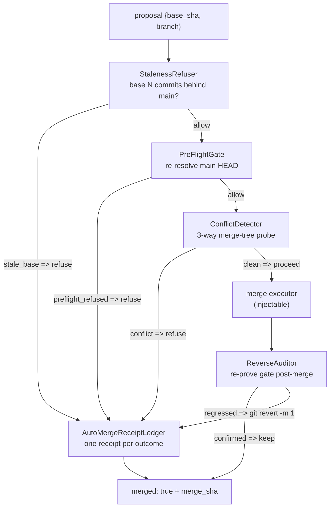
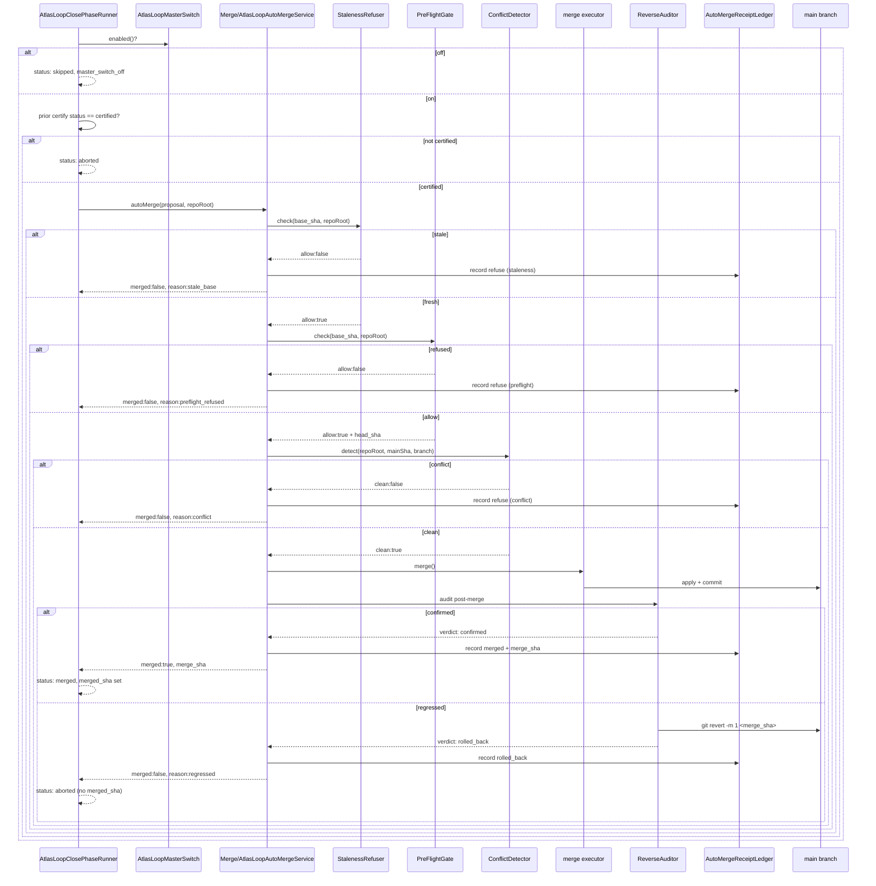

# Merge governor

The merge governor is what stands between a certified cycle and a real commit on main. It is fail-closed at every step: main is byte-identical unless the full pipeline is green and the merge commits. There are two merge surfaces in the loop. The decomposed `Merge/AtlasLoopAutoMergeService` is the wave-14 hardened single-proposal governor with five gates. The top-level `AtlasLoopAutoMergeService` (~82KB) is the production "merge-livre v2" drain that takes certified proposals and merges them to main for real, with re-proof, apply, sanity, commit, and a best-effort canary. `AtlasLoopObraAutoMergeService` is the multi-step obra merge authority with a broader regression gate. All three share one git contract: `AtlasLoopCycleGitContract`.

## Purpose

The operator's decision (recorded in `AtlasLoopAutoMergeService` docblock and memory `loop-merge-livre-v2-executado`) is that certified loop proposals merge to main for real. The merge is not the risk event; the risk event is the verdict, and the verdict already happened twice (certification in the grind plus re-proof here). The merge governor makes that crossing safe: it re-proves, refuses stale bases, refuses conflicts, refuses on regression, writes a receipt, and reverts if a post-merge audit fails.

## Key abstractions

| Path | Role |
|---|---|
| `app/Services/Ai/AutonomousEvolution/Merge/AtlasLoopAutoMergeService.php` | Decomposed single-proposal merge governor (preflight, conflict, staleness, reverse, receipt) |
| `app/Services/Ai/AutonomousEvolution/Merge/AtlasLoopAutoMergePreFlightGate.php` | Re-resolves main HEAD; refuses a stale branch |
| `app/Services/Ai/AutonomousEvolution/Merge/AtlasLoopAutoMergeConflictDetector.php` | 3-way merge-tree probe; refuses on conflict |
| `app/Services/Ai/AutonomousEvolution/Merge/AtlasLoopAutoMergeStalenessRefuser.php` | Cheapest fail-fast; refuses a base N commits behind main |
| `app/Services/Ai/AutonomousEvolution/Merge/AtlasLoopAutoMergeReverseAuditor.php` | Re-proves the gate post-merge; reverts on regression |
| `app/Services/Ai/AutonomousEvolution/Merge/AtlasLoopAutoMergeReceiptLedger.php` | Append-only merge receipt ledger |
| `app/Services/Ai/AutonomousEvolution/AtlasLoopAutoMergeService.php` | The production drain (`drain`, `mergeOperatorApproved`, `mergeOneCritical`); value-gate, canary, fix-forward; FORBIDDEN |
| `app/Services/Ai/AutonomousEvolution/AtlasLoopObraAutoMergeService.php` | Multi-step obra merge authority with broader regression gate |
| `app/Services/Ai/AutonomousEvolution/AtlasLoopMultiRepoMergeAuthority.php` | Per-repo authorization (home governed, foreign never-merge default) |
| `app/Services/Ai/AutonomousEvolution/AtlasLoopCycleGitContract.php` | base_sha / merged_sha / branch discipline; cut-from-fresh-main |
| `app/Services/Ai/AutonomousEvolution/Constitution/AtlasLoopMergeActuator.php` | The governed merge actuator |
| `app/Services/Ai/AutonomousEvolution/Constitution/AtlasLoopMainHealthSentinel.php` | Post-merge main health sentinel |
| `app/Services/Ai/AutonomousEvolution/AtlasLoopProposalPromotionGate.php` | Re-proves the frozen judge against the persisted contract; FORBIDDEN |
| `app/Services/Ai/AutonomousEvolution/AtlasLoopProposalMaterializer.php` | Materializes a proposal; FORBIDDEN |
| `app/Services/Ai/AutonomousEvolution/AtlasLoopNetDirectionGuard.php` | Measured-breakage throttle; FORBIDDEN |

## How it works

### The decomposed merge governor (single proposal)

`Merge/AtlasLoopAutoMergeService.php` is the wave-14 hardened entry. It runs five fail-closed gates in order before the merge executor is ever invoked. The merge executor is injectable (a no-op placeholder by default) so the gating is provable without a real git merge.

Every return path calls `recordReceipt` exactly once before returning, so the ledger reflects every allow, refuse, merge, and rollback. The receipt carries `proposal_id`, `base_sha`, `head_sha_before`, `head_sha_after`, the gate verdicts (preflight, conflict, reverse), and the outcome.

The gates:

- **StalenessRefuser** — the cheapest fail-fast, runs before everything else. A base SHA more than N commits behind main (default `atlas.loop.automerge.staleness_max_commits_behind = 25`) is refused. The commits-behind count is a real fact computed via `git rev-list --count base_sha..main`, never a score. A base equal to HEAD is `commits_behind=0` and allowed. Unresolvable refs or git failure fail closed.
- **PreFlightGate** — re-resolves main HEAD. A branch whose base no longer matches the current main HEAD is refused, so the loop never merges against a moved target.
- **ConflictDetector** — a 3-way merge-tree probe. A non-clean report refuses the merge with `reason:'conflict'`, so the loop never overwrites a sibling worker's work in progress on shared main. The detector emits facts only (`AtlasLoopAutoMergeConflictReport`); the only decision drawn here is `clean ? proceed : refuse`.
- **ReverseAuditor** — runs immediately after a successful merge. It re-proves the certification gate against the post-merge main. If the gate regresses, it performs a real `git revert -m 1 <merge_sha>` so main returns to its pre-merge SHA. Verdicts: `confirmed` (post-merge gate passed, main untouched), `rolled_back` (post-merge gate failed, main reverted), `abstain` (gate prover not wired), `revert_failed` (gate failed and revert did not bring HEAD back, an ops issue). The auditor acquires the same exclusive `.git/atlas-automerge-preflight.lock` so the revert cannot interleave with a concurrent worker that just opened pre-flight.

### The production drain (merge-livre v2)

`AtlasLoopAutoMergeService.php` (~82KB, top-level) is the live crossing the operator authorized. `drain($repoRoot, $limit)` drains certified, not-yet-merged proposals to main. The pipeline is fail-closed per proposal and never drops the drain:

1. **Per-repo authorization** — `AtlasLoopMultiRepoMergeAuthority::authorize($repoRoot)`. The home repo is governed by `atlas.ai.loop.auto_merge_to_main` (default OFF; the operator turned it on). Any foreign repo is never-merge by default and only crosses with the multi-repo feature ON and the repo on the operator allow-list.
2. **Re-proof** — the gate re-runs the frozen judge against the contract persisted in an isolated workspace (`AtlasLoopProposalPromotionGate::reprove`). No green re-proof, no merge; the proposal is skipped with a reason and left for retry or fix-forward.
3. **Apply real** — `git apply --check` then `git apply` in the real repo. A conflict is a skip (the tree moved since certification; the loop re-discovers the target).
4. **Pre-commit sanity** — `php -l` on every touched `.php` file. Broken syntax never enters; everything else is fix-forward territory, not a block.
5. **Commit on main** (current branch) with a receipt in the Evidence Ledger.
6. **Post-merge canary** (best-effort) — runs the sibling test by convention when one exists. A failure does not revert (fix-forward-first); it is recorded in the receipt for the queue.

The `merged_to_main=true` stamp is only possible inside the model's governed scope (`AtlasLoopProposal::$governedMergeInProgress`); no other path can stamp it. `mergeOperatorApproved` and `mergeOneCritical` are the operator-approval and critical-single paths. The service composes a calibrated-confidence abstention gate (`AtlasLoopCalibratedConfidenceGate`) and a per-change-class earned-autonomy drain gate (`AtlasLoopChangeClassDrainGate`), both default-off and self-resolved via `app()` when armed. A broader regression gate (`BroaderRegressionGateContract`) maps changed files to affected test modules and runs those suites. The service is a FORBIDDEN self-target.

### The obra merge authority (multi-step work)

`AtlasLoopObraAutoMergeService.php` takes a genuinely certified obra branch and merges it to main without operator review, but only after a new broader regression gate passes. This is a separate, flag-gated path; it does not change the obra executor's own never-merge contract. Gated by `atlas.loop.obra_auto_merge_enabled` (env `ATLAS_LOOP_OBRA_AUTO_MERGE_ENABLED`, default false). With it off, an obra always stays on the operator-review path.

The pipeline:

1. **Flag** — `obra_auto_merge_enabled` must be on, else disabled (operator-review path).
2. **Genuine certification** — the obra result must report `status=done`, `certified=true`, every node delivered and done, the whole-obra integrated test supplied, ran, and passed, `never_merged=true`, `main_untouched=true`, and a governed branch `atlas/obra/<id>`. A non-certified obra (needs_review, halted, failed) is refused.
3. **Net-direction throttle** — the same measured-breakage throttle that governs the single-file auto-merger; a negative net direction parks the crossing.
4. **Apply-no-commit** — `git merge --no-commit --no-ff <branch>` brings the obra change into the working tree without committing. A conflict aborts (main untouched).
5. **Broader regression gate** — map the obra's changed files to their affected test modules and run those suites plus the never-merge invariant test, boot-smoke, and `php -l`. Any red means `git merge --abort` (main untouched) and the obra is parked for the operator.
6. **Commit** — only on a green broader gate: commit the merge on main (governed door), receipt to the Evidence Ledger.

The whole crossing is reversible: pre-merge HEAD is captured and any red verdict leaves main exactly where it was.

### The git contract

`AtlasLoopCycleGitContract.php` is the drift-proof lifecycle the operator mandated: a cycle ends, commit, merge to main, then the next cycle's branch is cut from the fresh main. The 579-commits-behind worktree incident proved why this must be enforced: a flow that cuts its cycle branch once and never re-syncs drifts arbitrarily far behind main, its merges become an unmergeable mess, and every token spent on the stale base is wasted.

The invariant: every new cycle branch is cut from the current main HEAD (which already contains every prior cycle's merge), so a freshly started cycle is always zero commits behind main. Drift is impossible by construction. The freshness is relative to the canonical `$mainRef` the caller supplies; the live wiring always passes `config('atlas.loop.base_staleness_main_ref', 'main')`, so `mainRef` must be the real main. A caller that passes a stale ref defeats the guarantee (a caller-contract issue, not a data-loss one). The data-loss holes (concurrent merge, reset over a stale snapshot) are closed by the exclusive merge lock plus the in-lock pre-merge snapshot.

This service does not replace governance: the certification that authorizes a merge stays in the frozen judge and the obra auto-merge service. This is the git mechanics layer underneath: cut-from-fresh-main, commit, and the mechanical merge, with a staleness guard that refuses to even start a cycle on a base too far behind main. Cycle branches are governed `atlas/loop/cycle/*` refs that discard can always reverse. `commitsBehindMain($repoRoot, $ref, $mainRef)` returns the count or null when undeterminable; callers treat null as "cannot prove staleness" and fail open on the guard (never a false refuse).

## The merge flow

## Integration points

- The merge governor is phase 8 of [the 8-phase cycle](the-8-phase-cycle.md). The close runner refuses to close any prior receipt that did not certify clean (see [quality gates and certification](quality-gates-and-certification.md)).
- The master switch and the FORBIDDEN merge organs live in [self-modification safety](self-modification-safety.md).
- Every merge outcome is recorded in [receipts and evidence](receipts-and-evidence.md) (the `AutoMergeReceiptLedger` plus the cycle receipt chain).
- The merge governor is governed by the [self-construction-government](../self-construction-government/) (merge governor organ, never trusts worker self-report).

## Key source files

| File | What it does |
|---|---|
| `app/Services/Ai/AutonomousEvolution/Merge/AtlasLoopAutoMergeService.php` | Decomposed merge governor with five fail-closed gates |
| `app/Services/Ai/AutonomousEvolution/Merge/AtlasLoopAutoMergeStalenessRefuser.php` | Cheapest fail-fast; refuses base N commits behind main |
| `app/Services/Ai/AutonomousEvolution/Merge/AtlasLoopAutoMergePreFlightGate.php` | Re-resolves main HEAD |
| `app/Services/Ai/AutonomousEvolution/Merge/AtlasLoopAutoMergeConflictDetector.php` | 3-way merge-tree probe |
| `app/Services/Ai/AutonomousEvolution/Merge/AtlasLoopAutoMergeReverseAuditor.php` | Re-proves post-merge; reverts on regression |
| `app/Services/Ai/AutonomousEvolution/Merge/AtlasLoopAutoMergeReceiptLedger.php` | Append-only merge receipt ledger |
| `app/Services/Ai/AutonomousEvolution/AtlasLoopAutoMergeService.php` | Production drain; re-proof, apply, sanity, commit, canary |
| `app/Services/Ai/AutonomousEvolution/AtlasLoopObraAutoMergeService.php` | Obra multi-step merge authority with broader regression gate |
| `app/Services/Ai/AutonomousEvolution/AtlasLoopCycleGitContract.php` | base_sha / merged_sha / branch discipline; cut-from-fresh-main |
| `app/Services/Ai/AutonomousEvolution/Constitution/AtlasLoopMergeActuator.php` | The governed merge actuator |
| `app/Services/Ai/AutonomousEvolution/Constitution/AtlasLoopMainHealthSentinel.php` | Post-merge main health sentinel |
