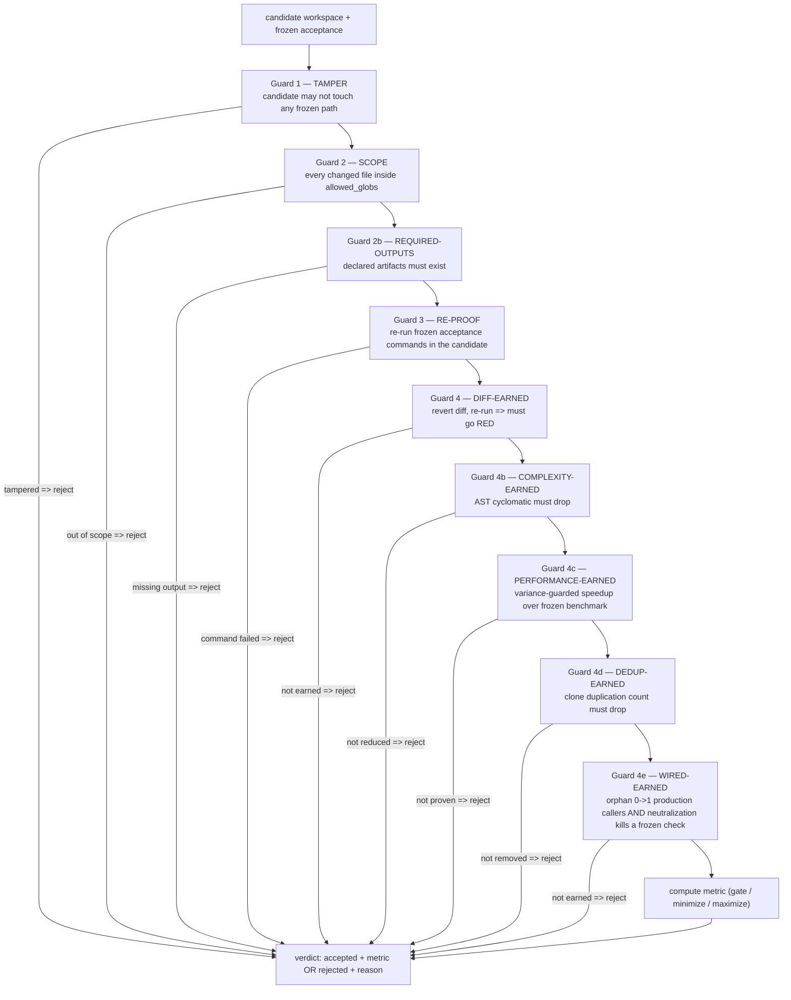

# Quality gates and certification

Certification is the spine of the loop. It is what replaces the human reviewer. The certify phase runs a deterministic gate chain, a frozen out-of-process judge, an anti-farm merge-eligibility floor, mutation adequacy, cross-file consumer checks, and a cross-model judging panel. The writer of a change is never on the panel that judges it. A regressed cycle raises `CertificationFailedException` and short-circuits the conductor. A cycle that clears every gate is `certified`; only a `certified` cycle is allowed to merge.

## Purpose

The loop is the only thing that evolves Atlas 24/7 without a human reviewing each change. That is only safe if the certification machinery is structurally incapable of being gamed by the thing it judges. Three properties make that true:

1. **The judge is frozen and out of process.** `AtlasEvolutionFrozenJudge` re-runs frozen acceptance itself. The loop touches only the target; the judge, the frozen tests, and the metric are out of reach. The judge is provider-agnostic by construction: it scores a workspace, it does not know or care which provider produced the candidate.
2. **A diff must be earned.** Reverting the candidate's edits to the bare baseline and re-running acceptance must turn a frozen check red. A test that stays green with the diff reverted is fake.
3. **The writer never judges its own change.** Cross-model triangulation runs three or more distinct providers over the same frozen bundle and accepts categorical agreement only, never a smoothed scalar.

## Key abstractions

| Path | Role |
|---|---|
| `app/Services/Ai/AutonomousEvolution/AtlasEvolutionFrozenJudge.php` | The frozen out-of-process judge; Guards 1-4e; FORBIDDEN self-target |
| `app/Services/Ai/AutonomousEvolution/AtlasLoopSemanticImplementationCertifier.php` | The certify orchestrator (gate + panel + refuters + mutation) |
| `app/Services/Ai/AutonomousEvolution/AtlasLoopAntiFarmFloor.php` | Merge-eligibility floor: BITES + PRODUCTION-PATH-PROVEN |
| `app/Services/Ai/AutonomousEvolution/LiveCycle/AtlasLoopCertifyPhaseRunner.php` | Certify runner; regressed raises `CertificationFailedException` |
| `app/Services/Ai/AutonomousEvolution/AtlasLoopHeldOutDeltaCertifier.php` | Held-out delta certification |
| `app/Services/Ai/AutonomousEvolution/AtlasLoopMutationAdequacyGateService.php` | Mutation testing adequacy gate |
| `app/Services/Ai/AutonomousEvolution/AtlasLoopMutationOperators.php` | The frozen mutation operator map |
| `app/Services/Ai/AutonomousEvolution/AtlasLoopCrossModelTriangulator.php` | Cross-model categorical agreement (>=3 distinct providers) |
| `app/Services/Ai/AutonomousEvolution/AtlasLoopJudgeConsensusGate.php` | Unanimous / min-distinct-provider consensus evaluator |
| `app/Services/Ai/AutonomousEvolution/AtlasLoopJudgeSelfCalibrationService.php` | Judge calibration |
| `app/Services/Ai/AutonomousEvolution/AtlasLoopJudgeEffortEscalator.php` | Effort escalation ladder |
| `app/Services/Ai/AutonomousEvolution/AtlasLoopJudgeDisagreementDiagnostic.php` | Disagreement diagnostics |
| `app/Services/Ai/AutonomousEvolution/AtlasLoopAdversarialVerifierPool.php` | Adversarial verifier pool |
| `app/Services/Ai/AutonomousEvolution/AtlasLoopRefusalCriticPanel.php` | Refusal critic panel |
| `app/Services/Ai/AutonomousEvolution/AtlasLoopAntiGoodhartUnifiedRefusal.php` | Unified anti-Goodhart refusal |
| `app/Services/Ai/AutonomousEvolution/AtlasLoopFormalInvariantGateService.php` | Formal invariant gate |
| `app/Services/Ai/AutonomousEvolution/AtlasLoopCrossFileConsumerGateService.php` | Cross-file consumer gate |
| `app/Services/Ai/AutonomousEvolution/Frozen/AtlasLoopFrozenContractRegistry.php` | Frozen contract registry + `contracts.manifest.json` |
| `app/Services/Ai/AutonomousEvolution/Constitution/AtlasLoopFrozenBattery.php` | Frozen acceptance battery (certify floor) |
| `app/Services/Ai/AutonomousEvolution/Constitution/AtlasLoopFrozenOutcomeBattery.php` | Frozen outcome battery |

## How it works

### The frozen judge (Guards 1-4e)

`AtlasEvolutionFrozenJudge.php` scores a candidate workspace against a task's frozen acceptance contract. The acceptance is `{commands, allowed_globs, frozen_globs, metric_kind, metric_pattern, timeout_seconds, ...}`. The judge runs a fixed sequence of guards. Any guard failure returns a verdict with `rejected:true` and a precise `reason`; the candidate is refused.



A few load-bearing details from the source:

- **Fail-closed on missing frozen globs (sweep O-1).** An acceptance contract with no `frozen_globs` used to give zero tamper protection. Now the files referenced by the commands are always frozen implicitly when the contract does not say anything.
- **Guard 2b REQUIRED-OUTPUTS (Arbor-Graft MG1).** The first positive merge guard. Every other Atlas guard is negative (don't touch, stay inside). Required-outputs asserts an artifact must exist. It is DATA-declared in the frozen acceptance (a provider can never author or weaken it, it is covered by the freeze), CODE-enforced here, conjunctive: it runs after tamper and scope (so those keep precedence) and rejects in addition to, never instead of, the other guards. Absent key means byte-identical behavior.
- **Guard 3 RE-PROOF.** The judge re-runs the frozen acceptance itself. It never trusts the loop's self-report. Fail fast: one red command sinks the candidate.
- **Guard 4 DIFF-EARNED.** Opt-in via `revert_recheck`. The judge reuses git-stash machinery: revert the candidate's edits to the bare baseline and re-run acceptance. It must go red. If it stays green with the diff reverted, the change is fake (the test does not depend on it) and the candidate is rejected. The proof happens in the very workspace, so it cannot be fooled by where the generator's red-check ran. `diff_earned` returns false (fake-green) or null (could not verify, fail closed).
- **Guards 4b-4e are default-inert.** Each is gated by a per-work-type flag in `config/atlas.loop.*` (`refactor_complexity_proof`, `refactor_performance_proof`, `refactor_dedup_proof`, `refactor_wired_proof`). When the flag is off, the branch is never entered and the judge is byte-identical to today. The structural lane (extract-class) rides on top of complexity-proof, swapping the verdict to a per-method-identity gate.

Each earned-guard reuses the judge's OWN parser or benchmark harness, never a provider-claimed number:

- 4b measures AST cyclomatic candidate vs baseline (max-per-method primary, file total secondary).
- 4c measures a variance-guarded speedup over the frozen `benchmark_command`'s stdout samples. The variance guard (`candidate_median + candidate_iqr < baseline_median`) is what makes it real: a noisy candidate whose band reaches past baseline is rejected. Missing or garbled samples fail closed.
- 4d measures a count-drop in clone duplication with the judge's own parser. A no-op "dedup" that adds a helper but leaves both bodies keeps the shared count >= 2 and is rejected.
- 4e requires the orphan go from zero production callers (git-stashed baseline) to one or more (candidate), measured by the judge's own caller grep, AND that neutralizing the orphan's method bodies (a throw injected first, the constructor left intact) turns a frozen command red. A cosmetic `new Orphan()` never calls a method, so it stays green and is rejected; a hardcoded test value does not call the orphan, so it is rejected; only a wiring that genuinely invokes the orphan's behavior breaks and is certified.

The metric kind is `gate` (pass/fail to 1.0/0.0), `minimize` (drive down, lower is better), or `maximize` (drive up). For a verified refactor the candidate's own AST max-per-method is the honest ranking number; for a verified perf-cert the candidate's own benchmarked median is.

The judge is in `AtlasLoopHarnessGuard::FORBIDDEN_SELF_TARGETS`. The loop can never edit it.

### The anti-farm floor

`AtlasLoopAntiFarmFloor.php` is the merge-eligibility floor for comprehension-originated work. A farm-proof cert (a count-drop, a method-kill, a diff-earned) proves a single delivery is real. But the worst failure is a cert that merges on a cosmetic flip. Before any comprehension work item is allowed to merge, it must clear two independent floors a cosmetic change can never both clear:

1. **BITES** — the diff is load-bearing. Reverting or neutralizing it makes a frozen check go red. Proven by any of: `diff_earned` (revert to red), `method_kills` (neutralize the orphan to red), `earned_red` (the test was red before the fix), `count_drop` (the clone body actually collapsed). A cosmetic flip bites nothing.
2. **PRODUCTION-PATH-PROVEN** — a behavior-adding item (wired_proof: orphan-wiring or a new capability) must be wired into a real production caller, not a test-only or self-referential call-site. A `new X()` in a test farms `wiredEarned`. Structural items (dedup, refactor) are exempt: they add no caller, their realness is the count or complexity drop under behavior preservation.

The floor is pure and deterministic: it reads the cert evidence (no provider, no I/O) and returns `eligible` plus the precise `reasons`. Never loosen it. A new bite-proof may be added, never removed.

### The semantic certifier

`AtlasLoopSemanticImplementationCertifier.php` (~64KB) is the certify orchestrator. It runs the deterministic gate, the panel cycle, the refuters, mutation adequacy, cross-file consumers, and complexity/structural drop measurement. It composes the frozen judge verdict with the anti-farm floor and the broader cert chain. The certify phase runner turns a `regressed` outcome into `CertificationFailedException` (after appending the receipt), which the conductor catches to abort the cycle.

### Mutation adequacy

`AtlasLoopMutationAdequacyGateService.php` (~48KB) and `AtlasLoopMutationOperators.php` enforce mutation testing adequacy. The frozen mutation operator map is the registry the architect's `behavior_preserved` obligations cite (`mutop:<id>`). A change is mutation-adequate only if the operator set genuinely kills mutants; a test suite that passes on a mutated target is not adequate. The operators themselves are frozen (`Constitution/Frozen/AtlasLoopFrozenMutationOperators.php`); the loop cannot edit the mutation set that judges it.

### Cross-model triangulation

`AtlasLoopCrossModelTriangulator.php` is the cross-model fact transport for disputed certification verdicts. It never computes a smoothed scalar. The output is categorical agreement plus per-provider receipts anchored to the same frozen acceptance bundle hash.

The flow:

1. Compute a stable hash of the frozen bundle.
2. If the master switch is off, or `cross_model_triangulation_enabled` is off, return `insufficient`.
3. Collect provider verdicts (either passed in or produced by the runner). Each receipt is `{provider_id, judge_id, frozen_bundle_hash, passes, reason, raw_verdict}`. Goodhart keys (score, confidence, average) are stripped.
4. Require at least three distinct providers. Fewer returns `insufficient_witnesses:<count>`.
5. Feed categorical line items to `AtlasLoopJudgeConsensusGate` with policy `unanimous` and `min_distinct_providers:3`.
6. Return a verdict in `{agree, dissent, split, insufficient_witnesses}` plus the receipts and the stripped consensus.

The writer model is excluded from its own panel by construction.

### Judge consensus gate

`AtlasLoopJudgeConsensusGate.php` is the pure consensus arithmetic over M independent judge verdicts, each cast through a distinct lens in `{correctness, completeness, security, performance, maintainability}`. A delivery is consensus-certified only when:

1. **Independence** — the verdicts span at least `min_distinct_providers` engines. A panel of clones is not independent verification.
2. **Source-class independence** — `source_class` is a curated enum (`in_process` or `external`) the author cannot fake into independence. Real cross-source consensus requires verdicts from more than one source class. Default 0 means the floor is disabled (byte-identical); arm to >= 2 to require genuine cross-source verdicts.
3. **Lens coverage** — every `required_lens` has at least one passing judge. No dimension is unexamined.
4. **Quorum** — under `unanimous` every verdict passes; under `n_of_m` at least `min_pass` pass.

A lens or required-lens outside the known `LENSES` set fails closed (a typo must never silently satisfy coverage). Any dissent (a failing lens, an uncovered required lens, too few engines) means `consensus:false` with the precise reason. The escalation ladder turns that into another round. Pure and deterministic; the judges themselves (provider calls) are produced elsewhere and fed in, so the trust math is unit-testable.

### Calibration and escalation

`AtlasLoopJudgeSelfCalibrationService.php` calibrates the judge against known-good and known-bad fixtures. `AtlasLoopJudgeEffortEscalator.php` is the effort escalation ladder: a disputed verdict triggers a higher-effort round. `AtlasLoopJudgeDisagreementDiagnostic.php` produces diagnostics when judges disagree. `AtlasLoopAdversarialVerifierPool.php`, `AtlasLoopRefusalCriticPanel.php`, and `AtlasLoopAntiGoodhartUnifiedRefusal.php` run adversarial critiques and refusals. `AtlasLoopFormalInvariantGateService.php` and `AtlasLoopCrossFileConsumerGateService.php` enforce formal invariants and cross-file consumer obligations (the `consumer_intact` obligations the architect raised).

### Frozen contracts and batteries

`Frozen/AtlasLoopFrozenContractRegistry.php` plus `contracts.manifest.json` is the registry of frozen contracts; `AtlasLoopFrozenContractAuditor.php`, `AtlasLoopFrozenContractDriftDetector.php`, and `AtlasLoopFrozenContractReceiptLedger.php` audit, detect drift, and record. `FrozenContracts/` holds the auto-sentinel generator, coverage reporter, fact extractor, and retirement gate. `Constitution/AtlasLoopFrozenBattery.php` and `AtlasLoopFrozenOutcomeBattery.php` are the frozen acceptance batteries that form the certify floor; `AtlasLoopBatteryRunner.php`, `AtlasLoopBatteryGenesis.php`, and `AtlasLoopRobustnessProbe.php` run and probe them.

## The certify flow

```mermaid
sequenceDiagram
    participant Runner as AtlasLoopCertifyPhaseRunner
    participant Cert as AtlasLoopSemanticImplementationCertifier
    participant Judge as AtlasEvolutionFrozenJudge
    participant Floor as AtlasLoopAntiFarmFloor
    participant Mut as AtlasLoopMutationAdequacyGateService
    participant Tri as AtlasLoopCrossModelTriangulator
    participant Cons as AtlasLoopJudgeConsensusGate

    Runner->>Cert: certify(impl_receipt)
    Cert->>Judge: score(workspace, frozen_acceptance)
    Judge->>Judge: Guard 1 TAMPER + Guard 2 SCOPE + Guard 2b REQUIRED-OUTPUTS
    Judge->>Judge: Guard 3 RE-PROOF (re-run frozen commands)
    Judge->>Judge: Guard 4 DIFF-EARNED + 4b/4c/4d/4e (flag-gated)
    Judge-->>Cert: verdict (accepted + metric OR rejected + reason)
    alt rejected
        Cert-->>Runner: regressed
        Runner-->>Runner: raise CertificationFailedException
    else accepted
        Cert->>Mut: mutation adequacy over frozen operators
        Mut-->>Cert: adequate OR not
        alt not adequate
            Cert-->>Runner: regressed
        else adequate
            Cert->>Floor: eligibleToMerge(evidence)
            Floor-->>Cert: {eligible, bites, production_path_proven, reasons}
            alt not eligible
                Cert-->>Runner: not merge-eligible (recorded)
            else eligible + disputed
                Cert->>Tri: triangulate(frozenBundle, providerVerdicts)
                Tri->>Tri: strip Goodhart keys; require >=3 distinct providers
                Tri->>Cons: evaluate(lineItems, {policy: unanimous, min_distinct_providers: 3})
                Cons-->>Tri: consensus verdict
                Tri-->>Cert: agree / dissent / split / insufficient
                alt consensus
                    Cert-->>Runner: certified
                else no consensus
                    Cert->>Cert: escalate (effort ladder) or refuse
                end
            else eligible + undisputed
                Cert-->>Runner: certified
            end
        end
    end
```

## Integration points

- The certify phase is phase 7 of [the 8-phase cycle](the-8-phase-cycle.md). A `regressed` outcome raises `CertificationFailedException` and aborts the cycle.
- Only a `certified` cycle is allowed to enter [merge governor](merge-governor.md). The close runner refuses to close any prior receipt that did not certify clean.
- The frozen judge is a FORBIDDEN self-target; see [self-modification safety](self-modification-safety.md).
- Every verdict, floor decision, and consensus is recorded; see [receipts and evidence](receipts-and-evidence.md).
- The cross-model triangulator reaches providers through the [AI Gateway](../ai-gateway/).

## Key source files

| File | What it does |
|---|---|
| `app/Services/Ai/AutonomousEvolution/AtlasEvolutionFrozenJudge.php` | The frozen judge; Guards 1-4e; provider-agnostic |
| `app/Services/Ai/AutonomousEvolution/AtlasLoopAntiFarmFloor.php` | BITES + PRODUCTION-PATH-PROVEN merge floor |
| `app/Services/Ai/AutonomousEvolution/AtlasLoopSemanticImplementationCertifier.php` | Certify orchestrator |
| `app/Services/Ai/AutonomousEvolution/AtlasLoopMutationAdequacyGateService.php` | Mutation adequacy gate |
| `app/Services/Ai/AutonomousEvolution/AtlasLoopCrossModelTriangulator.php` | Cross-model categorical agreement |
| `app/Services/Ai/AutonomousEvolution/AtlasLoopJudgeConsensusGate.php` | Consensus arithmetic over M independent verdicts |
| `app/Services/Ai/AutonomousEvolution/LiveCycle/AtlasLoopCertifyPhaseRunner.php` | Phase 7 runner; raises on regression |
| `app/Services/Ai/AutonomousEvolution/Frozen/AtlasLoopFrozenContractRegistry.php` | Frozen contract registry + manifest |
| `app/Services/Ai/AutonomousEvolution/Constitution/AtlasLoopFrozenBattery.php` | Frozen acceptance battery |
| `docs/loop-8-phase-cycle-canonical.md` | The canonical cycle contract (phase 7 = certify) |
