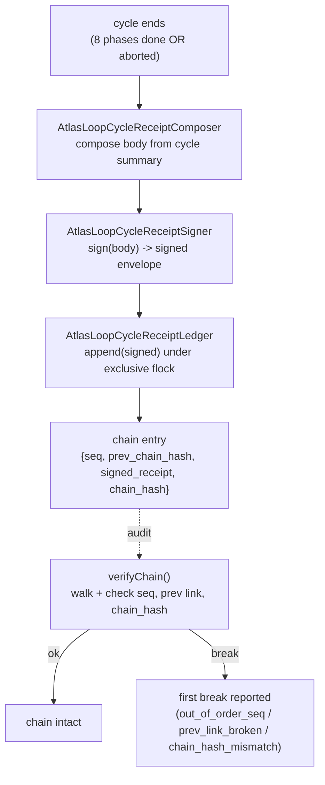

# Receipts and evidence chains

Every phase, cycle, and merge outcome in the loop is recorded as a signed, append-only, tamper-evident receipt. Receipts prove what actually ran: the `merged_sha` that proves close-on-main really merged, the frozen-judge verdict that proves a change earned its diff, the anti-Goodhart refusal that proves a refusal was honest and not a moved goalpost. Receipts prove events; they never override canonical specs. The cycle receipt chain is a JSONL file chained by `chain_hash = sha256(prev . body_sha . signature)`, fail-closed verified.

## Purpose

The loop runs 24/7 without a human reviewing each change. That is only auditable if every decision leaves an immutable trace. Receipts are that trace. They are also the substrate the loop itself reads back: the comprehension originator's prior-attempts context, the ambition faculty's plateau evidence, the pattern engine's cross-cycle mining, the learning transfer's proven-lessons promotion. Without tamper-evidence the loop could rewrite its own history; without fail-closed verification a tampered chain could pass silently. Both are load-bearing.

## Key abstractions

| Path | Role |
|---|---|
| `app/Services/Ai/AutonomousEvolution/Receipts/AtlasLoopCycleReceiptLedger.php` | Append-only tamper-evident signed receipt chain (JSONL) |
| `app/Services/Ai/AutonomousEvolution/Receipts/AtlasLoopCycleReceiptSigner.php` | Deterministic HMAC-SHA256 signer for cycle receipts |
| `app/Services/Ai/AutonomousEvolution/Receipts/AtlasLoopCycleReceiptComposer.php` | Composes the receipt body from a cycle summary |
| `app/Services/Ai/AutonomousEvolution/Receipts/CycleReceiptChainRejection.php` | Raised when an append is offered a receipt that fails verify |
| `app/Services/Ai/AutonomousEvolution/UnifiedReceipts/AtlasLoopUnifiedReceiptChain.php` | Per-cycle phase receipt chain the conductor records into |
| `app/Services/Ai/AutonomousEvolution/UnifiedReceipts/AtlasLoopUnifiedReceiptChainNode.php` | One node in the unified chain |
| `app/Services/Ai/AutonomousEvolution/UnifiedReceipts/AtlasLoopUnifiedReceiptVerifier.php` | Verifies the unified chain |
| `app/Services/Ai/AutonomousEvolution/UnifiedReceipts/AtlasLoopUnifiedReceiptVerificationReport.php` | Verification report |
| `app/Services/Ai/AutonomousEvolution/UnifiedReceipts/AtlasLoopUnifiedReceiptExporter.php` | Exports the unified chain |
| `app/Services/Ai/AutonomousEvolution/UnifiedReceipts/AtlasLoopUnifiedExportManifest.php` | Export manifest |
| `app/Services/Ai/AutonomousEvolution/AtlasLoopGoodhartReceiptLedger.php` | DB-backed append-only ledger for anti-Goodhart refusal verdicts |
| `app/Services/Ai/AutonomousEvolution/AtlasLoopImpactReceiptService.php` | Impact receipts |
| `app/Services/Ai/AutonomousEvolution/AtlasLoopSubstrateReceiptLedger.php` | Substrate receipts |
| `app/Services/Ai/AutonomousEvolution/AtlasLoopModelFloorReceiptLedger.php` | Model floor receipts |
| `app/Services/Ai/AutonomousEvolution/AtlasLoopLeapReceiptLedger.php` | Ambition leap receipts |
| `app/Services/Ai/AutonomousEvolution/AtlasLoopNetDiffCertReceiptLedger.php` | Net-diff cert receipts |
| `app/Services/Ai/AutonomousEvolution/AtlasLoopDeliveryContractRecorder.php` | Delivery contract recorder |
| `app/Services/Ai/AutonomousEvolution/AtlasLoopDeliveryDossierService.php` | Delivery dossier |
| `app/Services/Ai/AutonomousEvolution/Merge/AtlasLoopAutoMergeReceiptLedger.php` | Merge outcome receipts |
| `app/Services/Ai/AutonomousEvolution/AuditTrail/AtlasLoopAuditTrailComposer.php` | Tamper-evident audit timeline composer |
| `app/Services/Ai/AutonomousEvolution/AuditTrail/AtlasLoopAuditTrailIntegrityVerifier.php` | Audit trail integrity verifier and replay |

## How it works

### The signed cycle receipt chain

`Receipts/AtlasLoopCycleReceiptLedger.php` is an append-only, tamper-evident chain of signed loop-cycle receipts. Each entry stores `{seq, prev_chain_hash, signed_receipt, chain_hash}` where:

```
chain_hash = sha256(prev_chain_hash . body_canonical_sha256 . signature)
```

The genesis `prev_chain_hash` is 64 zeros (`GENESIS_PREV`). Storage is a single JSONL file (`storage/app/atlas/loop/cycle_receipts.chain.jsonl` by default, configurable via `atlas.ai.loop.cycle_receipt_chain_path`). Appends happen under an exclusive `flock`, and the seq and prev are computed inside the lock, so two concurrent appenders get consecutive seqs and never tear a line.

Append is fail-closed. `append(array $signedReceipt)` calls the signer's `verify` first. A signed receipt whose signature does not verify is rejected with `CycleReceiptChainRejection` and never enters the chain.

`verifyChain()` walks the file and reports the first break. Three break modes:

1. `out_of_order_seq` — a seq that does not match the expected counter.
2. `prev_link_broken` — a `prev_chain_hash` that does not match the previous entry's `chain_hash`.
3. `chain_hash_mismatch` — a recomputed `chain_hash` that does not match the stored one (constant-time `hash_equals`).

A single mutated byte in any body or stored sha is caught. The chain is tamper-evident by construction: you cannot rewrite history without breaking every link that follows.

### The signer

`Receipts/AtlasLoopCycleReceiptSigner.php` takes the composer body (`atlas.loop.cycle_receipt.body.v1`) and wraps it in a signed envelope (`atlas.loop.cycle_receipt.signed.v1`). The signature is an HMAC-SHA256 over the canonical JSON of the body. Canonicalization recursively sorts keys and uses `JSON_UNESCAPED_SLASHES | JSON_PRESERVE_ZERO_FRACTION | JSON_THROW_ON_ERROR`, so the same body always produces the same bytes. The envelope carries `body`, `body_canonical_sha256`, `signature`, and `signed_at_iso`.

`verify()` recomputes both the canonical sha and the HMAC and returns true only when the stored sha and the stored signature both match byte-for-byte (constant-time compare). So any single mutated byte, in the body or in the stored sha, is caught.

The HMAC key is `config('atlas.ai.loop.cycle_receipt_signing_key')` (production sets it via env). A documented dev fallback (`atlas-loop-cycle-receipt-dev-signing-key-do-not-use-in-prod`) keeps the signer usable in local and test runs. No chain logic lives in the signer; that is the ledger's job.

### The unified phase receipt chain

`UnifiedReceipts/AtlasLoopUnifiedReceiptChain.php` is the per-cycle phase receipt chain the conductor records each phase receipt into. It uses the same pattern: append-only JSONL, exclusive flock, `seq` and `prev_hash` computed inside the lock, genesis 64 zeros. Each append returns an `AtlasLoopUnifiedReceiptChainNode` carrying `node_hash`. The `AtlasLoopUnifiedReceiptVerifier` walks the chain and produces an `AtlasLoopUnifiedReceiptVerificationReport`. The `AtlasLoopUnifiedReceiptExporter` plus `AtlasLoopUnifiedExportManifest` export the chain for offline audit.

The conductor's `UnifiedReceiptChain` interface (declared in `LiveCycle/AtlasLoopFullCycleConductor.php`) is the seam: `record(string $cycleId, string $phase, array $receipt): void`. The production wiring points this at the unified chain so every phase receipt is anchored to the cycle and chained.

### The ledger family

Beyond the two chains, the loop keeps a family of append-only ledgers. Each is INSERT-only by contract; none exposes update, delete, or truncate. Several are DB-backed (`atlas_loop_goodhart_receipts`, `atlas_loop_*`); many are JSONL under `storage/app/atlas/loop/`.

- **Goodhart receipts** (`AtlasLoopGoodhartReceiptLedger.php` into `atlas_loop_goodhart_receipts`) — every anti-Goodhart refusal verdict (refused OR allowed) flows through `record()` so the loop has a tamper-evident audit trail proving a refusal was honest, not a moved goalpost. Each row carries `judge_commit_sha` (current git HEAD by default, injectable). When the table is unavailable, `record()` returns null and silently drops the row: the audit surface is best-effort by design, the production refusal still runs.
- **Impact receipts** (`AtlasLoopImpactReceiptService.php`) — the measured impact of a delivery.
- **Leap receipts** (`AtlasLoopLeapReceiptLedger.php`) — ambition leap origination records (and abstains, so the dry-probe converges honestly).
- **Substrate, model-floor, net-diff-cert receipts** — substrate, model-floor, and net-diff certification evidence.
- **Delivery contracts and dossier** (`AtlasLoopDeliveryContractRecorder.php`, `AtlasLoopDeliveryDossierService.php`) — the contract a delivery owes and the dossier that proves it met it.
- **Merge receipts** (`Merge/AtlasLoopAutoMergeReceiptLedger.php`) — one receipt per merge outcome (allow, refuse, merge, rollback).

### The audit trail

`AuditTrail/` composes a tamper-evident audit timeline and verifies its integrity. `AtlasLoopAuditTrailComposer` plus `AtlasLoopAuditTrailExporter` build and export the timeline; `AtlasLoopAuditTrailIntegrityVerifier` verifies it; `AtlasLoopAuditTrailReplayer` replays it. The audit trail is the operator-facing view that ties the cycle chain, the phase chain, the ledger family, and the merge receipts into one navigable, replayable timeline. See [campaigns and runtime](campaigns-and-runtime.md) for the observability organs that read it.

## The receipt flow



The per-phase flow is the same shape but into the unified chain during the cycle, not after it. The conductor calls `UnifiedReceiptChain::record($cycleId, $phase, $receipt)` after each phase runner returns (or after a failed-phase receipt is recorded before abort). The close phase receipt carries `merged_sha`; the conductor reads it back to decide `final_status`.

## Tamper-evidence and fail-closed verification

Two properties make the receipts load-bearing:

1. **Tamper-evident by construction.** Every entry is linked to the previous by a hash, and the body is signed. You cannot rewrite, insert, or delete an entry without breaking every link that follows and the signature on the changed body. `verifyChain()` reports the first break with a precise reason.
2. **Fail-closed append.** A signed receipt that fails `verify()` is rejected before it enters the chain. The chain never accepts a receipt whose signature does not verify. Verification itself uses constant-time compares so timing leaks cannot help an attacker.

The DB-backed ledgers are INSERT-only by contract: no public update, delete, or truncate method is exposed. They are best-effort (a missing table silently drops the row, the production decision still runs); the chains are strict (a tampered entry is rejected or reported on verify).

## Integration points

- The conductor records every phase receipt into the unified chain; see [the 8-phase cycle](the-8-phase-cycle.md).
- The close phase receipt carries `merged_sha`; see [merge governor](merge-governor.md).
- The certify phase writes goodhart, net-diff-cert, and model-floor receipts; see [quality gates and certification](quality-gates-and-certification.md).
- The ambition faculty writes leap receipts; see [work discovery and origination](work-discovery-and-origination.md).
- The broader doctrine is [concepts/evidence-and-receipts](../../concepts/evidence-and-receipts.md): receipts prove events, never override canonical specs.

## Key source files

| File | What it does |
|---|---|
| `app/Services/Ai/AutonomousEvolution/Receipts/AtlasLoopCycleReceiptLedger.php` | Append-only signed chain; `append`, `verifyChain`, `latest`, `all` |
| `app/Services/Ai/AutonomousEvolution/Receipts/AtlasLoopCycleReceiptSigner.php` | HMAC-SHA256 signer; `sign`, `verify` (constant-time) |
| `app/Services/Ai/AutonomousEvolution/Receipts/AtlasLoopCycleReceiptComposer.php` | Composes the receipt body |
| `app/Services/Ai/AutonomousEvolution/UnifiedReceipts/AtlasLoopUnifiedReceiptChain.php` | Per-cycle phase chain the conductor writes |
| `app/Services/Ai/AutonomousEvolution/UnifiedReceipts/AtlasLoopUnifiedReceiptVerifier.php` | Verifies the unified chain |
| `app/Services/Ai/AutonomousEvolution/AtlasLoopGoodhartReceiptLedger.php` | DB-backed append-only anti-Goodhart refusal ledger |
| `app/Services/Ai/AutonomousEvolution/AtlasLoopLeapReceiptLedger.php` | Ambition leap receipts |
| `app/Services/Ai/AutonomousEvolution/Merge/AtlasLoopAutoMergeReceiptLedger.php` | Merge outcome receipts |
| `app/Services/Ai/AutonomousEvolution/AuditTrail/AtlasLoopAuditTrailIntegrityVerifier.php` | Audit trail integrity verifier and replay |
| `config/atlas.php` (`atlas.ai.loop.cycle_receipt_chain_path`, `atlas.ai.loop.cycle_receipt_signing_key`) | Chain path and signing key |
