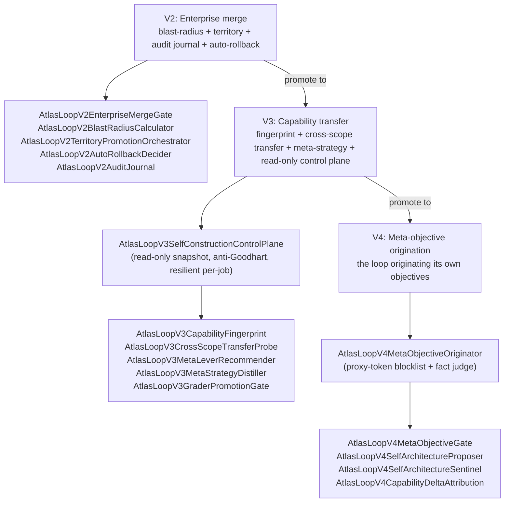

# Recursive self-improvement

Recursive self-improvement (RSI) is the loop evolving its own engine. The `autonomous` brain scope has `meta_harness=true` (the operator decision "RECURSIVE-TOTAL"): the brain may target its own machinery under `app/Services/Ai/AutonomousEvolution/` and `app/Services/Ai/SelfConstruction/`. This is what makes the loop an autopoiesis engine rather than a fixed grinder. It is held honest by a pétreo FORBIDDEN floor, invariant-survival proofs, a propose-only internalization pipeline, and an escalation ladder (V2 to V3 to V4) that raises the abstraction one generation at a time.

## Purpose

The loop is the only thing in Atlas that evolves Atlas 24/7, alone, without a human or another AI reviewing each change. If it can evolve anything, the most valuable thing it can evolve is itself: a smarter loop compounds every future scope. The danger is obvious: a loop that can edit its own judge, its own gates, its own stop-probe, or its own dedup memory can saw off the branch it sits on. So RSI is governed by the same anti-Goodhart spine as the rest of the loop, made stricter because the target IS the spine. Three invariants hold:

1. **The pétreo floor never moves.** The cert organs, the master switches, the stop-probe, the dedup memory, the perception organs, and the prioritizers are FORBIDDEN self-targets. The loop can never edit the gates that judge it. See [self-modification safety](self-modification-safety.md).
2. **Every self-edit is classified and proven.** `SelfMod/` classifies the edit and proves declared invariants survive it. A violation rejects the edit.
3. **Internalization is propose-only.** The cycle capsule to internalization pipeline turns external cycles into internal capability candidates, but every candidate is `promoted=false, requires_gate=true`. The pipeline never auto-promotes a capability; a separate gate or operator does.

## Key abstractions

| Path | Role |
|---|---|
| `app/Services/Ai/AutonomousEvolution/AtlasLoopHarnessGuard.php` | Owns `FORBIDDEN_SELF_TARGETS` (the pétreo list) plus `isForbiddenSelfTarget()` |
| `app/Services/Ai/AutonomousEvolution/AtlasLoopRecursiveSelfImprovementGate.php` | Self-edit gate: constitution-first (refuse pétreo), then policy (auto-apply default OFF) |
| `app/Services/Ai/AutonomousEvolution/SelfMod/AtlasLoopSelfModEditClassifier.php` | Classifies a self-edit as COSMETIC, STRUCTURAL, or HARDEN |
| `app/Services/Ai/AutonomousEvolution/SelfMod/AtlasLoopSelfModInvariantExtractor.php` | Extracts declared invariants from the pre-edit source |
| `app/Services/Ai/AutonomousEvolution/SelfMod/AtlasLoopSelfModInvariantSurvivalChecker.php` | Proves declared invariants survive the edit (HOLDS / UNCHECKABLE / VIOLATED) |
| `app/Services/Ai/AutonomousEvolution/SelfMod/AtlasLoopSelfModProofReceiptLedger.php` | Append-only ledger of invariant-survival proof receipts |
| `app/Services/Ai/AutonomousEvolution/SelfMod/FormalProofs/` | Formal proof scaffolding for invariant survival |
| `app/Services/Ai/AutonomousEvolution/Introspection/AtlasLoopSelfArchitectureScanner.php` | The loop scanning its own architecture |
| `app/Services/Ai/AutonomousEvolution/Introspection/AtlasLoopSelfCapabilityCoverageReporter.php` | Reports which capabilities the loop covers |
| `app/Services/Ai/AutonomousEvolution/Introspection/AtlasLoopSelfDependencyGraphReporter.php` | Reports the loop's own dependency graph |
| `app/Services/Ai/AutonomousEvolution/Introspection/AtlasLoopSelfIntrospectionReceiptLedger.php` | Append-only ledger of introspection receipts |
| `app/Services/Ai/AutonomousEvolution/Brain/AtlasBrainCycleCapsule.php` | Replayable record of one external cycle (the V3 internalization substrate) |
| `app/Services/Ai/AutonomousEvolution/Brain/AtlasBrainCycleCapsuleLedger.php` | Append-only IO for cycle capsules |
| `app/Services/Ai/AutonomousEvolution/Brain/AtlasBrainInternalizationPipeline.php` | Turns external capsules into internal capability candidates (propose-only) |
| `app/Services/Ai/AutonomousEvolution/Brain/AtlasBrainProvenanceLedger.php` | Provenance ledger for internalized candidates |
| `app/Services/Ai/AutonomousEvolution/V2/AtlasLoopV2EnterpriseMergeGate.php` | V2 enterprise merge gate |
| `app/Services/Ai/AutonomousEvolution/V2/AtlasLoopV2BlastRadiusCalculator.php` | V2 blast-radius calculator |
| `app/Services/Ai/AutonomousEvolution/V2/AtlasLoopV2TerritoryPromotionOrchestrator.php` | V2 territory promotion orchestrator |
| `app/Services/Ai/AutonomousEvolution/V2/AtlasLoopV2AutoRollbackDecider.php` | V2 auto-rollback decider |
| `app/Services/Ai/AutonomousEvolution/V2/AtlasLoopV2AuditJournal.php` | V2 audit journal |
| `app/Services/Ai/AutonomousEvolution/V3/AtlasLoopV3SelfConstructionControlPlane.php` | V3 read-only self-construction control plane |
| `app/Services/Ai/AutonomousEvolution/V3/AtlasLoopV3CapabilityFingerprint.php` | V3 capability fingerprint |
| `app/Services/Ai/AutonomousEvolution/V3/AtlasLoopV3CrossScopeTransferProbe.php` | V3 cross-scope transfer probe |
| `app/Services/Ai/AutonomousEvolution/V3/AtlasLoopV3MetaStrategyDistiller.php` | V3 meta-strategy distiller |
| `app/Services/Ai/AutonomousEvolution/V4/AtlasLoopV4MetaObjectiveOriginator.php` | V4 meta-objective origination (the loop originating its own objectives) |
| `app/Services/Ai/AutonomousEvolution/V4/AtlasLoopV4MetaObjectiveGate.php` | V4 meta-objective gate |
| `app/Services/Ai/AutonomousEvolution/V4/AtlasLoopV4SelfArchitectureProposer.php` | V4 self-architecture proposer |
| `app/Services/Ai/AutonomousEvolution/V4/AtlasLoopV4SelfArchitectureSentinel.php` | V4 self-architecture sentinel |
| `app/Services/Ai/AutonomousEvolution/Pattern/AtlasLoopPatternRegistry.php` | The deterministic pattern repertoire (read model for the selector) |
| `app/Services/Ai/AutonomousEvolution/Pattern/AtlasLoopPatternCompiler.php` | Compiles a pattern spec into an executable form |
| `app/Services/Ai/AutonomousEvolution/Pattern/AtlasLoopPatternSelector.php` | Ranks and selects a pattern for a given context |
| `app/Services/Ai/AutonomousEvolution/Pattern/AtlasLoopPatternChampionGate.php` | Promotes a candidate pattern to selectable (champion gate) |
| `app/Services/Ai/AutonomousEvolution/Pattern/AtlasLoopPatternDecisionDriver.php` | Drives the learned-pattern to decision pipeline |
| `app/Services/Ai/AutonomousEvolution/TaskClassDiscovery/AtlasLoopTaskClassMiner.php` | Mines new task classes from history |
| `app/Services/Ai/AutonomousEvolution/TaskClassDiscovery/AtlasLoopTaskClassProposer.php` | Proposes a discovered task class |
| `app/Services/Ai/AutonomousEvolution/TaskClassDiscovery/AtlasLoopTaskClassRegistry.php` | Registry of discovered task classes |
| `app/Services/Ai/AutonomousEvolution/Trinity/ThreeWay/AtlasLoopTrinityCycleConductor.php` | 3-way Loop-Maestro-cortex cycle conductor |
| `app/Services/Ai/AutonomousEvolution/Quaternity/` | 4-way coupling adding operator intent (IntentIngest, IntentResolver, LoopIntentDrift, CortexIntentMeaning) |
| `app/Services/Ai/AutonomousEvolution/Autopoiesis/` | Self-creation: Constitution, ScopeOrigination, SelfExtension |

## How it works

### meta_harness and the FORBIDDEN floor

The `autonomous` brain scope has `meta_harness=true` in `config/atlas.brain.scopes`. That flag is the operator decision "RECURSIVE-TOTAL": the brain may target its own engine. Without it, the brain can only evolve external scopes. With it, the brain can propose edits to `app/Services/Ai/AutonomousEvolution/` and `app/Services/Ai/SelfConstruction/`.

The floor that keeps this safe is `AtlasLoopHarnessGuard::FORBIDDEN_SELF_TARGETS`, the pétreo (stone, immutable) list. It protects the cert organs, the master switches, the stop-probe, the anti-proxy classifier, the dedup memory, the scope registry, the reflection stream, the causal gate, the structural perception digest, the portfolio router, the leverage brief, the adversarial auditor, the frontier source registry, the compounding digest, the metric snapshot, the spec simulation twin, the orphan spec drafter, the path catalog, the spec repair hints, the brief histogram, the seed-gate adversarial auditor, and the comprehension model builder. The same FORBIDDEN list is enforced at architect-time (`AtlasLoopGroundedProjectionRoles::isForbiddenTarget`) and cert-time, so the loop can never saw off its own branch by editing the organ that would judge the edit.

The self-edit gate is `AtlasLoopRecursiveSelfImprovementGate::evaluate(targetPath, intent)`:

1. `AtlasLoopHarnessGuard::isForbiddenSelfTarget()` is checked FIRST (flag and intent independent). A cert-organ edit is `refused_constitution_petreo` and never proceeds.
2. Otherwise the edit is classified as harden or improve.
3. `recursive_self_improvement_auto_apply` (default OFF) decides: OFF means `parked_for_operator`, ON means the edit may proceed through the normal architect, implement, certify, merge spine.

### SelfMod: classify and prove invariant survival

`SelfMod/` is the self-modification safety layer. Any edit the loop makes to its own code is classified and proven before it can merge.

`AtlasLoopSelfModEditClassifier` classifies the edit as `COSMETIC` (whitespace, formatting, no semantic change), `STRUCTURAL` (a real code change), or `HARDEN` (a change that strengthens an invariant). `AtlasLoopSelfModInvariantExtractor` extracts the declared invariants from the pre-edit source (via reflection and AST analysis). `AtlasLoopSelfModInvariantSurvivalChecker` then proves those invariants survive the edit:

- A `COSMETIC` edit is checked by AST node-kind equality between pre and post source. Same node kinds means `HOLDS`; a difference means `UNCHECKABLE`.
- A `STRUCTURAL` or `HARDEN` edit loads the post-edit source, instantiates the affected classes, runs any bootstrap calls from fixture inputs, and evaluates each invariant against the post-edit object. The verdict per invariant is `HOLDS`, `UNCHECKABLE`, or `VIOLATED`.
- The overall verdict is `APPROVED` only when no invariant is `VIOLATED`. A `VIOLATED` invariant means `REJECTED`.

`AtlasLoopSelfModProofReceiptLedger` records the proof receipts in an append-only ledger. `FormalProofs/` holds the formal proof scaffolding for invariant survival. See [self-modification safety](self-modification-safety.md).

### Introspection: the loop's self-model

`Introspection/` is the loop's introspective view of its own architecture, capabilities, and dependencies. This is distinct from `SelfModel/`, which is a learned-grader corpus pipeline (corpus, eval, oracle, promotion, registry, training).

- `AtlasLoopSelfArchitectureScanner` scans the loop's own architecture: it walks `app/Services/Ai/AutonomousEvolution/` and reports the structural shape (organs, clusters, sizes, the pétreo set).
- `AtlasLoopSelfCapabilityCoverageReporter` reports which capabilities the loop covers and which are gaps (a capability the docs name but no organ provides).
- `AtlasLoopSelfDependencyGraphReporter` reports the loop's own dependency graph (who depends on whom inside the engine).
- `AtlasLoopSelfIntrospectionReceiptLedger` records the introspection receipts in an append-only ledger.

The self-model is read-only perception: it surfaces facts the brain reasons over to originate self-improvements. It never edits, never decides, never gates. The pétreo floor protects it from being shaped to forge the "right" leap.

### Cycle capsule to internalization

The recursion closes here. `AtlasBrainCycleCapsule` is the replayable record of one external evolution cycle (brain to task to muscle to validation to evidence). `capture()` normalizes a raw cycle into the canonical, validated capsule shape and is deterministic. Fail-closed: a cycle without a `task_packet_id` is unattributable and yields null. A capsule certified true that changed files but carries no `tests_or_gates_result` evidence is normalized to uncertified, so the internalization pipeline never mints a wiring candidate from unproven work. `AtlasBrainCycleCapsuleLedger` does the append-only IO.

`AtlasBrainInternalizationPipeline` turns external capsules into internal capability candidates of kind `skill`, `policy`, `wiring`, `metric`, or `reflection`. This is how an external soak compounds into the future internal brain instead of evaporating:

- A certified cycle that changed real files AND carries real proof evidence yields a `wiring` candidate (internalize the certified change pattern).
- Failures yield a `policy` candidate (an avoidance policy so the internal brain avoids the same trap).
- A real learning note yields a `reflection` candidate (the no-scalar post-mortem).
- Measured metrics yield a `metric` candidate (a signal worth tracking internally).

The hard rule (author != judge, no fabricated capability): it only proposes. Every candidate is `promoted=false, requires_gate=true`. It never auto-promotes a capability; a separate gate or operator does. Pure and deterministic: candidates are a function of the capsules' real facts, never invented. A capsule with no usable signal yields no candidate.

### The V2 to V3 to V4 ladder

The self-construction ladder escalates the abstraction one generation at a time. The canonical ladder is documented in `docs/loop-exponential-evolution-ladder.md`.

**V2: enterprise merge, blast-radius, territory.** V2 is the enterprise-grade merge and promotion generation. `AtlasLoopV2EnterpriseMergeGate` is the merge gate. `AtlasLoopV2BlastRadiusCalculator` computes the blast radius of a change before it merges. `AtlasLoopV2TerritoryPromotionOrchestrator` orchestrates territory promotion (the scope-release ladder). `AtlasLoopV2AutoRollbackDecider` decides whether to auto-rollback a regression. `AtlasLoopV2AuditJournal` keeps the audit journal. `AtlasLoopV2ScopeManifestRegistry` holds the scope manifests.

**V3: capability fingerprint, cross-scope transfer, meta-strategy, read-only control plane.** V3 is the capability-transfer generation. `AtlasLoopV3CapabilityFingerprint` fingerprints a capability so it can be matched across scopes. `AtlasLoopV3CrossScopeTransferProbe` probes whether a capability is transferable to a target scope. `AtlasLoopV3MetaLeverRecommender` recommends a meta-lever (a lever that works across scopes). `AtlasLoopV3MetaStrategyDistiller` distills meta-strategies from campaigns. `AtlasLoopV3GraderPromotionGate` certifies a candidate learned grader for promotion (it must reject real rejected cases and planted-false cases). `AtlasLoopV3SelfConstructionControlPlane` composes the four primitives into a single read-only snapshot of what the loop is equipped to self-construct, learn, and transfer. It is pure composition: no autonomous side effects, no auto-merge, no flag flips. Anti-Goodhart: `ready_actions` is empty unless a real upstream primitive reports an admissible signal (no synthetic "all systems nominal"). Resilient: any delegate throw is caught per-job into `errors` so one bad job never poisons the whole snapshot.

**V4: meta-objective origination.** V4 is the generation where the loop originates its own objectives. `AtlasLoopV4MetaObjectiveOriginator::originate(originationOutcomes, deliveryOutcomes, capabilityTrend)` has a writer propose an objective plus a target metric (one of `origination`, `delivery`, `capability`) plus a target delta plus cited facts. The floor is strict:

- The objective must cite at least one fact, and every cited fact must ground against the real fact index (a deterministic fact judge, writer != judge).
- The objective is refused if it contains proxy vocabulary (refactor, cleanup, coverage, complexity, cyclomatic, lint, dead code, style). This is the proxy-token blocklist.
- The target metric must be one of the three buckets, or it is out of scope.
- The target delta must be positive and must not exceed the reachability ceiling (derived from the capability trend).

`AtlasLoopV4MetaObjectiveGate` is the gate. `AtlasLoopV4SelfArchitectureProposer` proposes self-architecture changes. `AtlasLoopV4SelfArchitectureSentinel` watches the self-architecture. `AtlasLoopV4CapabilityDeltaAttribution` attributes a capability delta to its cause. `AtlasLoopV4ObjectiveToWorkBridge` bridges a meta-objective into work.

### The pattern engine

`Pattern/` is the learned-pattern engine. It is the deterministic repertoire of governed loop execution patterns.

- `AtlasLoopPatternRegistry` is the read model the selector ranks over. It is pure and in-memory: the same seed set always yields the same ordering, the same `find()` result, the same `selectable()` set, so the loop's pattern choice is reproducible and testable. Governance lanes: `default` / `ready` are selectable (operator-seeded Atlas-native champions), `candidate` is proposed but not yet selectable (awaits the champion gate), `source_material` is external inspiration in quarantine (never selectable), `deprecated` is tombstoned.
- `AtlasLoopPatternCompiler` compiles a pattern spec into an executable form.
- `AtlasLoopPatternSelector` ranks and selects a pattern for a given context.
- `AtlasLoopPatternChampionGate` promotes a candidate pattern to selectable. External-provenance material can never be born selectable: the spec quarantines it to `candidate`, and the registry refuses to mark any external source `default` or `ready` as a second line of defense. Promotion is the champion gate's job, not the registry's.
- `AtlasLoopPatternDecisionDriver` drives the learned-pattern to decision pipeline (the executor for the pattern-design path).
- `AtlasLoopPatternLearningLedger` records pattern learning outcomes.
- `AtlasLoopPatternSourceIntake` is the intake for external pattern source material (the `frontier-harvest` path executor).

`PatternEmergence/AtlasLoopCrossCyclePatternMiner` mines stable patterns emerging across cycles into the pattern registry. See [campaigns and runtime](campaigns-and-runtime.md) for the cross-cycle mining.

### Task-class discovery

`TaskClassDiscovery/` is the loop inventing new kinds of work from history. `AtlasLoopTaskClassMiner` mines new task classes from observed cycles. `AtlasLoopTaskClassProposer` proposes a discovered task class. `AtlasLoopTaskClassRegistry` (plus `AtlasLoopTaskClassRegistryEntry`) holds the registered task classes. `AtlasLoopTaskClassReceipt` and `AtlasLoopTaskClassReceiptLedger` record the discovery receipts. `AtlasLoopTaskClassMinerSupport` supports the miner. This is the loop moving from a fixed vocabulary of work types to a discovered vocabulary: the more it runs, the more kinds of work it knows how to do.

### Trinity and Quaternity coupling

`Trinity/` is the 3-way coupling of Loop, Maestro, and cortex/muscle. `Trinity/ThreeWay/` holds the cycle conductor (`AtlasLoopTrinityCycleConductor`), the fact-stream merger (`AtlasLoopTrinityFactStreamMerger`), the feedback auditor (`AtlasLoopTrinityFeedbackAuditor`), the health service (`AtlasLoopTrinityHealthService`), and the receipt chain (`AtlasLoopTrinityReceiptChain`). `Trinity/MaestroToLoop/` is the Maestro-to-Loop direction. `Trinity/AntiDecoupling/` guards against the three drifting apart. The Trinity conductor runs a cycle that keeps the three coupled: the Loop decides what to evolve, Maestro schedules and executes, the cortex/muscle provides the comprehension and execution substrate.

`Quaternity/` is the 4-way coupling adding operator intent. `Quaternity/IntentIngest/` ingests operator intent. `Quaternity/IntentResolver/` resolves it. `Quaternity/LoopIntentDrift/` detects drift between the loop's work and the operator's intent. `Quaternity/CortexIntentMeaning/` maps intent to cortex meaning. `Quaternity/Receipts/` records the coupling receipts. The Quaternity is the Trinity plus the operator as a fourth leg: the loop does not just couple to its own machinery, it couples to what the operator actually wants.

### Autopoiesis

`Autopoiesis/` is self-creation. `Autopoiesis/Constitution/` is the constitution for self-creation. `Autopoiesis/ScopeOrigination/` is the loop proposing whole new scopes to evolve. `Autopoiesis/SelfExtension/` is the loop extending itself. This is the most abstract form of RSI: not just editing the engine, but proposing new scopes and new extensions under a constitution. See [self-construction-government](../self-construction-government/index.md) for the government that governs this.

## Integration points

- The pétreo floor and the self-edit gate are covered in [self-modification safety](self-modification-safety.md). This page covers the RSI machinery that runs under that floor.
- The cycle capsule and internalization substrate are part of the [loop brain](the-loop-brain.md); this page covers the RSI half of that substrate.
- The pattern engine feeds the `pattern-design` path of the 7-path portfolio. See [the loop brain](the-loop-brain.md) and [work discovery and origination](work-discovery-and-origination.md).
- The cross-cycle pattern mining runs under the 24/7 campaign. See [campaigns and runtime](campaigns-and-runtime.md).
- The V2 enterprise merge gate connects to [merge governor](merge-governor.md) and [quality gates and certification](quality-gates-and-certification.md).
- The self-construction government governs the loop, including its RSI scope. See [self-construction-government](../self-construction-government/index.md).
- The anti-Goodhart doctrine that forbids proxy deltas in ambition leaps and meta-objectives is covered in [concepts/anti-goodhart](../../concepts/anti-goodhart.md).

## Key source files

| File | What it does |
|---|---|
| `app/Services/Ai/AutonomousEvolution/AtlasLoopHarnessGuard.php` | Owns `FORBIDDEN_SELF_TARGETS` (the pétreo list) |
| `app/Services/Ai/AutonomousEvolution/AtlasLoopRecursiveSelfImprovementGate.php` | Self-edit gate: constitution-first, then policy |
| `app/Services/Ai/AutonomousEvolution/SelfMod/AtlasLoopSelfModEditClassifier.php` | Classifies a self-edit (COSMETIC / STRUCTURAL / HARDEN) |
| `app/Services/Ai/AutonomousEvolution/SelfMod/AtlasLoopSelfModInvariantSurvivalChecker.php` | Proves invariants survive (HOLDS / UNCHECKABLE / VIOLATED) |
| `app/Services/Ai/AutonomousEvolution/Introspection/AtlasLoopSelfArchitectureScanner.php` | Scans the loop's own architecture |
| `app/Services/Ai/AutonomousEvolution/Brain/AtlasBrainCycleCapsule.php` | Replayable record of one external cycle |
| `app/Services/Ai/AutonomousEvolution/Brain/AtlasBrainInternalizationPipeline.php` | Capsules to internal capability candidates (propose-only) |
| `app/Services/Ai/AutonomousEvolution/V3/AtlasLoopV3SelfConstructionControlPlane.php` | V3 read-only self-construction control plane |
| `app/Services/Ai/AutonomousEvolution/V4/AtlasLoopV4MetaObjectiveOriginator.php` | V4 meta-objective origination (proxy-token blocklist) |
| `app/Services/Ai/AutonomousEvolution/Pattern/AtlasLoopPatternRegistry.php` | The deterministic pattern repertoire |
| `app/Services/Ai/AutonomousEvolution/Pattern/AtlasLoopPatternChampionGate.php` | Promotes a candidate pattern to selectable |
| `app/Services/Ai/AutonomousEvolution/TaskClassDiscovery/AtlasLoopTaskClassMiner.php` | Mines new task classes from history |
| `app/Services/Ai/AutonomousEvolution/Trinity/ThreeWay/AtlasLoopTrinityCycleConductor.php` | 3-way Loop-Maestro-cortex cycle conductor |
| `app/Services/Ai/AutonomousEvolution/Autopoiesis/ScopeOrigination/` | The loop proposing new scopes |
| `docs/loop-exponential-evolution-ladder.md` | The canonical V2 to V3 to V4 ladder |
| `docs/loop-self-modification-safety-canonical.md` | The canonical self-modification safety contract |
| `config/atlas.php` (`atlas.brain.scopes.autonomous.meta_harness`) | The RECURSIVE-TOTAL flag |
