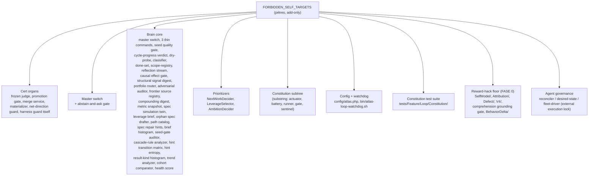
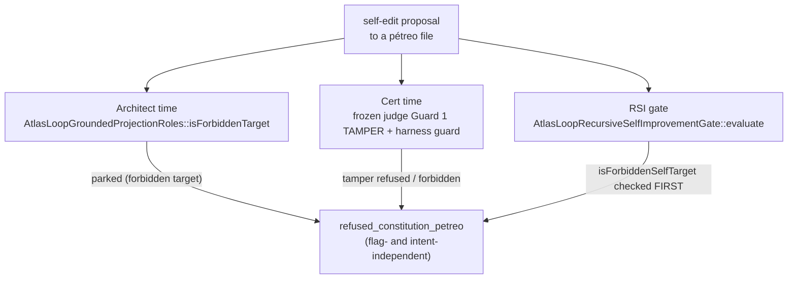

# Self-modification safety

The loop is allowed to evolve its own machinery. That is the source of compounding improvement and the most dangerous thing it can do. If it could edit the frozen judge, the gates, the master switch, or the Pétreo organs that perceive and prioritize, it would close its own eye and saw off the branch it sits on. Self-modification safety is the immutable floor that stops it. Three layers enforce it: the master switch (fail-closed, operator-only), the recursive-self-improvement gate (constitution-first, then policy), and the harness guard's `FORBIDDEN_SELF_TARGETS` (the pétreo list, flag- and intent-independent). The constitution gate service turns a candidate edit into a verdict plus a PASS token bound to the candidate tree and the frozen battery root.

## Purpose

The canonical contract is `docs/loop-self-modification-safety-canonical.md`. The operator's "RECURSIVE-TOTAL" decision set `meta_harness=true` on the autonomous scope, so the brain may evolve its own engine. That is only safe because the pétreo floor protects the judge, the gates, the switches, the stop-probe, the dedup memory, the perception organs, the attribution, the falsification gate, the meta-objective, and the config. The floor is add-only: a new forbidden entry may be added, never removed; the sentinel test fails if anyone shrinks it.

## Key abstractions

| Path | Role |
|---|---|
| `app/Services/Ai/AutonomousEvolution/AtlasLoopMasterSwitch.php` | Global fail-closed ON/OFF; parses `.env` directly; FORBIDDEN; operator-only |
| `app/Services/Ai/AutonomousEvolution/AtlasLoopHarnessGuard.php` | Owns `FORBIDDEN_SELF_TARGETS` (the pétreo list) + `isForbiddenSelfTarget` |
| `app/Services/Ai/AutonomousEvolution/AtlasLoopRecursiveSelfImprovementGate.php` | Self-edit gate: constitution-first, then policy |
| `app/Services/Ai/AutonomousEvolution/AtlasLoopAbstainAndAsk.php` | Frontier honesty abstain gate; FORBIDDEN |
| `app/Services/Ai/AutonomousEvolution/AtlasLoopNetDirectionGuard.php` | Net-direction guard; FORBIDDEN |
| `app/Services/Ai/AutonomousEvolution/AtlasLoopProposalPromotionGate.php` | Proposal promotion gate; FORBIDDEN |
| `app/Services/Ai/AutonomousEvolution/AtlasLoopProposalMaterializer.php` | Proposal materializer; FORBIDDEN |
| `app/Services/Ai/AutonomousEvolution/Constitution/AtlasLoopConstitutionGateService.php` | Turns candidate bytes into a verdict + PASS token |
| `app/Services/Ai/AutonomousEvolution/Constitution/AtlasLoopConstitutionGateToken.php` | The §3.5 token bound to candidate tree + battery root |
| `app/Services/Ai/AutonomousEvolution/Constitution/AtlasLoopConstitutionResolveFlags.php` | Resolves + monotonicity-checks config flags |
| `app/Services/Ai/AutonomousEvolution/Constitution/AtlasLoopCertChainClosure.php` | Cert chain closure |
| `app/Services/Ai/AutonomousEvolution/Constitution/AtlasLoopMergeActuator.php` | The governed merge actuator (re-verifies the token under lock) |
| `app/Services/Ai/AutonomousEvolution/SelfMod/AtlasLoopSelfModEditClassifier.php` | Classifies a self-edit (COSMETIC / STRUCTURAL / ...) |
| `app/Services/Ai/AutonomousEvolution/SelfMod/AtlasLoopSelfModInvariantExtractor.php` | Extracts declared invariants from the pre-source |
| `app/Services/Ai/AutonomousEvolution/SelfMod/AtlasLoopSelfModInvariantSurvivalChecker.php` | Proves the loop's edits preserve declared invariants |
| `app/Services/Ai/AutonomousEvolution/SelfMod/AtlasLoopSelfModProofReceiptLedger.php` | Proof receipts |

## How it works

### The master switch (fail-closed, operator-only)

`AtlasLoopMasterSwitch.php` is the single global gate that decides whether any part of the loop is allowed to run or respawn. It was built because the loop was auto-respawning (launchd scheduler, keepalive, resurrecting every stuck campaign) and burning tokens with no operator request.

Load-bearing invariants:

- **Default false, fail-closed.** Absent flag, unreadable `.env`, parse error, any exception means OFF. The loop is off unless the operator explicitly turned it on. Silence is off.
- **Robust under `config:cache`.** The switch does NOT read `config()` or `env()` (env returns null when the config is cached, the exact trap that would make a "safe" flag silently stale). It parses the `.env` file directly, so the value is whatever the operator last wrote, cache or no cache. The bash watchdogs grep the same line.
- **One source of truth.** The `ATLAS_LOOP_MASTER_ENABLED` line in `.env`. `on()` and `off()` rewrite that one line idempotently.
- **Pétreo.** This class is in `FORBIDDEN_SELF_TARGETS`. The loop can never edit its own master switch. It can never turn itself back on. Only the operator (via `atlas:loop:on` / `atlas:loop:off`) flips it.

Every auto-start vector (keepalive, campaign launch, the watchdog scripts, the loop schedule entries) checks `enabled()` before doing anything. Off means every one of them is a byte-identical no-op. See [concepts/earned-autonomy](../../concepts/earned-autonomy.md) and [cli-operator/watchdogs-and-master-switch](../cli-operator/watchdogs-and-master-switch.md).

### The FORBIDDEN_SELF_TARGETS floor (the pétreo list)

`AtlasLoopHarnessGuard.php` owns the immutable set of files the loop may never edit. `isForbiddenSelfTarget($path)` is a substring match over the constant list, so the whole file is covered and the Constitution subtree is covered by substring. The list is grouped by the safety property it protects:

The principle is the same for every entry: the réu (defendant) never edits the gate that judges it, the organ that credits it, the oracle that measures it, or the lock that authorizes its execution. Each entry is justified in the source by the specific trap it closes:

- The cert organs — editing the judge would let the loop grade its own work.
- The master switch — editing it would let the loop turn itself back on or weaken the fail-closed gate.
- The brain perception organs (dry-probe, classifier, done-set, scope-registry, reflection stream, structural signal digest, portfolio router, adversarial auditor, frontier source registry, compounding digest, metric snapshot, spec simulation twin, leverage brief, orphan spec drafter, path catalog, spec repair hints, brief histogram, seed-gate auditor, cascade-rule analyzer, hint transition matrix, hint entropy, result-kind histogram, trend analyzer, cohort comparator, health score) — editing what it perceives would let it shape its own input to forge the "right" leap; editing the router or decider would let it always route toward whichever path it wanted to win.
- The prioritizers (`NextWorkDecider`, `LeverageSelector`, `AmbitionDecider`) — the réu never edits the organ that decides what to do next.
- The Constitution subtree — the foundation (actuator, battery, runner, gate, sentinel) is inviolable by being written.
- `config/atlas.php` and `bin/atlas-loop-watchdog.sh` — the loop cannot lower its own safety gates or seize the external respawn trigger.
- The Constitution test suite — the build-time sentinel that admits or rejects a self-edit; if the loop could edit it, it could blind the admission gate.
- The reward-hack floor (SelfModel, Attribution, Defect, V4, comprehension grounding gate, BehaviorDelta) — the loop never edits the oracle, the credit gradient, the falsification bar, the meta-objective, the grounding veto, or the behavior-delta thermometer. This is what killed Sakana DGM and the CUDA Engineer; the floor closes it.
- AgentGovernance — the reconciler, desired-state, and fleet-driver that originate and authorize campaigns. Without this, the loop could force the hard execution gate to forever-true and originate a campaign even with the master switch off, without ever touching the pétreo switch file. Authorizing its own execution is the external lock; pétreo by the same principle as the master switch.

The harness guard also exposes `isHarnessTarget` (a file under `app/Services/Ai/AutonomousEvolution/` that is not forbidden) and `admit($path, $metaHarnessEnabled)` returning `forbidden`, `harness_gated`, or `admissible`. A harness file is only admissible as a target when `meta_harness` is on (default off).

### The recursive-self-improvement gate

`AtlasLoopRecursiveSelfImprovementGate.php` is the policy gate for any self-edit proposal. Two invariants hold in strict order:

1. **Constitution first (absolute, flag-independent).** A self-edit to a cert organ (anything in `FORBIDDEN_SELF_TARGETS`) is refused no matter what. The loop can never improve its way into weakening the gate that judges it. No flag, no policy, no operator switch reaches past this. It is checked first and short-circuits with `status:'refused_constitution_petreo'`.
2. **Policy (the operator's lever).** A self-edit to a non-pétreo brain file is a legal proposal, but applying it unattended needs explicit operator policy (`recursive_self_improvement_auto_apply`, default off). Off means the proposal is parked (`status:'parked_for_operator'`); the loop never edits itself without a human in the loop.

The gate classifies the proposal's kind: `harden` (add-only: a new guard, test, or forbidden entry; the safe exponential direction) or `improve` (a behavior change to a non-pétreo file; riskier). Both are legal but policy-gated; the kind lets a future operator policy auto-apply only hardening while still parking behavior changes. The gate is pure and deterministic (no provider, no I/O beyond the pétreo authority and the flag).

### The constitution gate service

`Constitution/AtlasLoopConstitutionGateService.php` turns a candidate edit's bytes into a verdict plus a PASS token. This is what `AtlasLoopHarnessGuard::admit()` routes a property-gated file to instead of a silent unlock. Each property-gated surface has its own weakening vector, so the gate dispatches per surface:

- **`config/atlas.php`** — the only weakening is a monotonicity violation (a safety gate flipped off, a threshold raised). `admitConfig` runs the §3.7 data check: it reads the candidate config by literal `require` with `.env` excluded, runs `monotonicityCheck(live, candidate)`, and rejects on any violation. A monotonic candidate passes and gets a token.
- **The judge surface (cert-chain closure, mutation operators, selector)** — the weakening is a blinder. `admitJudge` must run the candidate's judge bytes through the `AtlasLoopBatteryRunner` against the frozen battery (every bad refuted, every good certified, every robust held). The candidate-bytes substrate, the §3.6(i) probe, and the RobustnessProbe are built and proven; the §3.6(ii) judge-execution leg (clone-local autoload so the candidate's edited judge loads) is the remaining integration, so this path is fail-closed REJECT until it lands. It never returns a PASS it cannot back.

On PASS the service mints the §3.5 token bound to the candidate tree SHA and the battery root hash. The pétreo actuator (`AtlasLoopMergeActuator`) re-verifies the token under lock before committing.

### The frontier abstain gate

`AtlasLoopAbstainAndAsk.php` is the model-bound frontier honesty gate. The deterministic gates (grounding veto, anti-farm floor, frozen judge) prove what is real. At the frontier (a novel evolution with no precedent, a decision the model is not confident in, a citation the inventory cannot ground), the only honest moves are park it for the operator, or proceed. The forbidden move is to fabricate a confident decision to keep the funnel moving. The gate makes the honest choice mechanical: any uncertainty trigger forces abstain (park plus one precise operator question). It can never emit a fabricated "proceed": a proceed only fires when the decision is grounded AND confident AND not novel-without-precedent. The `proceedOnGroundedNovelty` flag (operator directive) lets a grounded, confident, novel decision proceed (the loop originates the leap); the honest floor moves downstream to the architect gate and the cert/refute pipeline. It is a FORBIDDEN self-target.

### The SelfMod invariant proofs

`SelfMod/` is the self-modification safety lab. `AtlasLoopSelfModEditClassifier` classifies an edit (COSMETIC, STRUCTURAL, ...). `AtlasLoopSelfModInvariantExtractor` extracts declared invariants from the pre-source. `AtlasLoopSelfModInvariantSurvivalChecker` proves the loop's edits preserve them: it returns per-invariant `HOLDS`, `UNCHECKABLE`, or `VIOLATED` and a verdict `APPROVED` or `REJECTED`. For a COSMETIC edit, the check is node-kind equality (a cosmetic edit must not change the AST node kinds). For a STRUCTURAL edit, the post-source is loaded and each invariant is evaluated against fixture inputs. `AtlasLoopSelfModProofReceiptLedger` records the proofs. `FormalProofs/` holds the formal proof substrate. See [recursive self-improvement](recursive-self-improvement.md).

## How the loop can never saw off its own branch

The same FORBIDDEN list is enforced at three independent points, so the loop cannot slip a self-edit through any one of them:

1. **At architect time.** `AtlasLoopGroundedProjectionRoles::isForbiddenTarget` parks a forbidden target before any obligation is projected.
2. **At cert time.** The frozen judge's Guard 1 TAMPER refuses any candidate that touches a frozen path; the harness guard refuses any self-edit to a cert organ.
3. **At RSI gate time.** `AtlasLoopRecursiveSelfImprovementGate::evaluate` checks `isForbiddenSelfTarget` first and short-circuits with `refused_constitution_petreo` before any policy is consulted.

The floor is add-only. A new forbidden entry may be added (a tightening); shrinking the list fails the sentinel test in `tests/Feature/Loop/Constitution/`.

## Integration points

- The master switch gates [the 8-phase cycle](the-8-phase-cycle.md) (close runner short-circuits when off) and [campaigns and runtime](campaigns-and-runtime.md) (every watchdog and auto-start vector checks it).
- The pétreo floor protects [quality gates and certification](quality-gates-and-certification.md) (the frozen judge, the gates) and [merge governor](merge-governor.md) (the merge service, the promotion gate, the materializer).
- The brain organs are co-located and heavily FORBIDDEN; see [the loop brain](the-loop-brain.md) and [recursive self-improvement](recursive-self-improvement.md).
- The operator surface is [cli-operator/watchdogs-and-master-switch](../cli-operator/watchdogs-and-master-switch.md); the doctrine is [concepts/earned-autonomy](../../concepts/earned-autonomy.md).

## Key source files

| File | What it does |
|---|---|
| `app/Services/Ai/AutonomousEvolution/AtlasLoopMasterSwitch.php` | Fail-closed ON/OFF; parses `.env` directly; FORBIDDEN |
| `app/Services/Ai/AutonomousEvolution/AtlasLoopHarnessGuard.php` | `FORBIDDEN_SELF_TARGETS` + `isForbiddenSelfTarget` + `admit` |
| `app/Services/Ai/AutonomousEvolution/AtlasLoopRecursiveSelfImprovementGate.php` | Constitution-first, then policy-gated |
| `app/Services/Ai/AutonomousEvolution/AtlasLoopAbstainAndAsk.php` | Frontier honesty abstain gate |
| `app/Services/Ai/AutonomousEvolution/Constitution/AtlasLoopConstitutionGateService.php` | Candidate bytes -> verdict + PASS token |
| `app/Services/Ai/AutonomousEvolution/Constitution/AtlasLoopConstitutionGateToken.php` | Token bound to candidate tree + battery root |
| `app/Services/Ai/AutonomousEvolution/Constitution/AtlasLoopMergeActuator.php` | Re-verifies the token under lock before committing |
| `app/Services/Ai/AutonomousEvolution/SelfMod/AtlasLoopSelfModInvariantSurvivalChecker.php` | Proves edits preserve declared invariants |
| `docs/loop-self-modification-safety-canonical.md` | The canonical self-modification safety contract |
| `tests/Feature/Loop/Constitution/` | The build-time sentinel suite (pétreo) |
