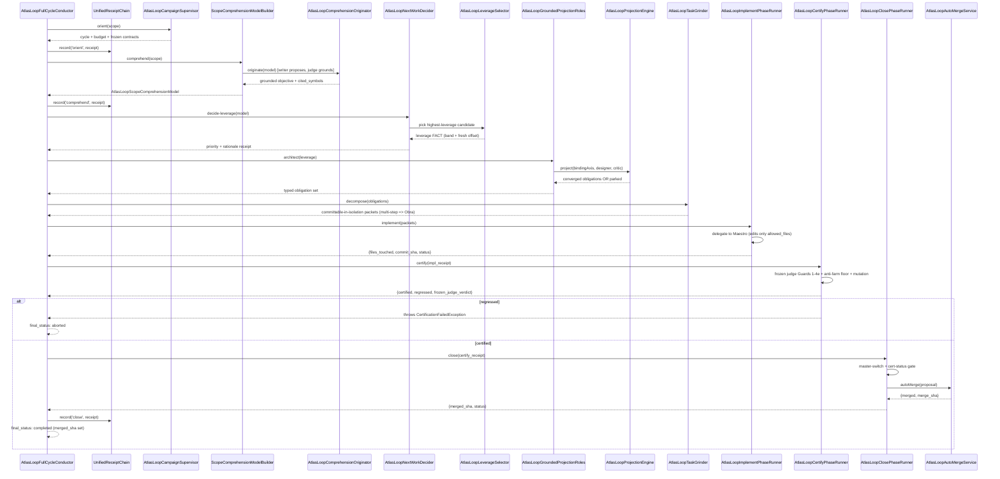

# The 8-phase cycle

The cycle is the loop's heartbeat. `AtlasLoopFullCycleConductor` runs a strict, sequential 8-phase cycle for one scope: orient, comprehend, decide-leverage, architect, decompose, implement, certify, close-on-main. Each phase is a pure runner that returns a receipt. Any phase that throws or returns `status:'failed'` short-circuits the conductor; subsequent runners are never invoked. Close-on-main is only "completed" with a real non-null `merged_sha`; a close with no merge is aborted, never a proxy success.

## Purpose

The cycle replaces ad-hoc agent loops with a mechanically enforced contract. The operator drilled the canonical sequence in `docs/loop-8-phase-cycle-canonical.md`: understand the scope, identify the leverage leap, project critically, decompose via the task fabric, execute by workers, verify, merge or reject by governance, record evidence, transfer learning, repeat. The conductor is the machine-checkable form of that contract.

## Key abstractions

| Path | Role |
|---|---|
| `app/Services/Ai/AutonomousEvolution/LiveCycle/AtlasLoopFullCycleConductor.php` | The canonical conductor; iterates `PHASES`, aborts on failure, requires `merged_sha` |
| `app/Services/Ai/AutonomousEvolution/LiveCycle/AtlasLoopPhaseRunner` (interface in the conductor file) | Minimal contract every runner implements: `run(array $scope): array` |
| `app/Services/Ai/AutonomousEvolution/LiveCycle/UnifiedReceiptChain` (interface in the conductor file) | Append-only receipt chain the conductor records each phase receipt into |
| `app/Services/Ai/AutonomousEvolution/LiveCycle/AtlasLoopClosePhaseRunner.php` | Phase 8 runner; master-switch and cert-status gated merge delegate |
| `app/Services/Ai/AutonomousEvolution/LiveCycle/AtlasLoopImplementPhaseRunner.php` | Phase 6 runner; pure Maestro delegate; artifacts-only receipt |
| `app/Services/Ai/AutonomousEvolution/LiveCycle/AtlasLoopCertifyPhaseRunner.php` | Phase 7 runner; regressed raises `CertificationFailedException` |
| `app/Services/Ai/AutonomousEvolution/LiveCycle/Integration/AtlasLoopLiveCycleOrchestrator.php` | The integration primitive `atlas:loop:cycle:run` drives |
| `app/Services/Ai/AutonomousEvolution/LiveCycle/Integration/AtlasLoopResumeManager.php` | Crash-resume a partially completed cycle |
| `app/Services/Ai/AutonomousEvolution/LiveCycle/Integration/AtlasLoopPhaseReceiptComposer.php` | Composes phase receipts into the unified chain |
| `app/Services/Ai/AutonomousEvolution/Campaign/AtlasLoopCampaignSupervisor.php` | The orient anchor (24h wall-clock supervisor) |
| `app/Services/Ai/AutonomousEvolution/Discovery/AtlasLoopScopeComprehensionModelBuilder.php` | The comprehend anchor |
| `app/Services/Ai/AutonomousEvolution/AtlasLoopComprehensionOriginator.php` | LAYER-2 cross-model origination (writer != judge) |
| `app/Services/Ai/AutonomousEvolution/Discovery/AtlasLoopNextWorkDecider.php` | The decide-leverage anchor; band + fresh offset |
| `app/Services/Ai/AutonomousEvolution/AtlasLoopLeverageSelector.php` | Frontier-model highest-leverage pick |
| `app/Services/Ai/AutonomousEvolution/AtlasLoopGroundedProjectionRoles.php` | The architect anchor; grounded designer/critic |
| `app/Services/Ai/AutonomousEvolution/AtlasLoopProjectionEngine.php` | Sound writer/critic convergence machine |
| `app/Services/Ai/AutonomousEvolution/AtlasLoopTaskGrinder.php` | The decompose + grind hot path (~68KB) |

## How it works

The conductor is small on purpose. The whole file is the contract; the work lives in the runners.

```php
public const PHASES = [
    'orient', 'comprehend', 'leverage', 'architect',
    'decompose', 'implement', 'certify', 'close',
];
```

`runCycle(array $scope): array` iterates the phases. For each phase it calls `$this->runners[$phase]->run($scope)` inside a try. Three abort paths:

1. A thrown `Throwable` (e.g. `CertificationFailedException` from certify) returns immediately with `final_status:'aborted'`, `aborted_at_phase`, and a truncated `abort_reason`. Subsequent runners are never invoked.
2. A receipt with `status:'failed'` is recorded, then the cycle aborts with `abort_reason:'phase_reported_failed'` (or the receipt's `reason`). A runner cannot silently mark itself failed and let the chain continue.
3. After `close`, the close receipt's `merged_sha` must be non-null and non-empty. Otherwise the cycle aborts with `abort_reason:'close_phase_missing_merged_sha'`. No proxy success.

A successful cycle returns `final_status:'completed'` with `merged_sha` set and `phases_completed` listing all eight.

The `withDefaultClosePhase` factory wires the production close runner (`AtlasLoopClosePhaseRunner`) into the runners map, taking an `autoMergeDelegate` callable (in production the `AtlasLoopAutoMergeService::autoMerge` entrypoint) and a `receiptChainAppender`.

### The phase flow



### Phase 1: orient

`Campaign/AtlasLoopCampaignSupervisor.php` is the orient anchor. It fixes a single canonical scope, a wall-clock budget, and the frozen contracts the cycle will hold against. It never proposes work. `AtlasLoopBudgetScheduler` and `AtlasLoopMasterSwitch` gate before any start. See [campaigns and runtime](campaigns-and-runtime.md).

### Phase 2: comprehend

`Discovery/AtlasLoopScopeComprehensionModelBuilder.php` builds the grounded scope model: an inventory of classes, measured caller edges, orphans (FQCN with zero production callers via fixed-string grep), clone clusters (normalized-body hash), pétreo/forbidden files, and doc-stated gaps (capabilities the canonical docs name but no symbol provides), plus a structural `snapshotId`. The model is facts-only: it never emits a scalar rank. "Which fact is highest leverage" is the frontier model's judgment, never the model's. See [work discovery and origination](work-discovery-and-origination.md).

#### Comprehension and origination (writer != judge grounding)

`AtlasLoopComprehensionOriginator.php` is LAYER 2: the model reasoning over the grounded substrate to propose a high-leverage evolution the supply lanes never enumerated. The danger of a free-text proposal is hallucination, e.g. "wire AtlasLoopFooBar" citing a symbol that does not exist. So writer != judge by construction:

- The **writer** (a frontier model, fenced behind a callable seam) proposes `{objective, cited_symbols}`.
- The **judge** is the deterministic `AtlasLoopComprehensionGroundingGate::groundAgainstInventory`. Every cited symbol must be a member of the brain's own inventory (exact FQCN, rel-path, or class-name), or the proposal is refuted.
- Fail-closed: no writer, no proposal, a proposal with no citations, or any refuted citation means no origination. An origination only exists when a model proposed it and the deterministic inventory judge cleared every symbol it rests on.
- Anchored origination: the loop proceeds on the citations the judge resolved, dropping any loose ones it refuted (kept in `refuted` as provenance, never acted on). The downstream target is chosen from resolved symbols and the materializer still requires that target to exist, so a dropped loose citation can never reach a hallucinated edit.

### Phase 3: decide-leverage

`Discovery/AtlasLoopNextWorkDecider.php` emits an ungameable next-work priority as a FACT, not a stored score:

```
priority = BAND(shape) + OFFSET(leverage re-resolved FRESH from the working tree)
```

- `BAND` is the work-shape tier. A wired refactor hub and an obra cluster sit in strictly higher, non-overlapping bands than an edge-fix. The offset cap (`BAND_WIDTH - 1 = 999`) is below the band gap (`BAND_REFACTOR - BAND_EDGE_FIX = 2000`), so shape always dominates leverage and no forged or stale stored field can cross a band. The bands: `BAND_SKIP = 0`, `BAND_EDGE_FIX = 2000`, `BAND_REFACTOR = 4000`, `BAND_OBRA = 6000`.
- The band is **raise-only** corrected from fresh measured truth: a genuinely wired and complex hub that the coarse shape under-classified is promoted to the refactor band by re-measured callers and cyclomatic, never demoted (fail-open).
- `OFFSET` is the leverage re-resolved fresh at decide time: real caller count plus measured worst-method cyclomatic. It is NOT the stored writable `target.score`. When both fresh reads are unavailable, the offset falls back to the stored score but is capped far below any measured target, so a degraded or forged read can never out-sort genuine measured work.

The decider emits an auditable rationale receipt ("why THIS next"). It is itself a FORBIDDEN self-target (the loop can never edit its own prioritizer). `AtlasLoopLeverageSelector.php` is the fenced frontier-model pick of the single highest-leverage candidate among grounded candidates: fail-closed, validates an in-range index, and trusts no stored score.

### Phase 4: architect

`AtlasLoopGroundedProjectionRoles.php` is the architect anchor. It replaces scripted designer/critic choreography with a critic that bites on ground truth. It reads the comprehension model's non-gameable who-calls-who edges and forces the design to carry an obligation for every real risk:

- The **designer** (round 1) seeds `behavior_preserved` (a mutation-operator id) and `contract_upheld` (a characterization test) on the target, plus the work-type's mandatory proof and any cross-model critique seeds.
- The **critic** (writer != judge) reads the target's real production callers and raises one `consumer_intact` obligation per round for each caller the design has not yet covered. When every real caller is covered it raises a `mutation_killed` obligation on the target (the anti-empty-test floor), then resolves what it raised, so the set converges.
- A target whose caller fan-out exceeds the engine's round budget never stabilizes. The engine parks it (blast-radius too large to auto-originate without review), a reachable, ground-truth-driven rejection, never a rubber-stamp.

#### The architect projection loop

`AtlasLoopProjectionEngine.php` is the convergence machine. The designer proposes each obligation as a typed tuple `{kind, target_symbol, assertion_ref}` where `assertion_ref` names a concrete check the cert chain can run. The critic (a distinct role, writer != judge) raises material obligations the designer must then address. New obligations across rounds are detected by set-difference on normalized keys (whitespace and case stripped, target fully-qualified, assertion-ref canonical), so a critic cannot be silenced by rephrasing and a designer cannot fabricate coverage with a non-existent mutation operator.

Convergence is a set-theoretic fact, not a panel's mood. CONVERGED iff all three:

1. The normalized obligation set stopped growing for a round.
2. The critic raised-then-resolved at least one material obligation (a contract that never grew is suspect, not converged).
3. At least one obligation maps to the binding system axis (the projection must actually address the bottleneck).

Oscillation (the set never stabilizes within `maxRounds`, default 8) means PARK, a liveness floor, never a livelock. The engine is itself a FORBIDDEN self-target because it produces the contract the cert chain enforces.

The obligation `kind` enum is fixed: `behavior_preserved`, `red_to_green`, `mutation_killed`, `consumer_intact`, `complexity_reduced`, `contract_upheld`, `perf_bound`, `coverage_added`. An out-of-enum kind is rejected; you cannot smuggle a fake axis.

### Phase 5: decompose

The conductor and `AtlasLoopTaskGrinder.php` split the obligation set into committable-in-isolation task packets. The invariant: each packet must be committable on its own. A step that needs a sibling step is routed to the **Obra bridge** (`AtlasLoopObraBridgeService.php` and `AtlasLoopObraExecutionAdapter.php`), the governed multi-file handoff. `AtlasLoopDecompositionService.php`, `AtlasLoopDecompositionShapePrior.php`, and `AtlasLoopTaskDecompositionAmplifier.php` support the decomposition.

### Phase 6: implement

`LiveCycle/AtlasLoopImplementPhaseRunner.php` is a pure delegate. It never writes files itself. It hands the decomposed packet to an injected Maestro delegate (in production `AtlasLoopAutonomousConductor` / `AtlasUnifiedLoopOrchestrator`) and returns a structured receipt of what the delegate did: `files_touched` (a sorted, deduped list), optional `commit_sha`, and a `status` in `{implemented, skipped, failed}`.

The receipt carries only verifiable artifacts. No line count, no churn metric, no score. An empty file list yields `skipped`, the honest outcome when the delegate produced nothing. The runner does not compensate by writing files itself. That is the anti-Goodhart invariant in the receipt shape.

### Phase 7: certify

`LiveCycle/AtlasLoopCertifyPhaseRunner.php` runs the certify orchestrator (`AtlasLoopSemanticImplementationCertifier.php`) through the frozen judge, the anti-farm floor, mutation adequacy, cross-file consumers, and complexity/structural drop measurement. Certified requires armed and improved; regressed always raises `CertificationFailedException` after appending the receipt, which short-circuits the conductor. See [quality gates and certification](quality-gates-and-certification.md).

### Phase 8: close-on-main

`LiveCycle/AtlasLoopClosePhaseRunner.php` delegates the merge to the auto-merge service. Three pétreo invariants:

1. `AtlasLoopMasterSwitch::enabled()` is false, so the runner short-circuits with `status:'skipped'` and `abort_reason:'master_switch_off'`. The merge delegate is never called.
2. The prior certify receipt's status is not `certified`, so the runner aborts with `abort_reason:'prior_certify_status_not_certified:<status>'`. The merge delegate is never called.
3. Any auto-merge refusal (preflight, conflict, reverse-audit rollback) flows through as `status:'aborted'` with the delegate's reason.

On a successful merge the receipt carries `merged_sha` from `merge_result.merge_sha`. The conductor then requires that value to be non-null or the whole cycle aborts. See [merge governor](merge-governor.md).

### Optional phase 9: learn

`AtlasLoopProjectionOutcomeLedger.php`, `Receipts/AtlasLoopCycleReceiptLedger.php`, `AtlasLoopLearningAppendService.php`, `AtlasLoopOriginationOutcomeRecorder.php`, and `AtlasLoopDecompositionOutcomeRecorder.php` append outcomes to ledgers. Learning never mutates a frozen contract. See [receipts and evidence](receipts-and-evidence.md).

## Integration points

- The conductor is driven by `atlas:loop:cycle:run {start|resume|status|audit}` through `LiveCycle/Integration/AtlasLoopLiveCycleOrchestrator.php`.
- The campaign supervisor (`atlas:loop:campaign`) wraps many cycles under a 24h wall-clock budget. See [campaigns and runtime](campaigns-and-runtime.md).
- The comprehend and decide-leverage phases are fed by the brain's `atlas:brain:next` flow. See [work discovery and origination](work-discovery-and-origination.md).
- The certify phase is the spine that connects to [quality gates and certification](quality-gates-and-certification.md).
- The close phase connects to [merge governor](merge-governor.md) and [self-modification safety](self-modification-safety.md) (the master switch).
- Every phase receipt flows into [receipts and evidence](receipts-and-evidence.md).

## Key source files

| File | What it does |
|---|---|
| `app/Services/Ai/AutonomousEvolution/LiveCycle/AtlasLoopFullCycleConductor.php` | The conductor; PHASES constant; runCycle with abort and merged_sha contract |
| `app/Services/Ai/AutonomousEvolution/LiveCycle/AtlasLoopClosePhaseRunner.php` | Phase 8; master-switch and cert-status gated merge delegate |
| `app/Services/Ai/AutonomousEvolution/LiveCycle/AtlasLoopImplementPhaseRunner.php` | Phase 6; pure Maestro delegate; artifacts-only receipt |
| `app/Services/Ai/AutonomousEvolution/LiveCycle/AtlasLoopCertifyPhaseRunner.php` | Phase 7; raises CertificationFailedException on regression |
| `app/Services/Ai/AutonomousEvolution/Campaign/AtlasLoopCampaignSupervisor.php` | Phase 1 anchor; 24h wall-clock supervisor |
| `app/Services/Ai/AutonomousEvolution/Discovery/AtlasLoopScopeComprehensionModelBuilder.php` | Phase 2 anchor; grounded scope model |
| `app/Services/Ai/AutonomousEvolution/AtlasLoopComprehensionOriginator.php` | Phase 2 LAYER-2; writer != judge origination |
| `app/Services/Ai/AutonomousEvolution/Discovery/AtlasLoopNextWorkDecider.php` | Phase 3 anchor; band + fresh offset |
| `app/Services/Ai/AutonomousEvolution/AtlasLoopLeverageSelector.php` | Phase 3; frontier-model highest-leverage pick |
| `app/Services/Ai/AutonomousEvolution/AtlasLoopGroundedProjectionRoles.php` | Phase 4 anchor; grounded designer/critic |
| `app/Services/Ai/AutonomousEvolution/AtlasLoopProjectionEngine.php` | Phase 4; convergence machine; park on oscillation |
| `app/Services/Ai/AutonomousEvolution/AtlasLoopTaskGrinder.php` | Phase 5 + 6 hot path; per-target decomposition and grind |
| `app/Services/Ai/AutonomousEvolution/LiveCycle/Integration/AtlasLoopLiveCycleOrchestrator.php` | The integration primitive the CLI drives |
| `docs/loop-8-phase-cycle-canonical.md` | The canonical 8-phase contract |
