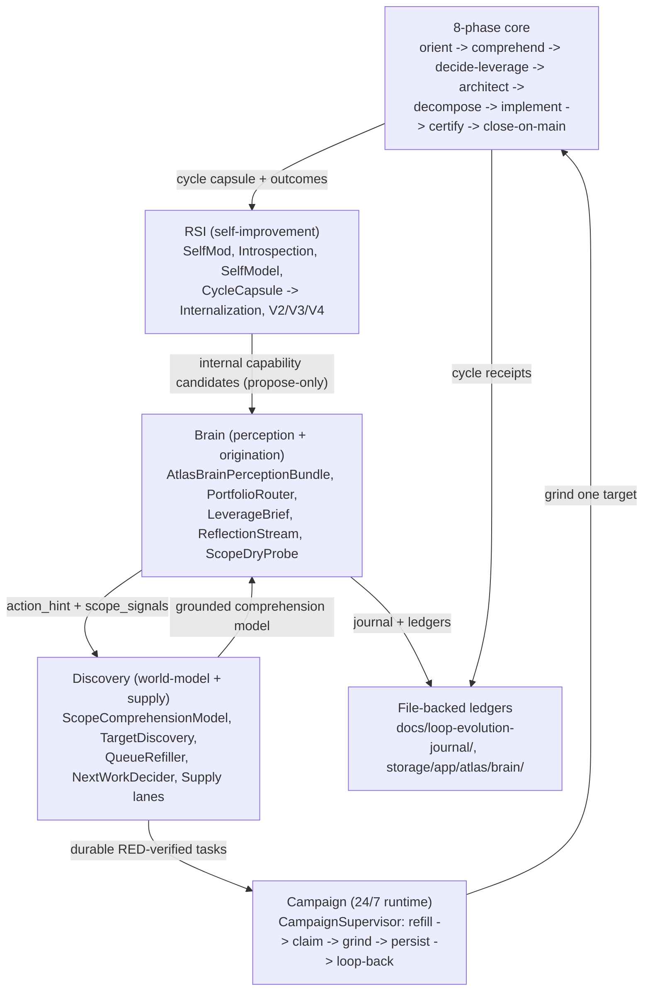

# The loop brain

The brain is the layer that decides **what** the loop should evolve next and **how** it learns to do that better over time. It sits above the mechanical 8-phase execute/certify/merge core. It does three jobs in a closed cycle: comprehend a scope into a grounded, non-gameable world-model (facts only); discover and originate the highest-leverage work from that model plus a never-drying portfolio of supply lanes, routed through a 7-path self-improvement portfolio and an author!=judge origination gate; and improve its own machinery recursively. The brain is deliberately file-backed (NDJSON/JSONL ledgers under `storage/app/atlas/brain/` plus the `docs/loop-evolution-journal/` journal), not DB-backed.

## Purpose

The mechanical core is good at grinding one target through certify and merge. It does not decide what is worth grinding. The brain is the organ that does. Its doctrine is the same anti-Goodhart spine as the rest of the loop, made stricter because the brain operates at the frontier where deterministic gates cannot reach: perception organs emit only facts and counts (NO-SCALAR), organs that perceive or prioritize are pétreo, and the brain only proposes. It writes to `docs/` journal, `storage/` ledgers, and the serving queue. It never writes to `app/`, never commits, never merges.

## Key abstractions

| Path | Role |
|---|---|
| `app/Services/Ai/AutonomousEvolution/Brain/AtlasBrainMasterSwitch.php` | Brain fail-closed ON/OFF (independent key `ATLAS_BRAIN_MASTER_ENABLED`); FORBIDDEN |
| `app/Services/Ai/AutonomousEvolution/Brain/AtlasBrainPerceptionBundle.php` | Façade composing ~22 read-only perception organs into "everything the brain sees" |
| `app/Services/Ai/AutonomousEvolution/Brain/AtlasBrainStructuralSignalDigest.php` | Top-K orphans/clones/doc-gaps from the comprehension model, shaped for the payload |
| `app/Services/Ai/AutonomousEvolution/Brain/AtlasBrainPortfolioRouter.php` | Maps dominant structural signal to one of 7 portfolio paths |
| `app/Services/Ai/AutonomousEvolution/Brain/AtlasBrainLeverageBrief.php` | Consolidates all scope_signals into ONE action_hint + 3 evidence cues + rationale |
| `app/Services/Ai/AutonomousEvolution/Brain/AtlasBrainReflectionStream.php` | Scope-keyed semantic Reflexion memory; recalls top-K prior post-mortems |
| `app/Services/Ai/AutonomousEvolution/Brain/AtlasBrainCompoundingDigest.php` | Cross-cycle status/streak summary (counts/streaks only, no scalar) |
| `app/Services/Ai/AutonomousEvolution/Brain/AtlasBrainCycleCapsule.php` | Replayable record of one external cycle (the V3 internalization substrate) |
| `app/Services/Ai/AutonomousEvolution/Brain/AtlasBrainInternalizationPipeline.php` | Turns external capsules into INTERNAL capability candidates (proposals only) |
| `app/Services/Ai/AutonomousEvolution/Brain/AtlasBrainSeedQualityGate.php` | Seed-boundary quality gate (vague_objective, acceptance_not_runnable, blind_orphan_wiring_proxy are fatal here) |
| `app/Services/Ai/AutonomousEvolution/Brain/AtlasBrainCycleProgressVerdict.php` | Counts a cycle as progress only when doc+enqueue+non-rejected-class+grounded-citation all hold |
| `app/Services/Ai/AutonomousEvolution/Brain/AtlasBrainScopeDryProbe.php` | The STOP decision (the probe's, not the model's) |
| `app/Services/Ai/AutonomousEvolution/Brain/AtlasBrainEvolutionLevelClassifier.php` | Anti-proxy classifier |
| `app/Services/Ai/AutonomousEvolution/Brain/AtlasBrainDoneSetLedger.php` | Dedup memory of done work |
| `app/Services/Ai/AutonomousEvolution/Brain/AtlasBrainScopeRegistry.php` | Scope reach |
| `app/Services/Ai/AutonomousEvolution/Brain/AtlasBrainCausalEffectGate.php` | Causal promotion gate |
| `app/Services/Ai/AutonomousEvolution/Brain/AtlasBrainGateAdversarialAuditor.php` | Attacks the gates/critics to find rubber-stamping |
| `app/Services/Ai/AutonomousEvolution/Brain/AtlasBrainFrontierSourceRegistry.php` | Pure-read substrate for the frontier-harvest path |
| `app/Services/Ai/AutonomousEvolution/Brain/AtlasBrainHealthScore.php` | Composed health grade |
| `app/Services/Ai/AutonomousEvolution/Discovery/AtlasLoopScopeComprehensionModel.php` | The facts-only world-model |
| `app/Services/Ai/AutonomousEvolution/AtlasLoopComprehensionOriginator.php` | LAYER-2 cross-model origination (writer != judge) |

## How it works

### Doctrine: author != judge, NO-SCALAR, pétreo, propose-only

Four invariants run through every brain organ:

1. **Author != judge.** Perception and origination organs surface signals or propose. Deterministic gates judge. No organ both proposes and certifies its own work. The comprehension originator's writer (a frontier model) proposes `{objective, cited_symbols}`; the deterministic `AtlasLoopComprehensionGroundingGate` refutes any uncited symbol.
2. **NO-SCALAR.** Perception organs store only raw facts, counts, and streaks, never a learned score the loop could optimize into a proxy. The comprehension model emits sets and per-path descriptive fields, never a scalar rank. "Which fact is highest leverage" is the frontier model's judgment, never the model's. The instant a structural role were encoded as a number the ranker climbs, it would be the cyclomatic proxy reborn one level up.
3. **Pétreo.** Perception and prioritization organs are FORBIDDEN self-targets. The brain can never edit its own perception (it would shape its own input to forge the "right" leap), its own prioritizer (it would always route toward whichever path it wanted to win), its own stop-probe, its own dedup memory, its own reflection stream, its own causal gate, its own adversarial auditor, its own metric snapshot, its own compounding digest, its own frontier source registry, its own leverage brief, its own health score, and so on. See [self-modification safety](self-modification-safety.md).
4. **Propose-only.** The brain writes to `docs/loop-evolution-journal/`, `storage/app/atlas/brain/` ledgers, and the serving queue. It never writes to `app/`, never commits, never merges. The merge organs and the pétreo floor forbid the brain editing them.

### The brain master switch

`AtlasBrainMasterSwitch.php` is the single global gate that decides whether the external brain is allowed to seed work into the serving queue. It is a clone of the loop master switch with its OWN key (`ATLAS_BRAIN_MASTER_ENABLED`), so the brain is gated independently of the muscle's loop/serving switches. Same invariants: default false, fail-closed, robust under `config:cache` (parses `.env` directly), one source of truth, pétreo. The brain can never turn itself back on. See [self-modification safety](self-modification-safety.md) and [cli-operator/watchdogs-and-master-switch](../cli-operator/watchdogs-and-master-switch.md).

### Perception organs (Brain/)

`Brain/` holds ~90 read-only perception organs plus the cycle/internalization substrate. Organs are versioned L1-L150+ (see `docs/brain-architecture-v2.md`). Major clusters:

- **Structural perception** — `AtlasBrainStructuralSignalDigest` (top-K orphans/clones/doc-gaps from the comprehension model, bounded so the payload stays small), `AtlasBrainPerceptionBundle` (single façade composing ~22 organs into "everything the brain sees" for a scope).
- **Path-portfolio analytics** — dozens of `…Path*` services: yield EWMA, momentum, diversity HHI, starvation, oscillation, KL-divergence.
- **Recommendation** — `AtlasBrainPortfolioRouter` (deterministic, auditable rotation), `AtlasBrainLeverageBrief` (one action_hint + 3 evidence cues + rationale), `AtlasBrainPlanAdviser`.
- **Reflection/learning** — `AtlasBrainReflectionStream` (scope-keyed semantic Reflexion memory, NO-SCALAR, flag-gated), `AtlasBrainCompoundingDigest` (cross-cycle status/streak summary, counts/streaks only).
- **Health/observability** — `AtlasBrainHealthScore`, `AtlasBrainMetricSnapshot`, `AtlasBrainTrendAnalyzer`, `AtlasBrainHeartbeatLedger`.
- **Frontier sourcing** — `AtlasBrainFrontierSourceRegistry`, `AtlasBrainFrontierMethodCatalog`, `AtlasBrainResearchSourceRegistry`.
- **Gate-adversarial auditing** — `AtlasBrainGateAdversarialAuditor`, `AtlasBrainRubberStampDetector`, `AtlasBrainCriticIndependenceScore`.
- **V3 internalization substrate** — `AtlasBrainCycleCapsule` (+`…Ledger`), `AtlasBrainInternalizationPipeline`, `AtlasBrainProvenanceLedger`.

The perception bundle composes all of these into one payload a downstream consumer can pull in a single call. It is pure composition over existing organs: no new state, no new IO. Pétreo (the bundle's shape is load-bearing; the réu would re-order to hide signals).

### The 7-path self-improvement portfolio

`config/atlas.brain.paths` defines the 7-path self-improvement portfolio with a per-path `executor_organ`:

| Path | Executor organ | Lens |
|---|---|---|
| `frontier-harvest` | `AtlasLoopPatternSourceIntake` | Mine an external frontier technique for a documented gap |
| `metrics-optimization` | `AtlasBrainCausalEffectGate` | Promote a measured causal effect into a tracked metric |
| `pattern-design` | `AtlasLoopPatternRegistry` | Resolve a duplicate via a pattern-registry match |
| `simulation-twin` | `AtlasLoopSimulableTwinOrchestrator` | Pre-flight a change in the software twin |
| `comprehension-deepening` | `AtlasLoopScopeComprehensionModelBuilder` | Go deeper on a subsystem to find non-obvious structural leverage |
| `adversarial-critique` | `AtlasLoopAdversarialVerifierPool` | Attack the cert gates to find rubber-stamping |
| `compounding` | `AtlasLoopLearningAppendService` | Build on a winning theme |

The portfolio router maps the dominant structural signal to one path deterministically: orphans map to `comprehension-deepening` (orphans ARE the non-obvious leverage), clone clusters map to `pattern-design` (duplicates are exactly what a pattern-registry match resolves), doc-stated gaps map to `frontier-harvest` (a documented gap is a known-unknown to mine an external technique for). Priority order when multiple signals are present: orphans, then clones, then gaps (orphans win because a file with zero callers is a fact, not a heuristic). An empty digest means no recommendation; the brain's normal rotation decides. The router never forces a path; it only surfaces a recommendation when the perception layer has a clear symptom.

### The scope comprehension model (facts only)

`Discovery/AtlasLoopScopeComprehensionModel.php` is the loop's real understanding of its own scope: what components exist, who calls whom, which are built-but-unwired orphans, which are structural clones, which are pétreo/forbidden, and which capabilities the canonical docs demand but no symbol provides. It is the substrate a frontier model reasons over to originate the highest-leverage evolution.

The anti-Goodhart invariant is load-bearing: this model emits facts-at-snapshot-T (sets and per-path descriptive fields) and never a scalar rank. It is consumed by nothing in the ranking math. Provenance is explicit: structural facts (orphans, edges, clones, forbidden) come from non-gameable oracles (FQCN caller grep, normalized-body clone hash, the harness guard); doc-derived facts (`docPurposes`, `docStatedGaps`) are tagged `writable_untrusted_prose` and are never a scored field. The model carries a structural `snapshotId` (a deterministic hash of the structural facts only, prose-independent).

`Discovery/AtlasLoopScopeComprehensionModelBuilder.php` is the pure builder: a deterministic function of a repo snapshot. `AtlasLoopScopeComprehensionQuery.php`, `AtlasLoopScopeComprehensionReadModel.php`, and `AtlasLoopScopeRuntimeFacts.php` expose it. Freshness is kept by `AtlasLoopComprehensionDeltaTracker`, `AtlasLoopComprehensionCadenceService`, `AtlasLoopComprehensionStalenessDetector`, and `AtlasLoopComprehensionDocReader`, plus `atlas:loop:comprehension snapshot|diff|stale`.

See [work discovery and origination](work-discovery-and-origination.md) for the origination flow that reasons over this model.

### How Brain/Discovery/RSI fit around the 8-phase core

The brain is the propose-only "decide" verb that emits the packet spec a worker (the implement/certify core) carries. Brain output is advisory: it never merges. The core's certify and merge organs do, and the pétreo floor plus the harness guard forbid the brain editing them. The comprehension model is the substrate the orient and comprehend phases read and the decide-leverage phase originates against (LAYER 1 to LAYER 2). The Discovery refiller is what fills the task queue the core grinds. The RSI organs replay core outcomes back into future discovery and origination (compounding). See [the 8-phase cycle](the-8-phase-cycle.md), [work discovery and origination](work-discovery-and-origination.md), and [recursive self-improvement](recursive-self-improvement.md).

### The cycle capsule and internalization

`AtlasBrainCycleCapsule.php` is the replayable record of one external evolution cycle (brain to task to muscle to validation to evidence). It captures everything needed to replay or learn from the cycle: the prompt/receipt, the task spec, the brain's decision, the provider that executed, the files touched, the evidence, the validation verdict, the metrics, the failures, and the learning. `capture()` normalizes a raw cycle into the canonical, validated capsule shape and is deterministic. Fail-closed: a cycle without a `task_packet_id` is unattributable and yields null. `AtlasBrainCycleCapsuleLedger` does the append-only IO.

`AtlasBrainInternalizationPipeline.php` turns external capsules into internal capability candidates of kind `skill`, `policy`, `wiring`, `metric`, or `reflection`. This is how an external soak compounds into the future internal brain instead of evaporating. The hard rule (author != judge, no fabricated capability): it only proposes. Every candidate is `promoted=false, requires_gate=true`. It never auto-promotes a capability; a separate gate or operator does. Pure and deterministic: candidates are a function of the capsules' real facts (certified outcome, files, failures, metrics, learning), never invented. A capsule with no usable signal yields no candidate. See [recursive self-improvement](recursive-self-improvement.md).

## Integration points

- The brain's `atlas:brain:next <scope>` flow is the propose-only "decide" verb; see [work discovery and origination](work-discovery-and-origination.md).
- The brain's perception organs are pétreo; see [self-modification safety](self-modification-safety.md).
- The cycle capsule and internalization feed [recursive self-improvement](recursive-self-improvement.md).
- The brain runs under the 24/7 campaign; see [campaigns and runtime](campaigns-and-runtime.md).
- The brain reaches frontier models through the [AI Gateway](../ai-gateway/).
- The brain is governed by the [self-construction-government](../self-construction-government/).

## Key source files

| File | What it does |
|---|---|
| `app/Services/Ai/AutonomousEvolution/Brain/AtlasBrainMasterSwitch.php` | Brain fail-closed ON/OFF (independent key) |
| `app/Services/Ai/AutonomousEvolution/Brain/AtlasBrainPerceptionBundle.php` | Façade over ~22 read-only perception organs |
| `app/Services/Ai/AutonomousEvolution/Brain/AtlasBrainStructuralSignalDigest.php` | Top-K orphans/clones/gaps digest |
| `app/Services/Ai/AutonomousEvolution/Brain/AtlasBrainPortfolioRouter.php` | Maps dominant signal to one of 7 paths |
| `app/Services/Ai/AutonomousEvolution/Brain/AtlasBrainLeverageBrief.php` | One action_hint + 3 evidence cues + rationale |
| `app/Services/Ai/AutonomousEvolution/Brain/AtlasBrainReflectionStream.php` | Scope-keyed Reflexion memory (NO-SCALAR) |
| `app/Services/Ai/AutonomousEvolution/Brain/AtlasBrainCycleCapsule.php` | Replayable record of one external cycle |
| `app/Services/Ai/AutonomousEvolution/Brain/AtlasBrainInternalizationPipeline.php` | Capsules to internal capability candidates (propose-only) |
| `app/Services/Ai/AutonomousEvolution/Discovery/AtlasLoopScopeComprehensionModel.php` | The facts-only world-model |
| `app/Services/Ai/AutonomousEvolution/AtlasLoopComprehensionOriginator.php` | LAYER-2 writer != judge origination |
| `docs/loop-brain-architecture.md` | Canonical brain architecture |
| `docs/brain-architecture-v2.md` | Organ map L1-L64+ |
| `docs/loop-brain-state.md` | Live maturity per axis |
| `config/atlas.php` (`atlas.brain.*`) | Brain config: master switch, journal root, done-set root, the 7-path portfolio |
