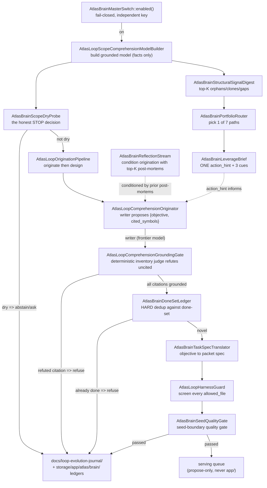

# Work discovery and origination

The brain's mechanical core is good at grinding one target through certify and merge, but it does not decide what is worth grinding. Work discovery and origination is the layer that fills the task queue the core grinds and that originates the next evolution when the obvious supply runs dry. It sits between the [loop brain](the-loop-brain.md) (which perceives and recommends) and the [8-phase cycle](the-8-phase-cycle.md) (which executes). Two distinct acts live here: **discovery** turns known structural facts into durable, RED-verified tasks, and **origination** has a frontier model propose a high-leverage evolution the lanes never enumerated, then a deterministic judge refutes any hallucinated citation.

## Purpose

The doctrine is the same anti-Goodhart spine as the rest of the loop. The queue must never dry on real work, and it must never fill on fake work. Three invariants hold:

1. **The only provider call in discovery is the honest RED gate.** A discovered target is not "real work" because a heuristic said so. `AtlasLoopQueueRefiller` asks the task generator to write one RED-verified frozen test plus objective. A target whose generated test is not genuinely RED is routed through loop-back and quarantined, never enqueued. The queue stays honest by construction.
2. **Author != judge in origination.** The frontier writer proposes `{objective, cited_symbols}`. The deterministic `AtlasLoopComprehensionGroundingGate` refutes any symbol not in the brain's own inventory. A free-text proposal citing "AtlasLoopFooBar" dies at the gate.
3. **No ceiling within a scope.** When reactive work dries up, the loop does not stop. An ambition faculty originates the next real leap rather than idling. See [concepts/anti-goodhart](../../concepts/anti-goodhart.md).

## Key abstractions

| Path | Role |
|---|---|
| `app/Services/Ai/AutonomousEvolution/Discovery/AtlasLoopTargetDiscoveryService.php` | Discovers candidate targets across the scope (the upstream of the refiller, ~43KB) |
| `app/Services/Ai/AutonomousEvolution/Discovery/AtlasLoopQueueRefiller.php` | Turns discovered targets into durable, RED-verified, reproducible TASKS (the self-feeding seam, ~2k lines) |
| `app/Services/Ai/AutonomousEvolution/Discovery/AtlasLoopObjectiveProducer.php` | Builds objectives/specs for discovered targets (~34KB) |
| `app/Services/Ai/AutonomousEvolution/Consolidation/AtlasLoopRefillerSupplyLaneCoordinator.php` | Arbitrates across supply lanes (~21KB) |
| `app/Services/Ai/AutonomousEvolution/Consolidation/AtlasLoopRefillerPriorityDecider.php` | Decides refill priority across lanes |
| `app/Services/Ai/AutonomousEvolution/Consolidation/AtlasLoopRefillerRegistry.php` | Registry of refillers |
| `app/Services/Ai/AutonomousEvolution/Consolidation/AtlasLoopRefillerSupplyLaneContract.php` | The supply-lane contract |
| `app/Services/Ai/AutonomousEvolution/Discovery/AtlasLoopNextWorkDecider.php` | Ungameable next-work priority = band(shape) + fresh-leverage offset; FORBIDDEN |
| `app/Services/Ai/AutonomousEvolution/Discovery/AtlasLoopAmbitionDecider.php` | Ambition-weighted decider: risk-seeking on ambition, risk-averse on the gate |
| `app/Services/Ai/AutonomousEvolution/Discovery/AtlasLoopLeverageScorer.php` | Leverage = (impact x breadth x compounding) / (cost x risk), with an ambition floor |
| `app/Services/Ai/AutonomousEvolution/Discovery/AtlasLoopExpectedValueDecider.php` | Bayesian EV + theory-of-constraints bottleneck relief |
| `app/Services/Ai/AutonomousEvolution/AtlasLoopComprehensionOriginator.php` | LAYER-2 cross-model origination; writer proposes, deterministic judge grounds |
| `app/Services/Ai/AutonomousEvolution/AtlasLoopOriginationPipeline.php` | End-to-end originate-then-design flow feeding `atlas:brain:next` |
| `app/Services/Ai/AutonomousEvolution/Brain/AtlasBrainStructuralSignalDigest.php` | Top-K orphans/clones/doc-gaps from the comprehension model, shaped for the payload |
| `app/Services/Ai/AutonomousEvolution/Brain/AtlasBrainPortfolioRouter.php` | Maps dominant structural signal to one of 7 portfolio paths |
| `app/Services/Ai/AutonomousEvolution/Brain/AtlasBrainLeverageBrief.php` | Consolidates all scope_signals into ONE action_hint + 3 evidence cues + rationale |
| `app/Services/Ai/AutonomousEvolution/Brain/AtlasBrainScopeDryProbe.php` | The honest STOP decision (the probe's, not the model's) |
| `app/Services/Ai/AutonomousEvolution/Brain/AtlasBrainReflectionStream.php` | Scope-keyed semantic Reflexion memory; recalls top-K prior post-mortems (NO-SCALAR) |
| `app/Services/Ai/AutonomousEvolution/Brain/AtlasBrainTaskSpecTranslator.php` | Translates an originated objective into a packet spec a worker carries |
| `app/Services/Ai/AutonomousEvolution/AtlasLoopAmbitionLeapProposer.php` | Turns frontier gaps into grounded AmbitionLeap proposals; rejects proxy deltas |
| `app/Services/Ai/AutonomousEvolution/AtlasLoopFrontierGapModel.php` | Fact-only frontier gap detector (connects persisted evidence ids, never scores ambition) |
| `app/Services/Ai/AutonomousEvolution/AtlasLoopTerritoryLadder.php` | The armed, not-promoted territory ladder (atomic discovery-root + frozen-safety widening) |
| `app/Services/Ai/AutonomousEvolution/Feedback/AtlasLoopGiveBackToReplenisherFeedback.php` | Delivery outcomes feed back into supply-lane priority |

## How it works

### Target discovery and the supply lanes

`AtlasLoopTargetDiscoveryService` surfaces candidate targets across the scope. It is the upstream of the refiller. Many **supply lanes/sources** mint known work so the queue never dries on the obvious structural facts:

| Lane / source | Path | What it mints |
|---|---|---|
| backlog-intent | `Discovery/AtlasLoopBacklogIntentSource.php` | Operator-authored backlog intents |
| coverage-deficit | `Discovery/AtlasLoopCoverageDeficitSource.php` | Real test coverage gaps |
| failure-handle | `Discovery/AtlasLoopFailureHandleSource.php` | Reproducible bug handles from red suites |
| doc-gap | `Discovery/AtlasLoopDocGapSupplyLane.php` | Capabilities the canonical docs name but no symbol provides |
| orphan-wiring | `Discovery/AtlasLoopOrphanWiringSupplyLane.php` | Built-but-unwired classes (orphans are unwired organs, not dead code) |
| dedup | `Discovery/AtlasLoopDedupSupplyLane.php` | Duplicate-elimination work with a proof |
| meta-harness | `Discovery/AtlasLoopMetaHarnessIntentSource.php` | Self-improvement intents for the `autonomous` scope |

The pluggable `Discovery/Supply/` lanes add cross-cutting supply: `CrossLeverageSupplyLane`, `FeatureFrontierSupplyLane`, `PatternTransferSupplyLane` (all under `app/Services/Ai/AutonomousEvolution/Discovery/Supply/`). Each implements `SupplyLaneContract`.

### The queue refiller's RED gate

`AtlasLoopQueueRefiller` is the self-feeding seam. For each top-ranked candidate it builds a scoped base workspace from the campaign's repo, asks `AtlasEvolutionTaskGenerator` to write ONE RED-verified frozen test plus objective (the only provider call in discovery), then snapshots the target content plus frozen test bodies into a durable task payload so the queued task is reproducible across restarts, and enqueues it.

The RED gate is the honest "is this real work" check. A target whose generator output is not genuinely RED is routed through `AtlasLoopBackService` loop-back (quarantined as un-grindable), never enqueued. The queue stays honest: no fake work reaches the grind, no real work is dropped because a heuristic was wrong about leverage.

### Refiller priority and coordination

`Consolidation/AtlasLoopRefillerSupplyLaneCoordinator` (~21KB) plus `AtlasLoopRefillerPriorityDecider` arbitrate across the supply lanes. The coordinator owns the cross-lane merge and ordering; the priority decider picks which lane's candidates refill next. `AtlasLoopRefillerRegistry` holds the registered refillers, and `AtlasLoopRefillerSupplyLaneContract` is the contract every lane implements. `Feedback/AtlasLoopGiveBackToReplenisherFeedback` closes the loop: delivery outcomes (certified, regressed, abstained) feed back into lane priority so a lane producing accepted work rises and a lane producing thrash falls. `AtlasLoopGiveBackHonestyAuditor` keeps the feedback honest.

### The deciders

Four deciders choose order. All are pure and deterministic (no provider, no DB, no mutation) so they freeze under test and can never be the thing that breaks a run.

- `AtlasLoopNextWorkDecider` emits an ungameable next-work priority as a FACT, not a stored score: `priority = BAND(shape) + OFFSET(leverage re-resolved FRESH from the working tree)`. The band gap (`BAND_REFACTOR - BAND_EDGE_FIX = 2000`) exceeds the offset cap (`BAND_WIDTH - 1 = 999`), so shape always dominates leverage and no forged or stale stored field can cross a band. It is a FORBIDDEN self-target (the loop can never edit its own prioritizer).
- `AtlasLoopLeverageScorer` scores each candidate by `leverage = (strategic_impact x breadth x compounding) / (cost x risk)`. Every input is a 0..1 normalized signal with a documented saturation, so the score is explainable and anti-Goodhart (leverage is strategic-progress-per-effort, never diff size). `passesAmbitionFloor` rejects trivia, janitorial work, and unverifiable dreams by construction.
- `AtlasLoopAmbitionDecider` is the operator's explicit strategy: always choose the work that lets Atlas evolve the most per commit, preferring the big high-return leap over the small safe one, even at lower landing probability. The score is `leap_magnitude * P(land)^riskTolerance - cost`. Risk-seeking on ambition is only sound because the honest coupling requires proportionally stronger verification for bigger leaps (`requiredVerification` scales with magnitude). The bounded-downside assumption is printed in every receipt: failures are discarded, main is byte-identical, the frozen gates never merge a bad result.
- `AtlasLoopExpectedValueDecider` is the decision-theoretic plus constraint-theoretic plus Bayesian choice: `EV = P_success(class) * value * reliefMultiplier(bottleneck) - costPenalty`. `P_success` is Bayesian (Laplace rule of succession over observed soak results, so it self-calibrates each cycle). `reliefMultiplier` is theory-of-constraints: work that improves the binding axis (the largest weighted gap across the utility-grade axes) is worth more per unit. The receipt stamps `is_optimal=false, estimate_calibrates=true` because it is the optimal decision given current grounded beliefs, never a proof of the outcome.

### The atlas:brain:next flow

`atlas:brain:next <scope>` is the propose-only "decide" verb that emits the packet spec a worker (the implement/certify core) carries. The flow:

Step by step:

1. **Master-switch gate.** `AtlasBrainMasterSwitch::enabled()` is checked first. Off means the brain seeds nothing. The brain switch is independent of the loop switch (`ATLAS_BRAIN_MASTER_ENABLED` vs `ATLAS_LOOP_MASTER_ENABLED`), both fail-closed, both pétreo.
2. **Build the comprehension model.** `AtlasLoopScopeComprehensionModelBuilder` produces the facts-only world-model (inventory, caller edges, orphans, clone clusters, forbidden files, doc-stated gaps). See [the loop brain](the-loop-brain.md).
3. **Dry probe.** `AtlasBrainScopeDryProbe` is the honest STOP decision. It returns `dry` only when the last `m` recent cycles ALL refused AND the comprehension model exposes zero new grounded gaps (orphans plus doc-stated gaps). Otherwise it returns `unknown_blocked`. The STOP is the probe's, not the model's: a model cannot fake-declare the scope dry when grounded facts remain.
4. **Originate then design.** `AtlasLoopOriginationPipeline` composes origination with design. `AtlasLoopComprehensionOriginator` originates a grounded evolution (writer proposes, judge grounds). The pipeline then resolves the primary cited symbol to its real scope path and runs `AtlasLoopArchitectPhaseGate` so the origination carries a converged design contract (caller protection plus the work-type's mandatory proof) or is suppressed (pétreo or blast-radius too large). An origination is only WORK once it has been designed as a principal engineer would design it, never a raw undesigned proposal.
5. **HARD dedup.** Every originated objective is deduped against the done-set ledger (`AtlasBrainDoneSetLedger`). A repeat of already-done work is refused, not re-enqueued.
6. **Translate to packet spec.** `AtlasBrainTaskSpecTranslator` turns the originated objective into a packet spec a worker can carry.
7. **Harness guard screen.** Every `allowed_file` is screened via `AtlasLoopHarnessGuard::isForbiddenSelfTarget()`. A target touching a pétreo file is refused before it can reach the grind.
8. **Seed quality gate.** `AtlasBrainSeedQualityGate` is the seed-boundary quality gate. `vague_objective`, `acceptance_not_runnable`, and `blind_orphan_wiring_proxy` are fatal here.
9. **Author and record.** The brain authors a journal section in `docs/loop-evolution-journal/` and records a `served` cycle in `storage/app/atlas/brain/`. Every refusal and abstain is also recorded so the dry-probe converges honestly.

Perception is composed for the payload in parallel with the decision: `AtlasBrainStructuralSignalDigest` picks the top-K facts from each axis (orphans, clone clusters, doc-stated gaps, bounded so the payload stays small), `AtlasBrainPortfolioRouter` maps the dominant signal to one of the 7 portfolio paths (orphans to `comprehension-deepening`, clones to `pattern-design`, gaps to `frontier-harvest`), and `AtlasBrainLeverageBrief` consolidates all scope_signals into ONE `action_hint` plus 3 evidence cues plus a rationale. The brief is a HINT, never a directive: the brain still authors the spec, the gate still vets it.

### Writer != judge origination

`AtlasLoopComprehensionOriginator` is LAYER 2: the model reasoning over the grounded comprehension substrate to propose a high-leverage evolution the supply lanes never enumerated. The danger of a free-text proposal is hallucination. So writer != judge by construction:

- The **writer** (a frontier model, fenced behind a callable seam) proposes `{objective, cited_symbols}`.
- The **judge** is the deterministic `AtlasLoopComprehensionGroundingGate::groundAgainstInventory`. Every cited symbol must be a member of the brain's own inventory (exact FQCN, rel-path, or class-name), or the proposal is refuted.
- Fail-closed: no writer, no proposal, a proposal with no citations, or any refuted citation means no origination. An origination only exists when a model proposed it and the deterministic inventory judge cleared every symbol it rests on.
- Anchored origination: the loop proceeds on the citations the judge resolved, dropping any loose ones it refuted (kept in `refuted` as provenance, never acted on). The downstream target is chosen from resolved symbols and the materializer still requires that target to exist, so a dropped loose citation can never reach a hallucinated edit.

### Reflection-stream conditioning

`AtlasBrainReflectionStream` is scope-keyed semantic Reflexion memory. It recalls the top-K prior post-mortems to condition the next origination. It is NO-SCALAR (stores only flag/streak/text, never a learned score) and flag-gated. The reflection stream is a FORBIDDEN self-target: the loop can never edit the memory it recalls from, else it would shape its own past to forge the "right" future leap. The reflection provenance chain (`AtlasBrainReflectionProvenanceChain`) ties each recalled post-mortem to the cycle that produced it, so conditioning is auditable.

### The ambition faculty

A scope given to the loop has no ceiling. When the reactive work dries up, the loop does not stop. The ambition faculty originates the next real leap. This is the **faculdade de ambição**.

`AtlasLoopFrontierGapModel` is a fact-only frontier gap detector: it never scores ambition, it only connects already-persisted evidence ids. It computes a `FrontierGap` when a scope shows a plateau signal (the capability-trend rate has been flat for the window) AND a starvation signal (the last `m` origination cycles all abstained). Each gap carries `evidence_refs` grounded in real persisted facts.

`AtlasLoopAmbitionLeapProposer::propose(frontierGaps)` turns frontier gaps into grounded `AmbitionLeap` proposals. The floor is strict:

- A gap must carry `plateau_signal: true` and at least 3 grounded evidence refs, or the proposer abstains with `insufficient_grounded_evidence`.
- The `target_capability_delta` is rejected if it reads as a proxy delta (cyclomatic, dead code, formatting, refactor, rename, whitespace). A proxy delta abstains with `proxy_delta_rejected`.
- A leap that clears both floors emits a hypothesis plus a `target_capability_delta` plus the grounded evidence refs. `AtlasLoopLeapRiskAuditor` and `AtlasLoopLeapDecompositionSeeder` turn the leap into real cycle work. `AtlasLoopLeapReceiptLedger` records it.

The leap re-enters the same project, implement, certify, merge spine. It is REAL proven work, never fake. See [concepts/anti-goodhart](../../concepts/anti-goodhart.md).

The territory ladder (`AtlasLoopTerritoryLadder`) gates how the loop's scope is released gradually. Widening a discovery root is the most dangerous act the loop can perform: a new territory carries its own judge (the safety files that decide whether the loop is allowed to edit there). The ladder enforces the atomic three-set promotion invariant: every widened discovery root must have at least one frozen safety file under it AND ship at least one robustness case. A promotion is allowed only when the invariant holds AND the promotion rule is met (enough certified leaps, zero red-main in the window, compounding trending up). It is the armed mechanism plus the gate; it does not widen any live discovery root itself.

## Integration points

- The comprehension model is the substrate the [8-phase cycle](the-8-phase-cycle.md) orient and comprehend phases read; this page covers the decide-leverage origination that reasons over it.
- The queue refiller fills the task queue the [8-phase cycle](the-8-phase-cycle.md) grinds. The campaign supervisor (`atlas:loop:campaign`) wraps the refill under a 24h wall-clock budget. See [campaigns and runtime](campaigns-and-runtime.md).
- The perception organs and the propose-only doctrine are covered in [the loop brain](the-loop-brain.md). This page covers the discovery and origination flow specifically.
- The pétreo floor that forbids the loop editing its own perception and prioritization organs is covered in [self-modification safety](self-modification-safety.md).
- The deciders and the harness guard are FORBIDDEN self-targets; see [self-modification safety](self-modification-safety.md).
- The brain reaches frontier models through the [AI Gateway](../ai-gateway/index.md).
- The loop is governed by the [self-construction-government](../self-construction-government/index.md).

## Key source files

| File | What it does |
|---|---|
| `app/Services/Ai/AutonomousEvolution/Discovery/AtlasLoopTargetDiscoveryService.php` | Discovers candidate targets across the scope |
| `app/Services/Ai/AutonomousEvolution/Discovery/AtlasLoopQueueRefiller.php` | The self-feeding seam; RED-verified durable tasks; the only provider call is the honest RED gate |
| `app/Services/Ai/AutonomousEvolution/Discovery/AtlasLoopNextWorkDecider.php` | Ungameable band + fresh-leverage offset priority |
| `app/Services/Ai/AutonomousEvolution/Discovery/AtlasLoopAmbitionDecider.php` | Risk-seeking on ambition, risk-averse on the gate |
| `app/Services/Ai/AutonomousEvolution/Discovery/AtlasLoopLeverageScorer.php` | Leverage score with an ambition floor |
| `app/Services/Ai/AutonomousEvolution/Discovery/AtlasLoopExpectedValueDecider.php` | Bayesian EV + theory-of-constraints bottleneck relief |
| `app/Services/Ai/AutonomousEvolution/Consolidation/AtlasLoopRefillerSupplyLaneCoordinator.php` | Cross-lane refill arbitration |
| `app/Services/Ai/AutonomousEvolution/AtlasLoopComprehensionOriginator.php` | Writer != judge LAYER-2 origination |
| `app/Services/Ai/AutonomousEvolution/AtlasLoopOriginationPipeline.php` | Originate-then-design flow feeding `atlas:brain:next` |
| `app/Services/Ai/AutonomousEvolution/Brain/AtlasBrainStructuralSignalDigest.php` | Top-K orphans/clones/gaps digest |
| `app/Services/Ai/AutonomousEvolution/Brain/AtlasBrainPortfolioRouter.php` | Maps dominant signal to one of 7 paths |
| `app/Services/Ai/AutonomousEvolution/Brain/AtlasBrainLeverageBrief.php` | ONE action_hint + 3 evidence cues + rationale |
| `app/Services/Ai/AutonomousEvolution/Brain/AtlasBrainScopeDryProbe.php` | The honest STOP decision |
| `app/Services/Ai/AutonomousEvolution/Brain/AtlasBrainReflectionStream.php` | Scope-keyed Reflexion memory (NO-SCALAR) |
| `app/Services/Ai/AutonomousEvolution/AtlasLoopAmbitionLeapProposer.php` | Ambition leap origination from frontier gaps |
| `app/Services/Ai/AutonomousEvolution/AtlasLoopFrontierGapModel.php` | Fact-only frontier gap detector |
| `app/Services/Ai/AutonomousEvolution/AtlasLoopTerritoryLadder.php` | Atomic discovery-root + frozen-safety widening gate |
| `app/Services/Ai/AutonomousEvolution/Feedback/AtlasLoopGiveBackToReplenisherFeedback.php` | Delivery outcomes feed back into supply priority |
| `app/Console/Commands/AtlasBrainNextCommand.php` | The `atlas:brain:next <scope>` command (FORBIDDEN) |
| `docs/loop-canonical-definition.md` | The canonical definition of the loop (the ambition faculty) |
