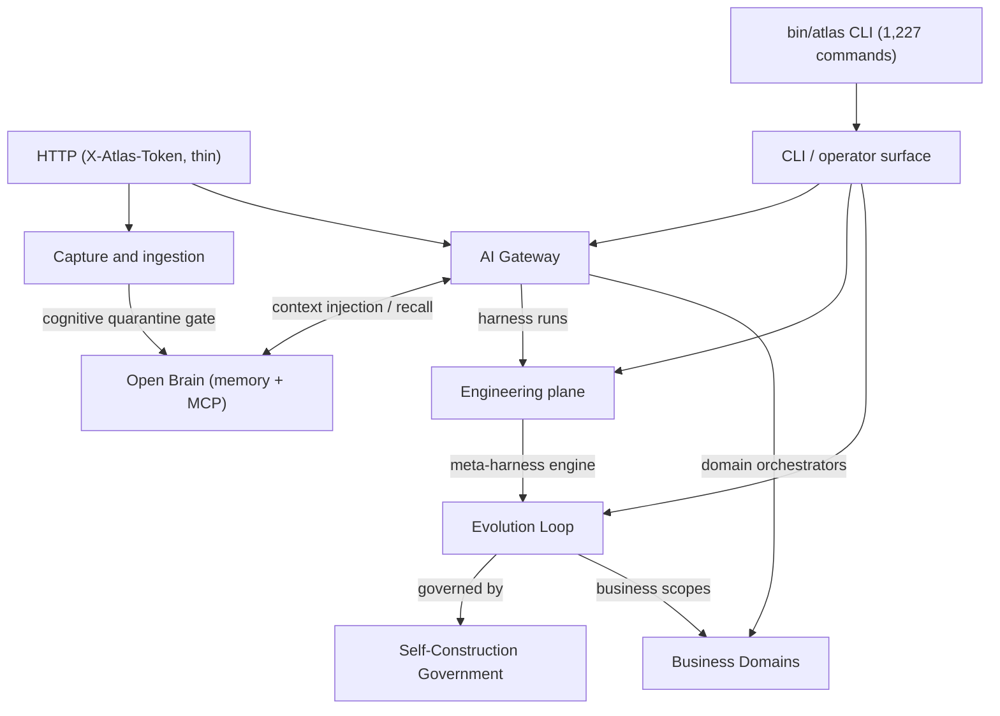

# Systems

Atlas Server is built from eight conceptual subsystems. Each one is a directory of pages under `systems/`. The HTTP layer is thin (`routes/api.php`, protected by a static `X-Atlas-Token`); the real surface is 1,227 artisan commands dispatched by the `bin/atlas` launcher. The intelligence lives under `app/Services/`, overwhelmingly `app/Services/Ai/` (112 subdirectories).

## The eight subsystems

| Subsystem | What it does | Pages |
|-----------|-------------|-------|
| [Capture and ingestion](capture-ingestion/index.md) | The original V1 personal-data backend. Receives captures (text/audio/photo), check-ins, passive health signals, Sensor 4 digital activity, and the daily mission from the operator's devices. Audio is transcribed with whisper.cpp. All raw captures are cognitively quarantined until a human ratifies a curation proposal. | [capture-ingestion/](capture-ingestion/index.md) |
| [AI Gateway](ai-gateway/index.md) | The single mediated path to frontier models. The app never calls Claude, Codex, or Gemini APIs directly. An interaction creates a trace and a job; a local worker (`atlas:ai:work`) runs the already-authenticated provider CLI as a child process and streams the result back. | [ai-gateway/](ai-gateway/index.md) |
| [Open Brain](open-brain/index.md) | A governed knowledge store and MCP server that any external AI can plug into. Fuses three brains (code-graph, reality graph, semantic memory) into one provider-safe context pack. Canonical memory is the source of truth; `CLAUDE.md` and `AGENTS.md` are generated projections. | [open-brain/](open-brain/index.md) |
| [Engineering](engineering/index.md) | The agentic software-engineering plane: versioned blueprints, a code-intelligence read model with BM25-ranked context packs, reality cartography, a sandboxed harness runner, and an Atlas-vs-Claude-Code benchmark. | [engineering/](engineering/index.md) |
| [Evolution Loop](evolution-loop/index.md) | The crown jewel. Given a scope, it grinds 24/7 to evolve that scope exponentially through a strict 8-phase cycle (orient, comprehend, decide-leverage, architect, decompose, implement, certify, close-on-main). Replaces the human reviewer with a frozen out-of-process judge, cross-model triangulation, mutation testing, and a fail-closed merge gate. | [evolution-loop/](evolution-loop/index.md) |
| [Self-Construction Government](self-construction-government/index.md) | The meta-architecture that governs the Loop. Sixteen organs with separation of powers: no single agent originates, implements, judges, merges, and promotes its own work. A Kubernetes-style fleet control plane (default OFF) authorizes which agents may run. Autonomy is earned, not assumed. | [self-construction-government/](self-construction-government/index.md) |
| [Business Domains](business-domains/index.md) | The same agent machinery pointed at money-making scopes: a generic domain-manifest engine, a live trading strategy loop (Finance), a Conversion OS and Search/Keyword OS (Marketing), Venture Foundry, and a Holding/Strategic-OS company stack. | [business-domains/](business-domains/index.md) |
| [CLI and operator surface](cli-operator/index.md) | The `atlas` terminal product (`bin/atlas`), a Dev Cockpit, bootstrap-to-release readiness gates, an operator approval gate with Ed25519-signed decision receipts, and shell watchdogs that keep the Loop alive without a human supervising. | [cli-operator/](cli-operator/index.md) |

## How they interconnect

The capture and ingestion layer feeds the AI platform through a cognitive quarantine gate: a raw capture is never treated as memory, context, or learning signal until a human ratifies a semantic-curation proposal. The AI Gateway is the only path to frontier models. The Open Brain is the shared knowledge surface that the Gateway, Engineering, and external AI tools all read from and (governed) write back to. The Evolution Loop is one organ inside the Self-Construction Government. Business Domains reuse the same agent machinery for finance, marketing, and ventures.

## Cross-cutting doctrine

Several concepts appear across all subsystems. They are documented in detail under [concepts/](../concepts/index.md):

- **Anti-Goodhart / no-proxy** ([concepts/anti-goodhart.md](../concepts/anti-goodhart.md)) — never optimize a measurable surrogate. Refactor that preserves behavior is zero improvement.
- **Provider-safety** ([concepts/provider-safety.md](../concepts/provider-safety.md)) — every byte that can cross to an external AI is redacted by construction.
- **Separation of powers** — the agent that writes a change never judges, merges, or promotes it.
- **Evidence and receipts** — append-only, tamper-evident receipt chains prove what actually ran.
- **Earned autonomy + fail-closed master switches** — no scope gets 24/7 authority by ambition; master switches default OFF.

## Related pages

- [Architecture](../overview/architecture.md) — system architecture with data-flow diagrams
- [Glossary](../overview/glossary.md) — project-specific terms
- [REST API reference](../api/rest-endpoints.md) — the full HTTP endpoint catalog
