# Blackboard and write-back governance

## Purpose

The context pack is the read direction (brain -> external AI). Two other
surfaces complete the Open Brain:

- **Write-back (N1.F2)** lets an external session report what it did and
  propose what it learned. The input is untrusted and hostile by default: it
  can never write canonical memory directly, never auto-promote, and never
  exceed provider-safety. Every accepted write lands as a branch-only
  proposal.
- **Blackboard (N2.F4)** is the shared coordination surface between engines.
  Multiple AIs working in the same workspace claim targets (files, tasks,
  missions) so that when one engine is about to edit a file another engine
  already holds, the brain can surface the conflict during flight.
- **Per-file brain-delta (N2.F1)** is the active brain: when an engine opens
  or edits a file, it gets the brain's slice for that one file.

This page documents `AtlasOpenBrainWriteBackService`,
`AtlasAobgBlackboardService`, and `AtlasOpenBrainFileContextService`.

## Key abstractions

| Path / constant | Role |
|---|---|
| `app/Services/Ai/AtlasOpenBrainWriteBackService.php` | N1.F2 governed write-back: `recordOutcome`, `proposeLearning` |
| `app/Services/Ai/AtlasAobgBlackboardService.php` | N2.F4 blackboard: `claim`, `release`, `active`, `conflictsFor` |
| `app/Services/Ai/AtlasOpenBrainFileContextService.php` | N2.F1 per-file brain-delta: `contextFor` |
| `app/Services/Ai/AtlasOpenBrainSessionCaptureService.php` | Structural capture of an external session into governed proposals |
| `app/Models/AtlasAobgBlackboard.php` | Blackboard claim row |
| `AtlasOpenBrainWriteBackService::SCHEMA` | `atlas.aobg.write_back.v1` |
| `AtlasAobgBlackboardService::SCHEMA` | `atlas.aobg.blackboard.v1` |
| `AtlasAobgBlackboardService::TABLE` | `atlas_aobg_blackboard` |
| `AtlasOpenBrainFileContextService::SCHEMA` | `atlas.aobg.file_context.v1` |

## Write-back (N1.F2)

`app/Services/Ai/AtlasOpenBrainWriteBackService.php` is the governed door
external AI uses to feed the brain. It assembles two proven, gated writers
under one hostile-input boundary:

1. `record_outcome` -> `AtlasRealityGraphIngestionService::recordMissionOutcome()`
   — the existing AURG mission/evidence node writer. It writes only
   provider-safe ids/hashes/labels, is idempotent by content hash, fails open,
   and writes a **branch ref, never a merge to main**.
2. `propose_learning` -> `AtlasLearningProposalService::propose()` — the
   canonical compounding admission pipeline. It runs the capture quality gate
   (`AtlasCaptureQualityGate`) that rejects noise, dedups by content, and
   **always** materializes `status='proposed'`; `apply` / `auto_apply` are
   rejected by that service, so this surface cannot auto-promote.

### Hostile-input floor (applied before delegating)

- **Provider-safety**: any declared privacy class other than `normal`
  (`private`, `sensitive`, `secret`, `cyber`, `classified`, `pii`) is
  **rejected** with `REJECT_SENSITIVE`. Untrusted input may not stamp itself
  provider-safe. Label fields written to the brain are redacted via
  `AtlasSecurity::redactString` (defense in depth).
- **Size**: oversized payloads are **rejected**, not silently truncated. Caps
  (from `config/atlas.aobg.write_back.*`):

  | Cap | Default | Env |
  |---|---|---|
  | `max_request_chars` | 2000 | `ATLAS_AOBG_WB_MAX_REQUEST_CHARS` |
  | `max_files` | 50 | `ATLAS_AOBG_WB_MAX_FILES` |
  | `max_memory_refs` | 25 | `ATLAS_AOBG_WB_MAX_MEMORY_REFS` |
  | `max_id_chars` | 256 | `ATLAS_AOBG_WB_MAX_ID_CHARS` |

- **Shape**: required fields enforced; missing/blank -> `REJECT_INVALID`.

### Rejection reasons (stable, auditable)

| Constant | Reason |
|---|---|
| `REJECT_SENSITIVE` | `rejected_provider_unsafe` |
| `REJECT_OVERSIZED` | `rejected_oversized` |
| `REJECT_INVALID` | `rejected_invalid_input` |
| `REJECT_QUALITY` | `rejected_by_quality_gate` |

### Never throws

A store fault degrades to a `recorded:false` / `ok:false` reason (fail-open),
so a brain outage never breaks the external session. Every write appends an
audit receipt.

## Blackboard (N2.F4)

`app/Services/Ai/AtlasAobgBlackboardService.php` is the shared coordination
surface. A claim is a provider-safe ref: `{workspace_id, engine, kind, target,
status, claimed_at, expires_at, meta}`. `target` is a file path or a task ref
(a label only); no content is stored. Workspace identity is resolved by the
same `CodeGraphWorkspaceIdentity` the rest of AOBG uses (multi-project, never
a cross-workspace leak).

### Guarantees

- **Idempotent**: the same engine re-claiming the same target collapses onto
  one active row (`UNIQUE(workspace, engine, kind, target)` + `updateOrInsert`),
  refreshing `claimed_at` and `expires_at`. The claim id is deterministic:
  `"<engine>:<kind>:<sha1(workspace|target)>"`.
- **Conflict-aware**: a claim on a target another engine already holds returns
  `status=conflict` with the conflicting claim. It does **not** steal the
  claim and does **not** throw. The caller (or the Claude Code `PreToolUse`
  guard) decides what to do with the conflict. Coordination, not a gate.
- **Lazily expiring**: a claim past its `expires_at` is marked `stale` on the
  next read (`expireStale`), so a crashed engine's claim never blocks
  coordination forever. No cron needed. `max_ttl_seconds` defaults to 86400.
- **Fail-open**: any fault (no table, DB error, bad input) degrades to a safe
  no-finding answer. The service never throws.

### Kinds and statuses

- **Kinds**: `task`, `file`, `mission` (unknown normalizes to `file`).
- **Statuses**: `active`, `released`, `stale`.

### Claude Code hook asymmetry (honestly stated)

In Claude Code, the `PreToolUse` hook
(`.claude/hooks/atlas-pretooluse-guard.sh`) reads `conflictsFor(target)`
automatically and injects an **advisory** warning ("codex is editing this
file") before an edit. It is never a block. Codex and Cursor have no rich
hooks: they reach the same blackboard only via the `atlas_claim_task` and
`atlas_blackboard_status` MCP tools, called on demand.

## Per-file brain-delta (N2.F1)

`app/Services/Ai/AtlasOpenBrainFileContextService.php` answers "what does the
brain already know about THIS file?" when an engine opens or edits it. It
assembles the same three provider-safe brains the context pack uses, but
seeded from a file path rather than a free-text prompt:

1. **code-graph neighbors** — `EngineeringCodeIntelligenceService::symbols()`,
   workspace-scoped: symbols defined in the file + who consumes it (the
   "consumed by Z").
2. **reality graph (AURG)** — `AtlasRealityGraphQueryService::query()` with
   `provider_bound=true`, seeded from the file's module path + basename
   tokens: the cross-layer paths (missions/decisions/evidence/domains) that
   touch the file's module (the "decision X / mission Y").
3. **semantic memory** — `AtlasHybridMemoryRetrievalService::recall()` over
   the redacted projection, keyed on the file's class/basename (the
   "memories that reference this file").

### Caps (from `config/atlas.aobg.file_context.*`)

| Cap | Default | Env |
|---|---|---|
| `budget_chars` | 3500 | `ATLAS_AOBG_FC_BUDGET_CHARS` |
| `max_neighbors` | 12 | `ATLAS_AOBG_FC_MAX_NEIGHBORS` |
| `max_memory` | 6 | `ATLAS_AOBG_FC_MAX_MEMORY` |
| `max_paths` | 8 | `ATLAS_AOBG_FC_MAX_PATHS` |

A final `enforceTotalCeiling` pass trims trailing (lowest-ranked) items,
neighbors first (the largest section), then memory, then paths, until the
measured chars fit. Each non-empty section keeps at least its top hit.

### Honest empty

An unknown, out-of-workspace, or brain-less file yields an empty-but-valid
delta (`has_context=false`), never a fabricated one. The delta labels itself
`curated top-K (not exhaustive)`. The service never throws.

### Claude Code hook asymmetry (honestly stated)

In Claude Code, the `PostToolUse` hook
(`.claude/hooks/atlas-postedit-context.sh`) fires `contextFor(path)`
automatically on edit. Codex and Cursor call the `atlas_context_for` MCP tool
(or `atlas:aobg:file-context`) on demand.

```mermaid
flowchart TD
    subgraph N1F2["Write-back (N1.F2)"]
        WB["atlas_record_outcome / atlas_propose_learning"] --> WBS["AtlasOpenBrainWriteBackService"]
        WBS --> GF{"Hostile-input floor"}
        GF -->|"sensitive class"| RS["REJECT_SENSITIVE"]
        GF -->|"oversized"| RO["REJECT_OVERSIZED"]
        GF -->|"invalid"| RI["REJECT_INVALID"]
        GF -->|"ok"| ING["AtlasRealityGraphIngestionService<br/>(branch-only, ids/hashes)"]
        GF -->|"ok"| PROP["AtlasLearningProposalService<br/>(always 'proposed', never auto-promote)"]
        ING --> AUD["append-only audit receipt"]
        PROP --> AUD
    end
    subgraph N2F4["Blackboard (N2.F4)"]
        CL["atlas_claim_task"] --> CLS["AtlasAobgBlackboardService::claim"]
        CLS --> EX["expireStale (lazy TTL)"]
        CLS --> CF{"Another engine holds target?"}
        CF -->|"yes"| CON["status=conflict (advisory)"]
        CF -->|"no"| UPS["updateOrInsert (idempotent)"]
        ST["atlas_blackboard_status"] --> ACT["active / conflictsFor"]
    end
    subgraph N2F1["Per-file brain-delta (N2.F1)"]
        FC["atlas_context_for / atlas:aobg:file-context"] --> FCS["AtlasOpenBrainFileContextService::contextFor"]
        FCS --> N1["code neighbors"]
        FCS --> N2["reality graph (provider_bound=true)"]
        FCS --> N3["semantic memory (redacted)"]
        N1 --> DELTA["brain-delta (curated top-K)"]
        N2 --> DELTA
        N3 --> DELTA
    end
```

## Integration points

- **MCP**: `atlas_record_outcome`, `atlas_propose_learning`, `atlas_claim_task`,
  `atlas_blackboard_status`, `atlas_context_for`. See
  [mcp-server-and-tools.md](mcp-server-and-tools.md).
- **Canonical memory**: a promoted write-back learning becomes a canonical
  entry via the delta promotion path. See
  [memory-governance-and-lifecycle.md](memory-governance-and-lifecycle.md).
- **Context pack**: the per-file brain-delta reuses the same three brains. See
  [context-pack.md](context-pack.md).
- **Engineering plane**: the code-neighbors section is the code-graph read
  model. See
  [../engineering/code-intelligence-and-codegraph.md](../engineering/code-intelligence-and-codegraph.md).

## Key source files

| File | What |
|---|---|
| `app/Services/Ai/AtlasOpenBrainWriteBackService.php` | Governed write-back |
| `app/Services/Ai/AtlasAobgBlackboardService.php` | Multi-engine blackboard |
| `app/Services/Ai/AtlasOpenBrainFileContextService.php` | Per-file brain-delta |
| `app/Services/Ai/AtlasOpenBrainSessionCaptureService.php` | Session capture into proposals |
| `app/Services/Ai/Reality/AtlasRealityGraphIngestionService.php` | AURG mission/evidence writer |
| `app/Services/Ai/Compounding/AtlasLearningProposalService.php` | Compounding admission pipeline |
| `app/Support/AtlasSecurity.php` | Redaction helper |
| `config/atlas.php` | `aobg.write_back.*`, `aobg.file_context.*`, blackboard TTL |
