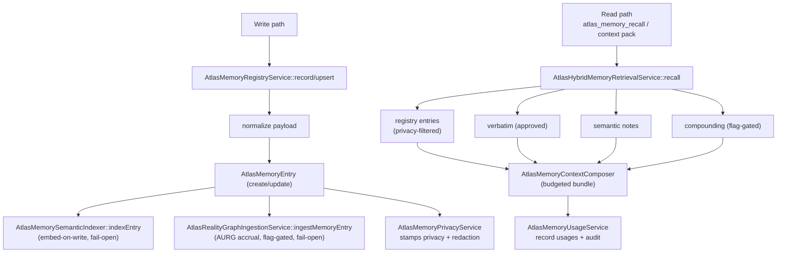

# Canonical memory model

## Purpose

`atlas_memory_entries` is the source of truth for Atlas's decisions, learnings,
and technical context. The provider files `CLAUDE.md` and `AGENTS.md` are
generated projections of it (see
[provider-projections.md](provider-projections.md)); the context pack's
semantic-memory section is a redacted projection of it (see
[context-pack.md](context-pack.md)). This page documents the
`AtlasMemoryEntry` model (types, scopes, privacy, redaction, temporal-truth),
the registry that writes and reads it, the hybrid retrieval that ranks it, and
the governance that keeps it honest.

## Key abstractions

| Path | Role |
|---|---|
| `app/Models/AtlasMemoryEntry.php` | The canonical memory row (types, scopes, privacy, redaction, temporal-truth) |
| `app/Models/AtlasMemoryEntryRelation.php` | Typed relations between entries (incl. conflict verbs) |
| `app/Models/AtlasMemoryEntryUsage.php` | Usage tracking + feedback (`last_used_at`, `feedback_action`) |
| `app/Models/AtlasMemoryQualitySnapshot.php` | Quality snapshot rows |
| `app/Models/AtlasVerbatimMemory.php` | Approved verbatim quotes |
| `app/Models/AiMemoryDelta.php` | A proposed entry pending review/promotion |
| `app/Services/Ai/AtlasMemoryRegistryService.php` | Canonical writer/reader: `record`, `upsert`, `search`, `relevantForTask/Project/Run/Context`, `recordHarnessLearning` |
| `app/Services/Ai/AtlasHybridMemoryRetrievalService.php` | Hybrid lexical + pgvector recall over redacted projections |
| `app/Services/Ai/AtlasMemoryPrivacyService.php` | Privacy classification + `providerAllowed` floor |
| `app/Services/Ai/AtlasMemorySourcePrivacyPolicy.php` | Per-source privacy policy + policy version |
| `app/Services/Ai/AtlasMemoryContextComposer.php` | Composes recall sections into a budgeted bundle |
| `app/Services/Ai/Memory/AtlasMemorySemanticIndexer.php` | Embed-on-write indexer |
| `app/Services/Ai/Memory/AtlasMemoryVectorSearchService.php` | pgvector search |
| `app/Support/TemporalTruth/TemporalTruthCanon.php` | Temporal-truth field canon |

## The model

`app/Models/AtlasMemoryEntry.php` is a UUID-keyed, soft-deletable Eloquent
model using the `HasTemporalTruth` trait.

### Types (`TYPES`)

| Type | Meaning |
|---|---|
| `decision` | A decision that was taken |
| `preference` | A stated preference |
| `feedback` | Feedback on an outcome |
| `technical_context` | Technical context worth remembering |
| `issue` | A known issue |
| `resolution` | A resolution to an issue |
| `benchmark_observation` | A benchmark observation |
| `harness_learning` | A learning captured by the engineering harness |
| `anti_memory` | A "do not" memory (what not to do) |
| `strategic_insight` | A strategic insight |

### Scopes (`SCOPES`)

`global`, `project`, `task`, `engineering_run`, `workspace`, `user`, `session`,
`obra`, `long_horizon`.

`obra` and `long_horizon` are the long-horizon scopes (`LONG_HORIZON_SCOPES`).
Promotion into them is gated by
`app/Services/Ai/LongHorizon/LongHorizonMemoryPromotionGuard.php` and must
carry `evidence_refs` plus operator review.

### Statuses (`STATUSES`)

`active`, `inactive`, `archived`. The `scopeActive` query scope filters to
`status=active` and `archived_at IS NULL`.

### Privacy (`PRIVACY_CLASSES`)

| Class | Crosses to external AI? |
|---|---|
| `normal` | Yes (after redaction) |
| `private` | No |
| `sensitive` | No |
| `secret` | No |

`external_ai_allowed` is the derived boolean. `AtlasMemoryPrivacyService`
computes it from the class and stamps `redaction_status` (`clean` or
`redacted`) plus `redacted_title` / `redacted_body` / `redacted_summary`.

### Temporal truth

`AtlasMemoryEntry` uses the `HasTemporalTruth` trait. The temporal-truth
fields (from `TemporalTruthCanon::casts()`) are `valid_from`, `valid_until`,
`observed_at`, `verified_at`, `stale_after`, `source_hash`, `authority_level`.
The legacy `superseded_by_id` column is reused as the canonical supersession
pointer (TEOS reuses it instead of adding a duplicate `superseded_by` field).
A superseded entry is no longer the live truth; its supersessor is.

## Registry: write and read

`app/Services/Ai/AtlasMemoryRegistryService.php` is the canonical writer and
reader.

- **Write**: `record(array $attributes)` and `upsert(array $identity, array
  $attributes)` normalize the payload, create/update the row, then run two
  best-effort, fail-open side effects:
  - **embed-on-write** via `AtlasMemorySemanticIndexer::indexEntry()` so recall
    can rank by vector similarity. On SQLite or no venv it skips honestly and
    recall falls back to lexical (never a fake vector).
  - **AURG accrual** via `AtlasRealityGraphIngestionService::ingestMemoryEntry()`
    when `atlas.aurg.enabled` and `atlas.aurg.ingest_on_write` are on. This
    upserts the memory's fused-store brain node and re-runs the deterministic
    memory-to-code / memory-to-domain linkers for this row only (never a full
    sync inline). A missing brain table or a disabled flag leaves the memory
    write untouched.
- **Read**: `search`, `relevantForTask`, `relevantForProject`,
  `relevantForRun`, `relevantForContext` return ranked, privacy-filtered
  collections.
- **Harness learning**: `recordHarnessLearning` captures engineering-run
  learnings as a `harness_learning` type entry.
- **Source map**: `sourceMap` exposes the source-type to source-label mapping.

## Hybrid retrieval (the semantic brain in the pack)

`app/Services/Ai/AtlasHybridMemoryRetrievalService.php` is the recall engine
the context pack and the `atlas_memory_recall` MCP tool use.

`recall(string $query, array $context, array $filters, array $options)` pulls
from four sources and composes them under a char budget:

1. **registry** — `AtlasMemoryRegistryService` entries, privacy-filtered.
2. **verbatim** — approved `AtlasVerbatimMemory` quotes via
   `AtlasVerbatimMemoryService`.
3. **semantic** — local `SemanticNote` search via
   `app/Services/Semantic/SemanticSearchService.php`.
4. **compounding** — `AiCompoundingMemory` (flag-gated, default OFF; when off
   it returns `[]` and the compose call is byte-identical to today).

On PostgreSQL, recall ranks **primarily by real vector similarity**. The
blended `hybrid_score = max(vector-dominant, lexical)` with
`VECTOR_WEIGHT = 0.85` and `LEXICAL_WEIGHT = 0.15`, so a strong semantic match
always outranks a weak substring match, but a row without a vector (NULL
embedding, SQLite, no venv) honestly degrades to its lexical score.

The composer (`AtlasMemoryContextComposer`) merges the four sources into a
budgeted bundle (`memory_recall_limit`, `memory_recall_budget_chars`,
`memory_recall_item_chars`). `AtlasMemoryUsageService::recordRecallUsages`
records usage rows (with `last_used_at`) and a `usage_audit_id`. The summary
reports `redacted_ref_count` and `raw_content_persisted_count` (always 0 for
the latter under the provider-safe policy) and the policy
`provider_safe_only`.

### Privacy floor

`AtlasMemoryPrivacyService` is the floor that makes recall provider-safe:

- `normalizeForStorage` stamps the privacy class, `external_ai_allowed`,
  `redaction_status`, and the redacted title/body/summary on write.
- `apply` re-stamps an entry on review.
- `providerAllowed` is the filter recall uses to drop anything that is not
  cleared to cross to an external AI.

`AtlasMemorySourcePrivacyPolicy` adds a per-source privacy policy with a
policy version, so a source can tighten its defaults over time.

## Tables

| Table | Role |
|---|---|
| `atlas_memory_entries` | Canonical rows (privacy columns, `superseded_by_id`, temporal-truth, embedding) |
| `atlas_memory_entry_relations` | Typed relations (+ conflict verbs) |
| `atlas_memory_entry_usages` | Usage + feedback (`feedback_action`, `last_used_at`) |
| `atlas_memory_quality_snapshots` | Quality snapshots |
| `atlas_verbatim_memories` | Approved verbatim quotes |
| `ai_memory_deltas` | Proposals pending promotion (+ promotion columns) |

## Integration points

- **Context pack**: the semantic-memory section is this recall. See
  [context-pack.md](context-pack.md).
- **MCP**: `atlas_memory_recall`, `atlas_memory_record`, `atlas_memory_get`,
  `atlas_memory_archive`, `atlas_memory_link`, `atlas_memory_supersede`. See
  [mcp-server-and-tools.md](mcp-server-and-tools.md).
- **Governance**: feedback, scan, audit, quality, conflict resolution, review
  queue. See [memory-governance-and-lifecycle.md](memory-governance-and-lifecycle.md).
- **Provider projections**: `CLAUDE.md` / `AGENTS.md` are generated from the
  provider-safe entries. See [provider-projections.md](provider-projections.md).
- **AURG**: each write accrues a brain node. See
  [../engineering/code-intelligence-and-codegraph.md](../engineering/code-intelligence-and-codegraph.md)
  for the code-graph side of the reality graph.

## Key source files

| File | What |
|---|---|
| `app/Models/AtlasMemoryEntry.php` | The canonical row model |
| `app/Services/Ai/AtlasMemoryRegistryService.php` | Writer/reader |
| `app/Services/Ai/AtlasHybridMemoryRetrievalService.php` | Hybrid recall |
| `app/Services/Ai/AtlasMemoryPrivacyService.php` | Privacy floor |
| `app/Services/Ai/AtlasMemorySourcePrivacyPolicy.php` | Per-source privacy policy |
| `app/Services/Ai/AtlasMemoryContextComposer.php` | Recall composer |
| `app/Services/Ai/AtlasMemoryUsageService.php` | Usage tracking |
| `app/Services/Ai/Memory/AtlasMemorySemanticIndexer.php` | Embed-on-write |
| `app/Services/Ai/Memory/AtlasMemoryVectorSearchService.php` | pgvector search |
| `app/Support/TemporalTruth/TemporalTruthCanon.php` | Temporal-truth canon |
| `app/Http/Controllers/AtlasMemoryRecallController.php` | Recall HTTP controller |
