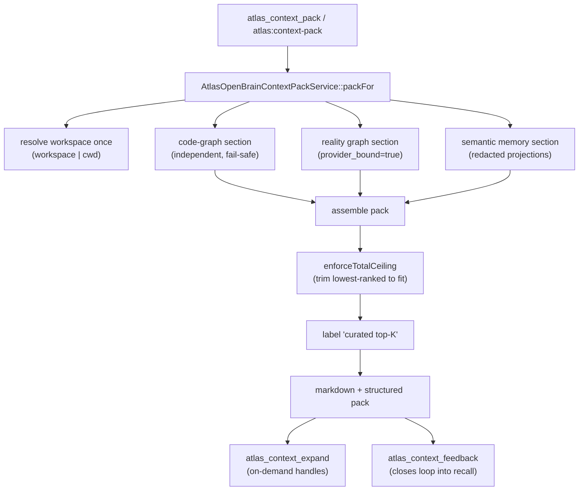

# The context pack

## Purpose

The context pack is the single front door of the Open Brain. An external AI
calls one tool (`atlas_context_pack`) and receives one provider-bound, budgeted
assembly that fuses the code-graph, the reality graph (AURG), and semantic
memory for a given task. It is labelled `curated top-K (not exhaustive)`, it
degrades to empty honestly when a brain is missing, and it never throws.

This page documents `app/Services/Ai/AtlasOpenBrainContextPackService.php`
(AOBG N1.F1), the assembly it performs, the char budgets, the on-demand
expansion handles, and the feedback loop that closes back into recall.

## Key abstractions

| Path / constant | Role |
|---|---|
| `app/Services/Ai/AtlasOpenBrainContextPackService.php` | The pack assembler; `packFor(task, opts)` |
| `app/Services/Engineering/CodeGraph/CodeGraphContextRetriever.php` | code-graph section: `packFor()` (BM25 + E-3 embedding, workspace-scoped symbols) |
| `app/Services/Ai/Reality/AtlasRealityGraphQueryService.php` | reality-graph section: `query()` with `provider_bound=true` (cross-layer paths + provenance) |
| `app/Services/Ai/AtlasHybridMemoryRetrievalService.php` | semantic-memory section: `recall()` over redacted projections |
| `app/Services/Engineering/CodeGraph/CodeGraphWorkspaceIdentity.php` | Resolves the workspace once from `workspace`/`cwd` (multi-project, no cross-leak) |
| `app/Services/Ai/AtlasOpenBrainContextExpansionService.php` | On-demand `expand:` / `recheck:` handle expansion |
| `app/Services/Ai/Context/SemanticContextRetrievalService.php` | Optional semantic-rerank arm |
| `AtlasOpenBrainContextPackService::SCHEMA` | `atlas.aobg.context_pack.v1` |
| `AtlasOpenBrainContextPackService::HONESTY_LABEL` | `curated top-K (not exhaustive)` |
| `AtlasOpenBrainContextPackService::RUNTIME_VERSION` | `aobg-context-pack-runtime-v3` |

## How it works

### Assembly

`packFor(string $task, array $opts = [])` resolves the workspace once, then
builds each of the three sections **independently** and fail-safe:

1. **code-graph** — `CodeGraphContextRetriever::packFor()` returns the proven
   `atlas:ctx` BM25 + embedding symbol pack, workspace-scoped, biased by
   `changed_files` when supplied.
2. **reality graph / AURG** — `AtlasRealityGraphQueryService::query()` with
   `provider_bound=true` returns cross-layer paths (code <-> memory <->
   domain <-> evidence) with provenance. Sensitive domains and anything
   reachable only through them are excluded structurally.
3. **semantic memory** — `AtlasHybridMemoryRetrievalService::recall()` runs
   pgvector recall over the provider-safe redacted projections only, filtered
   by `AtlasMemoryPrivacyService`.

Each section returns a `{present, items, ...}` envelope. A section that has no
table, a blank query, or a transient fault yields `present=false` and an empty
`items` array — never a fabricated one.

### Char budgets

The pack is char-budgeted at three levels (defaults in `config/atlas.php` under
`atlas.aobg`):

| Budget | Default | Env | Bounds |
|---|---|---|---|
| Total (`budget_chars`) | 6000 | `ATLAS_AOBG_BUDGET_CHARS` | Real ceiling over the measured pack |
| Code sub-budget (`code_budget_chars`) | 2500 | `ATLAS_AOBG_CODE_BUDGET_CHARS` | Bounds the code-graph slice |
| Memory sub-budget (`memory_budget_chars`) | 2000 | `ATLAS_AOBG_MEMORY_BUDGET_CHARS` | Bounds the memory slice |

The reality-graph section is path-shaped, not char-budgeted at source. The
total budget is a real ceiling: when the caller's total is tighter than the
sub-budget sum, the two sub-budgets are scaled down proportionally so
`--budget` actually bounds the pack. After assembly, a final
`enforceTotalCeiling` pass trims trailing (lowest-ranked) entries from the
largest contributing section until the measured chars fit, while each
non-empty section keeps at least its top hit (never starves).

A **context delivery policy** (`atlas.aobg.context_delivery_policy.v1`) can
apply an `initial_context_budget_multiplier` and a per-source
`source_selection_policy` (with `budget_multipliers` for `code` and `memory`)
to the initial pack, scaling the budgets before assembly.

### Optional semantic rerank

When `config('atlas.aobg.semantic_retrieval')` is on (default OFF), the memory
section is reranked by a semantic retriever. It fails open without a venv: the
pack never depends on it.

### Expansion handles

The initial pack is deliberately compact. When the external AI needs more of a
specific source, it calls `atlas_context_expand` (MCP) or
`atlas:open-brain:expand-context` (CLI), which delegates to
`AtlasOpenBrainContextExpansionService`. Handles include:

- `expand:<source_type>` — pull more of a source type that was deferred (e.g.
  `expand:test_symbols`, `expand:canonical_doc`).
- `recheck:<source_type>` — re-run a source after the workspace changed (e.g.
  `recheck:canonical_doc`).

The auxiliary code source types (`test_method`, `doc_heading`) are usually too
noisy for the first brief and remain available through explicit pulls.

### Feedback loop

`atlas_context_feedback` (MCP) records provider-safe feedback about the
delivered context: which refs were used, which were noise, which sources were
missing, the outcome status, and a 0-100 post-execution utility score. It
accepts no raw text; learning is proposal-only and persists only when
`record=true`. The feedback feeds `ai_rag_feedback_events` and the retrieval
feedback loop (`AtlasRetrievalFeedbackLoopService`), which tunes future recall.

### Runtime fingerprint

The pack carries a `runtime` block (`atlas.aobg.context_pack.runtime.v1`,
version `aobg-context-pack-runtime-v3`) with `RUNTIME_FEATURE_FLAGS` such as
`code_graph_fill_gaps`, `context_delivery_policy`,
`initial_auxiliary_code_symbol_deferral`, `provider_bound_mission_seed_filter`,
`separator_term_expansion`, and `test_symbol_on_demand_expansion`. A native
MCP client that does not see these flags is stale and should restart (see
[mcp-server-and-tools.md](mcp-server-and-tools.md)).

### HTTP export + audit

`POST /api/ai/open-brain/context-pack` routes to
`AtlasOpenBrainController::contextPack` -> `AtlasOpenBrainService::contextPack`,
which builds via `AiContextPackBuilder::build`, computes a sha256
`context_pack_hash`, and records an `atlas_open_brain_access_logs` row with
**hash-only** query redaction (no raw objective or workspace path persisted).
It returns a provider-safety summary and an optional prompt section
(`compact` default or `full` for audit) with token-savings metrics.

## Integration points

- **MCP server**: `atlas_context_pack`, `atlas_open_brain_context_pack`,
  `atlas_context_expand`, `atlas_context_feedback` are served by
  `AtlasOpenBrainMcpService`. See [mcp-server-and-tools.md](mcp-server-and-tools.md).
- **Canonical memory**: the memory section is the redacted projection of
  `atlas_memory_entries`. See [canonical-memory.md](canonical-memory.md).
- **Code intelligence**: the code-graph section is the engineering plane's
  read model. See
  [../engineering/code-intelligence-and-codegraph.md](../engineering/code-intelligence-and-codegraph.md).
- **AI Gateway**: the gateway can inject a pack into a prompt before it reaches
  a frontier model. See [../ai-gateway/](../ai-gateway/).

## Key source files

| File | What |
|---|---|
| `app/Services/Ai/AtlasOpenBrainContextPackService.php` | The pack assembler |
| `app/Services/Engineering/CodeGraph/CodeGraphContextRetriever.php` | code-graph section |
| `app/Services/Ai/Reality/AtlasRealityGraphQueryService.php` | reality-graph section |
| `app/Services/Ai/AtlasHybridMemoryRetrievalService.php` | semantic-memory section |
| `app/Services/Engineering/CodeGraph/CodeGraphWorkspaceIdentity.php` | Workspace resolution |
| `app/Services/Ai/AtlasOpenBrainContextExpansionService.php` | Expansion handles |
| `app/Services/Ai/AtlasOpenBrainService.php` | HTTP export facade + audit |
| `app/Http/Controllers/AtlasOpenBrainController.php` | HTTP controller |
| `config/atlas.php` | `aobg.budget_chars`, `aobg.code_budget_chars`, `aobg.memory_budget_chars`, `aobg.semantic_retrieval` |
