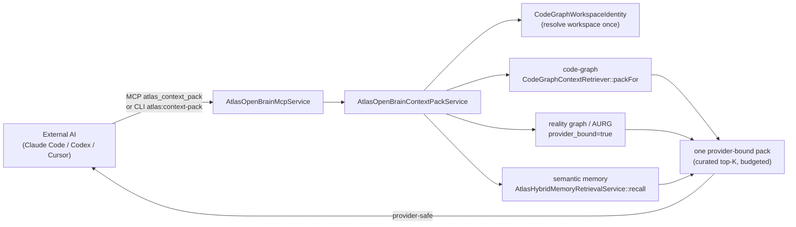

# Open Brain

## Purpose

The Atlas Open Brain Gateway (AOBG) is the part of Atlas that any external AI
(Claude Code, Codex, Cursor, in any project) plugs into to ask "what does the
brain already know about this task?" and to report back what it did. It is a
local, read-only, provider-safe MCP server (`atlas-open-brain`) plus the
governed knowledge store behind it. Atlas memory is canonical; the provider
files `CLAUDE.md` and `AGENTS.md` are generated projections that can never
override canonical repo docs.

The flagship surface is a single **context pack** that fuses three already-proven
brains under one char budget and one workspace:

1. **code-graph** — a BM25 + embedding symbol index (classes, methods, routes,
   migrations, tests), workspace-scoped. See
   [../engineering/code-intelligence-and-codegraph.md](../engineering/code-intelligence-and-codegraph.md).
2. **reality graph / AURG** — the fused Unified Reality Graph (code + memory +
   domain + evidence + strategic) with cross-layer paths and provenance,
   queried with `provider_bound=true` so sensitive domains are excluded
   structurally, not post-filtered.
3. **semantic memory** — pgvector recall over provider-safe redacted
   projections of canonical memory. See
   [canonical-memory.md](canonical-memory.md).

Around that front door the AOBG adds a multi-engine **blackboard** for
coordination, **governed write-back** (external output enters as branch-only
proposals, never auto-merged), per-file **brain-delta** context, and generated
**provider projections**.

## Key abstractions

| Path | Role |
|---|---|
| `app/Services/Ai/AtlasOpenBrainMcpService.php` | The MCP JSON-RPC server (~60 tools), dispatch, runtime fingerprint, self-check |
| `app/Services/Ai/AtlasOpenBrainContextPackService.php` | N1.F1 front door; fuses code-graph + AURG + semantic memory into one provider-bound pack |
| `app/Services/Ai/AtlasOpenBrainService.php` | HTTP context-pack export facade + `atlas_open_brain_access_logs` audit + safety summary |
| `app/Services/Ai/AtlasOpenBrainContextInjectionService.php` | Injects brain context into the live prompt (flag-gated, default OFF, hash-preserving) |
| `app/Services/Ai/AtlasOpenBrainContextExpansionService.php` | On-demand expansion of pack handles (`expand:`, `recheck:`) |
| `app/Services/Ai/AtlasOpenBrainFileContextService.php` | N2.F1 per-file brain-delta (decisions/missions/memories/neighbors) |
| `app/Services/Ai/AtlasOpenBrainWriteBackService.php` | N1.F2 governed write-back: branch-only proposals, never auto-merge, size-capped |
| `app/Services/Ai/AtlasAobgBlackboardService.php` | N2.F4 multi-engine claim/release coordination (TTL, idempotent, advisory) |
| `app/Services/Ai/AtlasAobgWorkspaceOnboardingService.php` | Multi-project AWIS onboarding/activation + provider bootstraps |
| `app/Services/Ai/AtlasOpenBrainGuardService.php` | Provider-safety guard / redaction enforcement for outbound brain content |
| `app/Services/Ai/AtlasMemoryRegistryService.php` | Canonical memory CRUD + relevance retrieval + harness-learning capture |
| `app/Services/Ai/AtlasProviderProjectionService.php` | Generates/writes `CLAUDE.md` / `AGENTS.md` from canonical memory |

## How it works

### Three-brain fusion

The context pack does not build a new context engine. It assembles three
brains that each already exist and are already provider-safe, under one budget
and one workspace. Each section is built **independently** and degrades to
empty on its own: a missing brain table, a blank query, or a transient fault
yields an honest empty section, never a fabricated one. The pack labels itself
`curated top-K (not exhaustive)` so a consumer never reads it as an exhaustive
dump of the brain.

### Provider-safety (provider-bound)

Every byte that can cross to an external AI is provider-bound by construction:

- The AURG query runs with `provider_bound=true` — sensitive domains and
  anything reachable only through them are excluded structurally.
- Memory is the recall's already-redacted projection (redacted title/body/
  summary, ids/hashes only). `AtlasMemoryPrivacyService` is the privacy floor.
- The code-graph pack carries symbol names and signatures from the local
  read-model only — no raw memory bodies, no Atlas-internal ids/traces/prompts.

See [../../concepts/provider-safety.md](../../concepts/provider-safety.md) for
the doctrine and [provider-projections.md](provider-projections.md) for how
`CLAUDE.md` / `AGENTS.md` are generated from this.

### Multi-project scoping

The workspace is resolved once, from an explicit `workspace` path or id, or
from the caller's `cwd`, via `CodeGraphWorkspaceIdentity`. A pack built for
project B never leaks project A's symbols. AURG nodes are global by design
(the brain is global), but its provider-bound floor still applies. The
`bin/atlas` launcher injects `--workspace=$CWD` so the CLI auto-scopes from
the caller's working directory.

### Honest degrade

Each of the three sections degrades to empty independently. The pack service
never throws: context recall is best-effort, not a gate. A slow or broken
brain degrades the hint; it never stalls or breaks the external session. The
same contract applies to the per-file brain-delta and the blackboard.

### Zero cost

The pack is read-only and local-DB only. No provider spend, no network. The
AURG Python graph-rank is an opt-in runtime that degrades honestly when absent;
the pack never depends on it.

## Integration points

- **AI Gateway**: the gateway injects brain context into prompts before they
  reach a frontier model. See [../ai-gateway/](../ai-gateway/).
- **Capture & ingestion**: raw captures are cognitively quarantined until a
  human ratifies a curation proposal; only then can they become memory. See
  [../capture-ingestion/cognitive-quarantine-and-privacy.md](../capture-ingestion/cognitive-quarantine-and-privacy.md).
- **Engineering plane**: the code-graph brain is a read model built and
  maintained by the engineering plane. See
  [../engineering/code-intelligence-and-codegraph.md](../engineering/code-intelligence-and-codegraph.md).
- **Knowledge governance**: the authority hierarchy (canonical repo docs >
  APs > code/tests/migrations > Evidence Ledger > Postgres KB / Code
  Intelligence > Obsidian > provider projections > chat) governs what the
  brain can assert. See
  [../../concepts/knowledge-governance.md](../../concepts/knowledge-governance.md).

## Pages in this section

- [context-pack.md](context-pack.md) — the N1.F1 front door: assembly, char budgets, expansion handles, feedback loop.
- [mcp-server-and-tools.md](mcp-server-and-tools.md) — the MCP server, JSON-RPC lifecycle, ~60 tools, self-check, registration.
- [canonical-memory.md](canonical-memory.md) — the `AtlasMemoryEntry` model, types/scopes/privacy/redaction/temporal-truth, hybrid retrieval.
- [memory-governance-and-lifecycle.md](memory-governance-and-lifecycle.md) — delta proposal to review to promotion, governance scan/audit, quality, conflicts, review queue.
- [provider-projections.md](provider-projections.md) — how `CLAUDE.md` / `AGENTS.md` are generated, lean-nested, checksum, audit, purge.
- [blackboard-and-write-back.md](blackboard-and-write-back.md) — blackboard coordination and governed write-back, plus per-file brain-delta.
- [vault-and-semantic.md](vault-and-semantic.md) — the Obsidian/AtlasVault Human Knowledge Surface and the semantic cartography canon.

## Key source files

| File | What |
|---|---|
| `app/Services/Ai/AtlasOpenBrainMcpService.php` | MCP server (~60 tools, JSON-RPC, self-check) |
| `app/Services/Ai/AtlasOpenBrainContextPackService.php` | The unified context-pack front door |
| `app/Services/Ai/AtlasOpenBrainService.php` | HTTP export facade + audit |
| `app/Services/Ai/AtlasOpenBrainFileContextService.php` | Per-file brain-delta |
| `app/Services/Ai/AtlasOpenBrainWriteBackService.php` | Governed write-back |
| `app/Services/Ai/AtlasAobgBlackboardService.php` | Multi-engine blackboard |
| `app/Services/Ai/AtlasMemoryRegistryService.php` | Canonical memory writer/reader |
| `app/Services/Ai/AtlasProviderProjectionService.php` | Provider projection generator |
| `app/Services/Ai/AtlasOpenBrainGuardService.php` | Provider-safety guard |
| `config/atlas.php` | `open_brain.*`, `aobg.*`, `code_graph.*` blocks |
| `.mcp.json` | Claude Code MCP registration |
| `scripts/setup-aobg.sh` | Codex + Cursor MCP registration |
