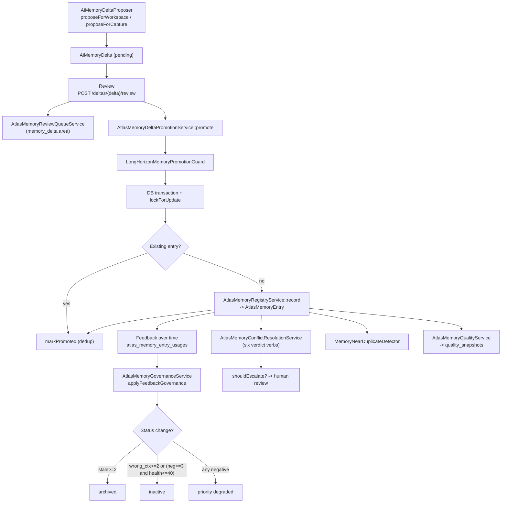

# Memory governance and lifecycle

## Purpose

Canonical memory is not write-once. Entries age, get superseded, contradict
each other, and accumulate feedback from the engines that use them. This page
documents the lifecycle that keeps `atlas_memory_entries` honest: the
delta proposal to review to promotion flow, the governance scan and audit, the
quality snapshots, the contradiction detectors, and the human review queue.

## Key abstractions

| Path | Role |
|---|---|
| `app/Services/Ai/AiMemoryDeltaProposer.php` | Proposes `AiMemoryDelta` from a workspace or a capture |
| `app/Services/Ai/AtlasMemoryDeltaPromotionService.php` | Promotes an accepted delta into a canonical `AtlasMemoryEntry` |
| `app/Services/Ai/AtlasMemoryLearningPromotionService.php` | Promotes captured learnings into governed memory |
| `app/Services/Ai/AtlasMemoryGovernanceService.php` | Feedback governance, `scan`, `audit`, relation review |
| `app/Services/Ai/AtlasMemoryQualityService.php` | Quality scoring and snapshots |
| `app/Services/Ai/AtlasMemoryReviewQueueService.php` | Human review queue across areas |
| `app/Services/Ai/Memory/AtlasMemoryConflictResolutionService.php` | Six-verdict conflict relations + escalation heuristic |
| `app/Services/Ai/Memory/MemoryConflictAxisResolver.php` | Conflict axis resolution |
| `app/Services/Ai/Memory/MemoryConflictVerbClassifier.php` | Verb classification |
| `app/Services/Ai/Memory/MemoryScopeContradictionClassifier.php` | Scope contradiction classification |
| `app/Services/Ai/Cognition/FactPairPolarityContradictionDetector.php` | Polarity contradiction detector |
| `app/Services/Ai/Cognition/NumericRangeOverlapContradictionDetector.php` | Numeric range overlap detector |
| `app/Services/Ai/Cognition/TemporalSupersessionClassifier.php` | Temporal supersession classifier |
| `app/Services/Ai/Cognition/CognitiveImmunePromotionGateEvaluator.php` | Cognitive-immune promotion gate |
| `app/Services/Ai/MemoryGovernance/MemoryNearDuplicateDetector.php` | Near-duplicate detection |
| `app/Services/Ai/MemoryGovernance/MemoryQualityStatusBandClassifier.php` | Quality status band classifier |
| `app/Services/Ai/MemoryGovernance/MemoryHealthCompositeScorer.php` | Composite health scorer |
| `app/Services/Ai/MemoryHealthCompositePolicy.php` | Top-level health policy |
| `app/Services/Ai/MemoryQualityStatusPolicy.php` | Top-level quality status policy |
| `app/Models/AiMemoryDelta.php` | The proposal row |
| `app/Models/AtlasMemoryQualitySnapshot.php` | Quality snapshot rows |

## How it works

### Delta proposal to review to promotion

A new memory does not enter `atlas_memory_entries` directly from an external
source. It enters as an `AiMemoryDelta` (status `pending`) and must be reviewed
and promoted.

1. **Propose.** `AiMemoryDeltaProposer::proposeForWorkspace` (or
   `proposeForCapture`) reads the latest `AiTrace` and `AiSessionState` for a
   workspace, extracts decisions and the dev-execution-plan objective, and
   writes `AiMemoryDelta` rows with `claim`, `evidence`, `use_when`, and
   `do_not_use_when`. `firstOrCreate` keeps proposals idempotent per
   workspace/type/text.
2. **Review.** `GET /api/ai/memory/deltas` lists deltas; `POST /api/ai/memory/deltas/{delta}/review`
   records a review decision. Flagged or low-confidence deltas also surface in
   the review queue (see below).
3. **Promote.** `POST /api/ai/memory/deltas/{delta}/promote` calls
   `AtlasMemoryDeltaPromotionService::promote`. The service:
   - runs the long-horizon promotion guard
     (`LongHorizonMemoryPromotionGuard::assertPromotable`) before the
     transaction, so a refused promotion never leaks a row;
   - opens a DB transaction, locks the delta row (`lockForUpdate`), and
     requires `status` in `['accepted', 'promoted']` unless `--force` is set;
   - if a matching canonical entry already exists, marks the delta promoted and
     returns the existing entry (dedup);
   - otherwise calls `AtlasMemoryRegistryService::record` to create the
     canonical `AtlasMemoryEntry`, then `markPromoted` (sets
     `promoted_memory_entry_id` and `promoted_at`).
4. **Batch.** `promoteAccepted(array $filters)` batch-promotes all `accepted`
   deltas, optionally filtered by `scope` and `types`, bounded by
   `promotionLimit`.

### Governance scan and audit

`AtlasMemoryGovernanceService` keeps entries honest:

- **`scan(array $filters, int $limit, bool $dryRun)`** — a sweep over
  `atlas_memory_entries` that reports duplicates and other governance findings
  without mutating unless `dryRun=false`. Returns counts and lists.
- **`audit(AtlasMemoryEntry $entry)`** — audits a single entry, recomputing
  governance metadata and timestamps (`governance_checked_at`).
- **`reviewRelation(AtlasMemoryEntryRelation $relation, array $data)`** —
  records a human review verdict on a relation.

### Feedback governance

`applyFeedbackGovernance(AtlasMemoryEntry $entry)` reads the entry's
`atlas_memory_entry_usages` rows with a non-null `feedback_action` and
summarizes them:

- Positive: `useful`.
- Negative: `not_useful`, `wrong_context`, `stale`, `too_much`, `corrected`.

The summary drives automatic status changes:

| Condition | Result |
|---|---|
| `stale_count >= 2` | `status=archived`, `archived_at` set, `last_action=archived_by_stale_feedback` |
| `wrong_context_count >= 2` OR (`negative_count >= 3` AND `health_score <= 40`) | `status=inactive`, `last_action=inactivated_by_negative_feedback` |
| active entry with any negative feedback | priority degraded, `last_action=priority_degraded_by_feedback` |

The base priority is preserved in `metadata.governance.base_priority` so
feedback degrades priority without losing the original.

### Quality snapshots

`AtlasMemoryQualityService` scores entries and writes
`atlas_memory_quality_snapshots` rows. `MemoryQualityStatusBandClassifier`
maps a score to a status band; `MemoryQualityStatusPolicy` is the top-level
policy. `GET /api/ai/memory/quality` (plus `/history` and `/snapshots`)
exposes the quality history.

`MemoryHealthCompositeScorer` + `MemoryHealthCompositePolicy` compute a
composite health score (the `health_score` used by feedback governance above)
from quality, usage, and governance signals.

### Contradiction detection and conflict resolution

Two layers detect and resolve contradictions:

- **Cognitive-immune layer** (`app/Services/Ai/Cognition/`):
  - `FactPairPolarityContradictionDetector` — two facts with opposite
    polarity.
  - `NumericRangeOverlapContradictionDetector` — numeric ranges that overlap
    conflictually.
  - `TemporalSupersessionClassifier` — a newer fact supersedes an older one.
  - `CognitiveImmunePromotionGateEvaluator` — the promotion gate that uses the
    detectors to block or flag contradictory promotions.
- **Relation layer** (`app/Services/Ai/Memory/AtlasMemoryConflictResolutionService`):
  relations between entries use six canonical verdict verbs:
  `related`, `compatible`, `scoped`, `conflicts_with`, `supersedes`,
  `not_conflict`. `judge()` persists a verdict via
  `atlas_memory_entry_relations`; `validateVerdict()` enforces the enum;
  `shouldEscalate()` applies an "ask vs silent" heuristic to decide whether a
  high-risk relation (decision/architecture/policy) needs human escalation
  before the verdict is promoted. `relatedConflicts(memoryId)` and
  `latestVerdict(sourceId, targetId)` feed the search composer so superseded
  memories can be suppressed in display.

### Near-duplicate detection

`MemoryGovernance/MemoryNearDuplicateDetector` finds near-duplicate entries
(content-hash and semantic similarity) so governance can dedup or merge them.

### Human review queue

`AtlasMemoryReviewQueueService::queue(array $filters, int $limit)` aggregates
items across five areas into one priority-ordered queue:

| Area | What it surfaces |
|---|---|
| `memory_privacy` | Entries needing a privacy review |
| `verbatim_privacy` | Verbatim quotes needing a privacy review |
| `relation` | Relations needing a review verdict |
| `semantic_curation` | Semantic curation proposals |
| `memory_delta` | Deltas pending review |

Items are ordered by `priority` desc then `updated_at` desc and bounded by
`reviewQueueLimit`. `GET /api/ai/memory/review-queue` exposes it. Relations
can also be reviewed via `POST /api/ai/memory/relations/{relation}/review`.

## Integration points

- **Canonical memory**: governance mutates `atlas_memory_entries` and its
  relations. See [canonical-memory.md](canonical-memory.md).
- **Write-back**: external `atlas_propose_learning` enters as a proposal that
  flows through the same promotion path. See
  [blackboard-and-write-back.md](blackboard-and-write-back.md).
- **MCP / HTTP**: `atlas:memory:govern`, `atlas:memory:review-queue`,
  `atlas:memory:quality`, `atlas:memory:audit`, `atlas:memory:judge`; the
  `/api/ai/memory/governance/*`, `/api/ai/memory/review-queue`,
  `/api/ai/memory/relations`, `/api/ai/memory/quality*` routes.
- **Provider projections**: only promoted, provider-safe entries reach
  `CLAUDE.md` / `AGENTS.md`. See [provider-projections.md](provider-projections.md).

## Key source files

| File | What |
|---|---|
| `app/Services/Ai/AiMemoryDeltaProposer.php` | Delta proposer |
| `app/Services/Ai/AtlasMemoryDeltaPromotionService.php` | Delta -> entry promoter |
| `app/Services/Ai/AtlasMemoryGovernanceService.php` | Scan, audit, feedback governance |
| `app/Services/Ai/AtlasMemoryQualityService.php` | Quality scoring + snapshots |
| `app/Services/Ai/AtlasMemoryReviewQueueService.php` | Review queue |
| `app/Services/Ai/Memory/AtlasMemoryConflictResolutionService.php` | Six-verdict conflict relations |
| `app/Services/Ai/Cognition/CognitiveImmunePromotionGateEvaluator.php` | Cognitive-immune promotion gate |
| `app/Services/Ai/MemoryGovernance/MemoryNearDuplicateDetector.php` | Near-duplicate detection |
| `app/Services/Ai/MemoryGovernance/MemoryHealthCompositeScorer.php` | Composite health scorer |
| `app/Models/AiMemoryDelta.php` | The proposal row |
