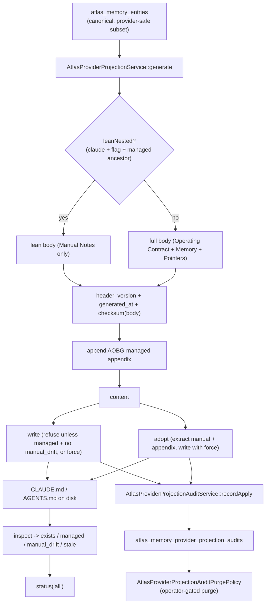

# Provider projections

## Purpose

`CLAUDE.md` and `AGENTS.md` are the files external AI providers read as their
bootstrap context. Atlas generates them from canonical memory so they stay in
sync without manual editing. They are **provider projections**: compact,
provider-safe, and never the source of truth. Canonical repo docs and
`atlas_memory_entries` outrank them in the
[knowledge authority hierarchy](../../concepts/knowledge-governance.md). This
page documents `app/Services/Ai/AtlasProviderProjectionService.php`, the
generate/write/adopt/inspect lifecycle, the lean-nested optimization, the
checksum and manual-block preservation, and the audit + purge trail.

## Key abstractions

| Path / constant | Role |
|---|---|
| `app/Services/Ai/AtlasProviderProjectionService.php` | `generate`, `write`, `adopt`, `inspect`, `status` |
| `app/Services/Ai/AtlasProviderProjectionAuditService.php` | Audit trail (`recordApply`, `search`) |
| `app/Services/Ai/AtlasProviderProjectionAuditPurgePolicy.php` | Retention/purge authorization policy |
| `app/Services/Ai/Provider/ProviderProjectionInput.php` | Input normalisation (`maxLines`, `memoryLimit`) |
| `app/Models/AtlasMemoryProviderProjectionAudit.php` | The audit row |
| `AtlasProviderProjectionService::VERSION` | `atlas_provider_projection_v1` |
| `AtlasProviderProjectionService::MANUAL_START` / `MANUAL_END` | `<!-- atlas:manual:start -->` / `<!-- atlas:manual:end -->` |
| `AtlasProviderProjectionService::AOBG_MANAGED_START` / `AOBG_MANAGED_END` | `<!-- atlas:aobg:auto-bootstrap:start -->` / `<!-- atlas:aobg:auto-bootstrap:end -->` |

## How it works

### Generate

`generate(string $target, array $context = [], array $options = [])` builds a
projection for a target (`claude` -> `CLAUDE.md`, `agents` -> `AGENTS.md`):

1. Resolves the workspace (from `context['workspace']` or `options['workspace']`).
2. Pulls provider-safe entries via `providerSafeEntries` (filtered by
   `AtlasMemoryPrivacyService`) bounded by `memoryLimit`.
3. Loads canonical provider-memory lines.
4. Reads the existing file's manual block and AOBG-managed appendix so they
   survive regeneration.
5. Decides whether to emit a **lean** projection (see below).
6. Builds the body (full or lean) and computes a `checksum` over the body.
7. Emits the header: `atlas_provider_projection_v1` with `generated_at` and
   `checksum`, followed by the body, followed by the AOBG-managed appendix.

The result carries `target`, `filename`, `path`, `workspace`, `version`,
`generated_at`, `checksum`, `line_count`, `memory_count`, `lean`, and
`content`.

### Lean-nested

A workspace nested under an Atlas-managed parent projection does not need a
second full copy of the Operating Contract, Canonical Knowledge Governance,
Provider-Safe Memory, and Atlas Pointers: Claude Code reads ancestor
`CLAUDE.md` files automatically. `leanNested` trims the child to just its
Manual Notes when:

- the target is `claude` (AGENTS.md consumers like Codex/Cursor are not
  guaranteed to read ancestor files, so they keep the full self-contained
  projection);
- `atlas.ai.provider_projection_lean_nested` is ON (default OFF);
- `hasManagedAncestorProjection` finds a managed `CLAUDE.md` within 8 ancestor
  directories.

The lean body states it is a lean projection and points to the parent for the
shared blocks.

### Write

`write` persists the generated projection to the workspace. It refuses to
overwrite an existing file unless:

- `force` is set, OR
- `inspect` reports the file is `managed` (has an Atlas header) AND
  `manual_drift` is false (no one hand-edited the managed body).

This protects hand-written, unmanaged files and managed files with manual
edits from being silently clobbered. The write uses `LOCK_EX`.

### Adopt

`adopt` is the one-shot "take this existing file under Atlas management"
operation. It parses the existing file (if any), extracts any manual block and
AOBG-managed appendix, then calls `write` with `force=true`. The result
includes `adopted` (whether a pre-existing file was found). This is how an
operator turns a hand-written `CLAUDE.md` into a managed projection without
losing their manual notes.

### Inspect and status

`inspect` reports the state of one projection:

| Field | Meaning |
|---|---|
| `exists` | The file is present |
| `managed` | The file has an Atlas header |
| `manual_drift` | The body checksum does not match the header checksum (someone edited the managed body) |
| `stale` | No manual drift, but the header checksum differs from the current memory checksum (memory changed since last write) |
| `reason` | `ok`, `missing`, `atlas_header_missing`, `checksum_mismatch`, or `atlas_memory_changed` |
| `checksum` / `actual_checksum` / `expected_checksum` | The checksums being compared |
| `manual_section_present` | Whether the manual block is present |

`status('all')` inspects every target and summarizes.

### Checksum and manual-block preservation

The checksum is computed over the **body** (everything after the header). This
is what lets Atlas detect two different kinds of drift:

- **manual_drift** (the managed body was hand-edited) -> `reason=checksum_mismatch`;
  `write` will refuse without `force` or `adopt`.
- **stale** (canonical memory changed since the projection was written) ->
  `reason=atlas_memory_changed`; the projection should be regenerated.

The manual block between `<!-- atlas:manual:start -->` and
`<!-- atlas:manual:end -->` is excluded from checksum drift detection and is
preserved across every `generate` / `write` / `adopt`. Atlas ignores its
content for checksum purposes but never overwrites it. The AOBG-managed
appendix between `<!-- atlas:aobg:auto-bootstrap:start -->` and
`<!-- atlas:aobg:auto-bootstrap:end -->` is likewise preserved.

### Audit and purge

`AtlasProviderProjectionAuditService::recordApply` writes an
`atlas_memory_provider_projection_audits` row for every apply action with
`action='apply'`, `target`, `workspace`, `initiator`, `confirmation_mode`,
`status`, `ok`, `summary_json`, `applied_json`, `blocked_json`, `failed_json`,
`review_summary_json`, `metadata`, and `applied_at`. `search(filters, limit)`
queries the trail. The audit routes are
`/api/ai/memory/provider-projection/audits`, `/audits/summary`, and
`/audits/purge`.

`AtlasProviderProjectionAuditPurgePolicy::evaluate(dryRun, operatorHeaderValue)`
authorizes a purge. When `atlas.ai.provider_projection_audit_purge.require_operator`
is ON, a purge requires an operator header (`X-Atlas-Operator` by default) or
an operator token (compared with `hash_equals`). Without `require_operator`,
the standard Atlas token authorizes it. This prevents accidental audit
history loss.

## Integration points

- **Canonical memory**: the projection is built from the provider-safe subset
  of `atlas_memory_entries`. See [canonical-memory.md](canonical-memory.md).
- **Knowledge governance**: projections sit near the bottom of the authority
  hierarchy and can never override canonical repo docs. See
  [../../concepts/knowledge-governance.md](../../concepts/knowledge-governance.md).
- **Provider safety**: only `normal`-privacy, redacted entries are emitted.
  See [../../concepts/provider-safety.md](../../concepts/provider-safety.md).
- **AOBG bootstrap**: the AOBG-managed appendix is the workspace-activation
  block written by `AtlasAobgWorkspaceOnboardingService`. See
  [index.md](index.md).

## Key source files

| File | What |
|---|---|
| `app/Services/Ai/AtlasProviderProjectionService.php` | Generator/writer/adopter/inspector |
| `app/Services/Ai/AtlasProviderProjectionAuditService.php` | Audit trail |
| `app/Services/Ai/AtlasProviderProjectionAuditPurgePolicy.php` | Purge authorization |
| `app/Services/Ai/Provider/ProviderProjectionInput.php` | Input normalisation |
| `app/Services/Ai/AtlasMemoryPrivacyService.php` | Privacy floor for the entry subset |
| `app/Models/AtlasMemoryProviderProjectionAudit.php` | Audit row model |
| `app/Http/Requests/AtlasMemoryProviderProjectionRequest.php` | HTTP request |
| `app/Console/Commands/AtlasMemoryProjectionCommand.php` | `atlas:memory:projection` |
| `config/atlas.php` | `atlas.ai.provider_projection_lean_nested`, `atlas.ai.provider_projection_audit_purge.*` |
