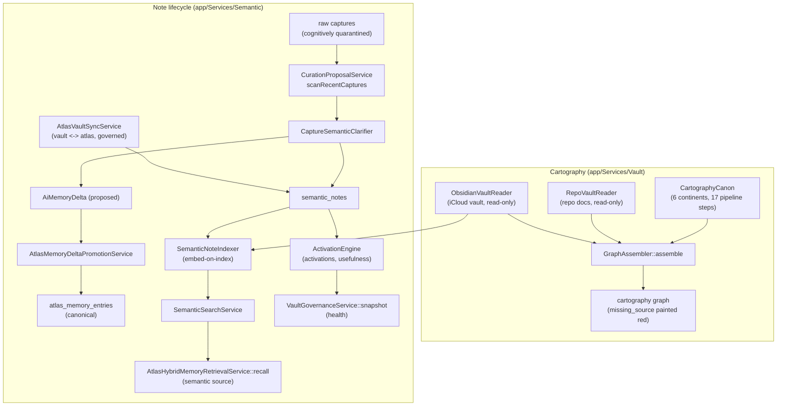

# Vault and semantic cartography

## Purpose

The vault is Atlas's **Human Knowledge Surface**: the place where a human
thinks, writes, and curates, separate from the canonical engineering
knowledge base and from canonical memory. It has two halves:

- `app/Services/Vault/` — the **cartography** layer: a canon of what the
  Atlas map should show, plus graph assembly that merges the canon with the
  real filesystem (repo docs + Obsidian vault) and is honest about gaps.
- `app/Services/Semantic/` — the **note lifecycle**: syncing notes between
  the vault and Atlas, indexing them with embeddings, curating captures into
  semantic notes, governing health, and activating notes into runtime.

A vault note governs runtime only after it is promoted into a canonical doc,
an AP, or a governed `atlas_memory_entries` row. The vault is a surface, not
the source of truth. This page documents both halves and how they relate to
canonical memory.

## Key abstractions

| Path | Role |
|---|---|
| `app/Services/Vault/CartographyCanon.php` | The canonical expectation of the map (6 continents, 17 pipeline steps) |
| `app/Services/Vault/GraphAssembler.php` | Merges canon + filesystem into the graph the cartography renders |
| `app/Services/Vault/RepoVaultReader.php` | Reads the repo engineering KB (read-only) |
| `app/Services/Vault/ObsidianVaultReader.php` | Reads the iCloud-synced Obsidian vault (read-only) |
| `app/Services/Vault/MarkdownVaultFiles.php` | Walk + read helpers for markdown vaults |
| `app/Services/Vault/VaultNoteFrontmatterParser.php` | Frontmatter parser for vault notes |
| `app/Services/Semantic/AtlasVaultSyncService.php` | Bidirectional vault <-> Atlas sync (governed) |
| `app/Services/Semantic/SemanticNoteIndexer.php` | Indexes vault notes into `semantic_notes` with embeddings |
| `app/Services/Semantic/CurationProposalService.php` | Scans captures, clarifies, proposes semantic notes + memory deltas |
| `app/Services/Semantic/VaultGovernanceService.php` | Vault health snapshots |
| `app/Services/Semantic/SemanticSearchService.php` | Semantic search over `semantic_notes` |
| `app/Services/Semantic/AtlasVaultManagedNoteService.php` | Managed note lifecycle |
| `app/Services/Semantic/AtlasVaultLinkService.php` | Vault link management |
| `app/Services/Semantic/SemanticLinkService.php` | Semantic link management |
| `app/Services/Semantic/AtlasVaultFrontmatterService.php` | Frontmatter management, `isManaged` |
| `app/Services/Semantic/EmbeddingService.php` | Embeddings for notes |
| `app/Services/Semantic/ActivationEngine.php` | Note activation into runtime |
| `app/Services/Semantic/CaptureSemanticClarifier.php` | Clarifies captures into semantic content |
| `app/Services/Semantic/VaultFileStore.php` | Vault file read/write |
| `app/Services/Semantic/ValueObjects/AtlasVaultNote.php` | Note value object |

## How it works

### Cartography canon

`app/Services/Vault/CartographyCanon.php` materializes the contract from
`node-catalog-and-build-contract.md` as PHP structures. The cartography uses
it to render the canvas consistently and to detect `missing_source` (when a
canon piece has no matching `.md` on disk).

- **6 continents** of the Vault Universe: `atlas`, `memory`, `works`, `forge`,
  `philosophy`, `risks`. Each carries a `graph_source` (`repo`, `vault`, or
  `mixed`), an `expected_path`, and `lookup_ids` (alternative frontmatter ids
  that may carry the content while the dedicated file does not exist yet).
- **17 canonical pipeline steps** of the Atlas AI Kernel Pipeline, ordered by
  roman numeral, each with `lookup_ids`.

When a real `.md` is found (by frontmatter `id` == `graph_id`), its fields are
merged onto the canon entry. The canon is the skeleton; the filesystem is the
flesh. If the flesh is missing, the skeleton still appears, marked as such.

### Graph assembly

`app/Services/Vault/GraphAssembler.php` combines the canon with the real
filesystem and assembles the graph the cartography renders. `assemble()`:

1. indexes the repo docs (`RepoVaultReader::index()`) and the vault
   (`ObsidianVaultReader::index()`);
2. builds a `semanticGraph` and runs an `essentialFieldAudit` over its nodes;
3. resolves each continent, pipeline step, and lane child via `resolveAtom`,
   which merges the canon entry with the matching `.md` (by `graph_id` /
   `atlas_id` / `id`). A canon piece with no `.md` ships with
   `missing_source: true` and the cartography paints it red. The cartography
   never lies about presence.

### Vault readers (read-only)

- `RepoVaultReader` reads the canonical engineering knowledge base from the
  repo (`docs/engineering-knowledge-base` by default). It is the source of
  truth for technical/architectural Atlas content (Kernel, Forge, Runtime,
  Governance, Evidence). It never writes a byte.
- `ObsidianVaultReader` reads the AtlasVault from the iCloud-synced Obsidian
  directory. It is the source of truth for human/reflective content (books,
  philosophy, marginalia, stories, personal hypotheses). Read-only.

Both key their indices by frontmatter `graph_id`, falling back to `atlas_id`
(Obsidian) or `id` (repo, legacy).

### Note sync

`app/Services/Semantic/AtlasVaultSyncService.php` governs bidirectional sync
between the vault and Atlas.

- **Directions**: `vault_to_atlas`, `atlas_to_vault`.
- **Operations**: `import`, `export_semantic_note`.
- **Resolution actions**: `adopt`, `archive`, `merge`, `regenerate`, `force`,
  `dismiss`.
- **Review statuses**: `pending`, `candidate`, `blocked`, `conflict`.
- **Filterable statuses**: `pending`, `candidate`, `blocked`, `conflict`,
  `imported`, `exported`, `reviewed`, `regenerated`, `archived`, `dismissed`.

`importPath(path, write)` reads a markdown file, parses frontmatter, computes
a content hash, and applies the privacy policy (`AtlasMemorySourcePrivacyPolicy`).
A note is **blocked** from import when it is an Atlas-managed note, when it is
not provider-safe, or when it has parse errors. Otherwise it becomes
`candidate` (dry run) or `imported` (write). Every action is audited via
`AuditLogService`.

### Note indexing

`app/Services/Semantic/SemanticNoteIndexer.php` walks the vault's markdown
files and indexes them into `semantic_notes` with embeddings
(`EmbeddingService`). `indexAll(changedOnly)` skips unchanged files by content
hash and marks files missing from the vault as deleted. This is what makes
vault notes searchable as the **semantic** source in
`AtlasHybridMemoryRetrievalService::recall()` (via
`app/Services/Semantic/SemanticSearchService.php`).

### Curation: capture -> semantic note -> memory

`app/Services/Semantic/CurationProposalService.php` is the bridge from raw
captures into governed memory. `scanRecentCaptures`:

1. pulls recent captures with non-empty `content_text`;
2. clarifies them via `CaptureSemanticClarifier`;
3. proposes `SemanticCurationProposal` rows and `semantic_notes`;
4. proposes `AiMemoryDelta` rows via `AiMemoryDeltaProposer`;
5. on acceptance, promotes deltas into canonical `atlas_memory_entries` via
   `AtlasMemoryDeltaPromotionService`;
6. records approved verbatim quotes via `AtlasVerbatimMemoryService`.

This is where the cognitive quarantine ends: a raw capture is blocked from
embedding/provider-export until a human ratifies a curation proposal. See
[../capture-ingestion/cognitive-quarantine-and-privacy.md](../capture-ingestion/cognitive-quarantine-and-privacy.md).

### Vault governance

`app/Services/Semantic/VaultGovernanceService.php::snapshot()` writes a
`VaultHealthSnapshot` row counting total, active, inbox, invalid, stale
(active but not activated in 6 months), `withoutTriggers`, `withoutLinks`,
plus 7-day activation metrics (`activations7d`, `useful7d`,
`activatedNotes7d`, `acted7d`). This is the health dashboard for the vault.

### Activation

`app/Services/Semantic/ActivationEngine.php` activates a semantic note into
runtime (records `SemanticNoteActivation` with a usefulness score and an
optional `acted_at`). Activation is the signal that a note was actually used,
which feeds governance and staleness.

## How the vault relates to canonical memory

- The vault is a **Human Knowledge Surface**, not the source of truth. A note
  there governs runtime only after promotion into a canonical doc, an AP, or a
  governed `atlas_memory_entries` row. See
  [../../concepts/knowledge-governance.md](../../concepts/knowledge-governance.md).
- The promotion path is `CurationProposalService` -> `AiMemoryDelta` ->
  `AtlasMemoryDeltaPromotionService` -> `atlas_memory_entries`. See
  [memory-governance-and-lifecycle.md](memory-governance-and-lifecycle.md).
- Indexed vault notes (`semantic_notes`) are the **semantic** source in hybrid
  recall, alongside the registry and verbatim sources. See
  [canonical-memory.md](canonical-memory.md).
- The cartography is a read-only visualization of both the repo KB and the
  vault; it never writes to either path (`config/atlas_vault.php` is
  read-only by contract).

## Integration points

- **Capture & ingestion**: curation is where cognitively-quarantined captures
  become semantic notes and memory proposals. See
  [../capture-ingestion/cognitive-quarantine-and-privacy.md](../capture-ingestion/cognitive-quarantine-and-privacy.md).
- **Canonical memory**: promoted curation proposals become
  `atlas_memory_entries`. See [canonical-memory.md](canonical-memory.md).
- **Context pack**: the semantic section of recall includes indexed vault
  notes. See [context-pack.md](context-pack.md).
- **Knowledge governance**: the vault sits above provider projections and
  chat in the authority hierarchy, but below canonical repo docs, APs, code,
  the Evidence Ledger, and read models. See
  [../../concepts/knowledge-governance.md](../../concepts/knowledge-governance.md).

## Key source files

| File | What |
|---|---|
| `app/Services/Vault/CartographyCanon.php` | The canonical map expectation |
| `app/Services/Vault/GraphAssembler.php` | Canon + filesystem graph assembly |
| `app/Services/Vault/RepoVaultReader.php` | Repo docs reader (read-only) |
| `app/Services/Vault/ObsidianVaultReader.php` | Obsidian vault reader (read-only) |
| `app/Services/Vault/MarkdownVaultFiles.php` | Markdown walk + read helpers |
| `app/Services/Semantic/AtlasVaultSyncService.php` | Bidirectional sync |
| `app/Services/Semantic/SemanticNoteIndexer.php` | Note indexer (embeddings) |
| `app/Services/Semantic/CurationProposalService.php` | Capture -> note -> memory pipeline |
| `app/Services/Semantic/VaultGovernanceService.php` | Vault health snapshots |
| `app/Services/Semantic/SemanticSearchService.php` | Semantic search over notes |
| `app/Services/Semantic/ActivationEngine.php` | Note activation |
| `app/Services/Semantic/EmbeddingService.php` | Embeddings |
| `config/atlas_vault.php` | `repo_docs_path`, `obsidian_vault_path`, cache, recent limit |
