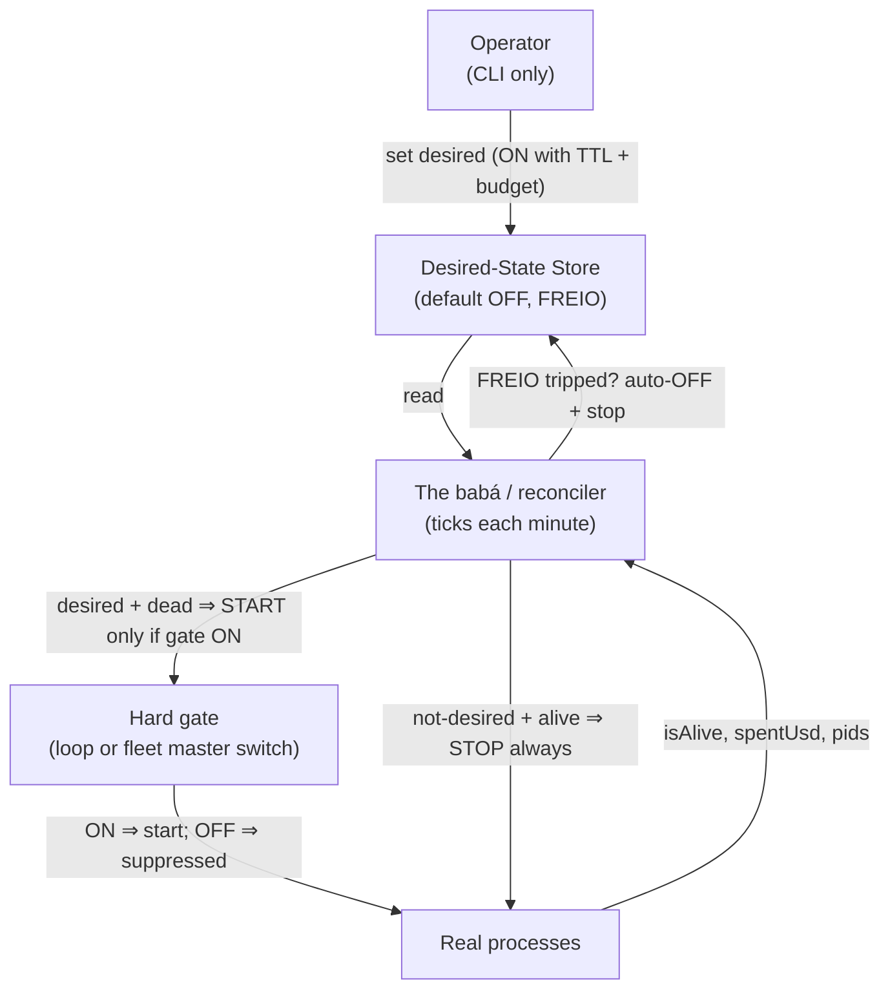

# Agent governance: the fleet control plane

The fleet control plane is the Kubernetes-style declarative control that decides which autonomous agents may run. The operator sets a desired-state, default OFF and fail-closed. The reconciler, called the babá (Portuguese for nanny), converges real processes toward that desired-state and only toward it. START is hard-gated and default-suppressed; STOP always runs. The whole thing ships OFF. Nothing runs or respawns until the operator explicitly turns it on, and the system can never re-enable itself.

This is the definitive fix for "autonomous Atlas agents running without the operator knowing, burning provider accounts, coming back by themselves."

## Purpose

To make the invariant non-negotiable: if the operator turned a loop ON, it runs; if he did not, nothing runs. Desired-state changes only by an explicit operator action, never by the system. Without this, a launchd respawn or an orphan database row marked `status=running` could bring a whole campaign graveyard back the instant a master switch went ON, spending provider quota the operator never sanctioned.

## Key abstractions

| Abstraction | Role |
|---|---|
| Desired-state store | The single source of run and respawn authority; default OFF, fail-closed |
| The babá (reconciler) | Converges real processes toward desired-state each tick; can only reduce unsanctioned spend by default |
| Fleet catalog | The declared inventory of every autonomous provider-consumer Atlas can run |
| Fleet master switch | `ATLAS_FLEET_ENABLED`, the global permission for the non-loop fleet; default OFF |
| Loop master switch | `ATLAS_LOOP_MASTER_ENABLED`, the loop's own section 0 master switch; default OFF |
| Env flag gate | Fail-closed boolean read straight from `.env`, robust under `config:cache` |
| FREIO | The brake: `ttl_expires_at` (auto-OFF after N seconds) plus `budget_limit_usd` (spend ceiling) |
| Agent registry | Read-only snapshot of the fleet; safe to call from HTTP, never starts or stops anything |
| Event ledger | Append-only audit of every flip and every start, stop, and expire |

## How it works

### The desired-state reconciliation loop



Each tick, `AtlasAgentReconciler` iterates the `AtlasFleetCatalog` and each agent's desired-state. It never scans `atlas_loop_campaigns WHERE status=running`, so an orphan row can never originate a start. Per agent, given desired-state D and liveness L:

1. FREIO first. If D is ON but the TTL or budget has tripped, the reconciler persists an auto-OFF (the brake), records an `expired` event, and treats the agent as not-desired.
2. Authorized and dead. If D is effectively ON and the agent is not alive, the reconciler starts it, but only if the agent's hard gate is ON. Default OFF means start is suppressed. This is fail-closed.
3. Not authorized and alive. If D is not ON and the agent is alive, the reconciler stops it, always. This enforces "if you did not turn it on, nothing runs" even against a process the operator never sanctioned.
4. Otherwise, no-op.

START is gated and default-suppressed; STOP always runs. So by default the babá can only reduce unsanctioned spend. It can never originate a run on its own.

### The single source of authority

`AtlasAgentDesiredStateStore` is the single source of run and respawn authority. It is default OFF and fail-closed: a missing row, a missing table, or any exception means OFF. Silence is off. Mutation is operator-only by construction: only `setOn` and `setOff` write, and they are called exclusively from operator-facing commands and endpoints, never from the loop or the reconciler. The system converges toward this state; it never authors it.

`authorizesCampaign` scopes loop respawn to the exact campaign the operator launched. True only when the loop is desired-ON (not braked) and one of: the operator pinned this exact campaign (`target_ref === id`), or the campaign was launched at or after the operator turned the loop on (the `set_at` floor). Orphans from the graveyard were created before the operator's explicit ON, so they sit below the floor and are never authorized. This is the precise cut of the root-cause bug.

### The FREIO brake

The FREIO (Portuguese for brake) is the desired-state safety mechanism. `AgentDesiredState` carries two optional caps:

- `ttl_expires_at` — a wall-clock deadline. Past this, the agent is auto-OFF.
- `budget_limit_usd` — a spend ceiling in USD. When measured spend reaches it, the agent is auto-OFF.

`effectivelyOn` is the single predicate the reconciler trusts: ON and not braked. `isExpired` reports whether the FREIO tripped; `expiryReason` reports `ttl_expired` or `budget_exhausted` for the audit trail.

### The hard gates

Two physical kill switches, both default OFF and fail-closed, stored as one `.env` line so they are robust under `config:cache` and greppable by the bash watchdogs:

- `AtlasLoopMasterSwitch` (`ATLAS_LOOP_MASTER_ENABLED`) — the loop's own section 0 master switch
- `AtlasFleetMasterSwitch` (`ATLAS_FLEET_ENABLED`) — the global permission for the rest of the fleet

Both use `EnvFlagGate`, which reads the `.env` file directly by parsing lines, not via `config()` or `env()`, which return null when the config is cached. The truthy set is `1`, `true`, `on`, `yes`, `enabled`. Absent flag, unreadable file, parse error, or any exception returns false. The system can never turn either switch on for itself; they are flipped only by operator-facing commands.

### The fleet catalog and registry

`AtlasFleetCatalog` is the declared inventory of every autonomous provider-consumer Atlas can run. Five agents are currently declared: the loop, the Codex AI worker, the Claude AI worker, the finance strategy loop, and the Mac host agent. Adding a new autonomous agent means adding it here, after which it is automatically governed by status, on/off, history, and the reconciler. Nothing runs unless the operator explicitly turns it on.

`AtlasAgentRegistry` is the read-only window into the fleet. It combines the catalog (what exists), desired-state (what the operator declared), and live process facts (what is actually running) into one truthful snapshot. It never starts or stops anything, so it is safe to call from an HTTP request with no chance of spending a provider account. The status label is `running`, `desired_dead` (operator wants it on but it is not running; the babá will respawn if the hard gate is on), or `off`.

### The event ledger

`AtlasAgentEventLedger` is the append-only history of fleet governance events: `desired_on`, `desired_off`, `started`, `stopped`, and `expired`. It is fail-safe: history must never break the control plane, so a write that throws is swallowed. Governance correctness does not depend on the ledger succeeding. The ledger is what the apps render as the history of the loops.

## Why orphan DB rows can never respawn

The incident: `AtlasLoopKeepaliveCommand` respawned any `status=running` row with a stale heartbeat, so the instant the loop master went ON, the whole campaign graveyard came back. Now every respawn, recycle, and revive branch is gated by `desiredStore->authorizesCampaign(id, launchedAt)`. Authority comes from what the operator explicitly launched (loop desired-ON, not braked, and `target_ref == id` or launched at or after the `set_at` floor), never from the row's status. Orphan rows become logged no-ops. This is proven by `tests/Feature/AgentGovernance/KeepaliveDesiredStateGateTest.php`: master ON plus orphan running rows plus no desired-state yields zero respawns.

## The operator interface

The operator interface is visibility and emergency override only. There is deliberately no turn-ON HTTP endpoint, so a tapped app can only ever reduce spend.

```bash
# Loop (keeps its section 0 master switch; on/off also drive desired-state)
php artisan atlas:loop:on  --ttl=7200 --reason="manual run"   # master ON + desired ON + FREIO 2h
php artisan atlas:loop:off                                    # master OFF + desired cleared

# Any fleet agent (declarative; the babá then runs or stops it)
php artisan atlas:agents:on  finance.strategy-loop --ttl=3600
php artisan atlas:agents:off finance.strategy-loop
php artisan atlas:agents:off --all          # PANIC: desired-OFF for all + both master switches OFF
php artisan atlas:agents:reconcile           # run the babá once (apply now)
php artisan atlas:agents:status              # the full fleet: running/desired/off + account + uptime + TTL
```

The babá is also scheduled (`atlas:agents:reconcile`, every minute) but gated by `atlas.agents.reconciler_enabled`, default OFF. It is inert until the operator arms it.

The mobile and desktop apps poll `/api/agents/*` under the existing `atlas.token` auth: `GET /api/agents/active`, `GET /api/agents/status`, `GET /api/agents/history`, `POST /api/agents/{key}/off`, and `POST /api/agents/off-all` (the DESLIGAR buttons). There is no turn-ON endpoint. The mobile app shows a persistent red badge on every screen; the desktop app has a fixed badge and a Frota surface.

## Current state

Everything ships OFF: `ATLAS_LOOP_MASTER_ENABLED=false`, `ATLAS_LOOP_KEEPALIVE_ENABLED=false`, `ATLAS_FLEET_ENABLED=false`, `ATLAS_AGENTS_RECONCILER_ENABLED=false`. Nothing runs or respawns until the operator explicitly turns it on.

## Integration points

- The fleet control plane gates whether the [Maestro and worker swarm](maestro-and-worker-swarm.md) may execute at all; nothing runs until the master switches are ON.
- The [Constitution and earned autonomy](constitution-and-earned-autonomy.md) assume the master switches default off; the FREIO is the runtime analog of the trust budget's daily cap.
- The loop is one agent in the catalog; its lifecycle is detailed in the [Autonomous Evolution Loop](../evolution-loop/index.md).
- The [CLI and operator surface](../cli-operator/index.md) exposes the operator commands and the bash watchdogs that grep the same `.env` flags.
- The finance strategy loop is one fleet agent; see [Business domains](../business-domains/index.md).

## Key source files

| File | Role |
|---|---|
| `app/Services/Ai/AgentGovernance/AtlasAgentDesiredStateStore.php` | Single source of run and respawn authority |
| `app/Services/Ai/AgentGovernance/AgentDesiredState.php` | Immutable desired-state snapshot with FREIO |
| `app/Services/Ai/AgentGovernance/AtlasAgentReconciler.php` | The babá; converges real toward desired |
| `app/Services/Ai/AgentGovernance/AtlasFleetCatalog.php` | The declared fleet inventory |
| `app/Services/Ai/AgentGovernance/AtlasAgentRegistry.php` | Read-only fleet snapshot |
| `app/Services/Ai/AgentGovernance/AtlasAgentEventLedger.php` | Append-only event history |
| `app/Services/Ai/AgentGovernance/AtlasFleetMasterSwitch.php` | `ATLAS_FLEET_ENABLED` master switch |
| `app/Services/Ai/AgentGovernance/EnvFlagGate.php` | Fail-closed `.env` flag reader |
| `app/Services/Ai/AgentGovernance/SystemFleetDriver.php` | System fleet driver (liveness, spend, start, stop) |
| `app/Services/Ai/AutonomousEvolution/AtlasLoopMasterSwitch.php` | The loop's section 0 master switch |
| `docs/agent-governance-control-plane.md` | Canonical fleet control plane doc |

## Related pages

- [Self-Construction OS and government](index.md) — the overview and where the fleet sits
- [Constitution and earned autonomy](constitution-and-earned-autonomy.md) — the laws the fleet enforces by defaulting off
- [Maestro and worker swarm](maestro-and-worker-swarm.md) — execution the fleet gates
- [Earned autonomy (concept)](../../concepts/earned-autonomy.md) — why authority is earned, not seized
- [Glossary](../../overview/glossary.md) — babá, FREIO, desired-state, fleet master switch
