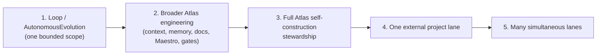

# Constitution and earned autonomy

The Constitution is the law. It is the pétreo gate every autonomous change must traverse before it is applied: forbidden scopes, autonomy levels, the change-class trust ladder, the trust budget, and rollback requirements. It never executes product work. Earned autonomy is the doctrine that no scope receives 24/7 authority by ambition. A scope earns autonomy through receipts, server-side gates, rollback, low waste, and real value, climbing the scope ladder one rung at a time. The constitution is what makes a self-improving system safe to let run unattended.

## Purpose

To make the laws immutable enough that the system cannot saw off the branch it sits on, and to make autonomy earned rather than claimed. Without a constitution, a 24/7 self-improving system would edit its own gates, grant itself authority it never proved, and drift into false green. Without earned autonomy, it would seize 24/7 authority over a scope the moment it wanted it, before proving it could recover from failure.

## Key abstractions

| Abstraction | Role |
|---|---|
| Constitutional Kernel | The single pétreo gate; loads canonical invariants in memory, validates every change |
| Invariant class | `petreo` (immutable, PR + redeploy), `elastic` (operator-flippable with receipt), `runtime` (auto-tune within a window) |
| Constitutional Vault | Signed vault separate from source code; verifies the in-code kernel has not drifted |
| Autonomy admission | Composes the kernel with risk, trust band, and change-class ladder into one admit decision |
| Autonomy levels | `suggest`, `draft`, `execute_with_approval`, `autonomous` (ranked 1 to 4) |
| Change-class trust ladder | Per-change-class record of re-checkable evidence that lets a class earn lower friction |
| Trust budget | Operator-defined daily budget per tier and operator class for mutative actions |
| Scope ladder | The five-rung path from one bounded scope to many simultaneous lanes |

## The Constitutional Kernel

`AtlasConstitutionalKernelService` is the single pétreo gate. It loads the canonical invariant set in memory as a `const` list, so editing the list is the only way to change pétreos, and that requires a PR and redeploy. The runtime never mutates the list. It exposes `validateChange`, `listInvariants`, `listViolations`, and a deterministic `kernelHash`.

### The three invariant classes

| Class | Who can change it | How |
|---|---|---|
| `petreo` | Nobody at runtime | PR + redeploy only; runtime cannot mutate |
| `elastic` | The operator | `flipElastic` with `--check` + `--confirm` + a receipt entry |
| `runtime` | Auto-tune within a canonical window | `tuneRuntime` with actor and reason; value must fall inside the declared window |

The kernel carries 9 pétreos, 4 elastics, and 3 runtime invariants. The pétreos include:

- `claim_policy_provider_safe` — no benchmark, rivals, superiority, or concurrent claims in code, doc, or provider output
- `sovereignty_local_first` — sensitive, secret, and cyber data never leaves the machine
- `cognitive_immune_law` — a raw capture is not evidence, not a learning signal, not memory, not context, not a decision
- `external_rivals_certification_blocked` — stays blocked forever
- `no_jarvis_vocabulary` — forbidden vocab: Jarvis, rivals, benchmark, superiority, concurrent
- `atlas_is_substrato_not_wrapper` — Atlas is a sovereignty substrate, not a wrapper, productivity tool, or memory system
- `evidence_append_only` — the Evidence Ledger is append-only; no retroactive ops
- `human_approval_for_high_risk` — cross-domain changes touching sensitive, secret, or cyber demand operator approval
- `no_silent_invariant_mutation` — no invariant mutation without an append-only ledger entry

The runtime windows are declared in code and enforced: `reconciliation_cadence_window` (minute to hourly), `tdc_ttl_window` (60 to 86400 seconds), and `admission_trust_modifier_window` (minus 1 to plus 1 tier). Anything outside the window throws.

### Validation

`validateChange` is fail-closed. A malformed envelope (missing `change_kind` or `proposed_effect`) blocks immediately. It checks prohibited claims, prohibited vocabulary in the proposed effect, outbound data classes (sensitive, secret, cyber must not appear in outbound), attempts to unblock `external_rivals_certification`, and high-risk privacy classes that demand human approval. The decision is one of `allow`, `block`, or `allow_with_human_approval`. Every violation is recorded to an append-only JSONL log with a `ticket_hash`.

### The Constitutional Vault

`AtlasConstitutionalVaultService` is a signed vault separate from the source code. The pétreo invariants live in `storage/atlas/governance/constitutional_vault.json` with an HMAC-SHA256 signature derived from an external key (the `ATLAS_KERNEL_VAULT_KEY` env var or the `storage/atlas/governance/.vault_key` file). On boot, the vault is loaded, its signature is verified against the key, and its content is compared with the in-code kernel snapshot. A mismatch emits a `kernel_drift` violation. The vault never modifies the kernel; it is an external verification layer. Vault tampered means kernel invalid.

## Autonomy admission

`AtlasAutonomyAdmissionService` is the composer that unites the Constitutional Kernel with the policy stack into one canonical question: can this actor execute this change autonomously right now, and if not, what is the gap? Consumers call `admit()` instead of orchestrating five services themselves, which eliminates logic drift between consumers.

`admit()` consults the kernel first (the pétreo gate), derives a risk level, computes the max autonomy for that risk, applies the trust band modifier, and re-binds under the change-class ladder. The decisions are `allow_autonomous`, `allow_with_approval`, or `deny`. The risk-to-max-autonomy mapping is canonical:

| Risk level | Max autonomy |
|---|---|
| low | autonomous |
| medium | execute_with_approval |
| high | draft |
| critical | suggest |

The trust band modifier is kernel-sanctioned: high trust lifts the cap by one tier, low trust lowers it by one tier, within the `admission_trust_modifier_window` of plus or minus one. The change-class ladder re-binds the cap under the risk-canon ceiling (it takes the more restrictive of the canon cap and the class's earned autonomy), so a class can only relax friction within the cap, never beyond it. Every admission is written to an append-only ticket log.

## The change-class trust ladder

`AtlasChangeClassTrustLadder` is the per-change-class record of re-checkable evidence that lets a class earn lower friction over time. Two sovereignty properties are structural:

1. Default is max friction. With no operator-configured thresholds, every class stays at `suggest`, meaning operator approval for everything. Autonomy rises only past thresholds the operator sets, from evidence.
2. Never above the risk cap. `earnedAutonomy` tops out at `autonomous`, and admission re-binds it under the risk-canon cap.

Trust is asymmetric. A single revert resets the class's clean streak to zero, so friction returns immediately. Trust accrues only from re-checkable evidence, never from a provider self-report. The closed evidence vocabulary is `frozen_judge_pass`, `clean_promotion`, and `revert`. Clean evidence must carry a real, distinct ref (an acceptance hash or receipt hash), so re-running the same proof cannot inflate the streak.

`recordMergeOutcome` wires the real loop auto-merge outcome into the ladder. A clean promotion accrues only when a real commit landed and the post-merge canary was not red. A red canary records a revert that resets the streak. The change class is derived from the real diff by `classifyChangedFiles`: `documentation_only`, `tests_only`, `docs_and_tests`, or `code`. The `code` class is never allowlisted by default, so ordinary code merges accrue history but earn nothing until the operator allowlists the class.

The release policy (`releasePolicy`) gates eligibility: a class with blockers (missing, blocked pattern, or not allowlisted) returns `suggest` no matter how long its streak. Configuration lives under `atlas.ai.trust_ladder` (`enabled` default false, `thresholds`, `log_path`, `eligible_classes`, `blocked_class_patterns`).

## The trust budget

`AtlasTrustBudgetService` is the operator-defined daily budget per tier and operator class for mutative actions. The tiers are `low_risk`, `medium_risk`, `high_risk`, and `critical`. The operator classes are `operator`, `autonomous_agent`, and `external`. The canonical budget is operator-defined and mutation requires a PR and redeploy. Critical is zero for everyone except the operator (10); high risk is zero for external.

The budget resets per UTC day with no carry-over. Each `consume` records a receipt with a unique `action_id`; each `rollback` emits a reverse receipt. A rollback never increases consumption above the limit. The state, check, consume, and rollback operations all write to an append-only JSONL log. The verdict is `allow`, `deny_budget_exceeded`, `deny_unknown_tier`, or `deny_unknown_class`.

## The scope ladder

No scope receives 24/7 authority by ambition. It earns authority through receipts, server-side gates, rollback, low waste, real value, and clean recovery, climbing one rung at a time:

1. One bounded scope inside Atlas, currently the Loop / AutonomousEvolution
2. Broader Atlas engineering scopes: context, memory, docs, task-serving, Maestro, gates, self-construction
3. Full Atlas Self-Construction stewardship
4. External project stewardship for one project at a time
5. Multiple simultaneous stewardship instances, each with its own scope, mainline lane, task economy, gates, receipts, and autonomy policy

## How it works together

A change enters the pipeline. The Constitutional Kernel validates it against the pétreos and returns allow, block, or allow-with-approval. Autonomy admission composes that with the risk level, the trust band, and the change-class ladder to produce the effective autonomy and the gaps. The trust budget checks whether the actor still has daily budget for a mutative action at that tier. The change-class ladder tracks re-checkable evidence so the class can earn lower friction over time, asymmetrically reverting on any regression. The vault verifies on boot that the in-code kernel has not drifted from the signed snapshot. None of these execute product work; they only gate.

## Integration points

- The kernel is consulted first by the [Control plane](control-plane-and-task-fabric.md) before any cycle is admitted.
- The change-class ladder is fed by real merge outcomes from the [Verification court and merge governor](verification-court-and-merge-governor.md); a red canary resets a class's streak.
- The forbidden organs in the Merge Governor's risk classifier (`Constitution`, `MasterSwitch`, `WorkspaceMaterializer`) overlap the pétreo core.
- The master switches that gate whether autonomy can run at all are in the [fleet control plane](agent-governance-fleet.md); the constitution assumes they default off.
- The [Autonomous Evolution Loop](../evolution-loop/index.md) is the first bounded scope on the scope ladder.

## Key source files

| File | Role |
|---|---|
| `app/Services/Ai/Governance/AtlasConstitutionalKernelService.php` | The pétreo gate; invariant list, validateChange, kernelHash |
| `app/Services/Ai/Governance/AtlasConstitutionalVaultService.php` | Signed vault; boot-time drift verification |
| `app/Services/Ai/Governance/AtlasAutonomyAdmissionService.php` | Composes kernel, risk, trust, class ladder into admit |
| `app/Services/Ai/Governance/AtlasChangeClassTrustLadder.php` | Per-change-class earned autonomy from re-checkable evidence |
| `app/Services/Ai/Governance/AtlasTrustBudgetService.php` | Daily mutative-action budget per tier and operator class |
| `app/Services/Ai/Governance/ChangeClassTrustReleaseGateService.php` | Release gate for the change-class trust ladder |
| `docs/engineering-knowledge-base/atlas-constitutional-kernel.md` | Canonical kernel authority doc |
| `docs/engineering-knowledge-base/self-construction/constitution.md` | Self-construction constitution |

## Related pages

- [Self-Construction OS and government](index.md) — the overview and scope ladder
- [Agent governance: the fleet control plane](agent-governance-fleet.md) — the master switches the constitution assumes default off
- [Verification court and merge governor](verification-court-and-merge-governor.md) — where revert outcomes feed the change-class ladder
- [Earned autonomy (concept)](../../concepts/earned-autonomy.md) — the doctrine
- [Evidence and receipts (concept)](../../concepts/evidence-and-receipts.md) — the receipts that prove earned autonomy
- [Glossary](../../overview/glossary.md) — pétreo, constitution, trust ladder, autonomy levels, scope ladder
