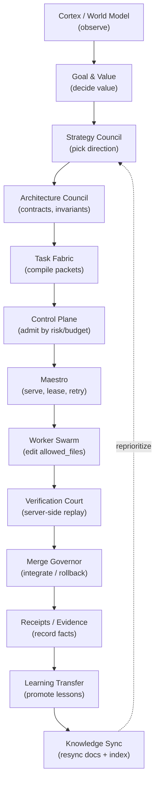

# Self-Construction OS and government

The Atlas Autonomous Engineering Government is the final 24/7 architecture for Atlas as a living engineering system. It is the layer above the autonomous loop that lets Atlas improve itself and other software projects around the clock: choose high-leverage work, architect it, decompose it into safe task packets, execute through replaceable workers, verify independently, merge or reject under governance, learn from outcomes, and update knowledge. The Atlas Self-Construction OS is the governed operating system inside that government, dedicated to "Atlas building Atlas."

This is stronger than assisted development. The non-negotiable end state is 100% Atlas-native autonomy: the operator, humans, Claude Code, Codex, Cursor, and external provider platforms are bootstrap, observability, and emergency-brake aids only, never structural runtime dependencies. If ordinary 24/7 progress still needs a person to keep the queue alive, approve normal work, unblock common packets, run gates, preserve context, or keep an external coding platform alive, Self-Construction is not complete.

The old framing "the loop is the whole thing" is no longer canonical. The Loop is one important organ, Autopoiesis, inside this government, not the final authority.

## Purpose

The government exists to make a self-improving system safe. A system that can rewrite itself 24/7 without a human reviewing every change will, without guardrails, optimize measurable surrogates instead of real capability, judge its own work, leak private data, and grant itself authority it never earned. The government closes each of those failure modes with separation of powers, a constitution, earned autonomy, server-side verification, and a fail-closed fleet control plane.

## The 16-organ map

The government splits the engineering lifecycle into 16 organs. Each organ has a narrow authority and an explicit non-authority. The same agent or runtime must not create the objective, implement the patch, judge its own work, merge it, and promote its own learning.

```mermaid
graph TD
    Gov["Atlas Autonomous Engineering Government"]
    OS["Self-Construction OS"]
    Kernel["Constitution / Kernel"]
    CP["Control Plane"]
    Cortex["Cortex / World Model"]
    Goal["Goal & Value System"]
    Strategy["Strategy Council"]
    Arch["Architecture Council"]
    Fabric["Task Fabric / Task Economy"]
    Maestro["Maestro Scheduler"]
    Swarm["Worker Swarm"]
    Court["Verification Court"]
    Merge["Merge / Release Governor"]
    Receipts["Receipts / Evidence / Memory"]
    Transfer["Learning Transfer System"]
    Autopoiesis["Autopoiesis Lab / Loop"]
    Sync["Docs / Knowledge Sync"]
    Operator["Operator Interface<br/>(visibility / emergency only)"]

    Gov --> OS
    OS --> Kernel
    OS --> CP
    OS --> Cortex
    OS --> Goal
    OS --> Strategy
    OS --> Arch
    OS --> Fabric
    OS --> Maestro
    OS --> Swarm
    OS --> Court
    OS --> Merge
    OS --> Receipts
    OS --> Transfer
    OS --> Autopoiesis
    OS --> Sync
    OS --> Operator
```



The canonical organ tree, from `docs/engineering-knowledge-base/atlas-autonomous-engineering-government.md`:

```
Atlas Autonomous Engineering Government
  -> Atlas Self-Construction OS
      -> Constitution / Kernel
      -> Control Plane
      -> Cortex / World Model
      -> Goal & Value System
      -> Strategy Council
      -> Architecture Council
      -> Task Fabric / Task Economy
      -> Maestro Scheduler
      -> Worker Swarm
      -> Verification Court
      -> Merge / Release Governor
      -> Receipts / Evidence / Memory
      -> Learning Transfer System
      -> Autopoiesis Lab / Loop
      -> Docs / Knowledge Sync
      -> Operator Interface (visibility / emergency only)
```

| Organ | Authority | Non-authority |
|---|---|---|
| Constitution / Kernel | Laws, forbidden scopes, autonomy levels, rollback requirements | Does not execute product work |
| Control Plane | Chooses what evolves, when, risk, budget, scope, mode | Does not write code directly |
| Cortex / World Model | Read-only understanding of code, docs, memory, evidence, graph, risk, history | Does not decide or promote learning alone |
| Goal & Value System | Defines real value and anti-proxy criteria | Does not accept task count or green tests as value |
| Strategy Council | Selects the next highest-leverage direction | Does not create executable packets directly |
| Architecture Council | Produces criticized contracts, interfaces, invariants, decomposition boundaries | Does not schedule workers or approve merges |
| Task Fabric / Task Economy | Converts approved architecture into self-sufficient packets with scope, deps, gates, rollback, evidence | Does not decide final priority or verify merit |
| Maestro Scheduler | Serves tasks, leases, retries, worker affinity, throughput, queue health | Does not rewrite architecture or relax gates |
| Worker Swarm | Executes small packets in exact allowed-file scopes on the mainline | Does not approve, merge, widen scope, or self-certify |
| Verification Court | Re-runs gates server-side, validates evidence, detects Goodhart, rejects false green | Does not author the candidate |
| Merge / Release Governor | Controls integration, main, rollback, canary, release, blast-radius policy | Does not trust worker self-report |
| Receipts / Evidence / Memory | Records facts, decisions, completions, failures, rollbacks, promotions | Receipts alone are not learning |
| Learning Transfer System | Promotes reusable lessons into future packets/context/docs after evidence | Does not promote narrative memory without proof |
| Autopoiesis Lab / Loop | Proposes self-improvement and recursive evolution under gates | Does not become the OS or bypass the Kernel |
| Docs / Knowledge Sync | Authoring source of truth and worker context freshness | Not optional post-work decoration |
| Operator Interface | Visibility and emergency override | Not a required steady-state runtime organ |

## The high-leverage-change flow

A high-leverage change moves through the organs in strict order. The same agent never spans originate through promote.



In words: Cortex reads code, docs, memory, the graph, risk, and history. Goal and Value defines real (anti-proxy) value. Strategy Council ranks leverage and picks the direction. Architecture Council produces criticized contracts, invariants, and decomposition boundaries. Task Fabric compiles those into conflict-free, self-sufficient packets. The Control Plane admits by risk, budget, scope, and mode. Maestro serves, leases, and retries packets with worker affinity and queue health. The Worker Swarm edits only `allowed_files` on shared `main`. The Verification Court re-runs gates server-side, validates evidence, and rejects false green. The Merge Governor integrates, rolls back, or quarantines by evidence. Receipts record the facts. Learning Transfer promotes proven lessons into future packets, templates, and context. Knowledge Sync resyncs docs and the code index. Strategy Council reprioritizes.

## The simplicity and mainline autonomy law

The canonical execution model is deliberately simple:

```
one local main branch
-> conflict-free task packets
-> worker edits only allowed_files
-> Atlas commits only that task scope
-> next packet
```

This is not a temporary hack. It is the proven simple path that keeps multiple workers productive without branch theater. Task Fabric prevents conflicts before serving work. Workers do not solve coordination by adding worktrees, sandboxes, or broad git operations. Worktrees, sandboxes, and isolated execution may exist only as exceptional tools for a specific risk class, never the default path.

Every task packet and runtime plan must preserve the autonomy invariants: `final_runtime_owner=atlas_native`, `steady_state_runtime_owner=atlas_server`, `operator_dependency_allowed=false`, `human_dependency_allowed=false`, and `external_provider_dependency_allowed=false`. A packet that says otherwise is a malformed autonomy regression, even if its implementation would be technically simple.

The autonomy ladder moves from external muscles to Atlas-native muscles:

```
bootstrap: human opens sessions + Claude/Codex/Cursor execute packets
transition: Atlas serves, verifies, learns while external workers remain replaceable
final: Atlas-native workers execute continuously without operator/human/provider dependency
```

## The 100%-autonomy completion gate

Self-Construction is complete only when the ordinary path is fully Atlas-native:

- Atlas originates and prioritizes the next high-leverage work
- Atlas decomposes it into self-sufficient packets
- Atlas serves and schedules packets without manual queue babysitting
- Atlas-native workers execute the normal packet stream
- The Verification Court proves or rejects work independently
- The Merge Governor integrates, rolls back, or quarantines by evidence
- Learning Transfer repairs future packets, templates, and context after failures
- Docs, memory, receipts, and indexes update without becoming optional cleanup

The acceptance test is blunt: unplug external coding sessions and remove the operator from ordinary queue maintenance. Atlas must still keep improving within its admitted scope through its own server-side runtime, gates, and rollback.

## The scope ladder

No scope receives 24/7 authority by ambition. It earns authority through receipts, server-side gates, rollback, low waste, real value, and clean recovery, climbing one rung at a time:

1. One bounded scope inside Atlas, currently the Loop / AutonomousEvolution
2. Broader Atlas engineering scopes: context, memory, docs, task-serving, Maestro, gates, self-construction
3. Full Atlas Self-Construction stewardship
4. External project stewardship for one project at a time
5. Multiple simultaneous stewardship instances, each with its own scope, mainline lane, task economy, gates, receipts, and autonomy policy

## Key abstractions

| Abstraction | Role |
|---|---|
| Government | The final architecture above the OS; governs separation of powers, scope admission, and multi-project stewardship |
| Self-Construction OS | The governed operating system inside the government for Atlas building Atlas |
| Organ | A narrow-authority unit of the 16-part lifecycle; each has an explicit non-authority |
| Task packet | The atomic execution unit: objective, allowed files, forbidden files, dependencies, risk class, gates, rollback, evidence |
| Simple mainline model | Shared local `main`, conflict-free scopes, Atlas-scoped commits; the default execution topology |
| Autonomy invariants | The five boolean fields every packet must carry to stay Atlas-native |
| Completion gate | The blunt acceptance test: unplug externals, remove the operator, Atlas must still improve |
| Scope ladder | The five-rung path from one bounded scope to many simultaneous lanes |
| FORBIDDEN / pétreo core | The immutable set of cert, merge, switch, and guard organs the Loop may never edit |

## How it works

The government runs as a pipeline of pure, deterministic organs. Each organ emits a signed, append-only envelope and never mutates state outside its scope. The Control Plane admits work by risk and budget. Task Fabric rejects packets that violate the mainline model or the autonomy invariants. Workers run inside a scoped execution envelope limited to `allowed_files`. The Verification Court re-runs gates itself rather than trusting worker output. The Merge Governor requires `server_side_green=true` and a present evidence hash before admitting anything. Receipts are append-only and tamper-evident. Learning Transfer only promotes lessons that pass a candidate gate with evidence refs. Knowledge Sync is a required post-merge step, not decoration.

The whole government ships OFF by default. The fleet control plane, the loop master switch, the fleet master switch, and the reconciler cron are all fail-closed. Nothing runs or respawns until the operator explicitly turns it on, and the system can never re-enable itself. See [Agent governance: the fleet control plane](agent-governance-fleet.md).

## Integration points

- The [Autonomous Evolution Loop](../evolution-loop/index.md) is the Autopoiesis organ: the first bounded scope on the scope ladder and an execution muscle, not the final authority.
- The [Engineering plane](../engineering/index.md) provides the worker and department surfaces (AAEOS, AWEOS, Autonomous Engineering) the government composes; final authority and final execution move into Atlas-native organs.
- The [Open Brain](../open-brain/index.md) holds canonical memory and knowledge governance; Knowledge Sync resyncs its read models after each merge.
- The [CLI and operator surface](../cli-operator/index.md) exposes the operator commands and the fail-closed master switches.
- The constitution and earned autonomy are detailed in [Constitution and earned autonomy](constitution-and-earned-autonomy.md).
- The separation-of-powers doctrine is detailed in [Separation of powers](separation-of-powers.md) and the concept page [Separation of powers](../../concepts/separation-of-powers.md).

## Key source files

| File | Role |
|---|---|
| `docs/engineering-knowledge-base/atlas-autonomous-engineering-government.md` | Canonical final-architecture law: organs, authority table, simplicity law, completion gate, scope ladder |
| `docs/engineering-knowledge-base/atlas-ai-self-construction-os.md` | Canonical law for the OS inside the government: hard laws, build flow, maturity ladder |
| `docs/agent-governance-control-plane.md` | Fleet control plane invariant and operator commands |
| `app/Services/Ai/SelfConstruction/` | The per-organ implementation directory (one subdirectory per organ, plus root control-plane services) |
| `app/Services/Ai/Governance/AtlasConstitutionalKernelService.php` | The pétreo gate every autonomous change must traverse |
| `app/Services/Ai/AgentGovernance/` | The fleet control plane: desired-state store, reconciler, master switches |
| `app/Console/Commands/AtlasAiSelfConstructionCommand.php` | The `atlas:ai:self-construction` mother command surface |

## Sub-pages

- [Separation of powers](separation-of-powers.md) — the canonical organ tree and the authority/non-authority table
- [Control plane and task fabric](control-plane-and-task-fabric.md) — decision, admission, queue, lease, claim, certification, and packet compilation
- [Maestro and worker swarm](maestro-and-worker-swarm.md) — scheduling and the native vs bootstrap execution envelope
- [Verification court and merge governor](verification-court-and-merge-governor.md) — server-side gate replay, false-green detection, and release decisions
- [Constitution and earned autonomy](constitution-and-earned-autonomy.md) — laws, the change-class trust ladder, and the scope ladder
- [Agent governance: the fleet control plane](agent-governance-fleet.md) — desired-state, the babá, master switches, and FREIO
- [Learning transfer and knowledge sync](learning-transfer-and-knowledge-sync.md) — lesson promotion, evidence, and post-merge resync

## Related pages

- [Separation of powers (concept)](../../concepts/separation-of-powers.md) — the doctrine
- [Earned autonomy (concept)](../../concepts/earned-autonomy.md) — how autonomy is earned
- [Evidence and receipts (concept)](../../concepts/evidence-and-receipts.md) — evidence and receipt chains
- [Anti-Goodhart and no-proxy](../../concepts/anti-goodhart.md) — the anti-proxy filter the Goal and Value organ applies
- [Architecture overview](../../overview/architecture.md) — where the government sits in the full system
- [Glossary](../../overview/glossary.md) — government, pétreo, babá, FREIO, task packet, scope ladder
