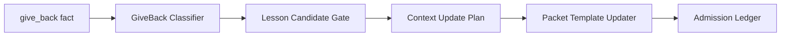

# Learning transfer and knowledge sync

Learning Transfer promotes proven, reusable lessons into future packets, templates, context, and docs after evidence. No narrative memory without proof. Knowledge Sync resyncs the docs and the code intelligence index after every merge, so the read models the next cycle depends on stay fresh. Receipts and Evidence record the facts, decisions, completions, failures, and rollbacks of each cycle in an append-only, tamper-evident chain. Together these are the record-and-learn stage of the government: they close the loop from one cycle into the next.

## Purpose

To make the system compound rather than repeat. A self-improving system that does not transfer learning will hit the same failure mode twice. A system that promotes narrative as learning will accumulate flattering stories with no evidence. A system that does not resync its read models after a merge will plan the next cycle against a stale world. Learning Transfer, Knowledge Sync, and Receipts close each of those gaps with gates, evidence requirements, and append-only ledgers.

## Key abstractions

| Abstraction | Role |
|---|---|
| Give-back classifier | Bins a worker's give-back or blocked-task fact into a reusable failure class |
| Lesson candidate gate | Admits a lesson only when it crosses both repetition and proof thresholds |
| Learning transfer orchestrator | Closed-loop lesson admission: classify, gate, plan, update, ledger |
| Context update plan | Plans how an admitted lesson changes future context |
| Packet template updater | Applies a context update plan to a packet template snapshot |
| Post-merge plan | Ordered list of post-merge knowledge-maintenance actions |
| Docs drift gate | Blocks completion when required documentation evidence is stale or missing |
| Code index readiness gate | Reports whether the code intelligence index is fresh enough to trust |
| Receipt fact index | Read-only projector that indexes receipt facts and flags integrity issues |
| Receipt kinds | The eight receipt families: decision, task, lease, verification, merge, rollback, knowledge, learning |

## How it works

### Learning Transfer

The orchestrator (`AtlasSelfConstructionLearningTransferAdmissionOrchestrator`) runs a closed loop in observe mode by default. A give-back fact flows through five stages:

`AtlasSelfConstructionLearningTransferGiveBackClassifier` bins the fact into one of eight reusable failure classes, with no narrative invention. Every output field comes from the input:

| Class | When |
|---|---|
| `duplicate_capability` | The work asked for already exists or would re-implement an existing organ |
| `scope_gap` | `allowed_files` are insufficient to deliver acceptance |
| `forbidden_target` | The target sits in a frozen or forbidden core path |
| `contradictory_acceptance` | Acceptance criteria are mutually exclusive against an existing fixture |
| `missing_dependency` | A needed extractor, migration, or collaborator does not yet exist |
| `stale_context` | The context pack, code index, or docs are out of date for this lane |
| `insufficient_evidence` | Verification was inconclusive (amber); not enough proof to act |
| `unknown` | No signal lights |

`AtlasSelfConstructionLearningTransferLessonCandidateGate` is the proof gate. It admits a lesson candidate only when its supporting evidence crosses both thresholds:

- the repetition threshold, at least `min_repetitions` independent observations (default 3)
- the proof threshold, at least `min_proven` observations carrying a non-empty `evidence_refs` list (default 2)

It rejects four kinds of weak candidate:

| Decision | When |
|---|---|
| `reject` | A broad narrative with no concrete `class` field, an unverified claim below the proof threshold, or conflicting outcomes split beyond the conflict tolerance (default 1) |
| `hold` | A one-off anecdote below the repetition threshold; it might mature with time |
| `admit` | Both thresholds are met |

The gate emits no scalar score and no ranking. Same input produces the same decision. This is the structural enforcement of "no narrative memory without proof."

When a lesson is admitted, the orchestrator builds a context update plan, applies it to a packet template snapshot (in observe mode the result is the intended template after applying the plan, with no real file mutated), and appends an admission ledger entry. The ledger is the audit trail of which lessons transferred and why.

### Knowledge Sync

Knowledge Sync is a required post-merge step, not optional decoration. `AtlasKnowledgeSyncPostMergePlan` is a pure planner that composes the artifact map, the docs drift gate verdict, and the code-index readiness verdict into an ordered list of post-merge actions:

| Action | When |
|---|---|
| `sync_docs` | Docs directories are present in the artifact map |
| `index_code` | Code index targets are present and the change is not docs-only |
| `refresh_context_pack` | Per project, to refresh the Open Brain context pack |
| `record_learning_candidate` | The candidate is certified and carries evidence refs |
| `no_action` | No actions are required |

The planner emits command hints (`atlas engineering knowledge sync --prune`, `atlas engineering knowledge index-code --prune`, `atlas open-brain context --workspace=... --refresh`, `atlas memory record --kind=learning --source=post_merge`) but never executes them. It is blocked when the docs drift gate or the code-index readiness gate is not conformant, and it never marks a release complete itself.

`AtlasKnowledgeSyncDocsDriftGate` blocks Self-Construction completion when required documentation evidence is stale, missing, or contradictory. It composes the required artifacts, the observed docs health, the observed sync result, and the changed docs. It is conformant only when the required `docs-health-check` and `engineering-knowledge-sync` artifacts are present, OK, and fresh (within the stale window, default 86400 seconds). It passes when no doc artifact is required (a bypass for non-docs changes). Debt facts are surfaced verbatim, never aggregated into a scalar score.

`AtlasKnowledgeSyncCodeIndexReadinessGate` reports whether the code intelligence index is fresh enough to be trusted as the post-change knowledge surface. It checks that the workspace id is present, the local schema is available, the required artifacts are observed, the index is fresh (within `max_age_seconds`, default 1800), the index code run did not fail, and the `changed_code_hash` is represented in the index. A docs-only bypass is explicit, never inferred. The gate never reads the filesystem, touches a DB, or calls a provider; the caller passes the observations. No numeric score.

### Receipts and Evidence

`AtlasSelfConstructionReceiptFactIndex` is the read-only projector over supplied receipt facts for one cycle. It indexes eight receipt kinds by stable id and flags integrity issues:

| Kind | What it records |
|---|---|
| `decision_receipts` | A decision was made |
| `task_receipts` | A task packet was created or served |
| `lease_receipts` | A lease was granted |
| `verification_receipts` | A verification verdict was reached |
| `merge_receipts` | A merge or release decision was made |
| `rollback_receipts` | A rollback was executed |
| `knowledge_receipts` | A knowledge sync action ran |
| `learning_receipts` | A lesson was transferred |

It flags missing ids, duplicate ids, missing hashes, missing timestamps, and, for the chain-linked kinds (`verification_receipts` and `merge_receipts`), a `chain_ref` that does not point to a known decision id. The projector is pure and deterministic; it never creates a ledger and never persists. The chain-linking is what makes the receipt chain tamper-evident: a verification or merge receipt must reference a decision that the index already holds.

The broader runtime evidence lives in the root `AgentRuntimeEvidence*` family (`JournalRepository`, `CertificationService`, `ContinuityIndexer`, `ReceiptBuilder`) and the sibling `app/Services/Ai/Evidence/` directory. The per-organ `Receipts/` subdirectory holds the pure projectors and binding services that the orchestrator composes.

## Integration points

- Learning Transfer takes give-back facts from the [Maestro and worker swarm](maestro-and-worker-swarm.md) and verdicts from the [Verification court and merge governor](verification-court-and-merge-governor.md).
- Knowledge Sync resyncs the read models the [Open Brain](../open-brain/index.md) serves; the context pack refresh is one of its actions.
- The docs drift gate and code-index readiness gate feed the [Control plane's](control-plane-and-task-fabric.md) next-action selector, which prioritizes `run_knowledge_sync` when sync is degraded.
- Receipts are the evidence the [Constitution and earned autonomy](constitution-and-earned-autonomy.md) trust ladder consumes; a clean promotion accrues to the change-class ladder only with a real, distinct ref.
- The [Autonomous Evolution Loop](../evolution-loop/index.md) is the source of the merge outcomes that feed learning.

## Key source files

| File | Role |
|---|---|
| `app/Services/Ai/SelfConstruction/LearningTransfer/AtlasSelfConstructionLearningTransferAdmissionOrchestrator.php` | Closed-loop lesson admission orchestrator |
| `app/Services/Ai/SelfConstruction/LearningTransfer/AtlasSelfConstructionLearningTransferGiveBackClassifier.php` | Failure-class classifier |
| `app/Services/Ai/SelfConstruction/LearningTransfer/AtlasSelfConstructionLearningTransferLessonCandidateGate.php` | Repetition and proof gate |
| `app/Services/Ai/SelfConstruction/LearningTransfer/AtlasSelfConstructionLearningTransferContextUpdatePlan.php` | Context update planner |
| `app/Services/Ai/SelfConstruction/LearningTransfer/AtlasSelfConstructionLearningTransferPacketTemplateUpdater.php` | Packet template updater |
| `app/Services/Ai/SelfConstruction/LearningTransfer/AtlasSelfConstructionLearningLedger.php` | Learning ledger |
| `app/Services/Ai/SelfConstruction/KnowledgeSync/AtlasKnowledgeSyncPostMergePlan.php` | Post-merge action planner |
| `app/Services/Ai/SelfConstruction/KnowledgeSync/AtlasKnowledgeSyncDocsDriftGate.php` | Docs drift gate |
| `app/Services/Ai/SelfConstruction/KnowledgeSync/AtlasKnowledgeSyncCodeIndexReadinessGate.php` | Code index readiness gate |
| `app/Services/Ai/SelfConstruction/KnowledgeSync/AtlasKnowledgeSyncRequiredArtifactMap.php` | Required artifact map |
| `app/Services/Ai/SelfConstruction/Receipts/AtlasSelfConstructionReceiptFactIndex.php` | Receipt fact projector and integrity checker |
| `app/Services/Ai/SelfConstruction/Receipts/AtlasSelfConstructionDecisionBinding.php` | Decision binding |
| `app/Services/Ai/SelfConstruction/Receipts/AtlasSelfConstructionCompletionRealityProjector.php` | Completion reality projector |
| `app/Services/Ai/SelfConstruction/Receipts/AtlasSelfConstructionReceiptMemoryExportPlan.php` | Receipt memory export plan |
| `app/Services/Ai/SelfConstruction/AgentRuntimeEvidenceJournalRepository.php` | Runtime evidence journal repository |

## Related pages

- [Self-Construction OS and government](index.md) — the overview and where record-and-learn sits
- [Verification court and merge governor](verification-court-and-merge-governor.md) — the verdict and decision ledgers that feed receipts
- [Control plane and task fabric](control-plane-and-task-fabric.md) — the next-action selector prioritizes knowledge sync
- [Constitution and earned autonomy](constitution-and-earned-autonomy.md) — the trust ladder consumes receipt evidence
- [Open Brain](../open-brain/index.md) — the read models Knowledge Sync resyncs
- [Evidence and receipts (concept)](../../concepts/evidence-and-receipts.md) — the append-only, tamper-evident ledger pattern
- [Anti-Goodhart and no-proxy](../../concepts/anti-goodhart.md) — why narrative is not learning
- [Glossary](../../overview/glossary.md) — learning transfer, knowledge sync, receipt, give-back
